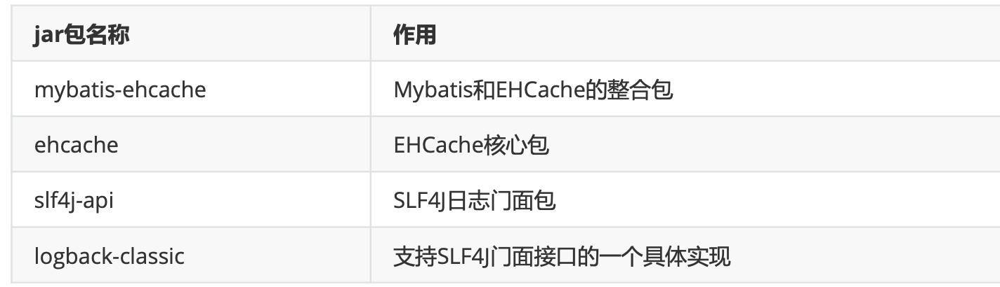
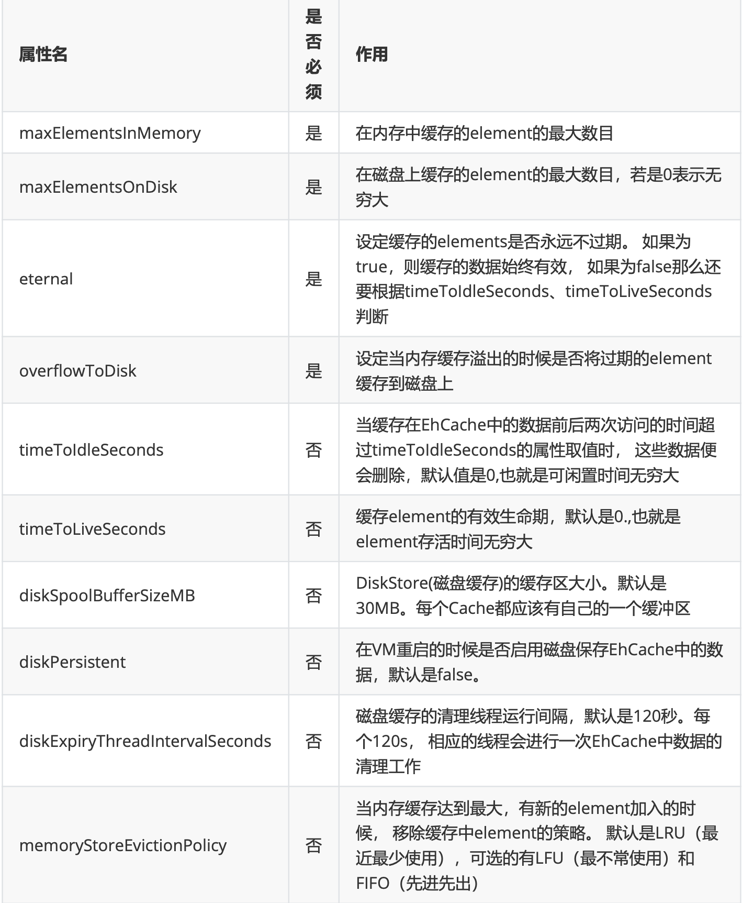

---
# 当前页面内容标题
title: 十、MyBatis的缓存
# 分类
category:
  - mybatis
# 标签
tag: 
  - mybatis
  - java
  - SSM框架
sticky: false
# 是否收藏在博客主题的文章列表中，当填入数字时，数字越大，排名越靠前。
star: false
# 是否将该文章添加至文章列表中
article: true
# 是否将该文章添加至时间线中
timeline: true
---

# 十、MyBatis的缓存

## 1、MyBatis的一级缓存

一级缓存是SqlSession级别的，通过同一个SqlSession查询的数据会被缓存，下次查询相同的数据，就 会从缓存中直接获取，不会从数据库重新访问

使一级缓存失效的四种情况:

1. 不同的SqlSession对应不同的一级缓存
2. 同一个SqlSession但是查询条件不同
3. 同一个SqlSession两次查询期间执行了任何一次增删改操作
4. 同一个SqlSession两次查询期间手动清空了缓存 session.closeCache();

## 2、MyBatis的二级缓存

二级缓存是SqlSessionFactory级别，通过同一个SqlSessionFactory创建的SqlSession查询的结果会被

缓存;此后若再次执行相同的查询语句，结果就会从缓存中获取

二级缓存开启的条件:

1. 在核心配置文件中，设置全局配置属性cacheEnabled="true"，默认为true，不需要设置
2. 在映射文件中设置标签<cache />
3. 二级缓存必须在SqlSession关闭或提交之后有效
4. 查询的数据所转换的实体类类型**必须实现序列化的接口 （**Serializable**）**

使二级缓存失效的情况:

**两次查询之间执行了任意的增删改，会使一级和二级缓存同时失****效**

## 3、二级缓存的相关配置

在mapper配置文件中添加的cache标签可以设置一些属性:

- eviction属性:缓存回收策略

  - LRU(Least Recently Used) – 最近最少使用的:移除最长时间不被使用的对象。
  - FIFO(First in First out) – 先进先出:按对象进入缓存的顺序来移除它们。
  - SOFT – 软引用:移除基于垃圾回收器状态和软引用规则的对象。
  - WEAK – 弱引用:更积极地移除基于垃圾收集器状态和弱引用规则的对象。
  - 默认的是 LRU。

- flushInterval属性:刷新间隔，单位毫秒

  - 默认情况是不设置，也就是没有刷新间隔，缓存仅仅调用语句时刷新

- size属性:引用数目，正整数

  - 代表缓存最多可以存储多少个对象，太大容易导致内存溢出

- readOnly属性:只读，true/false

  - true:只读缓存;会给所有调用者返回缓存对象的相同实例。因此这些对象不能被修改。这提供了 很重要的性能优势。
  - false:读写缓存;会返回缓存对象的拷贝(通过序列化)。这会慢一些，但是安全，因此默认是 false。

## 4、MyBatis缓存查询的顺序

- 先查询二级缓存，因为耳机缓存中可能会有其它程序已经查出来数据，可以哪来直接使用
- 如果二级缓存没有命中，再查询一级缓存
- 如果一级缓存也没有命中吗，则查询数据库
- **SqlSession关闭之后，一级缓存中数据会写入二级缓存**

## 5、整合第三份缓存EHCache

### a>添加依赖

```xml
<!-- Mybatis EHCache整合包 -->
<dependency>
    <groupId>org.mybatis.caches</groupId>
    <artifactId>mybatis-ehcache</artifactId>
    <version>1.2.1</version>
</dependency>
<!-- slf4j日志门面的一个具体实现 -->
<dependency>
    <groupId>ch.qos.logback</groupId>
    <artifactId>logback-classic</artifactId>
    <version>1.2.3</version>
</dependency>
```

> 这里我导了报错....

### b>各jar包功能



### c>创建EHCache的配置文件ehache.xml

```xml
<?xml version="1.0" encoding="utf-8" ?>
<ehcache xmlns:xsi="http://www.w3.org/2001/XMLSchema-instance"
         xsi:noNamespaceSchemaLocation="../config/ehcache.xsd">
<!-- 磁盘保存路径 -->
<diskStore path="D:\atguigu\ehcache"/>
    <defaultCache
            maxElementsInMemory="1000"
            maxElementsOnDisk="10000000"
            eternal="false"
            overflowToDisk="true"
            timeToIdleSeconds="120"
            timeToLiveSeconds="120"
            diskExpiryThreadIntervalSeconds="120"
            memoryStoreEvictionPolicy="LRU">
    </defaultCache>
</ehcache>
```

### d> 设置二级缓存的类型

```xml
<cache type="org.mybatis.caches.ehcache.EhcacheCache" />
```

### e>加入logback日志

存在SLF4J时，作为简易日志的log4j将失效，此时我们需要借助SLF4J的具体实现logback来打印日志。

创建logback的配置文件**logback.xml**

```xml
<?xml version="1.0" encoding="UTF-8"?>
<configuration debug="true">
    <!-- 指定日志输出的位置 -->
    <appender name="STDOUT"
              class="ch.qos.logback.core.ConsoleAppender">
        <encoder>
            <!-- 日志输出的格式 -->
            <!-- 按照顺序分别是:时间、日志级别、线程名称、打印日志的类、日志主体内容、换行 -->
            <pattern>[%d{HH:mm:ss.SSS}] [%-5level] [%thread] [%logger]
                [%msg]%n
            </pattern>
        </encoder>
    </appender>
    <!-- 设置全局日志级别。日志级别按顺序分别是:DEBUG、INFO、WARN、ERROR -->
    <!-- 指定任何一个日志级别都只打印当前级别和后面级别的日志。 -->
    <root level="DEBUG">
        <!-- 指定打印日志的appender，这里通过“STDOUT”引用了前面配置的appender -->
        <appender-ref ref="STDOUT"/>
    </root>
    <!-- 根据特殊需求指定局部日志级别 -->
    <logger name="com.atguigu.crowd.mapper" level="DEBUG"/>
</configuration>
```

### f>EHCache配置文件说明



---

```java
package com.atguigu.mybatis.test;

import com.atguigu.mybatis.mapper.CacheMapper;
import com.atguigu.mybatis.pojo.Emp;
import com.atguigu.mybatis.utils.SqlSessionUtils;
import org.apache.ibatis.io.Resources;
import org.apache.ibatis.session.SqlSession;
import org.apache.ibatis.session.SqlSessionFactory;
import org.apache.ibatis.session.SqlSessionFactoryBuilder;
import org.junit.Test;

import java.io.IOException;
import java.io.InputStream;

public class CacheMapperTest {

    @Test
    public void testOneCache() {
        SqlSession sqlSession1 = SqlSessionUtils.getSqlSession();
        CacheMapper mapper1 = sqlSession1.getMapper(CacheMapper.class);
        Emp emp1 = mapper1.getEmpByEid(1);
        System.out.println(emp1);
        // 3.在两次查询之间执行了增删改查的操作
        // mapper1.insertEmp(new Emp(null, "abc", 23, "男", "123@qq.com"));
        // 4.手动清空的缓存
        sqlSession1.clearCache();
        Emp emp2 = mapper1.getEmpByEid(1);
        System.out.println(emp2);


        /*SqlSession sqlSession2 = SqlSessionUtils.getSqlSession();
        CacheMapper mapper2 = sqlSession2.getMapper(CacheMapper.class);
        Emp emp2 = mapper2.getEmpByEid(1);
        System.out.println(emp2);*/
    }

    @Test
    public void testTwoCache() {
        try {
            InputStream is = Resources.getResourceAsStream("mybatis-config.xml");
            SqlSessionFactory factory = new SqlSessionFactoryBuilder().build(is);
            SqlSession sqlSession1 = factory.openSession(true);
            CacheMapper mapper1 = sqlSession1.getMapper(CacheMapper.class);
            System.out.println(mapper1.getEmpByEid(1));

            SqlSession sqlSession2 = factory.openSession(true);
            CacheMapper mapper2 = sqlSession2.getMapper(CacheMapper.class);
            System.out.println(mapper2.getEmpByEid(1));
        } catch (IOException e) {
            e.printStackTrace();
        }
    }

}
```

