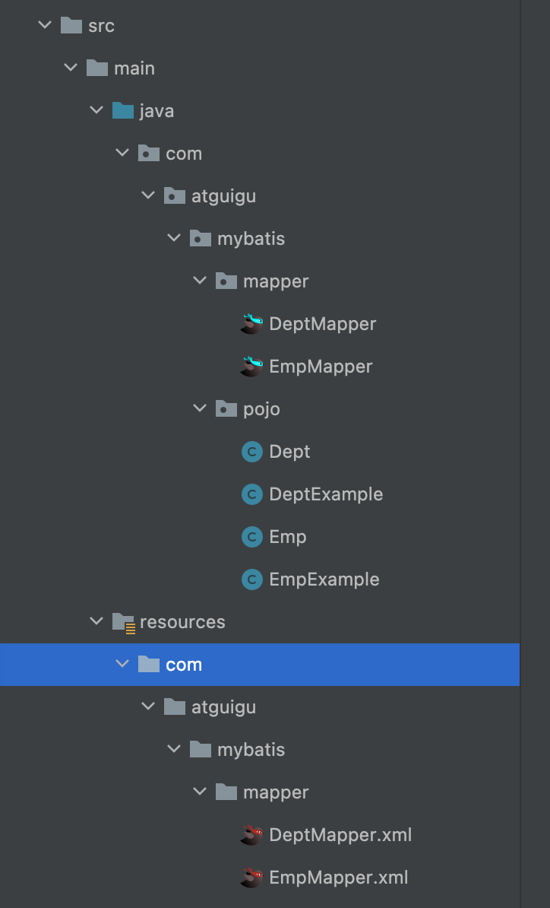
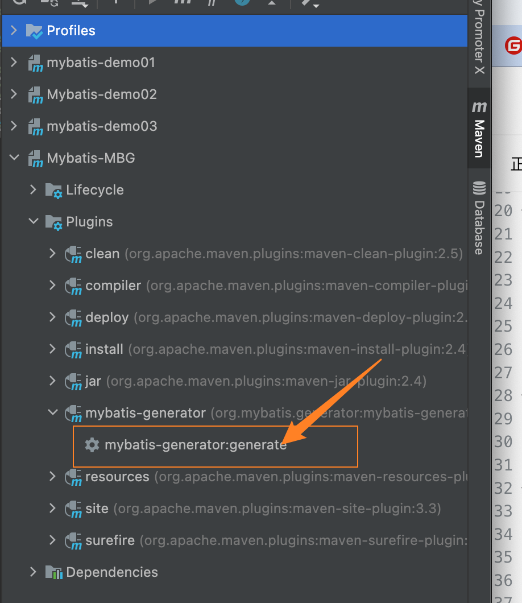
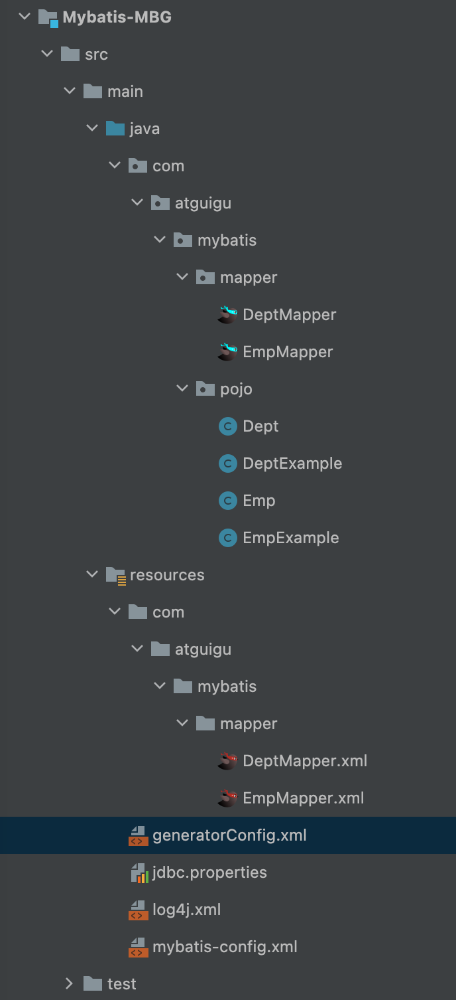

---
# 当前页面内容标题
title: 十一、MyBatis的逆向工程
# 分类
category:
  - mybatis
# 标签
tag: 
  - mybatis
  - java
  - SSM框架
sticky: false
# 是否收藏在博客主题的文章列表中，当填入数字时，数字越大，排名越靠前。
star: false
# 是否将该文章添加至文章列表中
article: true
# 是否将该文章添加至时间线中
timeline: true
---

# 十一、MyBatis的逆向工程

## 1、创建逆向工程和插件

- 正向工程：先创建Java实体类，由框架负责根据实体类生成数据库表。Hibernate是支持正向工程的。

- 逆向工程：先创建数据库表，由框架负责根据数据库表，反向生成如下资源:

  - Java实体类

  - Mapper接口

  - Mapper映射文件



### a>添加依赖和插件

```xml
<!-- 依赖MyBatis核心包 -->
<dependencies>
    <dependency>
        <groupId>org.mybatis</groupId>
        <artifactId>mybatis</artifactId>
        <version>3.5.7</version>
    </dependency>

    <dependency>
        <groupId>log4j</groupId>
        <artifactId>log4j</artifactId>
        <version>1.2.12</version>
    </dependency>

    <dependency>
        <groupId>junit</groupId>
        <artifactId>junit</artifactId>
        <version>4.12</version>
        <scope>test</scope>
    </dependency>

    <dependency>
        <groupId>mysql</groupId>
        <artifactId>mysql-connector-java</artifactId>
        <version>8.0.27</version>
    </dependency>

    <dependency>
        <groupId>org.projectlombok</groupId>
        <artifactId>lombok</artifactId>
        <version>1.18.22</version>
    </dependency>

</dependencies>
<!-- 控制Maven在构建过程中相关配置 -->
<build>
    <!-- 构建过程中用到的插件 -->
    <plugins>
        <!-- 具体插件，逆向工程的操作是以构建过程中插件形式出现的 -->
        <plugin>
            <groupId>org.mybatis.generator</groupId>
            <artifactId>mybatis-generator-maven-plugin</artifactId>
            <version>1.3.0</version>
            <!-- 插件的依赖 -->
            <dependencies>
                <!-- 逆向工程的核心依赖 -->
                <dependency>
                    <groupId>org.mybatis.generator</groupId>
                    <artifactId>mybatis-generator-core</artifactId>
                    <version>1.3.2</version>
                </dependency>
                <!-- 数据库连接池 -->
                <dependency>
                    <groupId>com.mchange</groupId>
                    <artifactId>c3p0</artifactId>
                    <version>0.9.2</version>
                </dependency>
                <!-- MySQL驱动 -->
                <dependency>
                    <groupId>mysql</groupId>
                    <artifactId>mysql-connector-java</artifactId>
                    <version>8.0.27</version>
                </dependency>
            </dependencies>
        </plugin>
    </plugins>
</build>
```

### b>创建MyBatis的核心配置文件

```xml
<?xml version="1.0" encoding="UTF-8" ?>
<!DOCTYPE configuration
        PUBLIC "-//mybatis.org//DTD Config 3.0//EN"
        "http://mybatis.org/dtd/mybatis-3-config.dtd">
<configuration>

    <!--引入properties配置文件-->
    <properties resource="jdbc.properties"/>

    <typeAliases>
        <package name="com.atguigu.mybatis.pojo"/>
    </typeAliases>

    <plugins>
        <!--设置分页插件-->
        <plugin interceptor="com.github.pagehelper.PageInterceptor"></plugin>
    </plugins>

    <environments default="development">
        <environment id="development">
            <transactionManager type="JDBC"/>
            <dataSource type="POOLED">
                <!--driver：驱动内容-->
                <property name="driver" value="${jdbc.driver}"/>
                <!--连接数据库的url-->
                <property name="url" value="${jdbc.url}"/>
                <!--用户名-->
                <property name="username" value="${jdbc.username}"/>
                <!--密码-->
                <property name="password" value="${jdbc.password}"/>
            </dataSource>
        </environment>
    </environments>
    <!--引入映射文件-->
    <mappers>
        <package name="com.atguigu.mybatis.mapper"/>
    </mappers>
</configuration>
```

### c>创建逆向工程的配置文件

> **文件名必须是:generatorConfig.xml**

```xml
<?xml version="1.0" encoding="UTF-8"?>
<!DOCTYPE generatorConfiguration
        PUBLIC "-//mybatis.org//DTD MyBatis Generator Configuration 1.0//EN"
        "http://mybatis.org/dtd/mybatis-generator-config_1_0.dtd">
<generatorConfiguration>
    <!--
        targetRuntime: 执行生成的逆向工程的版本
        MyBatis3Simple: 生成基本的CRUD(清新简洁版)
        MyBatis3: 生成带条件的CRUD(奢华尊享版)
    -->
    <!--<context id="DB2Tables" targetRuntime="MyBatis3Simple">-->
    <context id="DB2Tables" targetRuntime="MyBatis3">
        <!-- 数据库的连接信息 -->
        <jdbcConnection driverClass="com.mysql.cj.jdbc.Driver"
                        connectionURL="jdbc:mysql://localhost:3306/mybatis"
                        userId="root"
                        password="root">
        </jdbcConnection>
        <!-- javaBean的生成策略-->
        <javaModelGenerator targetPackage="com.atguigu.mybatis.pojo"
                            targetProject="./src/main/java">
            <!--是否能够使用子包-->
            <property name="enableSubPackages" value="true"/>
            <!--去掉字符串的前后空格-->
            <property name="trimStrings" value="true"/>
        </javaModelGenerator>
        <!-- SQL映射文件的生成策略 -->
        <sqlMapGenerator targetPackage="com.atguigu.mybatis.mapper" targetProject="./src/main/resources">
            <property name="enableSubPackages" value="true"/>
        </sqlMapGenerator>
        <!-- Mapper接口的生成策略 -->
        <javaClientGenerator type="XMLMAPPER" targetPackage="com.atguigu.mybatis.mapper" targetProject="./src/main/java">
            <property name="enableSubPackages" value="true"/>
        </javaClientGenerator>
        <!-- 逆向分析的表 -->
        <!-- tableName设置为*号，可以对应所有表，此时不写domainObjectName --> <!-- domainObjectName属性指定生成出来的实体类的类名 -->
        <table tableName="t_emp" domainObjectName="Emp"/>
        <table tableName="t_dept" domainObjectName="Dept"/>
    </context>
</generatorConfiguration>
```

**这里mac和linux系统把 \ 该成 / 这里我是mac系统，我改了 复制需要改一下**

### d>执行MBG插件的generate目标





## 2、QBC查询

```java
@Test
public void testMBG() {
    try {
        InputStream is = Resources.getResourceAsStream("mybatis-config.xml");
        SqlSessionFactory factory = new SqlSessionFactoryBuilder().build(is);
        SqlSession sqlSession = factory.openSession(true);
        EmpMapper mapper = sqlSession.getMapper(EmpMapper.class);
        // List<Emp> emps = mapper.selectByExample(null); // 根据条件查找 没有条件就是查询所有
        // emps.forEach(System.out::println);

        // 根据条件查询
        /*EmpExample example = new EmpExample();
        example.createCriteria().andEmpNameEqualTo("张三").andAgeGreaterThanOrEqualTo(20); // 创建一个条件  查询相当于 emp_name = "张三"的
        example.or().andDidIsNotNull(); // 或者
        List<Emp> list = mapper.selectByExample(example);
        list.forEach(System.out::println);*/

        // 修改
//            mapper.updateByPrimaryKey(new Emp(1, "admin", 22, null, "456@qq.com", 3));
        // 当传入的属性值为null时，是不会修改对应的字段值的(选择性修改)
        mapper.updateByPrimaryKeySelective(new Emp(1, "admin", 22, null, "456@qq.com", 3));
    } catch (IOException e) {
        e.printStackTrace();
    }
}
```

