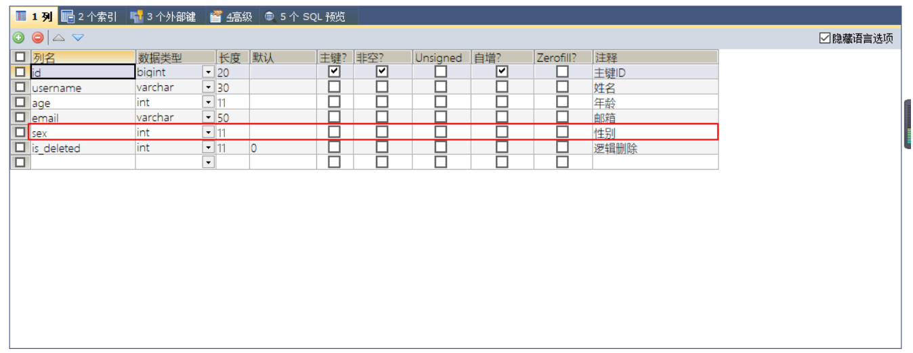

---
# 当前页面内容标题
title: 七、通用枚举
# 分类
category:
  - mybatisplus
# 标签
tag: 
  - mybatisplus
  - mybatis
  - java
sticky: false
# 是否收藏在博客主题的文章列表中，当填入数字时，数字越大，排名越靠前。
star: false
# 是否将该文章添加至文章列表中
article: true
# 是否将该文章添加至时间线中
timeline: true

---

# 七、通用枚举

> 表中的有些字段值是固定的，例如性别（男或女），此时我们可以使用MyBatis-Plus的通用枚举来实现

- **数据库表添加字段`sex`**

  

- **创建通用枚举类型**

  ```java
  @Getter
  public enum SexEnum {
      MALE(1, "男"),
      FEMALE(2, "女");
  
      @EnumValue //将注解所标识的属性的值存储到数据库中
      private int sex;
      private String sexName;
  
      SexEnum(Integer sex, String sexName) {
          this.sex = sex;
          this.sexName = sexName;
      }
  }
  ```

- **User实体类中添加属性sex**

  ```java
  public class User {
      private Long id;
      @TableField("username")
      private String name;
      private Integer age;
      private String email;
  
      @TableLogic
      private int isDeleted;  //逻辑删除
  
      private SexEnum sex;
  }
  ```

- **配置扫描通用枚举**

  ```xml
  <bean class="com.baomidou.mybatisplus.extension.spring.MybatisSqlSessionFactoryBean">
      <property name="configLocation" value="classpath:mybatis-config.xml"></property>
      <property name="dataSource" ref="dataSource"></property>
      <property name="typeAliasesPackage" value="com.atguigu.mp.pojo"></property>
      <!-- 设置MyBatis-Plus的全局配置 -->
      <property name="globalConfig" ref="globalConfig"></property>
      <!-- 配置扫描通用枚举 -->
      <property name="typeEnumsPackage" value="com.atguigu.mp.enums"></property>
  </bean>
  ```
  
  
  
- **执行测试方法**

  ```java
  @Test
  public void test(){
      User user = new User();
      user.setName("admin");
      user.setAge(33);
      user.setSex(SexEnum.MALE);
      int result = userMapper.insert(user);
      System.out.println("result:"+result);
  }
  ```

  