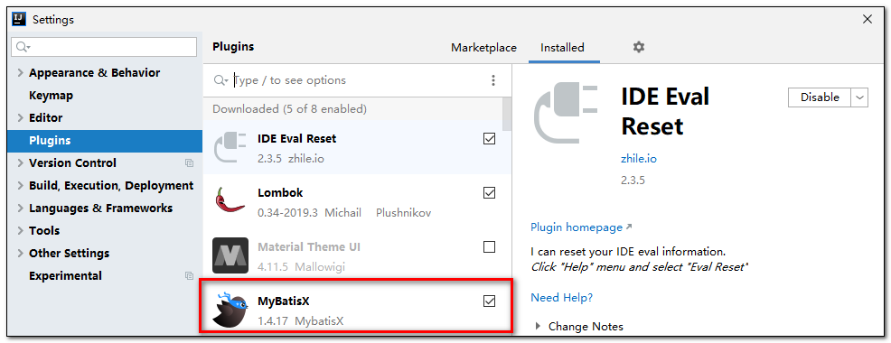

---
# 当前页面内容标题
title: 九、MyBatisX插件
# 分类
category:
  - mybatisplus
# 标签
tag: 
  - mybatisplus
  - mybatis
  - java
sticky: false
# 是否收藏在博客主题的文章列表中，当填入数字时，数字越大，排名越靠前。
star: false
# 是否将该文章添加至文章列表中
article: true
# 是否将该文章添加至时间线中
timeline: true
---

# 九、MyBatisX插件

> MyBatis-Plus为我们提供了强大的mapper和service模板，能够大大的提高开发效率。
>
> 但是在真正开发过程中，MyBatis-Plus并不能为我们解决所有问题，例如一些复杂的SQL，多表联查，我们就需要自己去编写代码和SQL语句，我们该如何快速的解决这个问题呢，这个时候可以使用MyBatisX插件。
>
> MyBatisX一款基于 IDEA 的快速开发插件，为效率而生。
>
> MyBatisX插件用法：https://baomidou.com/pages/ba5b24/

## 1.安装MyBatisX插件

> **打开IDEA，File-> Setteings->Plugins->MyBatisX，搜索栏搜索MyBatisX然后安装。**

