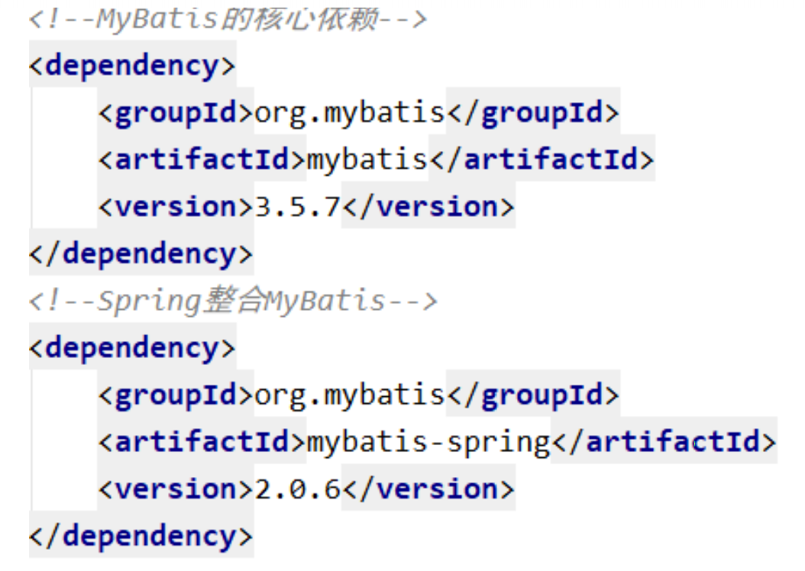
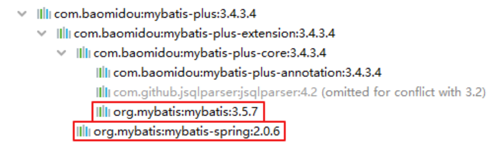
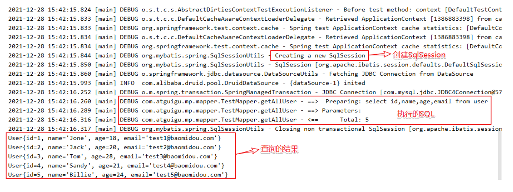
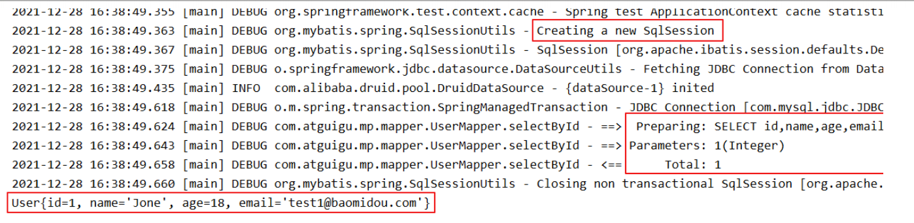

---
# 当前页面内容标题
title: 二、入门案例
# 分类
category:
  - mybatisplus
# 标签
tag: 
  - mybatisplus
  - mybatis
  - java
sticky: false
# 是否收藏在博客主题的文章列表中，当填入数字时，数字越大，排名越靠前。
star: false
# 是否将该文章添加至文章列表中
article: true
# 是否将该文章添加至时间线中
timeline: true

---

# 二、入门案例

> MyBatis-Plus官方推荐使用Spring Boot，在此我们以Spring整合MyBatis为基础，再加入MyBatis-plus，以此来学习MyBatis-Plus相关内容

## 1、开发环境

- **IDE：IDEA 2019.3.5**
- **JDK：JDK8+**
- **构建工具：Maven 3.5.4**
- **MySQL：MySQL 5.7**
- **Navicat：Navicat Premium 15**
- **Spring：5.3.1**
- **MyBatis-Plus：3.4.3.4**


## 2、建库建表

### a>创建表

```sql
CREATE DATABASE `mybatis_plus` /*!40100 DEFAULT CHARACTER SET utf8mb4 */; 
use `mybatis_plus`; 
CREATE TABLE `user` ( 
    `id` bigint(20) NOT NULL COMMENT '主键ID', 
    `name` varchar(30) DEFAULT NULL COMMENT '姓名', 
    `age` int(11) DEFAULT NULL COMMENT '年龄', 
    `email` varchar(50) DEFAULT NULL COMMENT '邮箱', 
    PRIMARY KEY (`id`) 
) ENGINE=InnoDB DEFAULT CHARSET=utf8;
```

### b>添加数据**插入几条测试数据**

```sql
INSERT INTO user (id, name, age, email) VALUES 
(1, 'Jone', 18, 'test1@baomidou.com'), 
(2, 'Jack', 20, 'test2@baomidou.com'), 
(3, 'Tom', 28, 'test3@baomidou.com'), 
(4, 'Sandy', 21, 'test4@baomidou.com'), 
(5, 'Billie', 24, 'test5@baomidou.com');
```

## 3、创建maven工程

### a>打包方式:jar

### **b>引入依赖**

```xml
<packaging>jar</packaging> 
<properties> 
  <spring.version>5.3.1</spring.version> 
</properties>

<dependencies>
        <dependency>
            <groupId>org.springframework</groupId>
            <artifactId>spring-context</artifactId>
            <version>${spring.version}</version>
        </dependency>
        <dependency>
            <groupId>org.springframework</groupId>
            <artifactId>spring-jdbc</artifactId>
            <version>${spring.version}</version>
        </dependency>
        <dependency>
            <groupId>org.springframework</groupId>
            <artifactId>spring-test</artifactId>
            <version>${spring.version}</version>
        </dependency> 
  			<!-- 连接池 -->
        <dependency>
            <groupId>com.alibaba</groupId>
            <artifactId>druid</artifactId>
            <version>1.2.8</version>
        </dependency> 
  			<!-- junit测试 -->
        <dependency>
            <groupId>junit</groupId>
            <artifactId>junit</artifactId>
            <version>4.12</version>
            <scope>test</scope>
        </dependency> 
  			<!-- MySQL驱动 -->
        <dependency>
            <groupId>mysql</groupId>
            <artifactId>mysql-connector-java</artifactId>
            <version>8.0.27</version>
        </dependency> 
  			<!-- 日志 -->
        <dependency>
            <groupId>org.slf4j</groupId>
            <artifactId>slf4j-api</artifactId>
            <version>1.7.30</version>
        </dependency>
        <dependency>
            <groupId>ch.qos.logback</groupId>
            <artifactId>logback-classic</artifactId>
            <version>1.2.3</version>
        </dependency> 
  			<!-- lombok用来简化实体类 -->
        <dependency>
            <groupId>org.projectlombok</groupId>
            <artifactId>lombok</artifactId>
            <version>1.16.16</version>
        </dependency> 
  			<!--MyBatis-Plus的核心依赖-->
        <dependency>
            <groupId>com.baomidou</groupId>
            <artifactId>mybatis-plus</artifactId>
            <version>3.4.3.4</version>
        </dependency>
    </dependencies>
```

**注意：**

> Spring整合MyBatis，需要MyBatis以及Spring整合MyBatis的依赖：
>
> 
>
> 但是，在以上的依赖列表中，并没有MyBatis以及Spring整合MyBatis的依赖，因为当我们引入了MyBatis-Plus的依赖时，就可以间接的引入这些依赖
>
> 
>
> 并且依赖和依赖之间的版本必须兼容，所以我们不能随便引入其他版本的依赖，以免发生冲突
>
> 在官网上有明确提示：
>
> 


## 4、Spring整合Mybatis

### a>创建实体

```java
public class User {

    private Long id;
    private String name;
    private Integer age;
    private String email;

    public Long getId() {
        return id;
    }

    public void setId(Long id) {
        this.id = id;
    }

    public String getName() {
        return name;
    }

    public void setName(String name) {
        this.name = name;
    }

    public Integer getAge() {
        return age;
    }

    public void setAge(Integer age) {
        this.age = age;
    }

    public String getEmail() {
        return email;
    }

    public void setEmail(String email) {
        this.email = email;
    }

    public User(Long id, String name, Integer age, String email) {
        this.id = id;
        this.name = name;
        this.age = age;
        this.email = email;
    }

    public User() {
    }

    @Override
    public String toString() {
        return "User{" +
                "id=" + id +
                ", name='" + name + '\'' +
                ", age=" + age +
                ", email='" + email + '\'' +
                '}';
    }
}
```

### b>创建Mybatis的核心配置文件

在resources下创建mybatis-config.xml

```xml
<?xml version="1.0" encoding="UTF-8" ?> 
<!DOCTYPE configuration 
				PUBLIC "-//mybatis.org//DTD Config 3.0//EN"
				"http://mybatis.org/dtd/mybatis-3-config.dtd"> 

<configuration> 

</configuration>
```

### c>创建mapper接口和映射文件

#### **mapper接口：**

```java
public interface TestMapper { 
  /**
  * 查询所有用户信息 
  * @return 
  */ 
  List<User> getAllUser(); 
}
```

#### **mapper映射文件：**

在resources下的com/atguigu/mp/mapper目录下创建TestMapper.xml

```xml
<?xml version="1.0" encoding="UTF-8" ?> 
<!DOCTYPE configuration 
				PUBLIC "-//mybatis.org//DTD Config 3.0//EN"
				"http://mybatis.org/dtd/mybatis-3-config.dtd"> 

<configuration> 

  <!--SQL片段，记录基础字段--> 
  <sql id="BaseColumns">id,name,age,email</sql>
  
  <!--List<User> getAllUser();--> 
  <select id="getAllUser" resultType="User"> 
    select <include refid="BaseColumns"></include> from user 
  </select>
  
</configuration>
```

### d>创建jdbc.properties

在resources下创建jdbc.properties

```properties
jdbc.driver=com.mysql.jdbc.Driver
jdbc.url=jdbc:mysql://localhost:3306/mybatis_plus?useUnicode=true&characterEncoding=utf-8&useSSL=false 
jdbc.username=root 
jdbc.password=123456
```

### e>创建spring的配置文件

在resources下创建applicationContext.xml

```xml
<?xml version="1.0" encoding="UTF-8"?>
<beans xmlns="http://www.springframework.org/schema/beans" xmlns:xsi="http://www.w3.org/2001/XMLSchema-instance"
       xmlns:context="http://www.springframework.org/schema/context"
       xsi:schemaLocation="http://www.springframework.org/schema/beans http://www.springframework.org/schema/beans/spring-beans.xsd http://www.springframework.org/schema/context https://www.springframework.org/schema/context/spring-context.xsd"> <!-- 引入jdbc.properties -->
    <context:property-placeholder
            location="classpath:jdbc.properties"></context:property-placeholder> <!-- 配置Druid数据源 -->
    <bean id="dataSource" class="com.alibaba.druid.pool.DruidDataSource">
        <property name="driverClassName" value="${jdbc.driver}"></property>
        <property name="url" value="${jdbc.url}"></property>
        <property name="username" value="${jdbc.username}"></property>
        <property name="password" value="${jdbc.password}"></property>
    </bean> <!-- 配置用于创建SqlSessionFactory的工厂bean -->
    <bean class="org.mybatis.spring.SqlSessionFactoryBean"> <!-- 设置MyBatis配置文件的路径（可以不设置） -->
        <property name="configLocation" value="classpath:mybatis-config.xml"></property> <!-- 设置数据源 -->
        <property name="dataSource" ref="dataSource"></property> <!-- 设置类型别名所对应的包 -->
        <property name="typeAliasesPackage"
                  value="com.atguigu.mp.pojo"></property> <!--设置映射文件的路径 若映射文件所在路径和mapper接口所在路径一致，则不需要设置 --> <!--<property name="mapperLocations" value="classpath:mapper/*.xml"> </property> -->
    </bean> <!--配置mapper接口的扫描配置 由mybatis-spring提供，可以将指定包下所有的mapper接口创建动态代理 并将这些动态代理作为IOC容器的bean管理 -->
    <bean class="org.mybatis.spring.mapper.MapperScannerConfigurer">
        <property name="basePackage" value="com.atguigu.mp.mapper"></property>
    </bean>
</beans>
```

### f>添加日志功能

在resources下创建logback.xml

```xml
<?xml version="1.0" encoding="UTF-8"?>
<configuration debug="false">
    <!--定义日志文件的存储地址 logs为当前项目的logs目录 还可以设置为../logs -->
    <property name="LOG_HOME" value="logs"/>
    <!--控制台日志， 控制台输出 -->
    <appender name="STDOUT" class="ch.qos.logback.core.ConsoleAppender">
        <encoder
                class="ch.qos.logback.classic.encoder.PatternLayoutEncoder">
            <!--格式化输出：%d表示日期，%thread表示线程名，%-5level：级别从左显示5个字符 宽度,%msg：日志消息，%n是换行符-->
            <pattern>%d{yyyy-MM-dd HH:mm:ss.SSS} [%thread] %-5level %logger{50} - %msg%n</pattern>
        </encoder>
    </appender> <!--myibatis log configure-->
    <logger name="com.apache.ibatis" level="TRACE"/>
    <logger name="java.sql.Connection" level="DEBUG"/>
    <logger name="java.sql.Statement" level="DEBUG"/>
    <logger name="java.sql.PreparedStatement" level="DEBUG"/>
    <!-- 日志输出级别 -->
    <root level="DEBUG">
        <appender-ref ref="STDOUT"/>
    </root>
</configuration>
```

### g>测试

#### 方式一：通过IOC容器

```java
public class MyBatisPlusTest {
    @Test
    public void testMyBatis() {
        ApplicationContext ac = new ClassPathXmlApplicationContext("applicationContext.xml");
        TestMapper mapper = ac.getBean(TestMapper.class);
        mapper.getAllUser().forEach(user -> System.out.println(user));
    }
}
```

#### 方式二：Spring整合Junit

```java
//在Spring的环境中进行测试 
@RunWith(SpringJUnit4ClassRunner.class)
//指定Spring的配置文件 
@ContextConfiguration("classpath:applicationContext.xml")
public class MyBatisPlusTest {
 	@Autowired 
  private TestMapper testMapper; 
  
  @Test 
  public void testMyBatisBySpring(){ 
    testMapper.getAllUser().forEach(user -> System.out.println(user)); 
  }
}
```

#### **结果：**



## **5**、加入MyBatis-Plus

### **a>**修改applicationContext.xml

Spring整合MyBatis

```xml
<!-- 配置用于创建SqlSessionFactory的工厂bean -->
<bean class="org.mybatis.spring.SqlSessionFactoryBean">
    <!-- 设置MyBatis配置文件的路径（可以不设置） -->
    <property name="configLocation" value="classpath:mybatis-config.xml"></property> 
    <!-- 设置数据源 -->
    <property name="dataSource" ref="dataSource"></property>
    <!-- 设置类型别名所对应的包 -->
    <property name="typeAliasesPackage"
              value="com.atguigu.mp.pojo"></property>
    <!--设置映射文件的路径 若映射文件所在路径和mapper接口所在路径一致，则不需要设置 -->
    <!--<property name="mapperLocations" value="classpath:mapper/*.xml">
    </property> -->
</bean>
```

加入MyBatis-Plus之后

```xml
<!-- 此处使用的是MybatisSqlSessionFactoryBean -->
<bean class="com.baomidou.mybatisplus.extension.spring.MybatisSqlSessionFactoryBean">
    <!-- 设置MyBatis配置文件的路径（可以不设置） -->
    <property name="configLocation" value="classpath:mybatis-config.xml"></property>
    <!-- 设置数据源 -->
    <property name="dataSource" ref="dataSource"></property>
    <!-- 设置类型别名所对应的包 -->
    <property name="typeAliasesPackage"
              value="com.atguigu.mp.pojo"></property>
    <!--设置映射文件的路径
            若映射文件所在路径和mapper接口所在路径一致，则不需要设置 -->
    <!--<property name="mapperLocations" value="classpath:mapper/*.xml"> </property> -->
</bean>
```

> 此处使用的是MybatisSqlSessionFactoryBean
>
> 经观察，目前bean中配置的属性和SqlSessionFactoryBean一致
>
> MybatisSqlSessionFactoryBean是在SqlSessionFactoryBean的基础上进行了增强
>
> 即具有SqlSessionFactoryBean的基础功能，又具有MyBatis-Plus的扩展配置
>
> 具体配置信息地址：https://baomidou.com/pages/56bac0/#%E5%9F%BA%E6%9C%AC%E9%85%8D%E7%BD%AE

### b>创建mapper接口

```java
public interface UserMapper extends BaseMapper<User> { 
}
```

> BaseMapper是MyBatis-Plus提供的基础mapper接口，泛型为所操作的实体类型，其中包含CRUD的各个方法，我们的mapper继承了BaseMapper之后，就可以直接使用BaseMapper所提供的各种方法，而不需要编写映射文件以及SQL语句，大大的提高了开发效率

### c>测试

```java
@RunWith(SpringJUnit4ClassRunner.class)
@ContextConfiguration("classpath:applicationContext.xml")
public class MyBatisPlusTest {
    @Autowired
    private UserMapper userMapper;

    @Test
    public void testMyBatisPlus() { 
        //根据id查询用户信息 
         System.out.println(userMapper.selectById(1)); 
    } 
}
```

### d>结果



## 6、总结

> 在Spring整合MyBatis中加入了MyBatis-Plus后，我们就可以使用MyBatis-Plus所提供的BaseMapper实现CRUD，并不需要编写映射文件以及SQL语句
>
> 但是若要自定义SQL语句，仍然可以编写映射文件而不造成任何影响
>
> 因为MyBatis-Plus只做增强，而不做改变
