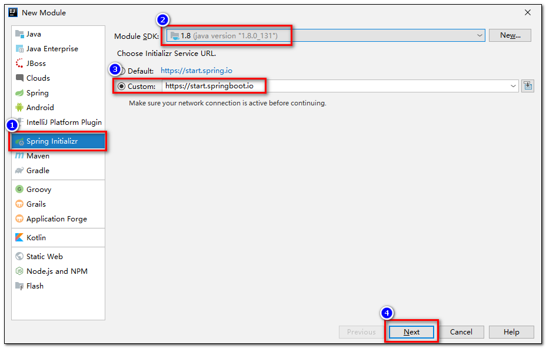
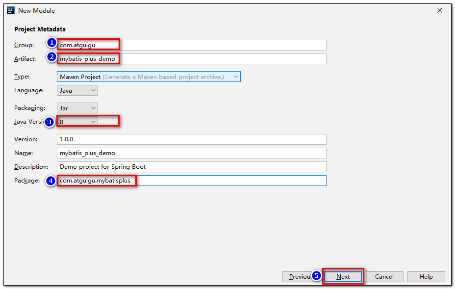
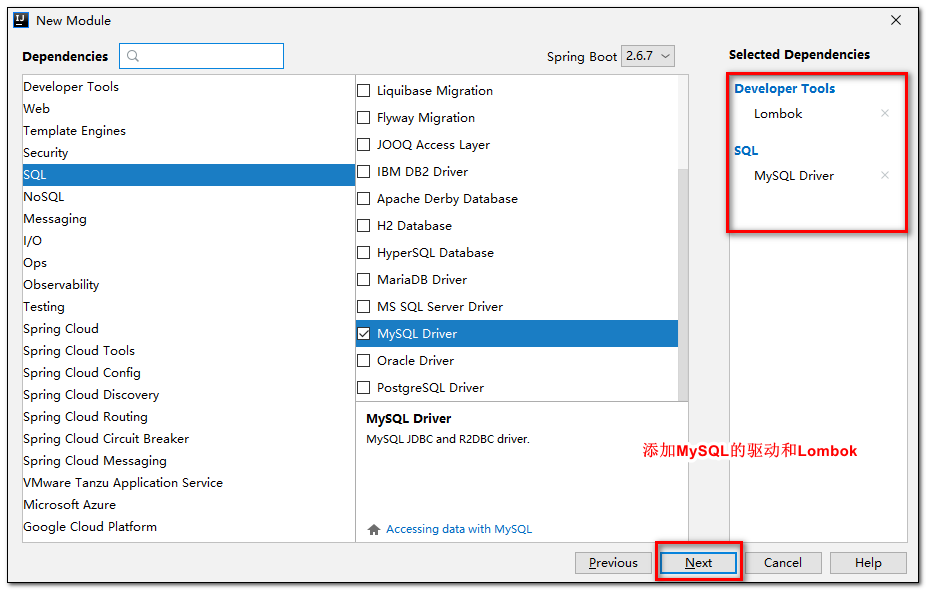
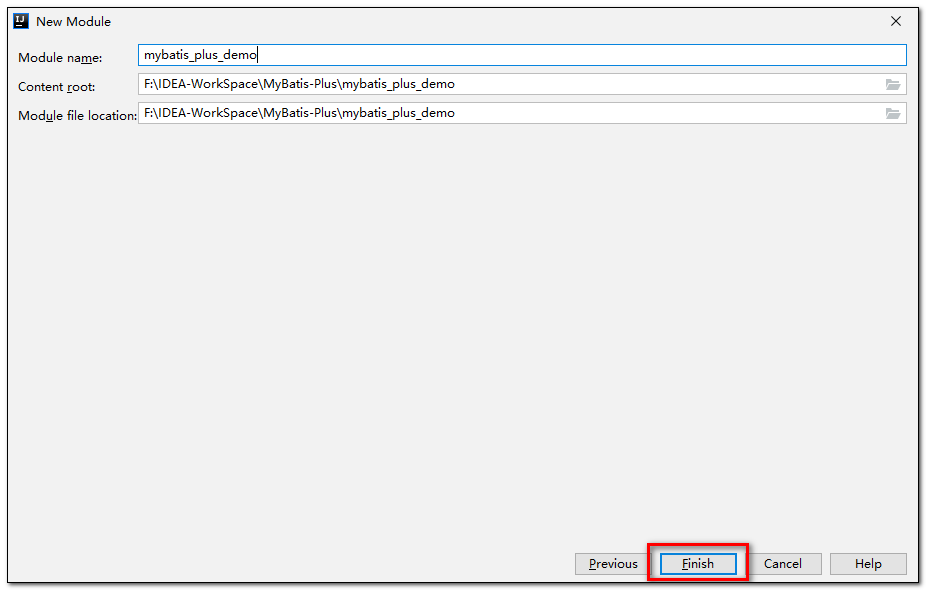
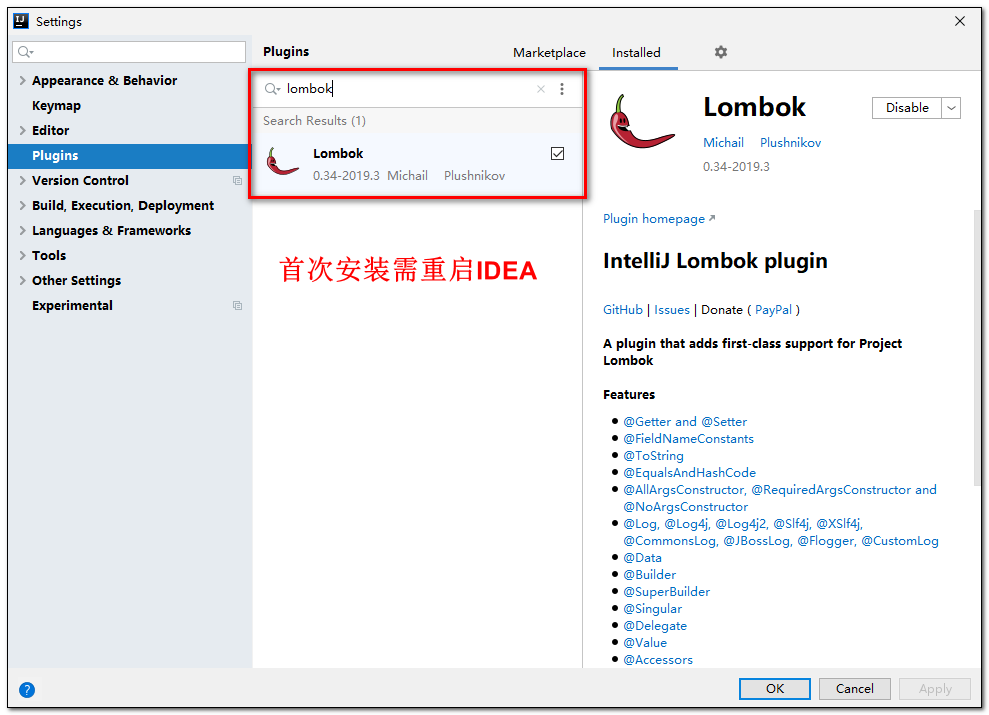
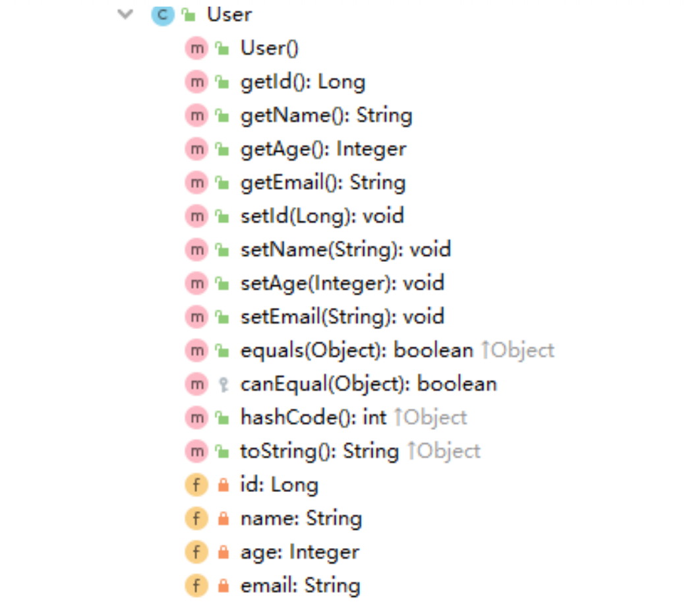
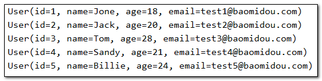
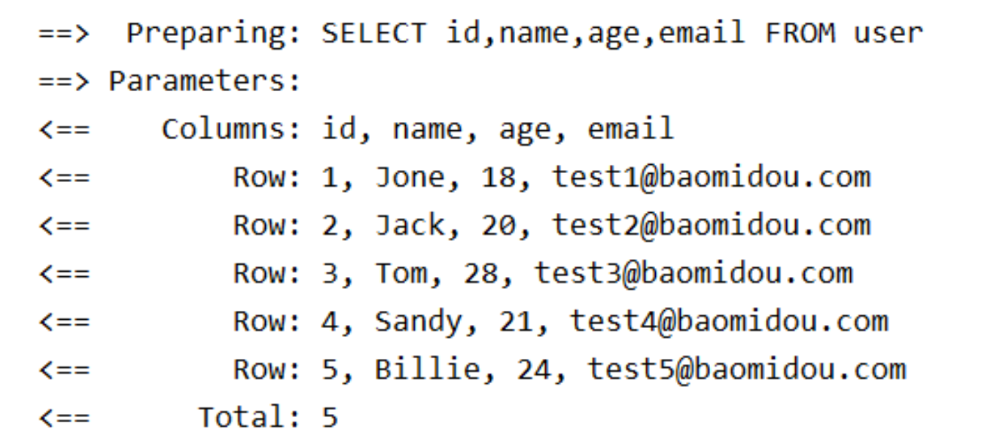

---
# 当前页面内容标题
title: 二、入门案例
# 分类
category:
  - mybatisplus
# 标签
tag: 
  - mybatisplus
  - mybatis
  - java
sticky: false
# 是否收藏在博客主题的文章列表中，当填入数字时，数字越大，排名越靠前。
star: false
# 是否将该文章添加至文章列表中
article: true
# 是否将该文章添加至时间线中
timeline: true

---

# 二、入门案例

## 1.开发环境

- **IDE：IDEA 2019.3.5**
- **JDK：JDK8+**
- **构建工具：Maven 3.5.4**
- **MySQL：MySQL 8.0.24**
- **Navicat：Navicat Premium 15**
- **Spring Boot：2.6.7**
- **MyBatis-Plus：3.5.1**


## 2.建库建表

- **打开Navicat运行以下SQL脚本进行建库建表**

  ```sql
  CREATE DATABASE `mybatis_plus` /*!40100 DEFAULT CHARACTER SET utf8mb4 */; 
  use `mybatis_plus`; 
  CREATE TABLE `user` ( 
      `id` bigint(20) NOT NULL COMMENT '主键ID', 
      `name` varchar(30) DEFAULT NULL COMMENT '姓名', 
      `age` int(11) DEFAULT NULL COMMENT '年龄', 
      `email` varchar(50) DEFAULT NULL COMMENT '邮箱', 
      PRIMARY KEY (`id`) 
  ) ENGINE=InnoDB DEFAULT CHARSET=utf8;
  ```

- **插入几条测试数据**

  ```sql
  INSERT INTO user (id, name, age, email) VALUES 
  (1, 'Jone', 18, 'test1@baomidou.com'), 
  (2, 'Jack', 20, 'test2@baomidou.com'), 
  (3, 'Tom', 28, 'test3@baomidou.com'), 
  (4, 'Sandy', 21, 'test4@baomidou.com'), 
  (5, 'Billie', 24, 'test5@baomidou.com');
  ```

  

## 3.创建工程

- **使用`Spring Initializer`快速初始化一个 Spring Boot 工程**

  

  

  

  

- **引入依赖**

  ```xml
  <dependencies> 
    <dependency> 
      <groupId>org.springframework.boot</groupId> 
      <artifactId>spring-boot-starter</artifactId> 
    </dependency> 
    <dependency> 
      <groupId>org.springframework.boot</groupId>
      <artifactId>spring-boot-starter-test</artifactId> 
      <scope>test</scope> 
    </dependency> 
    <dependency> 
      <groupId>com.baomidou</groupId> 
      <artifactId>mybatis-plus-boot-starter</artifactId>
      <version>3.5.1</version> 
    </dependency> 
    <dependency> 
      <groupId>org.projectlombok</groupId> 
      <artifactId>lombok</artifactId> 
      <optional>true</optional> 
    </dependency> 
    <dependency> 
      <groupId>mysql</groupId> 
      <artifactId>mysql-connector-java</artifactId> 
      <scope>runtime</scope> 
    </dependency> 
  </dependencies>
  ```

- **安装`Lombok`插件**

  


## 4.配置编码

- **配置`application.yml`文件**

  ```yml
  #配置端口
  server:
    port: 80
  
  spring:
    #配置数据源
    datasource:
      #配置数据源类型
      type: com.zaxxer.hikari.HikariDataSource
      #配置连接数据库的信息
      driver-class-name: com.mysql.cj.jdbc.Driver
      url: jdbc:mysql://localhost:3306/mybatis_plus?characterEncoding=utf-8&useSSL=false
      username: {username}
      password: {password}
  ```

注意：

> 1、驱动类driver-class-name
>
> spring boot 2.0（内置jdbc5驱动），驱动类使用：
>
> driver-class-name: com.mysql.jdbc.Driver
>
> spring boot 2.1及以上（内置jdbc8驱动），驱动类使用：
>
> driver-class-name: com.mysql.cj.jdbc.Driver
>
> 否则运行测试用例的时候会有 WARN 信息
>
> 2、连接地址url
>
> MySQL5.7版本的url：
>
> jdbc:mysql://localhost:3306/mybatis_plus?characterEncoding=utf-8&useSSL=false
>
> MySQL8.0版本的url：
>
> jdbc:mysql://localhost:3306/mybatis_plus?
>
> serverTimezone=GMT%2B8&characterEncoding=utf-8&useSSL=false
>
> 否则运行测试用例报告如下错误：
>
> java.sql.SQLException: The server time zone value 'Öйú±ê׼ʱ¼ä' is unrecognized or
>
> represents more

- **在 Spring Boot 启动类中添加 `@MapperScan` 注解，扫描 Mapper 文件夹**

  ```java
  @SpringBootApplication
  @MapperScan("指定Mapper接口所在的包")
  public class MybatisPlusDemoApplication {
  	public static void main(String[] args) {
  		SpringApplication.run(MybatisPlusDemoApplication.class, args);
  	}
  }
  ```

- **编写实体类 `User.java`（此处使用了 Lombok 简化代码）**

  ```java
  @Data
  public class User {
      private Long id;
      private String name;
      private Integer age;
      private String email;
  }
  ```



- **编写 Mapper 包下的 `UserMapper`接口**

  ```java
  public interface UserMapper extends BaseMapper<User> {}
  ```


## 5.测试查询

- **编写一个测试类`MyBatisPlusTest.java`**

  ```java
  @SpringBootTest
  public class MyBatisPlusTest {
      @Resource
      private UserMapper userMapper;
  
      /**
       * 测试查询所有数据
       */
      @Test
      void testSelectList(){
          //通过条件构造器查询一个list集合，若没有条件，则可以设置null为参数
          List<User> users = userMapper.selectList(null);
          users.forEach(System.out::println);
      }
  }
  ```

- **控制台打印查询结果**

  

> IDEA在 userMapper 处报错，因为找不到注入的对象，因为类是动态创建的，但是程序可以正确的执行。
>
> 为了避免报错，可以在mapper接口上添加 @Repository 注解

## 6.添加日志

```yaml
#MyBatis-Plus相关配置
mybatis-plus:
  configuration:
    #配置日志
    log-impl: org.apache.ibatis.logging.stdout.StdOutImpl
```


