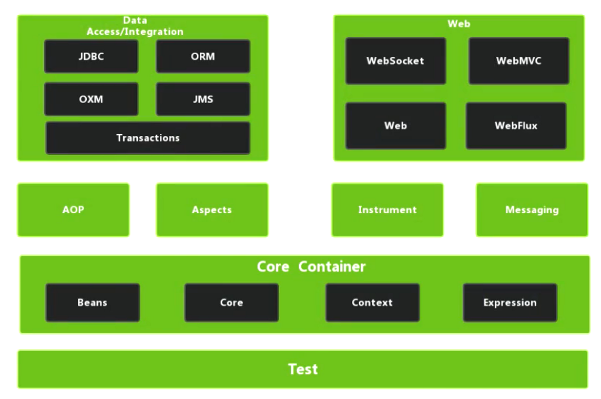
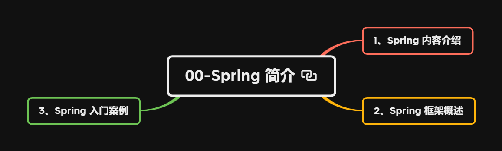
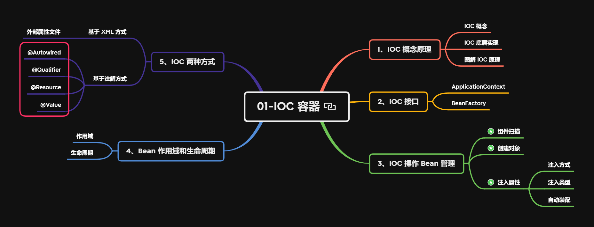
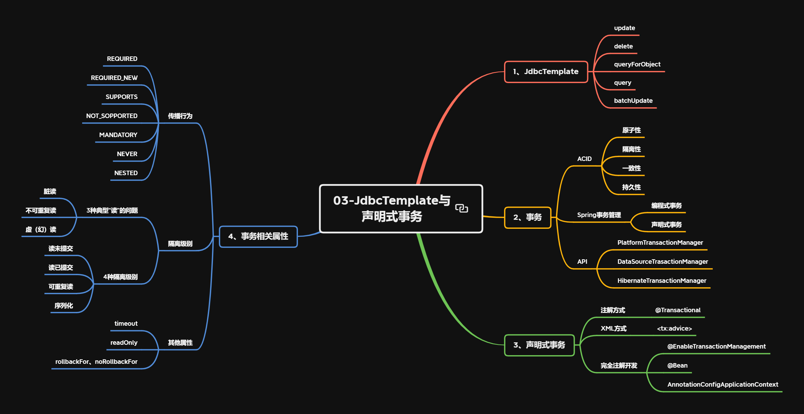

---
# 当前页面内容标题
title: Spring_README
# 分类
category:
  - spring
# 标签
tag: 
  - spring
  - SSM框架
sticky: false
# 是否收藏在博客主题的文章列表中，当填入数字时，数字越大，排名越靠前。
star: false
# 是否将该文章添加至文章列表中
article: true
# 是否将该文章添加至时间线中
timeline: true
---

## 1、官网

- Spring官网：[Spring Framework](https://spring.io/projects/spring-framework#learn)
- Github源码：[GitHub - spring-projects/spring-framework: Spring Framework](https://github.com/spring-projects/spring-framework)
- Spring下载路径：[JFrog (spring.io)](https://repo.spring.io/ui/native/release/org/springframework/spring/)

## 2、Spring5模块

[](https://s2.loli.net/2022/03/12/ZdO7zvjgIDBi62o.png)

笔记主要内容目前涵盖（2022-03-12）

- 核心容器：`Beans`、`Core`、`Context`、`Expression`
- 数据访问集成：`JDBC`、`ORM`、`Transactions`
- 其他：`AOP`、`Aspects`、`Test`

## 3、相关依赖

核心

- `spring-beans`
- `spring-core`
- `spring-context`
- `spring-expression`
- `commons-logging`

AOP 相关

- `spring-aop`
- `aspectjrt`
- `aspectjweaver`

JdbcTemplate 相关

- `druid`
- `mysql-connector-java`
- `spring-jdbc`
- `spring-orm`
- `spring-tx`

日志相关

- `log4j-api`
- `log4j-core`
- `log4j-slf4j-impl`
- `slf4j-api`

Junit 相关

- `spring-test`

```
<!--核心-->
<dependency>
    <groupId>org.springframework</groupId>
    <artifactId>spring-beans</artifactId>
    <version>5.3.16</version>
</dependency>
<dependency>
    <groupId>org.springframework</groupId>
    <artifactId>spring-core</artifactId>
    <version>5.3.16</version>
</dependency>
<dependency>
    <groupId>org.springframework</groupId>
    <artifactId>spring-context</artifactId>
    <version>5.3.16</version>
</dependency>
<dependency>
    <groupId>org.springframework</groupId>
    <artifactId>spring-expression</artifactId>
    <version>5.3.16</version>
</dependency>
<dependency>
    <groupId>commons-logging</groupId>
    <artifactId>commons-logging</artifactId>
    <version>1.2</version>
</dependency>
<!--AOP 相关-->
<dependency>
    <groupId>org.springframework</groupId>
    <artifactId>spring-aop</artifactId>
    <version>5.3.16</version>
</dependency>
<dependency>
    <groupId>org.aspectj</groupId>
    <artifactId>aspectjrt</artifactId>
    <version>1.9.8</version>
    <scope>runtime</scope>
</dependency>
<dependency>
    <groupId>org.aspectj</groupId>
    <artifactId>aspectjweaver</artifactId>
    <version>1.9.8</version>
    <scope>runtime</scope>
</dependency>
<!--JdbcTemplate 相关-->
<dependency>
    <groupId>com.alibaba</groupId>
    <artifactId>druid</artifactId>
    <version>1.2.8</version>
</dependency>
<dependency>
    <groupId>mysql</groupId>
    <artifactId>mysql-connector-java</artifactId>
    <version>8.0.28</version>
</dependency>
<dependency>
    <groupId>org.springframework</groupId>
    <artifactId>spring-jdbc</artifactId>
    <version>5.3.16</version>
</dependency>
<dependency>
    <groupId>org.springframework</groupId>
    <artifactId>spring-orm</artifactId>
    <version>5.3.16</version>
</dependency>
<dependency>
    <groupId>org.springframework</groupId>
    <artifactId>spring-tx</artifactId>
    <version>5.3.16</version>
</dependency>
<!--日志相关-->
<dependency>
    <groupId>org.apache.logging.log4j</groupId>
    <artifactId>log4j-api</artifactId>
    <version>2.17.2</version>
</dependency>
<dependency>
    <groupId>org.apache.logging.log4j</groupId>
    <artifactId>log4j-core</artifactId>
    <version>2.17.2</version>
</dependency>
<dependency>
    <groupId>org.apache.logging.log4j</groupId>
    <artifactId>log4j-slf4j-impl</artifactId>
    <version>2.17.2</version>
    <scope>test</scope>
</dependency>
<dependency>
    <groupId>org.slf4j</groupId>
    <artifactId>slf4j-api</artifactId>
    <version>1.7.36</version>
</dependency>
<!--Junit 相关-->
<dependency>
    <groupId>org.springframework</groupId>
    <artifactId>spring-test</artifactId>
    <version>5.3.16</version>
    <scope>test</scope>
</dependency>
```

## 4、导图

### 00-Spring简介



### 01-IOC容器

[](https://s2.loli.net/2022/03/12/z1vBP9tDoQSZrXn.png)

### 02-AOP

[](https://s2.loli.net/2022/03/12/DXfhQzgBW2jal8L.png)

### 03-JdbcTemplate与声明式事务

[](https://s2.loli.net/2022/03/12/F6Ab9jzGw3XvCpq.png)

### 04-Spring5新功能

[](https://s2.loli.net/2022/03/12/DgPXpqI793WmtMr.png)