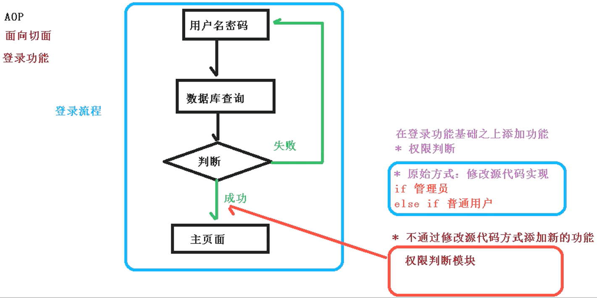
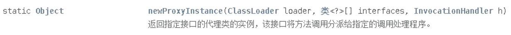
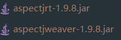
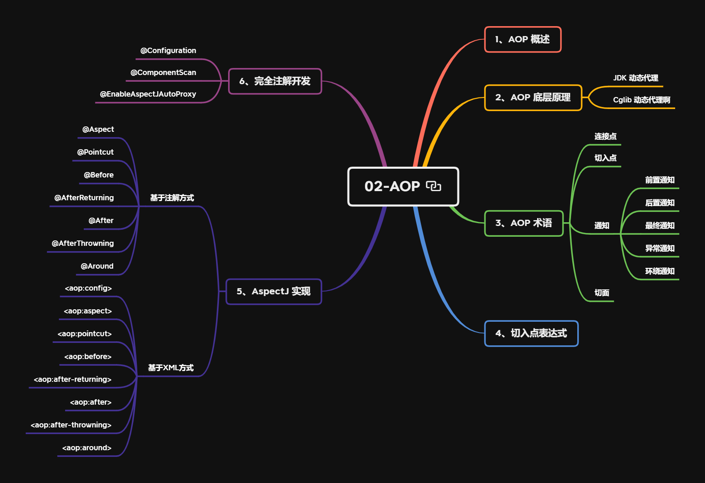

---
# 当前页面内容标题
title: AOP
# 分类
category:
  - spring
# 标签
tag: 
  - spring
  - SSM框架
  - AOP
sticky: false
# 是否收藏在博客主题的文章列表中，当填入数字时，数字越大，排名越靠前。
star: false
# 是否将该文章添加至文章列表中
article: true
# 是否将该文章添加至时间线中
timeline: true
---

# AOP

## 1、AOP 概述

- **定义**：AOP（Aspect Oriented Programming，面向切面编程），通过预编译和运行时动态代理扩展程序功能
- **作用**：利用 AOP 可以对业务逻辑的各个部分进行隔离，降低耦合性，提高程序可重用性和开发效率
- **场景**：日志记录，性能统计，安全控制，事务处理，异常处理
- **通俗描述**：不修改源代码，在主干功能中添加新功能

使用登录功能案例说明 AOP

[](https://s2.loli.net/2022/03/04/UCNB14TfSEQJrHg.png)

## 2、AOP 底层原理

- 底层原理：

  动态代理

  - **有接口情况**：JDK动态代理
  - **无接口情况**：CGLib动态代理

如果学习过设计模式，应该对上述两种代理方式非常了解了。没有学习过也没关系，我们接着往下看

### 2.1、JDK 动态代理

```java
public interface UserDao {
    void login();
}
public class UserDaoImpl implements UserDao {
    @Override
    public void login(){
        //登录实现过程
    }
}
```

**有接口情况**：创建 UserDao 接口实现类代理对象

### 2.2、CGlib 动态代理

```java
public class User {
    public void add(){
        //...
    }
}
// 原始方法：通过子类继承，重写User类方法
public class Person extends User {
    @Override
    public void add(){
        super.add();
        //增强代码逻辑
    }
}
```

**无接口情况**：创建 User 类子类代理对象

------

由于 Spring5 中对上述代理已经做了很好的封装，我们只需要通过最简单的方式进行配置即可

但仍然需要我们对原理有一定的认识，只有做到“知其然，知其所以然”，才能真正“以不变应万变”

## 3、JDK 动态代理实现

**实现方式**：使用`Proxy`中的方法创建代理对象

[](https://s2.loli.net/2022/03/04/wuD41Gdsqh7YgFa.png)

**具体方法**：`newProxyInstance()`

**方法参数**

- `ClassLoader loader`：类加载器
- `Class<?>[] interfaces`：增强方法所在类实现的接口数组
- `InvocationHandler h`：实现`InvocationHandler`接口，创建代理对象，编写增强方法

[](https://s2.loli.net/2022/03/04/1aBsfCtyjLuYoF3.png)

常言道：“Talking is cheap, show me the code"。话不多说，下面上代码~

- 1）创建 UserDao 接口和对应实现类

```java
public interface UserDao {
    int add(int a, int b);
    String update(String id);
}
public class UserDaoImpl implements UserDao {
    @Override
    public int add(int a, int b) {
        return a + b;
    }
    @Override
    public String update(String id) {
        return id;
    }
}
```

- 2）创建 UserDao 代理对象

```java
public class UserDaoProxy {
    private UserDao target;
    public UserDaoProxy(UserDao target) {
        this.target = target;
    }
    public UserDao newProxyInstance() {
        Class<?> targetClass = target.getClass();
        ClassLoader classLoader = targetClass.getClassLoader();
        Class<?>[] interfaces = targetClass.getInterfaces();
        return (UserDao) Proxy.newProxyInstance(classLoader, interfaces, new UserDaoInvocationHandler());
    }
    class UserDaoInvocationHandler implements InvocationHandler {

        @Override
        public Object invoke(Object proxy, Method method, Object[] args) throws Throwable {
            // 被代理对象方法前置逻辑
            System.out.print("method=" + method.getName() + ", args=" + Arrays.toString(args));
            // 被代理对象方法
            Object result = method.invoke(target, args);
            // 被代理对象方法后置逻辑
            System.out.println(", result=" + result);
            return result;
        }
    }
}
```

- 3）测试

```java
UserDao target = new UserDaoImpl();
UserDaoProxy userDaoProxy = new UserDaoProxy(target);
UserDao userDao = userDaoProxy.newProxyInstance();
userDao.add(1, 2);
userDao.update("UUID1");
// method=add, args=[1, 2], result=3
// method=update, args=[UUID1], result=UUID1
```

## 4、AOP 术语

- 连接点：类中可以被增强的方法，称为连接点

- 切入点：类中实际被增强的方法，称为切入点

- 通知（增强）：实际增强的逻辑部分，称为通知

  通知分为五种类型：

  - 前置通知：方法执行之前的处理
  - 后置通知：方法执行之后的处理
  - 环绕通知：方法执行前后的处理
  - 异常通知：方法抛出异常的处理
  - 最终通知：方法执行最终的处理（相当于`try-catch-finally`中的`finally`）

- 切面：是一个动作，即把通知应用到切入点的过程

## 5、AOP 准备工作

### 5.1、AspectJ 介绍

Spring 一般都是基于`AspectJ`实现 AOP 操作的

- `AspectJ`不是 Spring 的一部分，而是一个独立的 AOP 框架
- 一般会把`AspectJ`和 Spring 搭配使用，进行 AOP 操作，因为这样更加方便

基于 AspectJ 进行 AOP 操作的两种方式：

- 基于 XML 配置文件方式实现
- 基于注解方式实现（推荐使用）

### 5.2、引入 AOP 相关依赖

[](https://s2.loli.net/2022/03/05/Q6fSPz7Rp4oCJTY.png)

```xml
<dependency>
    <groupId>org.aspectj</groupId>
    <artifactId>aspectjrt</artifactId>
    <version>1.9.8</version>
</dependency>
<dependency>
    <groupId>org.aspectj</groupId>
    <artifactId>aspectjweaver</artifactId>
    <version>1.9.8</version>
</dependency>
```

### 5.3、切入点表达式

切入点表达式的作用：知道对哪个类的哪个方法进行增强

语法结构：`execution([权限修饰符][返回类型][类全路径][方法名]([参数列表]))`

**举例**

⭐ 举例1：对`com.vectorx.dao.BookDao`中的`add()`方法进行增强

```xml
execution(* com.vectorx.dao.BookDao.add(..))
```

⭐ 举例2：对`com.vectorx.dao.BookDao`中的所有方法进行增强

```xml
execution(* com.vectorx.dao.BookDao.*(..))
```

⭐ 举例3：对`com.vectorx.dao`包中所有类的所有方法进行增强

```xml
execution(* com.vectorx.dao.*.*(..))
```

## 6、AspectJ 注解实现

### 6.1、Spring 配置文件

- 1）引入`context`和`aop`名称空间
- 2）配置组件扫描基础包
- 3）开启AspectJ生成代理对象

```xml
<?xml version="1.0" encoding="UTF-8"?>
<beans xmlns="http://www.springframework.org/schema/beans"
       xmlns:context="http://www.springframework.org/schema/context"
       xmlns:aop="http://www.springframework.org/schema/aop"
       xmlns:xsi="http://www.w3.org/2001/XMLSchema-instance"
       xsi:schemaLocation="http://www.springframework.org/schema/beans http://www.springframework.org/schema/beans/spring-beans.xsd 
                           http://www.springframework.org/schema/context http://www.springframework.org/schema/context/spring-context.xsd 
                           http://www.springframework.org/schema/aop http://www.springframework.org/schema/aop/spring-aop.xsd">

    <!--组件扫描配置-->
    <context:component-scan base-package="com.vectorx.spring5.s13_aspectj_annatation"/>

    <!--开启AspectJ生成代理对象-->
    <aop:aspectj-autoproxy/>
</beans>
```

### 6.2、创建被增强对象和增强对象

- 1）创建 User 对象，并添加`@Component`注解
- 2）创建 UserProxy 对象，并添加`@Component`注解

```java
@Component
public class User {
    public void add() {
        System.out.println("add...");
    }
}
@Component
public class UserProxy {
    /**
     * 前置通知
     */
    public void before() {
        System.out.println("before...");
    }

    /**
     * 后置通知
     */
    public void afterReturning() {
        System.out.println("afterReturning...");
    }

    /**
     * 最终通知
     */
    public void after() {
        System.out.println("after...");
    }

    /**
     * 异常通知
     */
    public void afterThrowing() {
        System.out.println("afterThrowing...");
    }

    /**
     * 环绕通知
     */
    public void around() {
        System.out.println("around...");
    }
}
```

### 6.3、添加增强类注解和切入点表达式

```java
@Component
@Aspect
public class UserProxy {
    /**
     * 前置通知
     */
    @Before(value = "execution(* com.vectorx.spring5.s13_aspectj_annatation.User.add(..))")
    public void before() {
        System.out.println("before...");
    }

    /**
     * 后置通知
     */
    @AfterReturning(value = "execution(* com.vectorx.spring5.s13_aspectj_annatation.User.add(..))")
    public void afterReturning() {
        System.out.println("afterReturning...");
    }

    /**
     * 最终通知
     */
    @After(value = "execution(* com.vectorx.spring5.s13_aspectj_annatation.User.add(..))")
    public void after() {
        System.out.println("after...");
    }

    /**
     * 异常通知
     */
    @AfterThrowing(value = "execution(* com.vectorx.spring5.s13_aspectj_annatation.User.add(..))")
    public void afterThrowing() {
        System.out.println("afterThrowing...");
    }

    /**
     * 环绕通知
     */
    @Around(value = "execution(* com.vectorx.spring5.s13_aspectj_annatation.User.add(..))")
    public void around(ProceedingJoinPoint joinPoint) throws Throwable {
        System.out.println("around before...");
        // 执行被增强的方法
        joinPoint.proceed();
        System.out.println("around after...");
    }
}
```

### 6.4、代码测试

```java
ApplicationContext context = new ClassPathXmlApplicationContext("bean11.xml");
User user = context.getBean("user", User.class);
user.add();
```

结果

```
around before...
before...
add...
afterReturning...
after...
around after...
```

为了演示异常通知，需要修改下被增强对象中的方法，模拟一个异常

```java
@Component
public class User {
    public void add() {
        System.out.println("add...");
        // 模拟一个异常
        int i = 2 / 0;
    }
}
```

运行结果

```
around before...
before...
add...
afterThrowing...
after...
```

对比正常情况下，发现少了`afterReturning`即后置异常和`around after`即环绕增强的后置处理

### 6.5、抽取相同切入点表达式

通过上述的例子，应该对`AspectJ`注解实现有了一定的了解

同时我们发现切入点表达式都是完全一样的，可以对这些相同的切入点表达式进行抽取，以达到重用切入点表达式定义的目的

- 1）首先想到的应该是定义成员变量

```java
private final String execution = "execution(* com.vectorx.spring5.s13_aspectj_annatation.User.add(..))";

@Before(value = execution)
public void before() {
    System.out.println("before...");
}
```

- 2）`AspectJ`中提供了`Pointcut`注解（推荐）

```java
@Pointcut(value = "execution(* com.vectorx.spring5.s13_aspectj_annatation.User.add(..))")
private void pointcut(){}

@Before(value = "pointcut()")
public void before() {
    System.out.println("before...");
}
```

### 6.6、设置增强类优先级

如果有多个增强类对类中同一个方法进行增强，可以设置增强类的优先级，来决定哪个增强类先执行，哪个增强类后执行

使用`@Order`注解设置增强类的优先级，其中指定优先级数字，注解格式：`@Order(数字类型值)`

- 数字类型值越小，优先级越高
- 数字类型值越大，优先级越低

**:star:最佳实践**

```java
@Component
@Aspect
@Order(1)
public class PersonProxy {
    //...
}
@Component
@Aspect
@Order(3)
public class UserProxy {
    //...
}
```

测试结果

```
person around before...
person before...
user around before...
user before...
add...
user afterReturning...
user after...
user around after...
person afterReturning...
person after...
person around after...
```

我们发现：

- PersonProxy 中的前置通知先于 UserProxy 中的前置通知执行
- PersonProxy 中的后置通知晚于 UserProxy 中的后置通知执行

### 6.7、完全注解开发

如果要用完全注解的方式进行开发，可以使用注解类代替 Spring 配置文件

```java
@Configuration
@ComponentScan(value = "com.vectorx.spring5.s13_aspectj_annatation")
@EnableAspectJAutoProxy(proxyTargetClass = true)
public class AopConfig {
}
```

其中：

- 注解`@ComponentScan(value = "com.vectorx.spring5.s13_aspectj_annatation")`代替了`<context:component-scan base-package="com.vectorx.spring5.s13_aspectj_annatation"/>`进行组件扫描的配置
- 注解`@EnableAspectJAutoProxy(proxyTargetClass = true)`代替了`<aop:aspectj-autoproxy/>`开启AspectJ生成代理对象

对应关系

| 注解方式                  | 配置文件方式               |
| ------------------------- | -------------------------- |
| `@ComponentScan`          | `<context:component-scan>` |
| `@EnableAspectJAutoProxy` | `<aop:aspectj-autoproxy>`  |

## 7、AspectJ 配置文件实现

### 7.1、创建被增强对象和增强对象

```java
public class Book {
    public void buy() {
        System.out.println("buy...");
    }
}
public class BookProxy {
    public void before() {
        System.out.println("before...");
    }
    public void afterReturning() {
        System.out.println("afterReturning...");
    }
    public void after() {
        System.out.println("after...");
    }
    public void afterThrowing() {
        System.out.println("afterThrowing...");
    }
    public void around(ProceedingJoinPoint joinPoint) throws Throwable {
        System.out.println("around before...");
        joinPoint.proceed();
        System.out.println("around after...");
    }
}
```

### 7.2、Spring 配置文件

- 1）引入`aop`名称空间
- 2）配置被增强对象和增强对象创建
- 3）配置`aop`增强

```java
<?xml version="1.0" encoding="UTF-8"?>
<beans xmlns="http://www.springframework.org/schema/beans"
       xmlns:xsi="http://www.w3.org/2001/XMLSchema-instance" xmlns:aop="http://www.springframework.org/schema/aop"
       xsi:schemaLocation="http://www.springframework.org/schema/beans http://www.springframework.org/schema/beans/spring-beans.xsd http://www.springframework.org/schema/aop https://www.springframework.org/schema/aop/spring-aop.xsd">

    <!--创建对象-->
    <bean id="book" class="com.vectorx.spring5.s14_aspectj_xml.Book"></bean>
    <bean id="bookProxy" class="com.vectorx.spring5.s14_aspectj_xml.BookProxy"></bean>

    <!--配置aop增强-->
    <aop:config>
        <!--配置切入点-->
        <aop:pointcut id="p" expression="execution(* com.vectorx.spring5.s14_aspectj_xml.Book.buy(..))"/>
        <!--配置切面-->
        <aop:aspect ref="bookProxy">
            <!--前置通知-->
            <aop:before method="before" pointcut-ref="p"/>
            <!--后置通知-->
            <aop:after-returning method="afterReturning" pointcut-ref="p"/>
            <!--最终通知-->
            <aop:after method="after" pointcut-ref="p"/>
            <!--异常通知-->
            <aop:after-throwing method="afterThrowing" pointcut-ref="p"/>
            <!--环绕通知-->
            <aop:around method="around" pointcut-ref="p"/>
        </aop:aspect>
    </aop:config>
</beans>
```

其中，配置文件的标签与注解的对应关系如下表

| 配置文件方式            | 注解方式          |
| ----------------------- | ----------------- |
| `<aop:pointcut>`        | `@Pointcut`       |
| `<aop:aspect>`          | `@Aspect`         |
| `<aop:before>`          | `@Before`         |
| `<aop:after-returning>` | `@AfterReturning` |
| `<aop:after>`           | `@After`          |
| `<aop:after-throwing>`  | `@AfterThrowing`  |
| `<aop:around>`          | `@Around`         |

### 7.3、代码测试

```java
ApplicationContext context = new ClassPathXmlApplicationContext("bean12.xml");
Book book = context.getBean("book", Book.class);
book.buy();
```

测试结果

```
before...
around before...
buy...
around after...
after...
afterReturning...
```

## 小结

**本节重点**

1. AOP 概述
2. AOP 底层原理
3. AOP 术语
4. 切入点表达式
5. AspectJ 实现
6. 完全注解开发

**以下总结仅供参考**

[](https://s2.loli.net/2022/03/05/Eai2jOv738uSBdT.png)