---
# 当前页面内容标题
title: JdbcTemplate与声明式事务
# 分类
category:
  - spring
# 标签
tag: 
  - spring
  - SSM框架
  - 事务
sticky: false
# 是否收藏在博客主题的文章列表中，当填入数字时，数字越大，排名越靠前。
star: false
# 是否将该文章添加至文章列表中
article: true
# 是否将该文章添加至时间线中
timeline: true
---

# JdbcTemplate与声明式事务

## 1、JdbcTemplate

### 1.1、概述

前面我们已经学习了 Spring 中的`Core Container`核心部分和`AOP`、`Aspects`等面向切面编程部分，接下来就是`Data Access/Integration`即数据访问和集成部分

Spring 既可以单独使用，也可以集成其他框架，如`Hibernate`、`MyBatis`等。除此之外，其中对于`JDBC`也做了封装，即本章节的`JdbcTemplate`，用它可以比较方便地对数据库进行增删改查等操作

[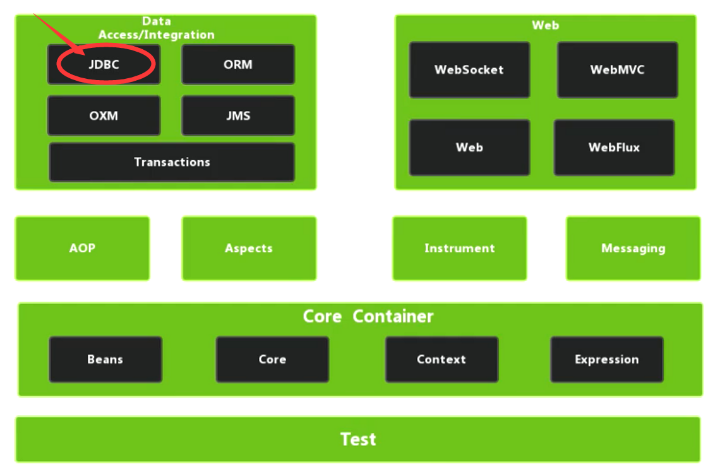](https://s2.loli.net/2022/03/06/NfepJE5nQI6jAd7.png)

总结一下：

- `JdbcTemplate`就是 Spring 框架对`JDBC`技术进行的二次封装模板，能够简化对数据库的操作

### 1.2、准备工作

**步骤预览**

- 1）引入相关`jar`包
- 2）Spring 配置文件配置`Druid`连接池信息
- 3）配置`JdbcTemplate`对象，注入`dataSource`
- 4）创建 Service 和 Dao 类，在 Dao 类中注入`JdbcTemplate`对象

**详细操作**

- 1）引入相关jar包（或依赖）
  - `druid`
  - `mysql-connector-java`
  - `spring-jdbc`
  - `spring-orm`
  - `spring-tx`

[](https://s2.loli.net/2022/03/06/gs6N9lbZckfdD4t.png)

- 2）Spring 配置文件配置`Druid`连接池信息

```xml
<context:property-placeholder location="classpath:jdbc.properties"/>
<bean id="dataSource" class="com.alibaba.druid.pool.DruidDataSource">
    <property name="driverClassName" value="${mysql.driverClassName}"/>
    <property name="url" value="${mysql.url}"/>
    <property name="username" value="${mysql.username}"/>
    <property name="password" value="${mysql.password}"/>
</bean>
```

沿用之前章节的`Jdbc.properties`配置信息，但稍作修改

```properties
mysql.driverClassName=com.mysql.jdbc.Driver
mysql.url=jdbc:mysql:///book_db
mysql.username=root
mysql.password=root
```

- 3）配置`JdbcTemplate`对象，注入`dataSource`

```xml
<!--配置JdbcTemplate-->
<bean id="jdbcTemplate" class="org.springframework.jdbc.core.JdbcTemplate">
    <!--属性注入dataSource-->
    <property name="dataSource" ref="dataSource"></property>
</bean>
```

**为何使用属性注入？**

`JdbcTemplate`虽然含有`DataSource`的有参构造，但其调用了`setDataSource()`方法

[](https://s2.loli.net/2022/03/06/8e5aPG6Sx3YlZty.png)

这个方法是在其父类中定义了的

[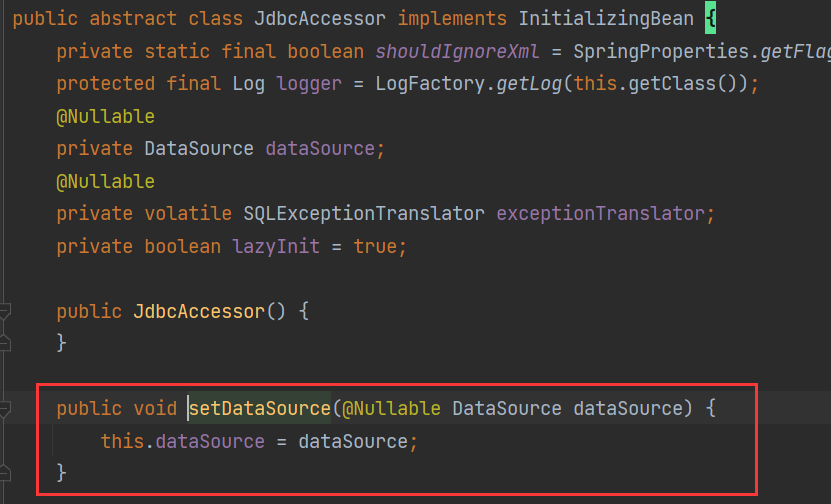](https://s2.loli.net/2022/03/06/n4qpwel6KRakdAm.png)

- 4）创建 Service 和 Dao 类，在 Dao 类中注入`JdbcTemplate`对象

Dao 类

```java
public interface BookDao {
}
@Repository
public class BookDaoImpl implements BookDao {
    @Autowired
    private JdbcTemplate jdbcTemplate;
}
```

Service 类

```java
@Service
public class BookService {
    @Autowired
    private BookDao bookDao;
}
```

别忘了开启注解扫描

```xml
<!--开启注解扫描-->
<context:component-scan base-package="com.vectorx.spring5.s15_jdbctemplate"/>
```

**配置文件整体结构**

```xml
<?xml version="1.0" encoding="UTF-8"?>
<beans xmlns="http://www.springframework.org/schema/beans"
       xmlns:xsi="http://www.w3.org/2001/XMLSchema-instance"
       xmlns:context="http://www.springframework.org/schema/context"
       xsi:schemaLocation="http://www.springframework.org/schema/beans http://www.springframework.org/schema/beans/spring-beans.xsd
http://www.springframework.org/schema/context http://www.springframework.org/schema/context/spring-context.xsd">

    <!--开启注解扫描-->
    <context:component-scan base-package="com.vectorx.spring5.s15_jdbctemplate"/>

    <!--配置dataSource-->
    <context:property-placeholder location="classpath:jdbc.properties"/>
    <bean id="dataSource" class="com.alibaba.druid.pool.DruidDataSource">
        <property name="driverClassName" value="${mysql.driverClassName}"/>
        <property name="url" value="${mysql.url}"/>
        <property name="username" value="${mysql.username}"/>
        <property name="password" value="${mysql.password}"/>
    </bean>

    <!--配置JdbcTemplate-->
    <bean id="jdbcTemplate" class="org.springframework.jdbc.core.JdbcTemplate">
        <!--属性注入dataSource-->
        <property name="dataSource" ref="dataSource"></property>
    </bean>
</beans>
```

### 1.3、添加操作

**步骤预览**

- 1）创建数据库中`t_book`表对应的实体对象
- 2）编写 Service 和 Dao 代码，增加*添加图书*的功能逻辑
- 3）代码测试

**详细操作**

- 1）创建数据库中`t_book`表对应的实体对象

```java
public class Book {
    private String bid;
    private String bname;
    private String bstatus;

    public String getBid() {
        return bid;
    }
    public void setBid(String bid) {
        this.bid = bid;
    }
    public String getBname() {
        return bname;
    }
    public void setBname(String bname) {
        this.bname = bname;
    }
    public String getBstatus() {
        return bstatus;
    }
    public void setBstatus(String bstatus) {
        this.bstatus = bstatus;
    }
}
```

- 2）编写 Service 和 Dao 代码，增加*添加图书*的功能逻辑

Service 类：添加`addBook()`方法

```java
@Service
public class BookService {
    @Autowired
    private BookDao bookDao;

    public int addBook(Book book) {
        return bookDao.add(book);
    }
}
```

Dao 类：通过操作`JdbcTemplate`对象的`update()`方法可实现插入，其中两个参数分别是

- 第一个参数`sql`：编写插入数据对应的`sql`语句，可使用通配符`?`做占位符
- 第二个参数`args`：可变参数列表，设置占位符对应的参数值

```java
public interface BookDao {
    int add(Book book);
}
@Repository
public class BookDaoImpl implements BookDao {
    @Autowired
    private JdbcTemplate jdbcTemplate;
 
    @Override
    public int add(Book book) {
        //操作JdbcTemplate对象，使用update方法进行添加操作
        String sql = "insert into t_book(bid,bname,bstatus) values(?,?,?)";
        Object[] args = {book.getBid(), book.getBname(), book.getBstatus()};
        return jdbcTemplate.update(sql, args);
    }
}
```

- 3）代码测试

```java
ApplicationContext context = new ClassPathXmlApplicationContext("bean13.xml");
BookService bookService = context.getBean("bookService", BookService.class);

//模拟新增图书
Book book = new Book();
book.setBid("1");
book.setBname("Spring JdbcTemplate");
book.setBstatus("1");
int result = bookService.addBook(book);
System.out.println(result);
```

测试结果

```
Loading class `com.mysql.jdbc.Driver'. This is deprecated. The new driver class is `com.mysql.cj.jdbc.Driver'. The driver is automatically registered via the SPI and manual loading of the driver class is generally unnecessary.
三月 06, 2022 10:25:49 下午 com.alibaba.druid.pool.DruidDataSource info
信息: {dataSource-1} inited
1
```

刷新数据库中`t_book`表数据，核验是否插入成功

[](https://s2.loli.net/2022/03/06/lr6szWvfcaO1bDm.png)

可以看到，表中成功新增了一条数据

### 1.4、修改和删除

修改、删除操作和添加操作代码逻辑基本一致

BookService 类：添加`updateBook()`和`deleteBook()`方法

```java
// 修改
public int updateBook(Book book) {
    return bookDao.update(book);
}
//删除
public int deleteBook(String id) {
    return bookDao.delete(id);
}
```

BookDao 类：添加`update()`和`delete()`方法

```java
// 修改
int update(Book book);
// 删除
int delete(String id);
```

BookDaoImpl 类：实现`update()`和`delete()`方法

```java
// 修改
@Override
public int update(Book book) {
    String sql = "update t_book set bname=?,bstatus=? where bid=?";
    Object[] args = {book.getBname(), book.getBstatus(), book.getBid()};
    return jdbcTemplate.update(sql, args);
}
// 删除
@Override
public int delete(String id) {
    String sql = "delete from t_book where bid=? ";
    return jdbcTemplate.update(sql, id);
}
```

测试修改

```java
//修改图书信息
Book book = new Book();
book.setBid("1");
book.setBname("JdbcTemplate");
book.setBstatus("update");
int result2 = bookService.updateBook(book);
System.out.println(result2);
```

测试结果

[](https://s2.loli.net/2022/03/07/TCLlJNIZ3RBovUX.png)

测试删除

```java
//删除图书
int result3 = bookService.deleteBook("1");
System.out.println(result3);
```

测试结果

[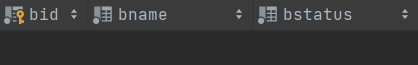](https://s2.loli.net/2022/03/07/JPM6ABoLmV7ZeWj.png)

### 1.5、查询操作

这里演示三种查询操作：

- 1）查询返回某个值
- 2）查询返回对象
- 3）查询返回集合

为了演示效果，需要先在数据库的`t_book`表中添加两条数据

[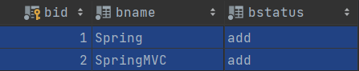](https://s2.loli.net/2022/03/07/oCSa3qAMGYbyfRN.png)

接着我们先将代码完成，最后再作进一步的分析说明

**代码实现**

BookService 类：添加`findCount()`、`findById()`和`findAll()`方法

```java
// 查找返回一个值
public int findCount() {
    return bookDao.selectCount();
}
// 查找返回对象
public Book findById(String id) {
    return bookDao.selectById(id);
}
// 查找返回集合
public List<Book> findAll() {
    return bookDao.selectAll();
}
```

BookDao 类：添加`selectCount()`、`selectById()`和`selectAll()`方法

```java
// 查找返回一个值
int selectCount();
// 查找返回对象
Book selectById(String id);
// 查找返回集合
List<Book> selectAll();
```

BookDaoImpl 类：实现`selectCount()`、`selectById()`和`selectAll()`方法

```java
// 查找返回一个值
@Override
public int selectCount() {
    String sql = "select count(0) from t_book";
    return jdbcTemplate.queryForObject(sql, Integer.class);
}
// 查找返回对象
@Override
public Book selectById(String id) {
    String sql = "select * from t_book where bid=?";
    return jdbcTemplate.queryForObject(sql, new BeanPropertyRowMapper<>(Book.class), id);
}
// 查找返回集合
@Override
public List<Book> selectAll() {
    String sql = "select * from t_book where 1=1";
    return jdbcTemplate.query(sql, new BeanPropertyRowMapper<>(Book.class));
}
```

测试代码

```java
int count = bookService.findCount();
System.out.println(count);
Book book = bookService.findById("1");
System.out.println(book);
List<Book> bookList = bookService.findAll();
System.out.println(bookList);
```

测试结果

```
2
Book{bid='1', bname='Spring', bstatus='add'}
[Book{bid='1', bname='Spring', bstatus='add'}, Book{bid='2', bname='SpringMVC', bstatus='add'}]
```

**代码分析**

上述代码逻辑中使用到了`queryForObject()`和`query()`方法

```java
jdbcTemplate.queryForObject(sql, Integer.class);
jdbcTemplate.queryForObject(sql, new BeanPropertyRowMapper<>(Book.class), id);
jdbcTemplate.query(sql, new BeanPropertyRowMapper<>(Book.class));
```

分别对应`JdbcTemplate`中的三个方法

```java
public <T> T queryForObject(String sql, Class<T> requiredType);
public <T> T queryForObject(String sql, RowMapper<T> rowMapper, Object... args);
public <T> List<T> query(String sql, RowMapper<T> rowMapper);
```

其中，有两个参数值得关注，一个是`Class<T> requiredType`，另一个是`RowMapper<T> rowMapper`

- `Class<T> requiredType`：返回值的`Class`类型
- `RowMapper<T> rowMapper`：是一个接口，返回不同类型数据，可以使用其实现类进行数据的封装。其实现类有很多，因为我们需要返回一个数据库实体对象，所以可以选择使用`BeanPropertyRowMapper`

[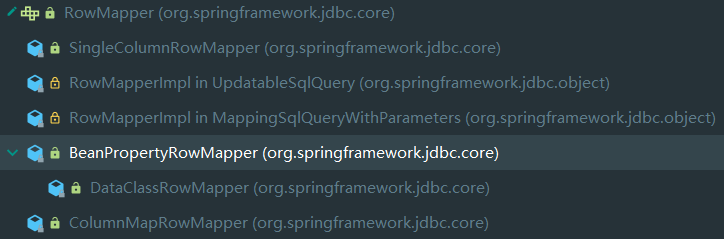](https://s2.loli.net/2022/03/07/YHjmQBSNXzDdPRL.png)

另外，`queryForObject(String sql, RowMapper<T> rowMapper, Object... args)`和`query(String sql, RowMapper<T> rowMapper)`的

区别在于

- `queryForObject`返回一个对象
- `query`返回一个集合

### 1.6、批量操作

`JdbcTemplate`中提供了`batchUpdate()`可供我们进行批量操作，如：批量添加、批量修改、批量删除等，代码实现上大同小异，我们对代码进行快速实现

**代码实现**

BookService 类：添加`batchAddBook()`、`batchUpdateBook()`和`batchDelBook()`方法

```java
// 批量添加
public void batchAddBook(List<Object[]> bookList) {
    bookDao.batchAdd(bookList);
}
// 批量修改
public void batchUpdateBook(List<Object[]> bookList) {
    bookDao.batchUpdate(bookList);
}
// 批量删除
public void batchDelBook(List<Object[]> bookList) {
    bookDao.batchDel(bookList);
}
```

BookDao 类：添加`batchAdd()`、`batchUpdate()`和`batchDel()`方法

```java
// 批量添加
void batchAdd(List<Object[]> bookList);
// 批量修改
void batchUpdate(List<Object[]> bookList);
// 批量删除
void batchDel(List<Object[]> bookList);
```

BookDaoImpl 类：实现`batchAdd()`、`batchUpdate()`和`batchDel()`方法

```java
// 批量添加
@Override
public void batchAdd(List<Object[]> bookList) {
    String sql = "insert into t_book(bid,bname,bstatus) values(?,?,?)";
    extractBatch(sql, bookList);
}
// 批量修改
@Override
public void batchUpdate(List<Object[]> bookList) {
    String sql = "update t_book set bname=?,bstatus=? where bid=?";
    extractBatch(sql, bookList);
}
// 批量删除
@Override
public void batchDel(List<Object[]> bookList) {
    String sql = "delete from t_book where bid=? ";
    extractBatch(sql, bookList);
}
private void extractBatch(String sql, List<Object[]> bookList,) {
    int[] ints = jdbcTemplate.batchUpdate(sql, bookList);
    System.out.println(ints);
}
```

**代码测试**

测试批量添加

```java
// 批量添加
List<Object[]> bookList = new ArrayList<>();
Object[] book1 = {"3", "Java", "batchAdd"};
Object[] book2 = {"4", "Python", "batchAdd"};
Object[] book3 = {"5", "C#", "batchAdd"};
bookList.add(book1);
bookList.add(book2);
bookList.add(book3);
bookService.batchAddBook(bookList);	
```

测试结果

[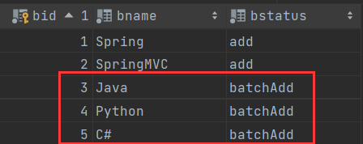](https://s2.loli.net/2022/03/07/SgzfJ29Ph4VbpKl.png)

测试批量修改

```java
// 批量修改
List<Object[]> bookList = new ArrayList<>();
Object[] book1 = {"Java++", "batchUpdate", "3"};
Object[] book2 = {"Python++", "batchUpdate", "4"};
Object[] book3 = {"C#++", "batchUpdate", "5"};
bookList.add(book1);
bookList.add(book2);
bookList.add(book3);
bookService.batchUpdateBook(bookList);
```

测试结果

[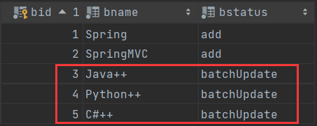](https://s2.loli.net/2022/03/07/Z8cquiezmorPxXY.png)

测试批量删除

```java
// 批量删除
List<Object[]> bookList = new ArrayList<>();
Object[] book1 = {"3"};
Object[] book2 = {"4"};
bookList.add(book1);
bookList.add(book2);
bookService.batchDelBook(bookList);
```

测试结果

[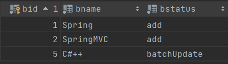](https://s2.loli.net/2022/03/07/Vvtmo9BXnd1IfFG.png)

可以看出，上述测试都完全符合我们的预期

[](https://s2.loli.net/2022/03/07/9Fu65poPBDlmryn.gif)

### 小结

简单总结下`JdbcTemplate`操作数据库的各个方法

- 添加、修改、删除操作：`update()`方法

- 查询操作：`queryForObject()`和`query()`

  方法，关注两个参数：

  - `Class<T> requiredType`：返回值的`Class`类型
  - `RowMapper<T> rowMapper`：接口，具体实现类`BeanPropertyRowMapper`，封装对象实体

- 批量操作：`batchUpdate()`方法

## 2、事务

### 2.1、事务概念

- 1）事务是数据库操作的最基本单元，是逻辑上的一组操作。这一组操作，要么都成功，要么都失败（只要有一个操作失败，所有操作都失败）
- 2）典型场景：银行转账。Lucy 转账 100 元给 Mary，Lucy 少 100，Mary 多 100。转账过程中若出现任何问题，双方都不会多钱或少钱，转账就不会成功

### 2.2、事务四个特性（ACID）

- 原子性（**A**tomicity）：一个事务中的所有操作，要么都成功，要么都失败，整个过程不可分割
- 一致性（**C**onsistency）：事务操作之前和操作之后，总量保持不变
- 隔离性（**I**solation）：多事务操作时，相互之间不会产生影响
- 持久性（**D**urability）：事务最终提交后，数据库表中数据才会真正发生变化

### 2.3、搭建事务操作环境

我们知道 JavaEE 中的三层架构分为：表示层（`web`层）、业务逻辑层（`service`层）、数据访问层（`dao`层）

- `web`层：与客户端进行交互
- `service`层：处理业务逻辑
- `dao`层：与数据库进行交互

因此，我们搭建操作环境也按照典型的三层架构来实现，不过目前现阶段我们只关注`Service`和`Dao`两层

[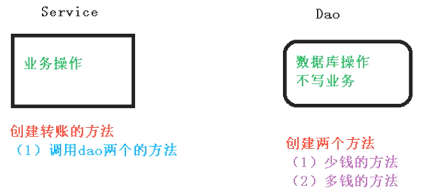](https://s2.loli.net/2022/03/08/hsX2AgEaPbSK8dj.png)

我们以银行转账为例，因为整个转账操作包括两个操作：出账的操作和入账的操作

**过程概览**

- 1）创建数据库表结构，添加几条记录
- 2）创建`Service`和`Dao`类，完成对象创建和关系注入
- 3）`Dao`中创建两个方法：出账的方法、入账的方法；`Service`中创建转账的方法

**过程详解**

**1）**创建数据库表结构，添加几条记录

```sql
# 建表语句
create table t_account
(
    id       varchar(20) not null,
    username varchar(50) null,
    amount   int         null,
    constraint transfer_record_pk
        primary key (id)
);
# 添加语句
INSERT INTO book_db.t_account (id, username, amount) VALUES ('1', 'Lucy', 1000);
INSERT INTO book_db.t_account (id, username, amount) VALUES ('2', 'Mary', 1000);
```

添加完成效果

[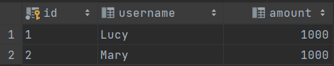](https://s2.loli.net/2022/03/08/rAOuq8Ml7kaE3ZJ.png)

**2）**创建`Service`和`Dao`类，完成对象创建和关系注入Service`中注入`Dao`，`Dao`中注入`JdbcTemplate`，`JdbcTemplate`中注入``DataSource`

`Service`和`Dao`类

```java
public interface TransferRecordDao {
}

@Repository
public class TransferRecordDaoImpl implements TransferRecordDao {
    @Autowired
    private JdbcTemplate jdbcTemplate;
}
@Service
public class TransferRecordService {
    @Autowired
    private TransferRecordDao transferRecordDao;
}
```

Spring 配置文件

```xml
<?xml version="1.0" encoding="UTF-8"?>
<beans xmlns="http://www.springframework.org/schema/beans"
       xmlns:xsi="http://www.w3.org/2001/XMLSchema-instance"
       xmlns:context="http://www.springframework.org/schema/context"
       xsi:schemaLocation="http://www.springframework.org/schema/beans http://www.springframework.org/schema/beans/spring-beans.xsd
                           http://www.springframework.org/schema/context http://www.springframework.org/schema/context/spring-context.xsd">
    <!--开启注解扫描-->
    <context:component-scan base-package="com.vectorx.spring5.s16_transaction"/>
    <!--配置dataSource-->
    <context:property-placeholder location="classpath:jdbc.properties"/>
    <bean id="dataSource" class="com.alibaba.druid.pool.DruidDataSource">
        <property name="driverClassName" value="${mysql.driverClassName}"/>
        <property name="url" value="${mysql.url}"/>
        <property name="username" value="${mysql.username}"/>
        <property name="password" value="${mysql.password}"/>
    </bean>
    <!--配置JdbcTemplate-->
    <bean id="jdbcTemplate" class="org.springframework.jdbc.core.JdbcTemplate">
        <!--属性注入dataSource-->
        <property name="dataSource" ref="dataSource"></property>
    </bean>
</beans>
```

**3）**`Dao`中创建两个方法：出账的方法、入账的方法；`Service`中创建转账的方法

- `Dao`负责数据库操作，所以需要创建两个方法：出账的方法、入账的方法

```java
public interface TransferRecordDao {
    void transferOut(int amount, String username);
    void transferIn(int amount, String username);
}
@Repository
public class TransferRecordDaoImpl implements TransferRecordDao {
    @Autowired
    private JdbcTemplate jdbcTemplate;

    @Override
    public void transferOut(int amount, String username) {
        String sql = "update t_account set amount=amount-? where username=?";
        Object[] args = {amount, username};
        jdbcTemplate.update(sql, args);
    }
    @Override
    public void transferIn(int amount, String username) {
        String sql = "update t_account set amount=amount+? where username=?";
        Object[] args = {amount, username};
        jdbcTemplate.update(sql, args);
    }
}
```

- `Service`负责业务操作，所以需要创建一个方法，来调用`Dao`中两个方法

```java
@Service
public class TransferRecordService {
    @Autowired
    private TransferRecordDao transferRecordDao;

    public void transferAccounts(int amount, String fromUser, String toUser) {
        transferRecordDao.transferOut(amount, fromUser);
        transferRecordDao.transferIn(amount, toUser);
    }
}
```

测试代码

```java
ApplicationContext context = new ClassPathXmlApplicationContext("bean14.xml");
TransferRecordService transferRecordService = context.getBean("transferRecordService", TransferRecordService.class);
transferRecordService.transferAccounts(100, "Lucy", "Mary");
```

测试结果

[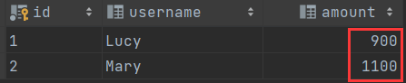](https://s2.loli.net/2022/03/08/djR3QoVOblLS7c5.png)

可以发现，转账如期完成了。但真的没有一点问题么？

### 2.4、引入事务场景

我们模拟下在转账中途发生网络异常，修改`TransferRecordService`中转账方法

```java
public void transferAccounts(int amount, String fromUser, String toUser) {
    transferRecordDao.transferOut(amount, fromUser);
    //模拟网络异常而导致操作中断
    int i = 10 / 0;
    transferRecordDao.transferIn(amount, toUser);
}
```

为了更清晰直观地看到数据的变化，我们还原数据表数据到最初状态

[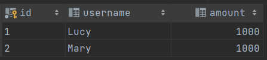](https://s2.loli.net/2022/03/08/zVF7b5RdXPyJZ2l.png)

按照期望，转账应该失败，即双方账户不应该有任何变化。事实真的能够如我们所料么？

我们执行测试方法，如期抛出异常

```java
Exception in thread "main" java.lang.ArithmeticException: / by zero
    at com.vectorx.spring5.s16_transaction.service.TransferRecordService.transferAccounts(TransferRecordService.java:15)
    at com.vectorx.spring5.s16_transaction.TestTransfer.main(TestTransfer.java:11)
```

那数据表是否也如期变化呢？

[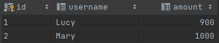](https://s2.loli.net/2022/03/08/uogKOIvxQhl3d9L.png)

我们发现，`Lucy`虽然成功转出了 100 元，但`Mary`没有成功到账 100 元。从现实的角度来说，这个问题很严重！！！

从事务的角度来说，这个转账操作没有遵循事务的原子性、一致性，即没有做到“要么都成功，要么都失败”，也没有做到“操作前后的总量不变”

综上所述，我们需要引入事务

### 2.5、事务基本操作

事务的基本操作过程如下

- Step1、开启一个事务
- Step2、进行业务逻辑实现
- Step3、没有异常，则提交事务
- Step4、发生异常，则回滚事务

事务的一般实现如下

```java
try {
    // Step1、开启一个事务
    // Step2、进行业务逻辑实现
    transferRecordDao.transferOut(amount, fromUser);
    //模拟网络异常而导致操作中断
    int i = 10 / 0;
    transferRecordDao.transferIn(amount, toUser);
    // Step3、没有异常，则提交事务
} catch (Exception e) {
    // Step4、发生异常，则回滚事务
}
```

不过，在 Spring 框架中提供了更方便的方式实现事务。“欲知后事如何，且听下回分解”

### 小结

本小结主要内容关键点

- 事务的基本概念：数据库操作的基本单元，逻辑上的一组操作，要么都成功，要么都失败
- 事务的四个基本特性：ACID，即原子性、一致性、隔离性和持久性

## 3、声明式事务

### 3.1、Spring事务管理

事务一般添加到三层结构中的`Service`层（业务逻辑层）

在 Spring 中进行事务管理操作有两种方式：编程式事务管理和声明式事务管理

- 编程式事务管理（不推荐）：上述事务的一般实现就是典型的编程式事务管理实现。但这种方式虽然并不好，但仍然需要我们有一定的了解，知道有这么一个过程即可。一般不推荐使用这种方式，主要原因如下
  - 1）实现不方便
  - 2）造成代码臃肿
  - 3）维护起来麻烦
- 声明式事务管理（推荐使用）：底层原理就是AOP，就是在不改变原代码基础上，扩展代码功能。有两种实现方式
  - 基于注解方式（推荐方式）
  - 基于XML配置文件方式

### 3.2、Spring事务管理API

提供了一个接口，代表事务管理器，针对不同框架存在不同实现类

[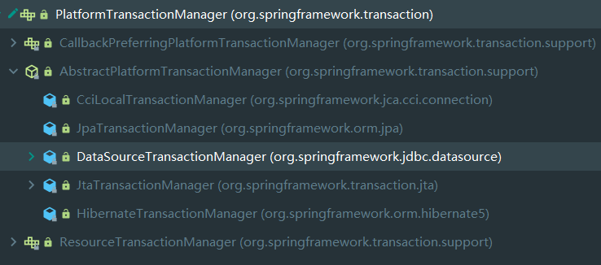](https://s2.loli.net/2022/03/08/IDQY1ue4BTSLwtW.png)

主要掌握

- `PlatformTransactionManager`接口：即事务管理器，有多个不同的抽象类和具体实现类，可满足不同的框架
- `DataSourceTrasactionManager`实现类：`JdbcTemplate`和`MyBatis`框架使用到它
- `HibernateTransactionManager`实现类：`Hibernate`框架使用到它

### 3.3、声明式事务（注解方式）

- 1）在 Spring 配置文件中配置事务管理器：配置`DataSourceTransactionManager`对象创建

```xml
<!--配置事务管理器-->
<bean id="transactionManager" class="org.springframework.jdbc.datasource.DataSourceTransactionManager">
    <property name="dataSource" ref="dataSource"></property>
</bean>
```

- 2）在 Spring 配置文件中开启事务：引入`xmlns:tx`的名称空间，并配置`<tx:annotation-driven>`标签以开启事务注解

```xml
<beans xmlns="http://www.springframework.org/schema/beans"
       xmlns:xsi="http://www.w3.org/2001/XMLSchema-instance"
       xmlns:context="http://www.springframework.org/schema/context"
       xmlns:tx="http://www.springframework.org/schema/tx"
       xsi:schemaLocation="http://www.springframework.org/schema/beans http://www.springframework.org/schema/beans/spring-beans.xsd
                           http://www.springframework.org/schema/context http://www.springframework.org/schema/context/spring-context.xsd
                           http://www.springframework.org/schema/tx http://www.springframework.org/schema/tx/spring-tx.xsd">
    <!--其他配置信息略-->
    <!--开启事务注解-->
    <tx:annotation-driven transaction-manager="transactionManager"></tx:annotation-driven>
</beans>
```

- 3）在`Service`（或`Service`的方法）上添加事务注解`@Transactional`

```java
@Service
@Transactional
public class TransferRecordService {
    //...
}
```

首先还原数据表信息至初始状态

[](https://s2.loli.net/2022/03/08/lbWkLeNT67x5yKD.png)

测试代码后刷新数据表

[](https://s2.loli.net/2022/03/08/lbWkLeNT67x5yKD.png)

这一次数据没有发生变化，说明事务回滚了，符合我们预期

### 3.4、事务参数

在`Service`类上面添加注解`@Transactional`，在这个注解里面可以配置事务相关参数

[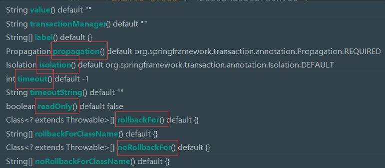](https://s2.loli.net/2022/03/09/42ncr6mtsbLGFvg.png)

主要介绍参数有

- `propagation`：事务传播行为
- `isolation`：事务隔离级别
- `timeout`：超时时间
- `readOnly`：是否只读
- `rollbackFor`：回滚
- `noRollbackFor`：不回滚

### 3.5、传播行为

- **事务传播行为**：多事务方法直接进行调用，这个过程中事务是如何进行管理的
- **事务方法**：让数据表数据发生变化的操作

事务的传播行为可以有传播属性指定。Spring 框架中定义了 7 种类传播行为：

| 传播属性        | 描述                                                         |
| --------------- | ------------------------------------------------------------ |
| `REQUIRED`      | 如果有事务在运行，当前方法就在此事务内运行；否则，就启动一个新的事务，并在自己的事务内运行 |
| `REQUIRED_NEW`  | 当前方法必须启动新事务，并在它自己的事务内运行；如果有事务正在运行，应该将它挂起 |
| `SUPPORTS`      | 如果有事务在运行，当前方法就在此事务内运行；否则，它可以不运行在事务中 |
| `NOT_SOPPORTED` | 当前方法不应该运行在事务内部，如果有运行的事务，就将它挂起   |
| `MANDATORY`     | 当前方法必须运行在事务内部，如果没有正在运行的事务，就抛出异常 |
| `NEVER`         | 当前方法不应该运行在事务中，如果有运行的事务，就抛出异常     |
| `NESTED`        | 如果有事务在运行，当前方法就应该在此事务的嵌套事务内运行；否则，就启动一个新的事务，并在它自己的事务内运行 |

举个例子：定义两个方法`add()`和`update()`

```java
@Transactional
public void add(){
    // 调用update方法
    update();
}
public void update(){
    // do something
}
```

则按照不同的传播属性，可以有以下解释

- `REQUIRED`
  - 如果`add()`方法本身有事务，调用`update()`方法之后，`update()`使用当前`add()`方法里面事务；
  - 如果`add()`方法本身没有事务，调用`update()`方法之后，创建新的事务
- `REQUIRED_NEW`
  - 使用`add()`方法调用`update()`方法，无论`add()`是否有事务，都创建新的事务

**代码实现**

```java
@Service
@Transactional(propagation = Propagation.REQUIRED)
public class TransferRecordService {
    //...
}
```

等价于

```java
@Service
@Transactional
public class TransferRecordService {
    //...
}
```

即默认不写，其事务传播行为就是使用的`REQUIRED`

### 3.6、隔离级别

在事务的四个特性中，隔离性（`isolation`）指的是多事务之间互不影响。不考虑隔离性，在并发时会产生一系列问题

有三个典型的“读”的问题：脏读、不可重复读、虚（幻）读

- **脏读**：一个未提交事务读取到了另一个未提交事务修改的数据

[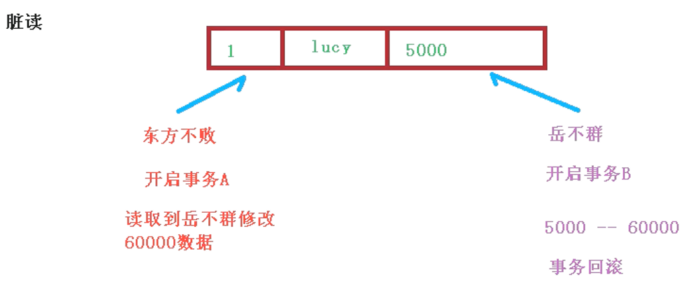](https://s2.loli.net/2022/03/09/XNTP5Kwz3hGW1vp.png)

- **不可重复读**：一个未提交事务读取到了另一个已提交事务修改的数据（不能算问题，只是算现象）

[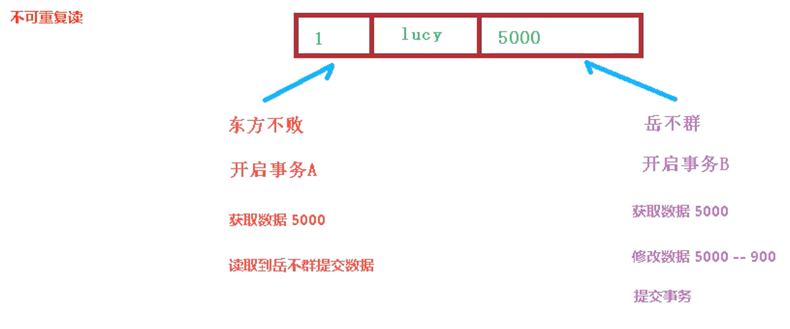](https://s2.loli.net/2022/03/09/MbpwgBudcGKx7rJ.png)

- **虚（幻）读**：一个未提交事务读取到了另一个已提交事务添加的数据

通过设置隔离级别，可以解决上述“读”的问题

| 事务隔离级别                   | 脏读 | 不可重复读 | 幻读 |
| ------------------------------ | ---- | ---------- | ---- |
| `READ UNCOMMITTED`（读未提交） | √    | √          | √    |
| `READ COMMITTED`（读已提交）   | ×    | √          | √    |
| `REPEATABLE READ`（可重复读）  | ×    | ×          | √    |
| `SERIALIZABLE`（串行化）       | ×    | ×          | ×    |

**代码实现**

```java
@Service
@Transactional(isolation = Isolation.REPEATABLE_READ)
public class TransferRecordService {
    //...
}
```

小课堂：MySQL 中默认事务隔离级别为`REPEATABLE READ`（可重复读）

### 3.7、其他参数

- `timeout`：设置事务超时时间。事务需要在一定的时间内进行提交，若设定时间内事务未完成提交，则对事务进行回滚。默认值为`-1`，设置时间以秒为单位

```java
@Service
@Transactional(timeout = 5)
public class TransferRecordService {
    @Autowired
    private TransferRecordDao transferRecordDao;

    public void transferAccounts(int amount, String fromUser, String toUser) {
        transferRecordDao.transferOut(amount, fromUser);
        //模拟处理超时
        try {
            Thread.sleep(6000);
        } catch (InterruptedException e) {
            e.printStackTrace();
        }
        transferRecordDao.transferIn(amount, toUser);
    }
}
```

设置超时时间后，执行测试代码，则日志信息会抛出`TransactionTimedOutException`即**事务超时异常**

```
Exception in thread "main" org.springframework.transaction.TransactionTimedOutException: Transaction timed out: deadline was Wed Mar 09 21:30:33 CST 2022
    at org.springframework.transaction.support.ResourceHolderSupport.checkTransactionTimeout(ResourceHolderSupport.java:155)
    at org.springframework.transaction.support.ResourceHolderSupport.getTimeToLiveInMillis(ResourceHolderSupport.java:144)
    at org.springframework.transaction.support.ResourceHolderSupport.getTimeToLiveInSeconds(ResourceHolderSupport.java:128)
    at org.springframework.jdbc.datasource.DataSourceUtils.applyTimeout(DataSourceUtils.java:341)
...	
```

- `readOnly`：是否只读。
  - 默认值为`false`，表示读写操作都允许，可以进行增、删、改、查等操作；
  - 可设置为`true`，表示只允许读操作，即只能进行查询操作

```java
@Service
@Transactional(readOnly = true)
public class TransferRecordService {
    //...
}
```

设置只读后，执行测试代码，则日志信息会抛出`TransientDataAccessResourceException`即**瞬态数据访问资源异常**，同时还会抛出`SQLException`，并指出“连接是只读的，查询导致数据修改是不允许的”

```
Exception in thread "main" org.springframework.dao.TransientDataAccessResourceException: PreparedStatementCallback; SQL [update t_account set amount=amount-? where username=?]; Connection is read-only. Queries leading to data modification are not allowed; nested exception is java.sql.SQLException: Connection is read-only. Queries leading to data modification are not allowed
	...
Caused by: java.sql.SQLException: Connection is read-only. Queries leading to data modification are not allowed
    ...
```

- `rollbackFor`：设置出现哪些异常才进行回滚

```java
@Service
@Transactional(rollbackFor = ArithmeticException.class)
public class TransferRecordService {
    @Autowired
    private TransferRecordDao transferRecordDao;

    public void transferAccounts(int amount, String fromUser, String toUser) {
        transferRecordDao.transferOut(amount, fromUser);
        //模拟网络异常而导致操作中断
        int i = 10 / 0;
        transferRecordDao.transferIn(amount, toUser);
    }
}
```

上述代码表明，只有在抛出的异常为`ArithmeticException`时，才会进行事务的回滚操作

此时运行测试代码，后台会抛出`ArithmeticException`异常，因此会进行回滚，转账过程不会成功

此时数据库中的数据，就不会有任何变化

[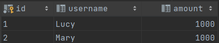](https://s2.loli.net/2022/03/09/z8NyqRbflHhaPCK.png)

- `noRollbackFor`：设置出现哪些异常不进行回滚

```java
@Service
@Transactional(noRollbackFor = ArithmeticException.class)
public class TransferRecordService {
    @Autowired
    private TransferRecordDao transferRecordDao;

    public void transferAccounts(int amount, String fromUser, String toUser) {
        transferRecordDao.transferOut(amount, fromUser);
        //模拟网络异常而导致操作中断
        int i = 10 / 0;
        transferRecordDao.transferIn(amount, toUser);
    }
}
```

因为设置了`noRollbackFor = ArithmeticException.class`，即表示抛出`ArithmeticException`异常时不会进行回滚

此时运行测试代码，后台会抛出`ArithmeticException`异常，但不会进行回滚，转账事务中只有出账操作会成功

```
Exception in thread "main" java.lang.ArithmeticException: / by zero
```

此时数据库中的数据，就会是下面情况（显然，这并不是我们想要的）

[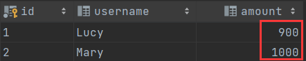](https://s2.loli.net/2022/03/09/z91mdZWXBLIuDKT.png)

### 3.8、声明式事务（XML方式）

- Step1、配置事务管理器

```xml
<!--配置事务管理器-->
<bean id="transactionManager" class="org.springframework.jdbc.datasource.DataSourceTransactionManager">
    <property name="dataSource" ref="dataSource"></property>
</bean>
```

- Step2、配置事务通知

```xml
<!--1、配置事务通知-->
<tx:advice id="txAdvice">
    <tx:attributes>
        <tx:method name="transferAccounts" propagation="REQUIRED" isolation="REPEATABLE_READ" read-only="false"
                   timeout="5" rollback-for="java.lang.ArithmeticException"/>
    </tx:attributes>
</tx:advice>
```

- Step3、配置切入点和切面

```xml
<!--2、配置切入点和切面-->
<aop:config>
    <aop:pointcut id="p"
                  expression="execution(* com.vectorx.spring5.s17_transaction_xml.service.TransferRecordService.*(..))"/>
    <aop:advisor advice-ref="txAdvice" pointcut-ref="p"></aop:advisor>
</aop:config>
```

Spring 配置文件整体内容

```xml
<?xml version="1.0" encoding="UTF-8"?>
<beans xmlns="http://www.springframework.org/schema/beans"
       xmlns:xsi="http://www.w3.org/2001/XMLSchema-instance"
       xmlns:context="http://www.springframework.org/schema/context"
       xmlns:tx="http://www.springframework.org/schema/tx"
       xmlns:aop="http://www.springframework.org/schema/aop"
       xsi:schemaLocation="http://www.springframework.org/schema/beans http://www.springframework.org/schema/beans/spring-beans.xsd
                           http://www.springframework.org/schema/context http://www.springframework.org/schema/context/spring-context.xsd
                           http://www.springframework.org/schema/tx http://www.springframework.org/schema/tx/spring-tx.xsd
                           http://www.springframework.org/schema/aop http://www.springframework.org/schema/aop/spring-aop.xsd">

    <!--配置dataSource-->
    <context:property-placeholder location="classpath:jdbc.properties"/>
    <bean id="dataSource" class="com.alibaba.druid.pool.DruidDataSource">
        <property name="driverClassName" value="${mysql.driverClassName}"/>
        <property name="url" value="${mysql.url}"/>
        <property name="username" value="${mysql.username}"/>
        <property name="password" value="${mysql.password}"/>
    </bean>

    <!--配置JdbcTemplate-->
    <bean id="jdbcTemplate" class="org.springframework.jdbc.core.JdbcTemplate">
        <!--属性注入dataSource-->
        <property name="dataSource" ref="dataSource"></property>
    </bean>

    <!--配置事务管理器-->
    <bean id="transactionManager" class="org.springframework.jdbc.datasource.DataSourceTransactionManager">
        <property name="dataSource" ref="dataSource"></property>
    </bean>

    <!--配置Dao创建和属性注入-->
    <bean id="transferRecordDao" class="com.vectorx.spring5.s17_transaction_xml.dao.TransferRecordDaoImpl">
        <property name="jdbcTemplate" ref="jdbcTemplate"></property>
    </bean>

    <!--配置Service创建和属性注入-->
    <bean id="transferRecordService" class="com.vectorx.spring5.s17_transaction_xml.service.TransferRecordService">
        <property name="transferRecordDao" ref="transferRecordDao"></property>
    </bean>

    <!--1、配置事务通知-->
    <tx:advice id="txAdvice">
        <tx:attributes>
            <tx:method name="transferAccounts" propagation="REQUIRED" isolation="REPEATABLE_READ" read-only="false"
                       timeout="5" rollback-for="java.lang.ArithmeticException"/>
        </tx:attributes>
    </tx:advice>

    <!--2、配置切入点和切面-->
    <aop:config>
        <aop:pointcut id="p"
                      expression="execution(* com.vectorx.spring5.s17_transaction_xml.service.TransferRecordService.*(..))"/>
        <aop:advisor advice-ref="txAdvice" pointcut-ref="p"></aop:advisor>
    </aop:config>
</beans>
```

对`Service`和`Dao`类去除注解，并对代码稍作修改

```java
public class TransferRecordDaoImpl implements TransferRecordDao {
    private JdbcTemplate jdbcTemplate;

    public void setJdbcTemplate(JdbcTemplate jdbcTemplate) {
        this.jdbcTemplate = jdbcTemplate;
    }
    //...
}
public class TransferRecordService {
    private TransferRecordDao transferRecordDao;

    public void setTransferRecordDao(TransferRecordDao transferRecordDao) {
        this.transferRecordDao = transferRecordDao;
    }
    //...
}
```

**运行测试代码**

后台结果

```
Exception in thread "main" java.lang.ArithmeticException: / by zero
```

数据库结果

[](https://s2.loli.net/2022/03/09/vh6obZc7uBwU4pO.png)

### 3.9、完全注解开发

```java
// 表示此类为配置类
@Configuration
// 自动扫描包
@ComponentScan(basePackages = "com.vectorx.spring5.s18_transaction_annotation")
// 开启事务
@EnableTransactionManagement
// 读取外部配置文件
@PropertySource(value = {"classpath:jdbc.properties"})
public class TxConfig {
    @Value(value = "${mysql.driverClassName}")
    private String driverClassName;
    @Value(value = "${mysql.url}")
    private String url;
    @Value(value = "${mysql.username}")
    private String username;
    @Value(value = "${mysql.password}")
    private String password;

    //配置dataSource
    @Bean
    public DruidDataSource getDruidDataSource() {
        DruidDataSource dataSource = new DruidDataSource();
        dataSource.setDriverClassName(driverClassName);
        dataSource.setUrl(url);
        dataSource.setUsername(username);
        dataSource.setPassword(password);
        return dataSource;
    }

    //配置JdbcTemplate
    @Bean
    public JdbcTemplate getJdbcTemplate(DataSource dataSource) {
        //IOC容器会根据类型找到对应DataSource
        JdbcTemplate jdbcTemplate = new JdbcTemplate();
        jdbcTemplate.setDataSource(dataSource);
        return jdbcTemplate;
    }

    //配置事务管理器
    @Bean
    public DataSourceTransactionManager getDataSourceTransactionManager(DataSource dataSource) {
        DataSourceTransactionManager transactionManager = new DataSourceTransactionManager();
        transactionManager.setDataSource(dataSource);
        return transactionManager;
    }
}
```

这里我们对各个注解进行一一说明

- `@Configuration`：表示此类为一个配置类，其作用等同于创建一个`bean.xml`，即

```xml
<?xml version="1.0" encoding="UTF-8"?>
<beans xmlns="http://www.springframework.org/schema/beans"
       xmlns:xsi="http://www.w3.org/2001/XMLSchema-instance"
       xsi:schemaLocation="http://www.springframework.org/schema/beans http://www.springframework.org/schema/beans/spring-beans.xsd">
</beans>
```

- `@ComponentScan`：自动扫描包，`basePackages`属性配置为需要扫描的包路径，等价于`<context:component-scan>`标签，即

```xml
<!--开启注解扫描-->
<context:component-scan base-package="com.vectorx.spring5.s18_transaction_annotation"/>
```

- `@EnableTransactionManagement`：开启事务管理，等价于`<tx:annotation-driven>`标签，即

```xml
<!--开启事务注解-->
<tx:annotation-driven transaction-manager="transactionManager"></tx:annotation-driven>
```

- `@PropertySource`：引入外部文件，`value`配置外部文件路径，等价于`<context:property-placeholder>`标签

```xml
<context:property-placeholder location="classpath:jdbc.properties"/>
```

- `@Value`：对普通类型的属性进行注入，同时其属性值可以使用`${}`表达式对外部文件配置信息进行获取
- `@Bean`：配置对象创建，等价于`<bean>`标签。可以在被修饰的方法参数列表中传入受IOC容器管理的类型，IOC容器会自动根据类型找到对应对象并注入到此方法中。因此无论是配置JdbcTemplate还是配置事务管理器，都可以使用这种方式对外部Bean进行引用

```java
//配置JdbcTemplate
@Bean
public JdbcTemplate getJdbcTemplate(DataSource dataSource) {...}
//配置事务管理器
@Bean
public DataSourceTransactionManager getDataSourceTransactionManager(DataSource dataSource) {...}
```

**测试代码**

需要注意的是，之前创建的对象是`ClassPathXmlApplicationContext`，而现在是完全注解开发，所以需要创建的对象是`AnnotationConfigApplicationContext`，构造参数中传入配置类的`class`类型即可，其他代码与之前一致

```java
ApplicationContext context = new AnnotationConfigApplicationContext(TxConfig.class);
TransferRecordService transferRecordService = context.getBean("transferRecordService", TransferRecordService.class);
transferRecordService.transferAccounts(100, "Lucy", "Mary");
```

**测试结果**

[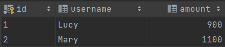](https://s2.loli.net/2022/03/10/57BxlHsi6zJtPdZ.png)

### 小结

重点掌握

- Spring事务管理两种方式：编程式事务管理（不推荐）、声明式事务管理（推荐）

- Spring事务管理API：`PlatformTransactionManager`、`DataSourceTrasactionManager`、`HibernateTransactionManager`

- 声明式事务两种实现方式：注解方式和XML方式

- 事务相关参数有：

  传播行为、隔离级别、超时时间、是否只读、（不）回滚

  - 传播行为：有7种传播属性，`REQUIRED`、`REQUIRED_NEW`、`SUPPORTS`、`NOT_SOPPORTED`、`MANDATORY`、`NEVER`、`NESTED`
  - 隔离级别：有3种典型“读”的问题，脏读、不可重复读、虚（幻）读，可设置4种隔离级别，`READ UNCOMMITTED`、`READ COMMITTED`、`REPEATABLE READ`、`SERIALIZABLE`
  - 其他参数：`timeout`、`readOnly`、`rollbackFor`、`noRollbackFor`

- 声明式事务（注解方式）：`@Transactional`

- 声明式事务（XML方式）：配置事务管理器；配置事务通知`<tx:advice>`；配置切入点和切面

- 完全注解开发：`@EnableTransactionManagement`、`@Bean`、`AnnotationConfigApplicationContext`

## 总结

1. `JdbcTemplate`的`CRUD`操作
2. 事务`ACID`特性、Spring事务管理
3. 声明式事务的注解方式和XML方式
4. 事务相关属性：传播行为、隔离级别、其他参数

下面思维导图经供参考

[](https://s2.loli.net/2022/03/10/aYFXR3VmHZAeNhE.png)