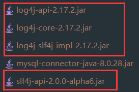
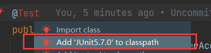
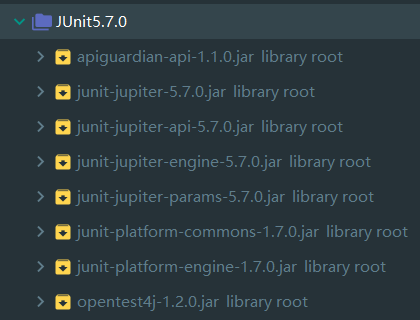
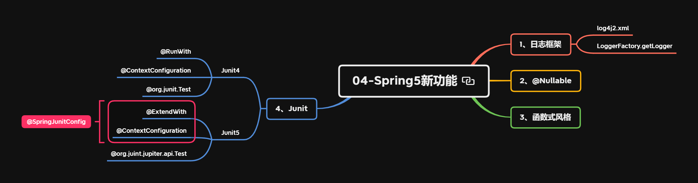

---
# 当前页面内容标题
title: Spring5新功能
# 分类
category:
  - spring
# 标签
tag: 
  - spring
  - SSM框架
  - 新特性
sticky: false
# 是否收藏在博客主题的文章列表中，当填入数字时，数字越大，排名越靠前。
star: false
# 是否将该文章添加至文章列表中
article: true
# 是否将该文章添加至时间线中
timeline: true
---

# Spring5新功能

## 1、Spring5框架新功能

1. 代码整体基于 Java8，运行时兼容 Java9，代码库中删除了许多不建议使用的类和方法
2. 自带了通用的日志封装：移除了`Log4jConfigListener`，官方建议使用`Log4j2`
3. 核心容器支持`@Nullable`注解
4. 核心容器支持函数式风格`GenericApplicationContext`
5. 支持整合`Junit 5`单元测试

## 2、整合日志框架

- 1）引入`jar`包



- 2）创建`log4j2.xml`配置文件，配置日志相关信息

```
<?xml version="1.0" encoding="UTF-8"?>
<!--日志级别以及优先级排序：OFF > FATAL > ERROR > WARN > INFO > DEBUG > TRACE > ALL -->
<!--Configuration后面的status用于设置log4j2自身内部的信息新出，可以不设置。当设置成trace时，可以看到log4j2内部各种详细输出-->
<configuration status="INFO">
    <!--先定义所有的appender-->
    <appenders>
        <!--输出日志信息到控制台-->
        <console name="Console" target="SYSTEM_OUT">
            <!--控制日志输出的格式-->
            <PatternLayout pattern="%d{yyyy-MM-dd HH:mm:ss.SSS} [%t] %-5level %logger{36} - %msg%n"/>
        </console>
    </appenders>
    <!--然后定义logger，只有定义了logger并引入appender，appender才会生效-->
    <!--root：用于指定项目的根日志，如果没有单独指定logger，则会使用root作为默认的日志输出-->
    <loggers>
        <root level="info">
            <appender-ref ref="Console"/>
        </root>
    </loggers>
</configuration>
```

随便一段代码，输入以下日志

```
2022-03-11 21:38:41.342 [main] INFO  com.alibaba.druid.pool.DruidDataSource - {dataSource-1} inited
```

如果将`log4j2.xml`配置文件级别从`INFO`改成`DEBUG`，则会打印更多的底层调用信息

```java
2022-03-11 21:40:41,054 main DEBUG Apache Log4j Core 2.17.2 initializing configuration XmlConfiguration[location=D:\workspace\NOTE_Spring\Spring5_HelloWorld\out\production\Spring5_HelloWorld\log4j2.xml]
2022-03-11 21:40:41,061 main DEBUG PluginManager 'Core' found 127 plugins
2022-03-11 21:40:41,062 main DEBUG PluginManager 'Level' found 0 plugins
2022-03-11 21:40:41,066 main DEBUG PluginManager 'Lookup' found 16 plugins
2022-03-11 21:40:41,069 main DEBUG Building Plugin[name=layout, class=org.apache.logging.log4j.core.layout.PatternLayout].
2022-03-11 21:40:41,092 main DEBUG PluginManager 'TypeConverter' found 26 plugins
2022-03-11 21:40:41,112 main DEBUG PatternLayout$Builder(pattern="%d{yyyy-MM-dd HH:mm:ss.SSS} [%t] %-5level %logger{36} - %msg%n", PatternSelector=null, Configuration(D:\workspace\NOTE_Spring\Spring5_HelloWorld\out\production\Spring5_HelloWorld\log4j2.xml), Replace=null, charset="null", alwaysWriteExceptions="null", disableAnsi="null", noConsoleNoAnsi="null", header="null", footer="null")
2022-03-11 21:40:41,113 main DEBUG PluginManager 'Converter' found 45 plugins
2022-03-11 21:40:41,131 main DEBUG Building Plugin[name=appender, class=org.apache.logging.log4j.core.appender.ConsoleAppender].
2022-03-11 21:40:41,142 main DEBUG ConsoleAppender$Builder(target="SYSTEM_OUT", follow="null", direct="null", bufferedIo="null", bufferSize="null", immediateFlush="null", ignoreExceptions="null", PatternLayout(%d{yyyy-MM-dd HH:mm:ss.SSS} [%t] %-5level %logger{36} - %msg%n), name="Console", Configuration(D:\workspace\NOTE_Spring\Spring5_HelloWorld\out\production\Spring5_HelloWorld\log4j2.xml), Filter=null, ={})
2022-03-11 21:40:41,145 main DEBUG Starting OutputStreamManager SYSTEM_OUT.false.false
2022-03-11 21:40:41,145 main DEBUG Building Plugin[name=appenders, class=org.apache.logging.log4j.core.config.AppendersPlugin].
2022-03-11 21:40:41,148 main DEBUG createAppenders(={Console})
2022-03-11 21:40:41,149 main DEBUG Building Plugin[name=appender-ref, class=org.apache.logging.log4j.core.config.AppenderRef].
2022-03-11 21:40:41,155 main DEBUG createAppenderRef(ref="Console", level="null", Filter=null)
2022-03-11 21:40:41,156 main DEBUG Building Plugin[name=root, class=org.apache.logging.log4j.core.config.LoggerConfig$RootLogger].
2022-03-11 21:40:41,159 main DEBUG LoggerConfig$RootLogger$Builder(additivity="null", level="INFO", levelAndRefs="null", includeLocation="null", ={Console}, ={}, Configuration(D:\workspace\NOTE_Spring\Spring5_HelloWorld\out\production\Spring5_HelloWorld\log4j2.xml), Filter=null)
2022-03-11 21:40:41,163 main DEBUG Building Plugin[name=loggers, class=org.apache.logging.log4j.core.config.LoggersPlugin].
2022-03-11 21:40:41,164 main DEBUG createLoggers(={root})
2022-03-11 21:40:41,165 main DEBUG Configuration XmlConfiguration[location=D:\workspace\NOTE_Spring\Spring5_HelloWorld\out\production\Spring5_HelloWorld\log4j2.xml] initialized
2022-03-11 21:40:41,166 main DEBUG Starting configuration XmlConfiguration[location=D:\workspace\NOTE_Spring\Spring5_HelloWorld\out\production\Spring5_HelloWorld\log4j2.xml]
2022-03-11 21:40:41,166 main DEBUG Started configuration XmlConfiguration[location=D:\workspace\NOTE_Spring\Spring5_HelloWorld\out\production\Spring5_HelloWorld\log4j2.xml] OK.
2022-03-11 21:40:41,168 main DEBUG Shutting down OutputStreamManager SYSTEM_OUT.false.false-1
2022-03-11 21:40:41,169 main DEBUG OutputStream closed
2022-03-11 21:40:41,177 main DEBUG Shut down OutputStreamManager SYSTEM_OUT.false.false-1, all resources released: true
2022-03-11 21:40:41,178 main DEBUG Appender DefaultConsole-1 stopped with status true
2022-03-11 21:40:41,179 main DEBUG Stopped org.apache.logging.log4j.core.config.DefaultConfiguration@6e9175d8 OK
2022-03-11 21:40:41,249 main DEBUG Registering MBean org.apache.logging.log4j2:type=18b4aac2
2022-03-11 21:40:41,255 main DEBUG Registering MBean org.apache.logging.log4j2:type=18b4aac2,component=StatusLogger
2022-03-11 21:40:41,258 main DEBUG Registering MBean org.apache.logging.log4j2:type=18b4aac2,component=ContextSelector
2022-03-11 21:40:41,263 main DEBUG Registering MBean org.apache.logging.log4j2:type=18b4aac2,component=Loggers,name=
2022-03-11 21:40:41,266 main DEBUG Registering MBean org.apache.logging.log4j2:type=18b4aac2,component=Appenders,name=Console
2022-03-11 21:40:41,271 main DEBUG org.apache.logging.log4j.core.util.SystemClock does not support precise timestamps.
2022-03-11 21:40:41,278 main DEBUG Reconfiguration complete for context[name=18b4aac2] at URI D:\workspace\NOTE_Spring\Spring5_HelloWorld\out\production\Spring5_HelloWorld\log4j2.xml (org.apache.logging.log4j.core.LoggerContext@1b410b60) with optional ClassLoader: null
2022-03-11 21:40:41,279 main DEBUG Shutdown hook enabled. Registering a new one.
2022-03-11 21:40:41,285 main DEBUG LoggerContext[name=18b4aac2, org.apache.logging.log4j.core.LoggerContext@1b410b60] started OK.
Loading class `com.mysql.jdbc.Driver'. This is deprecated. The new driver class is `com.mysql.cj.jdbc.Driver'. The driver is automatically registered via the SPI and manual loading of the driver class is generally unnecessary.
2022-03-11 21:40:41.927 [main] INFO  com.alibaba.druid.pool.DruidDataSource - {dataSource-1} inited
...
2022-03-11 21:40:44,518 pool-1-thread-1 DEBUG Stopping LoggerContext[name=18b4aac2, org.apache.logging.log4j.core.LoggerContext@1b410b60]
2022-03-11 21:40:44,518 pool-1-thread-1 DEBUG Stopping LoggerContext[name=18b4aac2, org.apache.logging.log4j.core.LoggerContext@1b410b60]...
2022-03-11 21:40:44,521 pool-1-thread-1 DEBUG Shutting down OutputStreamManager SYSTEM_OUT.false.false
2022-03-11 21:40:44,522 pool-1-thread-1 DEBUG OutputStream closed
2022-03-11 21:40:44,522 pool-1-thread-1 DEBUG Shut down OutputStreamManager SYSTEM_OUT.false.false, all resources released: true
2022-03-11 21:40:44,522 pool-1-thread-1 DEBUG Appender Console stopped with status true
2022-03-11 21:40:44,523 pool-1-thread-1 DEBUG Stopped XmlConfiguration[location=D:\workspace\NOTE_Spring\Spring5_HelloWorld\out\production\Spring5_HelloWorld\log4j2.xml] OK
2022-03-11 21:40:44,523 pool-1-thread-1 DEBUG Stopped LoggerContext[name=18b4aac2, org.apache.logging.log4j.core.LoggerContext@1b410b60] with status true
```

上述配置都是自动进行日志输出，那如何手动进行日志输出呢？

这里需要用到`org.slf4j.LoggerFactory`中`getLogger()`方法，并将当前类型作为参数传入，就可以获取到一个`org.slf4j.Logger`对象

其中可以调用的日志级别有5种：`trace`、`debug`、`info`、`warn`、`error`，分别对应方法

- `logger.trace`
- `logger.debug`
- `logger.info`
- `logger.warn`
- `logger.error`

测试代码，这里以常用的`info`、`warn`和`error`级别为例

```java
public class TestLog {
    private static final Logger logger = LoggerFactory.getLogger(TestLog.class);

    public static void main(String[] args) {
        logger.info("This is info log test.");
        logger.warn("This is warn log test.");
        logger.error("This is error log test.");
    }
}
```

测试结果

```java
2022-03-11 22:01:56.784 [main] INFO  com.vectorx.spring5.s19_log4j2.TestLog - This is info log test.
2022-03-11 22:01:56.789 [main] WARN  com.vectorx.spring5.s19_log4j2.TestLog - This is warn log test.
2022-03-11 22:01:56.789 [main] ERROR com.vectorx.spring5.s19_log4j2.TestLog - This is error log test.
```

## 3、@Nullable注解

`@Nullable`注解可以用在方法、属性和参数上面，分别表示方法可以为空、属性可以为空、参数可以为空

- 1）`@Nullable`注解作用在方法上，方法返回值可以为空

```java
@Nullable
String getId();
```

- 2）`@Nullable`注解作用在属性上，属性值可以为空

```java
@Nullable
private ResourceLoader resourceLoader;
```

- 3）`@Nullable`注解作用在参数上，参数值可以为空

```java
public <T> void registerBean(@Nullable String beanName, Class<T> beanClass, @Nullable Supplier<T> supplier, BeanDefinitionCustomizer... customizers) {
    this.reader.registerBean(beanClass, beanName, supplier, customizers);
}
```

## 4、函数式风格

函数式风格创建对象，交给 Spring 进行管理

```java
//1、创建GenericApplicationContext对象
GenericApplicationContext context = new GenericApplicationContext();
//2、调用context的方法进行注册
context.refresh();
context.registerBean(User.class, () -> new User());
//3、获取Spring注册的对象
User user = context.getBean("user", User.class);
System.out.println(user);
```

运行结果：抛出了`NoSuchBeanDefinitionException`异常，`No bean named 'user' available`表明Spring容器中没有名为`user`的对象

```java
org.springframework.beans.factory.NoSuchBeanDefinitionException: No bean named 'user' available
	at org.springframework.beans.factory.support.DefaultListableBeanFactory.getBeanDefinition(DefaultListableBeanFactory.java:872)
	at org.springframework.beans.factory.support.AbstractBeanFactory.getMergedLocalBeanDefinition(AbstractBeanFactory.java:1344)
	at org.springframework.beans.factory.support.AbstractBeanFactory.doGetBean(AbstractBeanFactory.java:309)
	at org.springframework.beans.factory.support.AbstractBeanFactory.getBean(AbstractBeanFactory.java:213)
	at org.springframework.context.support.AbstractApplicationContext.getBean(AbstractApplicationContext.java:1160)
	at com.vectorx.spring5.s20_functional.TestGenericApplicationContext.test1(TestGenericApplicationContext.java:16)
```

这是为什么呢？因为我们没有指定被注册对象的`name`，不像注解式编程中 Spring 会帮我们指定一个以类名首字母小写的`name`

```java
//1、创建GenericApplicationContext对象
GenericApplicationContext context = new GenericApplicationContext();
//2、调用context的方法进行注册
context.refresh();
context.registerBean("user", User.class, () -> new User());
//3、获取Spring注册的对象
User user = context.getBean("user", User.class);
System.out.println(user);
```

运行结果

```
com.vectorx.spring5.s20_functional.User@4d95d2a2
```

还有一种方式，不在注册的时候指定`name`，而是获取的时候指明类的全路径，即使用类的全限定名

```java
//1、创建GenericApplicationContext对象
GenericApplicationContext context = new GenericApplicationContext();
//2、调用context的方法进行注册
context.refresh();
context.registerBean(User.class, () -> new User());
//3、获取Spring注册的对象
User user = context.getBean("com.vectorx.spring5.s20_functional.User", User.class);
System.out.println(user);
```

运行结果

```
com.vectorx.spring5.s20_functional.User@4d95d2a2
```

## 5、整合Junit

### 5.1、整合Junit4

- 1）引入相关的`jar`包：`spring-test`和`junit4`


- 2）创建测试类，使用注解方式完成：`@RunWith`、`@ContextConfiguration`和`@org.junit.Test`

```java
//单元测试框架
@RunWith(SpringJUnit4ClassRunner.class)
//加载配置文件
@ContextConfiguration("classpath:bean15.xml")
public class JTest4 {
    @Autowired
    private TransferRecordService transferRecordService;

    @Test
    public void test() {
        transferRecordService.transferAccounts(100, "Lucy", "Mary");
    }
}
```

### 5.2、整合Junit5

- 1）引入相关的`jar`包





- 2）创建测试类，使用注解完成：`@ExtendWith`、`@ContextConfiguration`和`@org.junit.jupiter.api.Test`

```java
//单元测试框架
@ExtendWith(SpringExtension.class)
//加载配置文件
@ContextConfiguration("classpath:bean15.xml")
public class JTest5 {
    @Autowired
    private TransferRecordService transferRecordService;

    @Test
    public void test() {
        transferRecordService.transferAccounts(100, "Lucy", "Mary");
    }
}
```

不过 Spring 中提供了一个更为简单的方式可以简化代码

- 4）使用一个复合注解代替上述两个注解完成整合：`@SpringJUnitConfig`

```java
//使用复合注解简化写法
@SpringJUnitConfig(locations = "classpath:bean15.xml")
public class JTest5 {
    @Autowired
    private TransferRecordService transferRecordService;

    @Test
   	public void test() {
        transferRecordService.transferAccounts(100, "Lucy", "Mary");
    }
}
```

## 未完待续

课程中还介绍了`SpringWebFlux`模块，由于该知识点需要诸如`SpringMVC`、`SpringBoot`等前置知识，所以此章节暂时先告一段落...

## 总结

Spring5 框架的新功能：

- 支持整合日志框架`log4j2`
  - 自动记录日志：配置`log4j2.xml`
  - 手动记录日志：`LoggerFactory.getLogger`
- 支持`@Nullable`注解
- 支持函数式风格
- 支持整合`Junit`
  - `Junit4`：`@RunWith`、`@ContextConfiguration`、`@org.junit.Test`
  - `Junit5`：`@ExtendWith`、`@ContextConfiguration`、`@org.junit.jupiter.api.Test`
  - 复合注解：`@SpringJUnitConfig`

导图仅供参考

