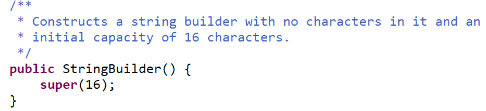
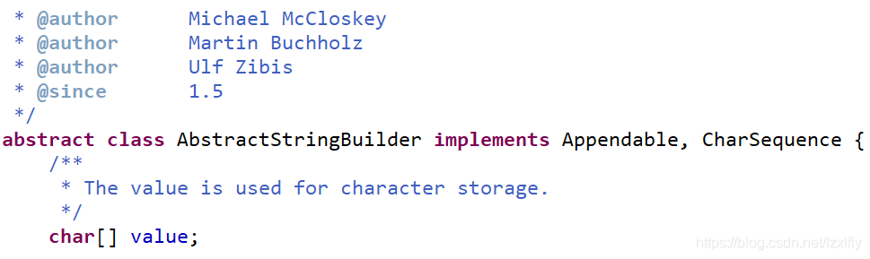

---
# 当前页面内容标题
title: 彻底弄懂StringBuffer与StringBuilder的区别
# 分类
category:
  - java
# 标签
tag: 
  - java
  - 面试题
sticky: false
# 是否收藏在博客主题的文章列表中，当填入数字时，数字越大，排名越靠前。
star: false
# 是否将该文章添加至文章列表中
article: true
# 是否将该文章添加至时间线中
timeline: true
---


> 一问道StringBuffer与StringBuilder的区别，张口就来StringBuffer是线程安全的，因为它相关方法都加了synchronized 关键字，StringBuilder线程不安全。没错，确实如此，但是我们查看过源码会发现StringBuffer是从jdk1.0就开始了，StringBuilder是从jdk1.5开始的。于是我就产生这样一个疑问，既然已经有了StringBuffer，为什么jdk5又出了一个StringBuilder呢，也就是单线程时候StringBuffer与StringBuilder有什么区别。

## 一、StringBuffer与StringBuilder的共同之处

1、都继成了AbstractStringBuilder这个抽象类，实现了CharSequence接口

```
public final class StringBuilder
    extends AbstractStringBuilder
    implements java.io.Serializable, CharSequence

 public final class StringBuffer
    extends AbstractStringBuilder
    implements java.io.Serializable, CharSequence
```

2、其append方法都是 super.append(str)，调用了父类AbstractStringBuilder的append(String str)方法

```
    @Override
    public StringBuilder append(String str) {
        super.append(str);
        return this;
    }

    @Override
    public synchronized StringBuffer append(String str) {
        toStringCache = null;
        super.append(str);
        return this;
    }
```

3、初始容量都是16和扩容机制都是"旧容量*2+2"



4、底层都是用char[]字符数组实现，且字符数组都是可变的，这点不同于String



## 二、StringBuffer与StringBuilder的不同之处

1、StringBuffer多线程安全的，StringBuilder多线程不安

2、StringBuffer从JDK1.0就有了，StringBuilder是JDK5.0才出现

3、StringBuffer比StringBuilder多了一个toStringCache字段，用来在toString方法中进行缓存，每次append操作之前都先把toStringCache设置为null，若多次连续调用toString方法，可避免每次Arrays.copyOfRange(value, 0, count)操作，节省性能。

```
    @Override
    public synchronized StringBuffer append(String str) {
        toStringCache = null;
        super.append(str);
        return this;
    }

    @Override
    public synchronized String toString() {
        if (toStringCache == null) {
            toStringCache = Arrays.copyOfRange(value, 0, count);
        }
        return new String(toStringCache, true);
    }
```

4、由于StringBuilder没有考虑同步，在单线程情况下，StringBuilder的性能要优于StringBuffer

## 三、单线程StringBuffer与StringBuilder区别

这个才是我们重点讨论的，单线程下StringBuffer加了synchronized，虽然是单线程， 但是synchronized获取锁和释放锁也还是需要时间的， 而StringBuilder没有，这个就是重点区别。因此重点要讨论synchronized锁的状态，从获取锁到释放锁的过程，因此需要讨论一下锁的升级和优化。

锁的4中状态：无锁状态、偏向锁状态、轻量级锁状态、重量级锁状态（级别从低到高）

（1）偏向锁：

偏向锁是指一段同步代码一直被一个线程所访问，那么该线程会自动获取锁。降低获取锁的代价。

为什么要引入偏向锁？

因为经过HotSpot的作者大量的研究发现，大多数时候是不存在锁竞争的，常常是一个线程多次获得同一个锁，因此如果每次都要竞争锁会增大很多没有必要付出的代价，为了降低获取锁的代价，才引入的偏向锁。

偏向锁的升级

当线程1访问代码块并获取锁对象时，会在java对象头和栈帧中记录偏向的锁的threadID，因为偏向锁不会主动释放锁，因此以后线程1再次获取锁的时候，需要比较当前线程的threadID和Java对象头中的threadID是否一致，如果一致（还是线程1获取锁对象），则无需使用CAS来加锁、解锁；如果不一致（其他线程，如线程2要竞争锁对象，而偏向锁不会主动释放因此还是存储的线程1的threadID），那么需要查看Java对象头中记录的线程1是否存活，如果没有存活，那么锁对象被重置为无锁状态，其它线程（线程2）可以竞争将其设置为偏向锁；如果存活，那么立刻查找该线程（线程1）的栈帧信息，如果还是需要继续持有这个锁对象，那么暂停当前线程1，撤销偏向锁，升级为轻量级锁，如果线程1 不再使用该锁对象，那么将锁对象状态设为无锁状态，重新偏向新的线程。

偏向锁的取消：

偏向锁是默认开启的，而且开始时间一般是比应用程序启动慢几秒，如果不想有这个延迟，那么可以使用-XX:BiasedLockingStartUpDelay=0；

如果不想要偏向锁，那么可以通过-XX:-UseBiasedLocking = false来设置；

（2）轻量级锁

轻量级锁是指当锁是偏向锁的时候，被另一个线程所访问，偏向锁就会升级为轻量级锁，其他线程会通过自旋的形式尝试获取锁，不会阻塞，提高性能

为什么要引入轻量级锁？

轻量级锁考虑的是竞争锁对象的线程不多，而且线程持有锁的时间也不长的情景。因为阻塞线程需要CPU从用户态转到内核态，代价较大，如果刚刚阻塞不久这个锁就被释放了，那这个代价就有点得不偿失了，因此这个时候就干脆不阻塞这个线程，让它自旋这等待锁释放。

（3）重量级锁

重量级锁是指当锁为轻量级锁的时候，另一个线程虽然是自旋，但自旋不会一直持续下去，当自旋一定次数的时候，还没有获取到锁，就会进入阻塞，该锁膨胀为重量级锁。重量级锁会让其他申请的线程进入阻塞，性能降低。

轻量级锁什么时候升级为重量级锁？

线程1获取轻量级锁时会先把锁对象的对象头MarkWord复制一份到线程1的栈帧中创建的用于存储锁记录的空间（称为DisplacedMarkWord），然后使用CAS把对象头中的内容替换为线程1存储的锁记录（DisplacedMarkWord）的地址；

如果在线程1复制对象头的同时（在线程1CAS之前），线程2也准备获取锁，复制了对象头到线程2的锁记录空间中，但是在线程2CAS的时候，发现线程1已经把对象头换了，线程2的CAS失败，那么线程2就尝试使用自旋锁来等待线程1释放锁。

但是如果自旋的时间太长也不行，因为自旋是要消耗CPU的，因此自旋的次数是有限制的，比如10次或者100次，如果自旋次数到了线程1还没有释放锁，或者线程1还在执行，线程2还在自旋等待，这时又有一个线程3过来竞争这个锁对象，那么这个时候轻量级锁就会膨胀为重量级锁。重量级锁把除了拥有锁的线程都阻塞，防止CPU空转。

*注意：为了避免无用的自旋，轻量级锁一旦膨胀为重量级锁就不会再降级为轻量级锁了；偏向锁升级为轻量级锁也不能再降级为偏向锁。一句话就是锁可以升级不可以降级，但是偏向锁状态可以被重置为无锁状态。

综上可知，StringBuffer虽然是单线程，但它是有偏向锁升级过程判断的，会耗费时间，效率固然低于StringBuilder

## 四、StringBuffer与StringBuilder的应用场景

1、StringBuffer多线程安全，但是加了synchronized，其效率低。故适用于多线程下，并发量不是很高的场景

2、StringBuilder没有加任何锁，其效率高，适用单线程场景，但同时也适用于高并发场景中，提高高并发场景下程序的响应性能，至于线程安全问题可以通过其它手段解决，如ThreadLocal，CAS操作等。

3、所以对于高并发场景下，若有用到二者，还是建议优先使用StringBuilder的。
