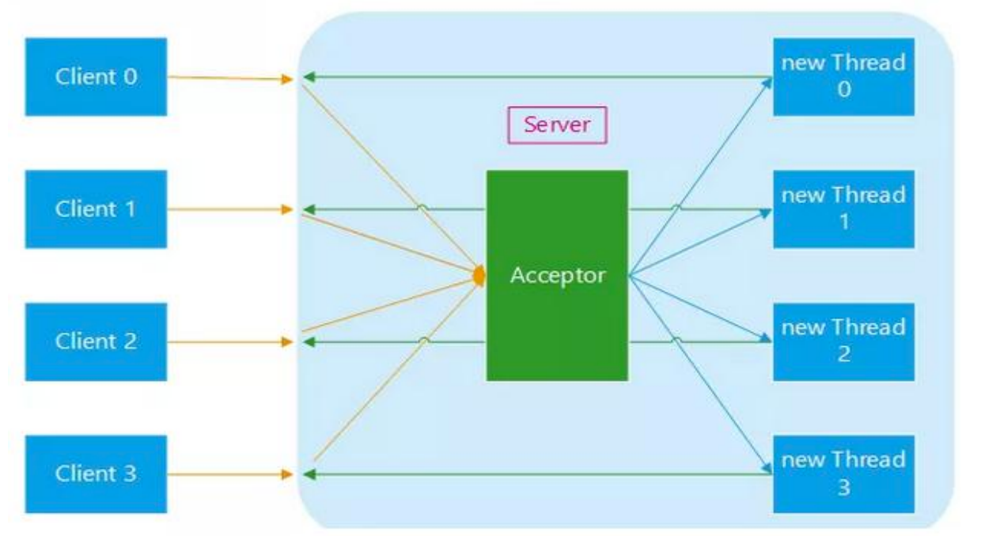
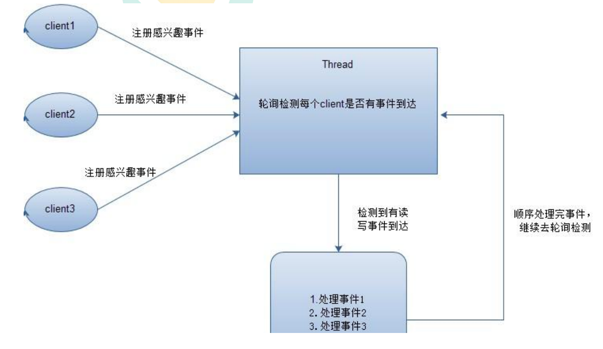
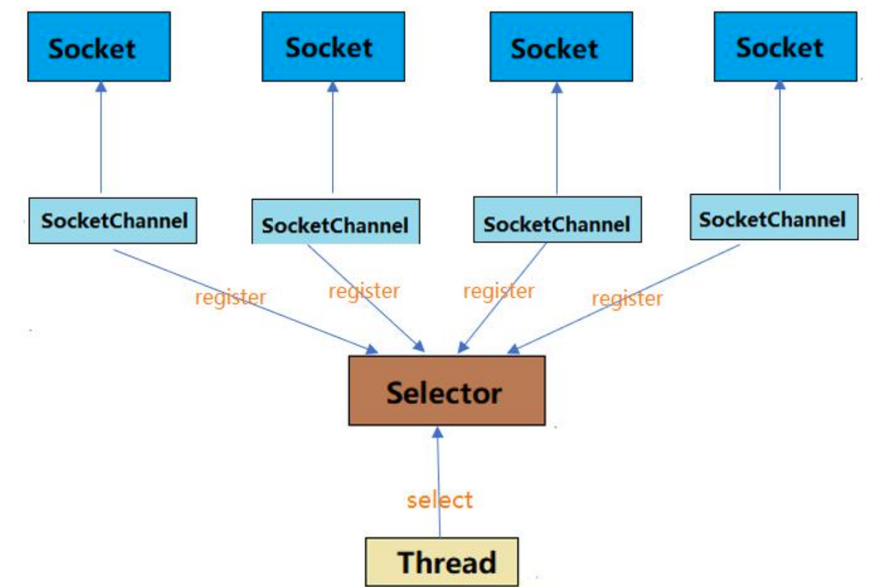
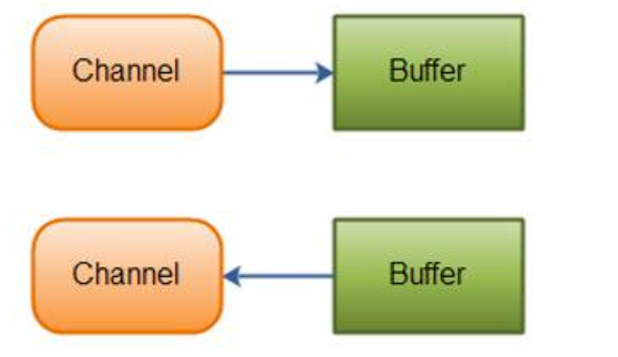
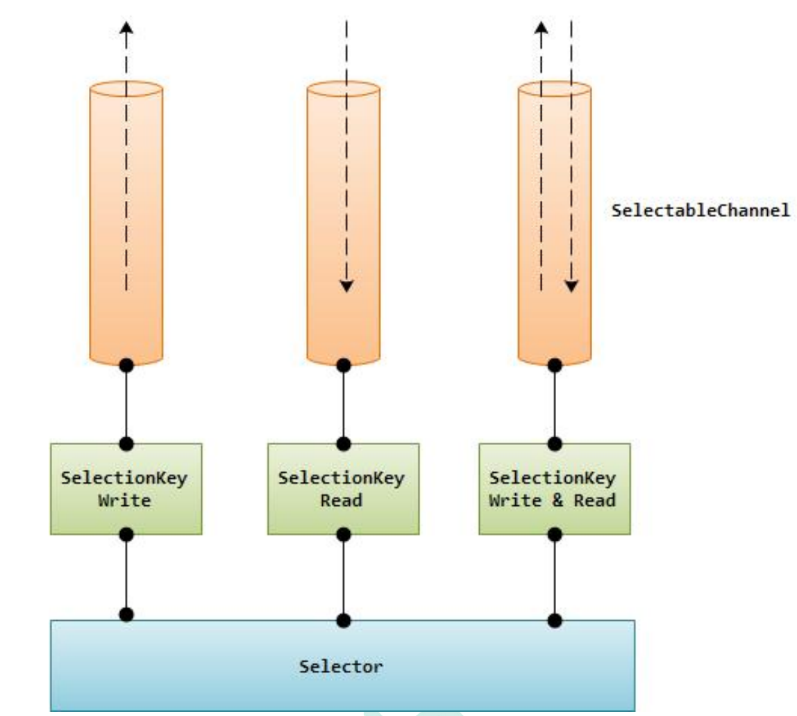

---
# 当前页面内容标题
title: 一、Java NIO概述
# 分类
category:
  - IO
# 标签
tag: 
  - NIO
  - IO
  - java
sticky: false
# 是否收藏在博客主题的文章列表中，当填入数字时，数字越大，排名越靠前。
star: false
# 是否将该文章添加至文章列表中
article: true
# 是否将该文章添加至时间线中
timeline: true
---

# 01、Java NIO概述

## 1.1、 IO概述

IO 的操作方式通常分为几种：同步阻塞 BIO、同步非阻塞 NIO、异步非阻塞 AIO。 

（1）在 JDK1.4 之前，我们建立网络连接的时候采用的是 BIO 模式。 

（2）Java NIO（New IO 或 Non Blocking IO）是从 Java 1.4 版本开始引入的一个新的 IO API，可以替代标准的 Java IO API。NIO 支持面向缓冲区的、基于通道的 IO 操作。 NIO 将以更加高效的方式进行文件的读写操作。BIO 与 NIO 一个比较重要的不同是， 我们使用 BIO 的时候往往会引入多线程，每个连接对应一个单独的线程；而 NIO 则是 使用单线程或者只使用少量的多线程，让连接共用一个线程。 

（3）AIO 也就是 NIO 2，在 Java 7 中引入了 NIO 的改进版 NIO 2,它是异步非阻塞的 IO 模型。 

下面我们来详细介绍这几种 IO 方式

## 1.2、阻塞 IO（BIO）

阻塞 IO（BIO）是最传统的一种 IO 模型，即在读写数据过程中会发生阻塞现象，直至 有可供读取的数据或者数据能够写入。

（1）在 BIO 模式中，服务器会为每个客户端请求建立一个线程，由该线程单独负责 处理一个客户请求，这种模式虽然简单方便，但由于服务器为每个客户端的连接都采 用一个线程去处理，使得资源占用非常大。因此，当连接数量达到上限时，如果再有 用户请求连接，直接会导致资源瓶颈，严重的可能会直接导致服务器崩溃。 

（2）大多数情况下为了避免上述问题，都采用了线程池模型。也就是创建一个固定大 小的线程池，如果有客户端请求，就从线程池中取一个空闲线程来处理，当客户端处 理完操作之后，就会释放对线程的占用。因此这样就避免为每一个客户端都要创建线 程带来的资源浪费，使得线程可以重用。但线程池也有它的弊端，如果连接大多是长 连接，可能会导致在一段时间内，线程池中的线程都被占用，那么当再有客户端请求 连接时，由于没有空闲线程来处理，就会导致客户端连接失败。传统的 BIO 模式如下 图所示：

## **1.3 、非阻塞 IO(NIO)**

基于 BIO 的各种弊端，在 JDK1.4 开始出现了高性能 IO 设计模式非阻塞 IO（NIO）。

（1）NIO 采用非阻塞模式，基于 Reactor 模式的工作方式，I/O 调用不会被阻塞，它 的实现过程是：会先对每个客户端注册感兴趣的事件，然后有一个线程专门去轮询每 个客户端是否有事件发生，当有事件发生时，便顺序处理每个事件，当所有事件处理 完之后，便再转去继续轮询。如下图所示：

（2）NIO 中实现非阻塞 I/O 的核心对象就是 Selector，Selector 就是注册各种 I/O 事件地方，而且当我们感兴趣的事件发生时，就是这个对象告诉我们所发生的事件， 

如下图所示： 

（3）NIO 的最重要的地方是当一个连接创建后，不需要对应一个线程，这个连接会被 注册到多路复用器上面，一个选择器线程可以同时处理成千上万个连接，系统不必创建大量的线程，也不必维护这些线程，从而大大减小了系统的开销。

|            IO             |              NIO              |
| :-----------------------: | :---------------------------: |
| 面向流（Stream Oriented） | 面向缓冲区（Buffer Oriented） |
|   阻塞IO（Blocking IO）   |  非阻塞IO（Non Blocking IO）  |
|          （无）           |      选择器（Selectors）      |

## **1.4** **异步非阻塞** **IO**(AIO)

（1）AIO 也就是 NIO 2，在 Java 7 中引入了 NIO 的改进版 NIO 2,它是异步非阻塞 的 IO 模型。异步 IO 是基于事件和回调机制实现的，也就是说 AIO 模式不需要selector 操作，而是是事件驱动形式，也就是当客户端发送数据之后，会主动通知服 务器，接着服务器再进行读写操作。

（2）Java 的 AIO API 其实就是 Proactor 模式的应用，和 Reactor 模式类似。 Reactor 和 Proactor 模式的主要区别就是真正的读取和写入操作是有谁来完成的， Reactor 中需要应用程序自己读取或者写入数据，而 Proactor 模式中，应用程序不需 要进行实际的读写过程，它只需要从缓存区读取或者写入即可，操作系统会读取缓存 区或者写入缓存区到真正的 IO 设备。 

## **1.5 NIO 概述**

Java NIO 由以下几个核心部分组成： 

-  Channels 
- Buffers 
- Selectors

虽然 Java NIO 中除此之外还有很多类和组件，但 Channel，Buffer 和 Selector 构成 了核心的 API。其它组件，如 Pipe 和 FileLock，只不过是与三个核心组件共同使用的 工具类。

### **1.5.1 Channel**

首先说一下 Channel，可以翻译成“通道”。Channel 和 IO 中的 Stream(流)是差不 多一个等级的。只不过 Stream 是单向的，譬如：InputStream, OutputStream.而 Channel 是双向的，既可以用来进行读操作，又可以用来进行写操作。 

NIO 中的 Channel 的主要实现有：FileChannel、DatagramChannel、 SocketChannel 和 ServerSocketChannel，这里看名字就可以猜出个所以然来：分别 可以对应文件 IO、UDP 和 TCP（Server 和 Client）。

### **1.5.2 Buffer** 

NIO 中的关键 Buffer 实现有：ByteBuffer, CharBuffer, DoubleBuffer, FloatBuffer, IntBuffer, LongBuffer, ShortBuffer，分别对应基本数据类型: byte, char, double, float, int, long, short。 

### **1.5.3 Selector** 

Selector 运行单线程处理多个 Channel，如果你的应用打开了多个通道，但每个连接 的流量都很低，使用 Selector 就会很方便。例如在一个聊天服务器中。要使用 Selector, 得向 Selector 注册 Channel，然后调用它的 select()方法。这个方法会一直 阻塞到某个注册的通道有事件就绪。一旦这个方法返回，线程就可以处理这些事件， 事件的例子有如新的连接进来、数据接收等。

### **1.5.4** **Channel Buffer Selector 三者关系** 

（1）一个 Channel 就像一个流，只是 Channel 是双向的，Channel 读数据到 Buffer， Buffer 写数据到 Channel。 

（2）一个 selector 允许一个线程处理多个 channel。

