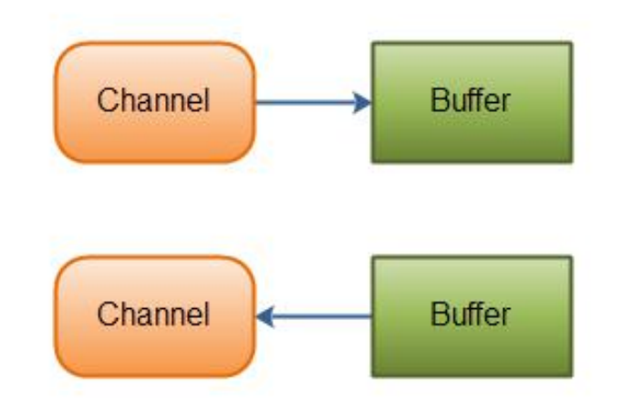
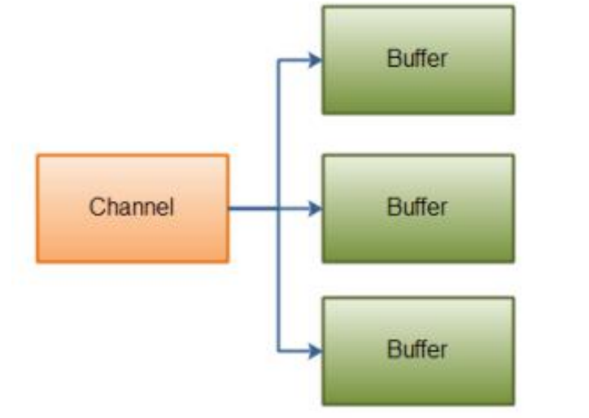
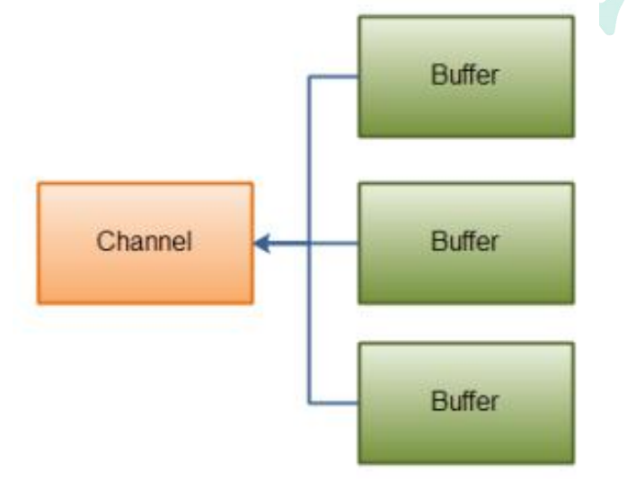

---
# 当前页面内容标题
title: 二、Java NIO（Channel）
# 分类
category:
  - IO
# 标签
tag: 
  - NIO
  - IO
  - java
sticky: false
# 是否收藏在博客主题的文章列表中，当填入数字时，数字越大，排名越靠前。
star: false
# 是否将该文章添加至文章列表中
article: true
# 是否将该文章添加至时间线中
timeline: true
---

# 01、Java NIO（Channel）

## **1.1 Channel 概述**

Java NIO 的通道类似流，但又有些不同： 

- 既可以从通道中读取数据，又可以写数据到通道。但流的读写通常是单向的。 

- 通道可以异步地读写。 

- 通道中的数据总是要先读到一个 Buffer，或者总是要从一个 Buffer 中写入。 

正如上面所说，从通道读取数据到缓冲区，从缓冲区写入数据到通道。如下图所示：



## **1.2 Channel 实现** 

下面是 Java NIO 中最重要的 Channel 的实现：

-  FileChannel 
- DatagramChannel 
- SocketChannel 
- ServerSocketChannel 

（1）FileChannel 从文件中读写数据。 

（2）DatagramChannel 能通过 UDP 读写网络中的数据。 

（3）SocketChannel 能通过 TCP 读写网络中的数据。 

（4）ServerSocketChannel 可以监听新进来的 TCP 连接，像 Web 服务器那样。对 每一个新进来的连接都会创建一个 SocketChannel。 

正如你所看到的，这些通道涵盖了 UDP 和 TCP 网络 IO，以及文件 IO

## **1.3 FileChannel 介绍和示例** 

FileChannel 类可以实现常用的 read，write 以及 scatter/gather 操作，同时它也提 

供了很多专用于文件的新方法。这些方法中的许多都是我们所熟悉的文件操作。

|                方法                |                     描述                      |
| :--------------------------------: | :-------------------------------------------: |
|    **int read(ByteBuffer dst)**    |       **从 Channel 中读取到ByteBuffer**       |
| **long read(ByteBuffer[] dsts )**  | **将 Channel 中的数据“分散” 到 ByteBuffer[]** |
|   **int write(ByteBuffer src)**    |    **将 ByteBuffer 中的数据写入到Channel**    |
| **long write(ByteBuffer[] srcs )** | **将 ByteBuffer[] 中的数据 “聚集” 到Channel** |
|          long position()           |             返回此通道的文件位置              |
|    FileChannel position(long p)    |             设置此通道的文件位置              |
|            long size()             |          返回此通道的文件的当前大小           |
|    FileChannel truncate(long s)    |         将此通道的文件截取为给定大小          |
|    void force(boolean metaData)    | 强制将所有对此通道的文件更新写入到存储设备中  |

**下面是一个使用 FileChannel 读取数据到 Buffer 中的示例：**

```java
public class FileChannelDemo { 
  public static void main(String[] args) throws IOException { 
    RandomAccessFile aFile = new RandomAccessFile("d:\\atguigu\\01.txt", "rw");
    FileChannel inChannel = aFile.getChannel(); 
    ByteBuffer buf = ByteBuffer.allocate(48); 
    int bytesRead = inChannel.read(buf); 
    while (bytesRead != -1) { 
      System.out.println("读取： " + bytesRead); 
      buf.flip(); 
      while (buf.hasRemaining()) { 
        System.out.print((char) buf.get()); 
      }
      buf.clear(); 
      bytesRead = inChannel.read(buf); 
    }
    aFile.close(); 
    System.out.println("操作结束"); 
  } 
}
```

**Buffer** **通常的操作** 

1. 将数据写入缓冲区
2. 调用 buffer.flip() 反转读写模式 
3. 从缓冲区读取数据 
4. 调用 buffer.clear() 或 buffer.compact() 清除缓冲区内容

## **1.4 FileChannel 操作详解** 

### **1.4.1 打开 FileChannel** 

在使用 FileChannel 之前，必须先打开它。但是，我们无法直接打开一个 FileChannel，需要通过使用一个 InputStream、OutputStream 或 RandomAccessFile 来获取一个 FileChannel 实例。下面是通过 RandomAccessFile 

打开 FileChannel 的示例：

```java
RandomAccessFile aFile = new RandomAccessFile("d:\\atguigu\\01.txt", "rw"); 
FileChannel inChannel = aFile.getChannel();
```

### **1.4.2 从 FileChannel 读取数据** 

调用多个 read()方法之一从 FileChannel 中读取数据。如：

```java
ByteBuffer buf = ByteBuffer.allocate(48); 
int bytesRead = inChannel.read(buf);
```

首先，分配一个 Buffer。从 FileChannel 中读取的数据将被读到 Buffer 中。然后，调 用 FileChannel.read()方法。该方法将数据从 FileChannel 读取到 Buffer 中。read() 方法返回的 int 值表示了有多少字节被读到了 Buffer 中。如果返回-1，表示到了文件 末尾。

### **1.4.3 向 FileChannel 写数据** 

使用 FileChannel.write()方法向 FileChannel 写数据，该方法的参数是一个 Buffer。 

如：

```java
public class FileChannelDemo { 
  public static void main(String[] args) throws IOException { 
    RandomAccessFile aFile = new RandomAccessFile("d:\\atguigu\\01.txt", "rw");
    FileChannel inChannel = aFile.getChannel(); 
    String newData = "New String to write to file..." + System.currentTimeMillis();
    ByteBuffer buf1 = ByteBuffer.allocate(48); 
    buf1.clear(); 
    buf1.put(newData.getBytes()); 
    buf1.flip(); 
    while(buf1.hasRemaining()) { 
      inChannel.write(buf1); 
    }
    inChannel.close(); 
  } 
}
```

注意 FileChannel.write()是在 while 循环中调用的。因为无法保证 write()方法一次能 向 FileChannel 写入多少字节，因此需要重复调用 write()方法，直到 Buffer 中已经没 有尚未写入通道的字节。

### **1.4.4 关闭 FileChannel** 

用完 FileChannel 后必须将其关闭。如：

```java
inChannel.close();
```

### **1.4.5 FileChannel 的 position 方法**

有时可能需要在 FileChannel 的某个特定位置进行数据的读/写操作。可以通过调用 position()方法获取 FileChannel 的当前位置。也可以通过调用 position(long pos)方 法设置 FileChannel 的当前位置。 

这里有两个例子：

```java
long pos = channel.position(); 
channel.position(pos +123);
```

如果将位置设置在文件结束符之后，然后试图从文件通道中读取数据，读方法将返回- 1 （文件结束标志）。

如果将位置设置在文件结束符之后，然后向通道中写数据，文件将撑大到当前位置并 写入数据。这可能导致“文件空洞”，磁盘上物理文件中写入的数据间有空隙。

### **1.4.6 FileChannel 的 size 方法** 

FileChannel 实例的 size()方法将返回该实例所关联文件的大小。如: 

```java
long fileSize = channel.size(); 
```

### **1.4.7 FileChannel 的 truncate 方法** 

可以使用 FileChannel.truncate()方法截取一个文件。截取文件时，文件将中指定长度 

后面的部分将被删除。如： 

```java
channel.truncate(1024); 
```

这个例子截取文件的前 1024 个字节。

### **1.4.8 FileChannel 的 force 方法** 

FileChannel.force()方法将通道里尚未写入磁盘的数据强制写到磁盘上。出于性能方 面的考虑，操作系统会将数据缓存在内存中，所以无法保证写入到 FileChannel 里的 数据一定会即时写到磁盘上。要保证这一点，需要调用 force()方法。 

force()方法有一个 boolean 类型的参数，指明是否同时将文件元数据（权限信息等） 写到磁盘上。 

### **1.4.9 FileChannel 的 transferTo 和 transferFrom 方法** 

**通道之间的数据传输：** 

如果两个通道中有一个是 FileChannel，那你可以直接将数据从一个 channel 传输到 另外一个 channel。 

**（1）transferFrom()方法**

FileChannel 的 transferFrom()方法可以将数据从源通道传输到 FileChannel 中（译 者注：这个方法在 JDK 文档中的解释为将字节从给定的可读取字节通道传输到此通道 的文件中）。下面是一个 FileChannel 完成文件间的复制的例子：

```java
public class FileChannelWrite { 
  public static void main(String args[]) throws Exception { 
    RandomAccessFile aFile = new RandomAccessFile("d:\\atguigu\\01.txt", "rw");
    FileChannel fromChannel = aFile.getChannel(); 
    RandomAccessFile bFile = new RandomAccessFile("d:\\atguigu\\02.txt", "rw");
    FileChannel toChannel = bFile.getChannel(); 
    long position = 0; 
    long count = fromChannel.size();
    toChannel.transferFrom(fromChannel, position, count); 
    aFile.close(); 
    bFile.close(); 
    System.out.println("over!"); 
  } 
}
```

方法的输入参数 position 表示从 position 处开始向目标文件写入数据，count 表示最 多传输的字节数。如果源通道的剩余空间小于 count 个字节，则所传输的字节数要小 于请求的字节数。此外要注意，在 SoketChannel 的实现中，SocketChannel 只会传 输此刻准备好的数据（可能不足 count 字节）。因此，SocketChannel 可能不会将请 求的所有数据(count 个字节)全部传输到 FileChannel 中。 

**（2）transferTo()方法** 

transferTo()方法将数据从 FileChannel 传输到其他的 channel 中。 

下面是一个 transferTo()方法的例子：

```java
public class FileChannelDemo { 
  public static void main(String args[]) throws Exception { 
    RandomAccessFile aFile = new RandomAccessFile("d:\\atguigu\\02.txt", "rw");
    FileChannel fromChannel = aFile.getChannel(); 
    RandomAccessFile bFile = newRandomAccessFile("d:\\atguigu\\03.txt", "rw");
    FileChannel toChannel = bFile.getChannel(); 
    long position = 0; 
    long count = fromChannel.size(); 
    fromChannel.transferTo(position, count, toChannel); 
    aFile.close(); 
    bFile.close(); 
    System.out.println("over!"); 
  }
}
```

## **1.5** **Scatter/Gather**

Java NIO 开始支持 scatter/gather，scatter/gather 用于描述从 Channel 中读取或者写入到 Channel 的操作。 

**分散（scatter）**从 Channel 中读取是指在读操作时将读取的数据写入多个 buffer 中。 

因此，Channel 将从 Channel 中读取的数据“分散（scatter）”到多个 Buffer 中。 

**聚集（gather）**写入 Channel 是指在写操作时将多个 buffer 的数据写入同一个 Channel，因此，Channel 将多个 Buffer 中的数据“聚集（gather）”后发送到 Channel。 

scatter / gather 经常用于需要将传输的数据分开处理的场合，例如传输一个由消息头 和消息体组成的消息，你可能会将消息体和消息头分散到不同的 buffer 中，这样你可 以方便的处理消息头和消息体。 

### **1.5.1 Scattering Reads** 

Scattering Reads 是指数据从一个 channel 读取到多个 buffer 中。如下图描述： 



```java
ByteBuffer header = ByteBuffer.allocate(128); 
ByteBuffer body = ByteBuffer.allocate(1024);
ByteBuffer[] bufferArray = { header, body }; 
channel.read(bufferArray);
```

注意 buffer 首先被插入到数组，然后再将数组作为 channel.read() 的输入参数。 

read()方法按照 buffer 在数组中的顺序将从 channel 中读取的数据写入到 buffer，当 一个 buffer 被写满后，channel 紧接着向另一个 buffer 中写。 

Scattering Reads 在移动下一个 buffer 前，必须填满当前的 buffer，这也意味着它 不适用于动态消息(译者注：消息大小不固定)。换句话说，如果存在消息头和消息体， 消息头必须完成填充（例如 128byte），Scattering Reads 才能正常工作。

### **1.5.2 Gathering Writes** 

Gathering Writes 是指数据从多个 buffer 写入到同一个 channel。如下图描述：



```java
ByteBuffer header = ByteBuffer.allocate(128); 
ByteBuffer body = ByteBuffer.allocate(1024); 

//write data into buffers 
ByteBuffer[] bufferArray = { header, body }; 
channel.write(bufferArray);
```

buffers 数组是 write()方法的入参，write()方法会按照 buffer 在数组中的顺序，将数 据写入到 channel，注意只有 position 和 limit 之间的数据才会被写入。因此，如果 一个 buffer 的容量为 128byte，但是仅仅包含 58byte 的数据，那么这 58byte 的数 据将被写入到 channel 中。因此与 Scattering Reads 相反，Gathering Writes 能较 好的处理动态消息。