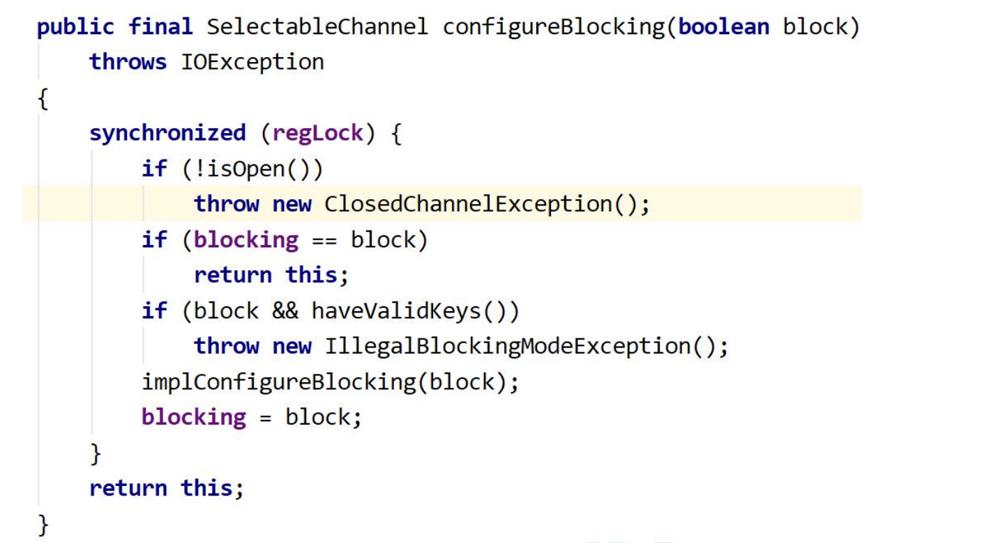
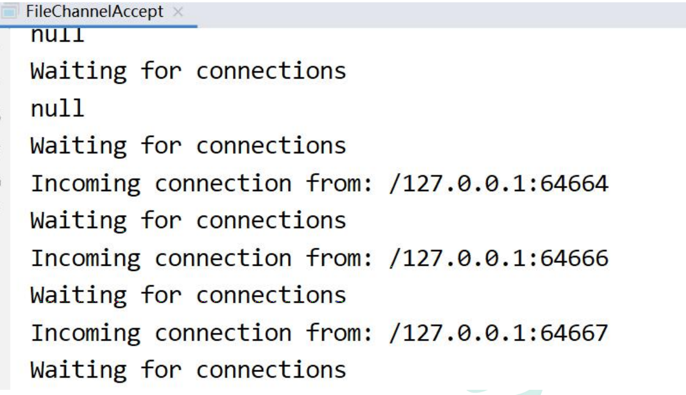
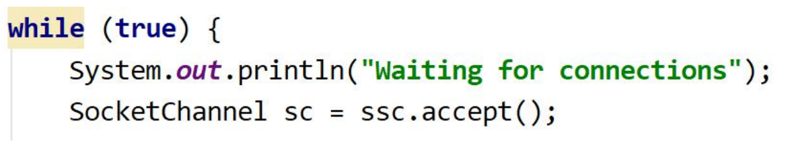
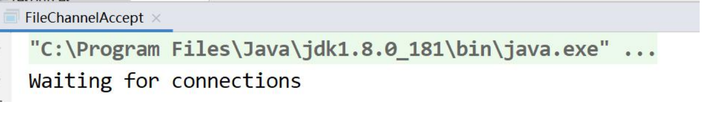
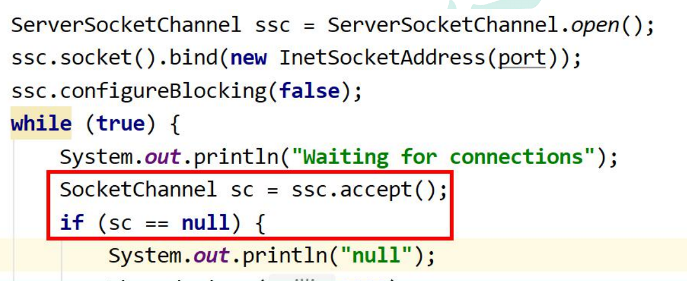

---
# 当前页面内容标题
title: 三、Java NIO（SocketChannel）
# 分类
category:
  - IO
# 标签
tag: 
  - NIO
  - IO
  - java
sticky: false
# 是否收藏在博客主题的文章列表中，当填入数字时，数字越大，排名越靠前。
star: false
# 是否将该文章添加至文章列表中
article: true
# 是否将该文章添加至时间线中
timeline: true
---

# 01、Java NIO（**SocketChannel**）

（1）SocketChannel 就是 NIO 对于非阻塞 socket 操作的支持的组件，其在 socket 上 封装了一层，主要是支持了非阻塞的读写。同时改进了传统的单向流 API,，Channel 同时支持读写。 

（2）socket 通道类主要分为 DatagramChannel、SocketChannel 和 ServerSocketChannel，它们在被实例化时都会创建一个对等 socket 对象。要把一个 socket 通道置于非阻塞模式，我们要依靠所有 socket 通道类的公有超级类： SelectableChannel。就绪选择（readiness selection）是一种可以用来查询通道的 机制，该查询可以判断通道是否准备好执行一个目标操作，如读或写。非阻塞 I/O 和 可选择性是紧密相连的，那也正是管理阻塞模式的 API 代码要在 SelectableChannel 超级类中定义的原因。 

（3）设置或重新设置一个通道的阻塞模式是很简单的，只要调用 configureBlocking( )方法即可，传递参数值为 true 则设为阻塞模式，参数值为 false 值设为非阻塞模式。可以通过调用 isBlocking( )方法来判断某个 socket 通道当前处于 哪种模式。 

**AbstractSelectableChannel.java 中实现的 configureBlocking()方法如下：**



下面分别介绍这 3 个通道 

## **1.1 ServerSocketChannel**

ServerSocketChannel 是一个基于通道的 socket 监听器。它同我们所熟悉的 java.net.ServerSocket 执行相同的任务，不过它增加了通道语义，因此能够在非阻塞 模式下运行。 

由于 ServerSocketChannel 没有 bind()方法，因此有必要取出对等的 socket 并使用 它来绑定到一个端口以开始监听连接。我们也是使用对等 ServerSocket 的 API 来根 据需要设置其他的 socket 选项。 

同 java.net.ServerSocket 一样，ServerSocketChannel 也有 accept( )方法。 ServerSocketChannel 的 accept()方法会返回 SocketChannel 类型对象， SocketChannel 可以在非阻塞模式下运行。 

**以下代码演示了如何使用一个非阻塞的 accept( )方法：**

```java
public class FileChannelAccept { 
  public static final String GREETING = "Hello java nio.\r\n";
  public static void main(String[] argv) throws Exception { 
    int port = 1234; // default 
    if (argv.length > 0) { 
      port = Integer.parseInt(argv[0]); 
    }
    ByteBuffer buffer = ByteBuffer.wrap(GREETING.getBytes()); 
    ServerSocketChannel ssc = ServerSocketChannel.open(); 
    ssc.socket().bind(new InetSocketAddress(port)); 
    ssc.configureBlocking(false); 
    while (true) { 
      System.out.println("Waiting for connections"); 
      SocketChannel sc = ssc.accept(); 
      if (sc == null) { 
        System.out.println("null"); 
        Thread.sleep(2000); 
      } else { 
        System.out.println("Incoming connection from: " + sc.socket().getRemoteSocketAddress()); 
        buffer.rewind(); sc.write(buffer); 
        sc.close(); 
      } 
    } 
  } 
}
```



**（1）打开 ServerSocketChannel** 

通过调用 ServerSocketChannel.open() 方法来打开 ServerSocketChannel. 

```java
ServerSocketChannel serverSocketChannel = ServerSocketChannel.open(); 
```

**（2）关闭 ServerSocketChannel** 

通过调用 ServerSocketChannel.close() 方法来关闭 ServerSocketChannel. 

```java
serverSocketChannel.close(); 
```

**（3）监听新的连接** 

通过 ServerSocketChannel.accept() 方法监听新进的连接。当 accept()方法返回时 候,它返回一个包含新进来的连接的 SocketChannel。因此, accept()方法会一直阻塞 到有新连接到达。 

通常不会仅仅只监听一个连接,在 while 循环中调用 accept()方法. 如下面的例子：



**（4）阻塞模式**



会在 SocketChannel sc = ssc.accept();这里阻塞住进程。 

**（5）非阻塞模式** 

ServerSocketChannel 可以设置成非阻塞模式。在非阻塞模式下，accept() 方法会立 刻返回，如果还没有新进来的连接,返回的将是 null。 因此，需要检查返回的 SocketChannel 是否是 null.如：



## **1.2 SocketChannel** 

### **1.2.1**、SocketChannel介绍

Java NIO 中的 SocketChannel 是一个连接到 TCP 网络套接字的通道。 

**A selectable channel for stream-oriented connecting sockets.** 

以上是 Java docs 中对于 SocketChannel 的描述：SocketChannel 是一种面向流连接 sockets 套接字的可选择通道。从这里可以看出： 

- SocketChannel 是用来连接 Socket 套接字 
- SocketChannel 主要用途用来处理网络 I/O 的通道 
- SocketChannel 是基于 TCP 连接传输
- SocketChannel 实现了可选择通道，可以被多路复用的

### **1.2.2*、***SocketChannel **特征：** 

（1）对于已经存在的 socket 不能创建 SocketChannel 

（2）SocketChannel 中提供的 open 接口创建的 Channel 并没有进行网络级联，需要使 用 connect 接口连接到指定地址 

（3）未进行连接的 SocketChannle 执行 I/O 操作时，会抛出 NotYetConnectedException 

（4）SocketChannel 支持两种 I/O 模式：阻塞式和非阻塞式 

（5）SocketChannel 支持异步关闭。如果 SocketChannel 在一个线程上 read 阻塞，另 一个线程对该 SocketChannel 调用 shutdownInput，则读阻塞的线程将返回-1 表示没有 读取任何数据；如果 SocketChannel 在一个线程上 write 阻塞，另一个线程对该 SocketChannel 调用 shutdownWrite，则写阻塞的线程将抛出 AsynchronousCloseException 

（6）SocketChannel 支持设定参数：

|  SO_SNDBUF   |                 套接字发送缓冲区大小                  |
| :----------: | :---------------------------------------------------: |
|  SO_RCVBUF   |                 套接字接收缓冲区大小                  |
| SO_KEEPALIVE |                       保活连接                        |
| O_REUSEADDR  |                       复用地址                        |
|  SO_LINGER   | 有数据传输时延缓关闭 Channel (只有在非阻塞模式下有用) |
| TCP_NODELAY  |                    禁用 Nagle 算法                    |

### **1.2.3*、***SocketChannel **的使用** 

**（1）创建 SocketChannel** 

方式一： 

```java
SocketChannel socketChannel = SocketChannel.open(new InetSocketAddress("www.baidu.com", 80));
```

方式二： 

```java
SocketChannel socketChanne2 = SocketChannel.open(); 
socketChanne2.connect(new InetSocketAddress("www.baidu.com", 80));
```

直接使用有参 open api 或者使用无参 open api，但是在无参 open 只是创建了一个 SocketChannel 对象，并没有进行实质的 tcp 连接。

**（2）连接校验** 

```java
socketChannel.isOpen(); // 测试 SocketChannel 是否为 open 状态 
socketChannel.isConnected(); //测试 SocketChannel 是否已经被连接
socketChannel.isConnectionPending(); //测试 SocketChannel 是否正在进行 连
socketChannel.finishConnect(); //校验正在进行套接字连接的 SocketChannel 是否已经完成连接
```

**（3）读写模式** 

前面提到 SocketChannel 支持阻塞和非阻塞两种模式： 

```java
socketChannel.configureBlocking(false);
```

通过以上方法设置 SocketChannel 的读写模式。false 表示非阻塞，true 表示阻塞。 

**（4）读写**

```java
SocketChannel socketChannel = SocketChannel.open( new InetSocketAddress("www.baidu.com", 80)); 
ByteBuffer byteBuffer = ByteBuffer.allocate(16); 
socketChannel.read(byteBuffer); 
socketChannel.close(); 
System.out.println("read over");
```

以上为阻塞式读，当执行到 read 出，线程将阻塞，控制台将无法打印 read over

```java
SocketChannel socketChannel = SocketChannel.open( new InetSocketAddress("www.baidu.com", 80)); 
socketChannel.configureBlocking(false); 
ByteBuffer byteBuffer = ByteBuffer.allocate(16); 
socketChannel.read(byteBuffer); 
socketChannel.close();
System.out.println("read over");
```

以上为非阻塞读，控制台将打印 read over 

读写都是面向缓冲区，这个读写方式与前文中的 FileChannel 相同。

**（5）设置和获取参数** 

```java
socketChannel.setOption(StandardSocketOptions.SO_KEEPALIVE, Boolean.TRUE).setOption(StandardSocketOptions.TCP_NODELAY, Boolean.TRUE);
```

通过 setOptions 方法可以设置 socket 套接字的相关参数 

```java
socketChannel.getOption(StandardSocketOptions.SO_KEEPALIVE);
socketChannel.getOption(StandardSocketOptions.SO_RCVBUF);
```

可以通过 getOption 获取相关参数的值。如默认的接收缓冲区大小是 8192byte。 

SocketChannel 还支持多路复用，但是多路复用在后续内容中会介绍到。

## **1.3 DatagramChannel** 

正如 SocketChannel 对应 Socket，ServerSocketChannel 对应 ServerSocket，每 一个 DatagramChannel 对象也有一个关联的 DatagramSocket 对象。正如 SocketChannel 模拟连接导向的流协议（如 TCP/IP），DatagramChannel 则模拟包 导向的无连接协议（如 UDP/IP）。DatagramChannel 是无连接的，每个数据报 （datagram）都是一个自包含的实体，拥有它自己的目的地址及不依赖其他数据报的 数据负载。与面向流的的 socket 不同，DatagramChannel 可以发送单独的数据报给 不同的目的地址。同样，DatagramChannel 对象也可以接收来自任意地址的数据包。 每个到达的数据报都含有关于它来自何处的信息（源地址） 

### **1、打开** **DatagramChannel** 

```java
DatagramChannel server = DatagramChannel.open(); 
server.socket().bind(new InetSocketAddress(10086));
```

此例子是打开 10086 端口接收 UDP 数据包。

### **2、接收数据** 

通过 receive()接收 UDP 包 

```java
ByteBuffer receiveBuffer = ByteBuffer.allocate(64); 
receiveBuffer.clear(); 
SocketAddress receiveAddr = server.receive(receiveBuffer);
```

SocketAddress 可以获得发包的 ip、端口等信息，用 toString 查看，格式如下 

```java
/127.0.0.1:57126 
```

### **3、发送数据** 

通过 send()发送 UDP 包

```java
DatagramChannel server = DatagramChannel.open(); 
ByteBuffer sendBuffer = ByteBuffer.wrap("client send".getBytes());
server.send(sendBuffer, new InetSocketAddress("127.0.0.1",10086));
```

### **4、连接** 

UDP 不存在真正意义上的连接，这里的连接是向特定服务地址用 read 和 write 接收 发送数据包。

```java
client.connect(new InetSocketAddress("127.0.0.1",10086)); 
int readSize= client.read(sendBuffer); 
server.write(sendBuffer);
```

read()和 write()只有在 connect()后才能使用，不然会抛 NotYetConnectedException 异常。用 read()接收时，如果没有接收到包，会抛 PortUnreachableException 异常。

### **5、DatagramChannel示例**

客户端发送，服务端接收的例子

```java
/**
	* 发包的 datagram 
	*
	* @throws IOException 
	* @throws InterruptedException 
	*/
	@Test 
	public void sendDatagram() throws IOException, InterruptedException {
    DatagramChannel sendChannel= DatagramChannel.open(); 
    InetSocketAddress sendAddress= new InetSocketAddress("127.0.0.1", 9999); 
    while (true) { 
      sendChannel.send(ByteBuffer.wrap("发包".getBytes("UTF-8")), sendAddress);
      System.out.println("发包端发包"); 
      Thread.sleep(1000); 
    } 
  }
/**
	* 收包端 
	*
	* @throws IOException 
	*/
  @Test 
  public void receive() throws IOException { 
    DatagramChannel receiveChannel= DatagramChannel.open(); 
    InetSocketAddress receiveAddress= new InetSocketAddress(9999);
    receiveChannel.bind(receiveAddress); 
    ByteBuffer receiveBuffer= ByteBuffer.allocate(512); 
    while (true) { 
      receiveBuffer.clear();
      SocketAddress sendAddress= receiveChannel.receive(receiveBuffer);
      receiveBuffer.flip(); 
      System.out.print(sendAddress.toString() + " ");
      System.out.println(Charset.forName("UTF-8").decode(receiveBuffer)); 
    } 
  }

/**
	* 只接收和发送 9999 的数据包 
	*
	* @throws IOException 
	*/
  @Test 
  public void testConect1() throws IOException { 
    DatagramChannel connChannel= DatagramChannel.open(); 
    connChannel.bind(new InetSocketAddress(9998)); 
    connChannel.connect(new InetSocketAddress("127.0.0.1",9999));
    connChannel.write(ByteBuffer.wrap("发包".getBytes("UTF-8"))); 
    ByteBuffer readBuffer= ByteBuffer.allocate(512); 
    while (true) { 
      try {
        readBuffer.clear(); 
        connChannel.read(readBuffer); 
        readBuffer.flip(); 
        System.out.println(Charset.forName("UTF-8").decode(readBuffer)); 
      }catch(Exception e) { 
      } 
    } 
  }
```

