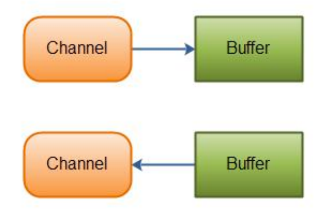
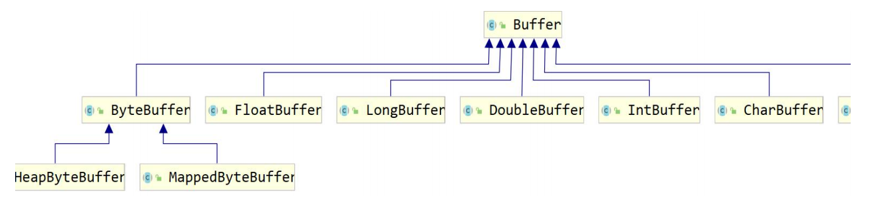
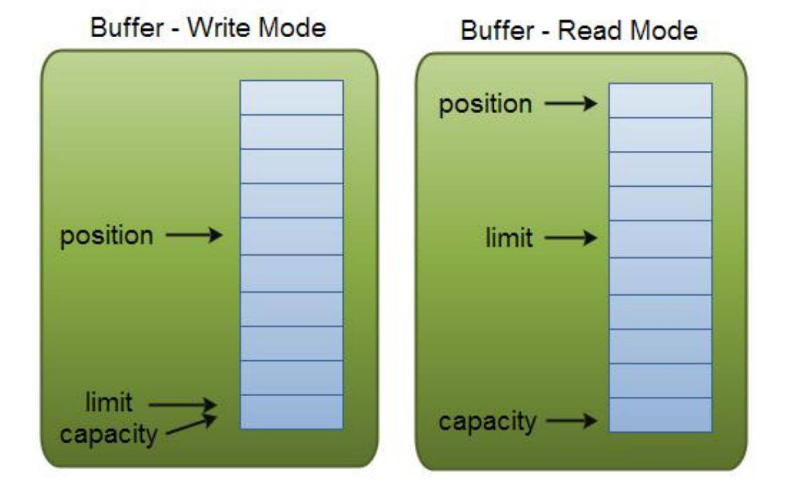

---
# 当前页面内容标题
title: 四、Java NIO（Buffer）
# 分类
category:
  - IO
# 标签
tag: 
  - NIO
  - IO
  - java
sticky: false
# 是否收藏在博客主题的文章列表中，当填入数字时，数字越大，排名越靠前。
star: false
# 是否将该文章添加至文章列表中
article: true
# 是否将该文章添加至时间线中
timeline: true
---

# 01、**Java NIO（Buffer）**

## **1.1 Buffer 简介** 

Java NIO 中的 Buffer 用于和 NIO 通道进行交互。数据是从通道读入缓冲区，从缓冲 区写入到通道中的。



缓冲区**本质上是一块可以写入数据，然后可以从中读取数据的内存。**这块内存被包装 成 NIO Buffer 对象，并提供了一组方法，用来方便的访问该块内存。缓冲区实际上是 一个容器对象，更直接的说，其实就是一个数组，**在 NIO 库中，所有数据都是用缓冲 区处理的。**在读取数据时，它是直接读到缓冲区中的； 在写入数据时，它也是写入到 缓冲区中的；任何时候访问 NIO 中的数据，都是将它放到缓冲区中。而在面向流 I/O 系统中，所有数据都是直接写入或者直接将数据读取到 Stream 对象中。 

在 NIO 中，所有的缓冲区类型都继承于抽象类 Buffer，最常用的就是 ByteBuffer， 对于 Java 中的基本类型，基本都有一个具体 Buffer 类型与之相对应，它们之间的继 承关系如下图所示：



## **1.2 Buffer 的基本用法** 

**1、使用 Buffer 读写数据，一般遵循以下四个步骤：** 

（1）写入数据到 Buffer 

（2）调用 flip()方法 

（3）从 Buffer 中读取数据 

（4）调用 clear()方法或者 compact()方法 

当向 buffer 写入数据时，buffer 会记录下写了多少数据。一旦要读取数据，需要通过 flip()方法将 Buffer 从写模式切换到读模式。在读模式下，可以读取之前写入到 buffer 的所有数据。一旦读完了所有的数据，就需要清空缓冲区，让它可以再次被写入。有 两种方式能清空缓冲区：调用 clear()或 compact()方法。clear()方法会清空整个缓冲 区。compact()方法只会清除已经读过的数据。任何未读的数据都被移到缓冲区的起 始处，新写入的数据将放到缓冲区未读数据的后面。 

**2、使用 Buffer 的例子** 

```java
@Test 
public void testConect2() throws IOException { 
  RandomAccessFile aFile = new RandomAccessFile("d:\\atguigu/01.txt", "rw"); 
  FileChannel inChannel = aFile.getChannel(); 
  
  //create buffer with capacity of 48 bytes 
  ByteBuffer buf = ByteBuffer.allocate(48); 
  int bytesRead = inChannel.read(buf); //read into buffer. 
  while (bytesRead != -1) { 
    buf.flip(); //make buffer ready for read 
    while(buf.hasRemaining()){ 
      System.out.print((char) buf.get()); // read 1 byte at a time 
    }
    buf.clear(); //make buffer ready for writing 
    bytesRead = inChannel.read(buf); 
  }
  aFile.close(); 
}
```

**3、使用 IntBuffer 的例子**

```java
@Test 
public void testConect3() throws IOException { 
  // 分配新的 int 缓冲区，参数为缓冲区容量 
  // 新缓冲区的当前位置将为零，其界限(限制位置)将为其容量。 
  // 它将具有一个底层实现数组，其数组偏移量将为零。 
  IntBuffer buffer = IntBuffer.allocate(8); 
  for (int i = 0; i < buffer.capacity(); ++i) { 
    int j = 2 * (i + 1); 
    // 将给定整数写入此缓冲区的当前位置，当前位置递增 
    buffer.put(j); 
  }
  // 重设此缓冲区，将限制设置为当前位置，然后将当前位置设置为 0 
  buffer.flip(); 
  
  // 查看在当前位置和限制位置之间是否有元素 
  while (buffer.hasRemaining()) { 
    // 读取此缓冲区当前位置的整数，然后当前位置递增 
    int j = buffer.get(); 
    System.out.print(j + " "); 
  } 
}
```

## **1.3 Buffer 的 capacity、position 和 limit** 

为了理解 Buffer 的工作原理，需要熟悉它的三个属性： 

- Capacity 
-  Position 
- limit 

position 和 limit 的含义取决于 Buffer 处在读模式还是写模式。不管 Buffer 处在什么 模式，capacity 的含义总是一样的。 

这里有一个关于 capacity，position 和 limit 在读写模式中的说明：



**（1）capacity** 

作为一个内存块，Buffer 有一个固定的大小值，也叫“capacity”.你只能往里写 capacity 个 byte、long，char 等类型。一旦 Buffer 满了，需要将其清空（通过读数 据或者清除数据）才能继续写数据往里写数据。 

**（2）position** 

1. ==写数据到 Buffer 中时==，position 表示写入数据的当前位置，position 的初始值为 0。当一个 byte、long 等数据写到 Buffer 后， position 会向下移动到下一个可插入 数据的 Buffer 单元。position 最大可为 capacity – 1（因为 position 的初始值为 0）
2. ==读数据到 Buffer 中时==，position 表示读入数据的当前位置，如 position=2 时表 示已开始读入了 3 个 byte，或从第 3 个 byte 开始读取。通过 ByteBuffer.flip()切换到 读模式时 position 会被重置为 0，当 Buffer 从 position 读入数据后，position 会下 移到下一个可读入的数据 Buffer 单元。 

**（3）limit**

1. ==写数据时==，limit 表示可对 Buffer 最多写入多少个数据。写模式下，limit 等于 Buffer 的 capacity。 
2. ==读数据时==，limit 表示 Buffer 里有多少可读数据（not null 的数据），因此能读到 之前写入的所有数据（limit 被设置成已写数据的数量，这个值在写模式下就是 position）

## **1.4 Buffer 的类型** 

Java NIO 有以下 Buffer 类型 

- ByteBuffer 
- MappedByteBuffer 
- CharBuffer 
- DoubleBuffer 
- FloatBuffer
-  IntBuffer 
- LongBuffer 
- ShortBuffer 

这些 Buffer 类型代表了不同的数据类型。换句话说，就是可以通过 char，short，int， long，float 或 double 类型来操作缓冲区中的字节。

## **1.5 Buffer 分配和写数据** 

### **1、Buffer 分配** 

要想获得一个 Buffer 对象首先要进行分配。 每一个 Buffer 类都有一个 allocate 方法。 下面是一个分配 48 字节 capacity 的 ByteBuffer 的例子。 

```java
ByteBuffer buf = ByteBuffer.allocate(48);
```

这是分配一个可存储 1024 个字符的 CharBuffer： 

```java
CharBuffer buf = CharBuffer.allocate(1024);
```

### **2、向 Buffer 中写数据** 

**写数据到 Buffer 有两种方式：** 

（1）从 Channel 写到 Buffer。 

（2）通过 Buffer 的 put()方法写到 Buffer 里。 

**从 Channel 写到 Buffer 的例子** 

```java
int bytesRead = inChannel.read(buf); //read into buffer. 
```

**通过 put 方法写 Buffer 的例子：** 

```java
buf.put(127); 
```

put 方法有很多版本，允许你以不同的方式把数据写入到 Buffer 中。例如， 写到一个 指定的位置，或者把一个字节数组写入到 Buffer.

### **3、flip()方法** 

flip 方法将 Buffer 从写模式切换到读模式。调用 flip()方法会将 position 设回 0，并 将 limit 设置成之前 position 的值。换句话说，position 现在用于标记读的位置， limit 表示之前写进了多少个 byte、char 等 （现在能读取多少个 byte、char 等）。

## **1.6 从 Buffer 中读取数据** 

**从 Buffer 中读取数据有两种方式：** 

（1）从 Buffer 读取数据到 Channel。 

（2）使用 get()方法从 Buffer 中读取数据。 

**从 Buffer 读取数据到 Channel 的例子：** 

```java
//read from buffer into channel. 

int bytesWritten = inChannel.write(buf); 
```

**使用 get()方法从 Buffer 中读取数据的例子** 

```java
byte aByte = buf.get(); 
```

get 方法有很多版本，允许你以不同的方式从 Buffer 中读取数据。例如，从指定 position 读取，或者从 Buffer 中读取数据到字节数组。

## **1.7 Buffer 几个方法** 

### **1、rewind()方法** 

Buffer.rewind()将 position 设回 0，所以你可以重读 Buffer 中的所有数据。limit 保 持不变，仍然表示能从 Buffer 中读取多少个元素（byte、char 等）。

### **2、clear()与 compact()方法** 

一旦读完 Buffer 中的数据，需要让 Buffer 准备好再次被写入。可以通过 clear()或 compact()方法来完成。 如果调用的是 clear()方法，position 将被设回 0，limit 被设置成 capacity 的值。换 句话说，Buffer 被清空了。Buffer 中的数据并未清除，只是这些标记告诉我们可以从 哪里开始往 Buffer 里写数据。 

如果 Buffer 中有一些未读的数据，调用 clear()方法，数据将“被遗忘”，意味着不再 有任何标记会告诉你哪些数据被读过，哪些还没有。 

如果 Buffer 中仍有未读的数据，且后续还需要这些数据，但是此时想要先先写些数据， 那么使用 compact()方法。 

compact()方法将所有未读的数据拷贝到 Buffer 起始处。然后将 position 设到最后一 个未读元素正后面。limit 属性依然像 clear()方法一样，设置成 capacity。现在 Buffer 准备好写数据了，但是不会覆盖未读的数据。

### **3、mark()与 reset()方法** 

通过调用 Buffer.mark()方法，可以标记 Buffer 中的一个特定 position。之后可以通 过调用 Buffer.reset()方法恢复到这个 position。例如：

```java
buffer.mark(); 

//call buffer.get() a couple of times, e.g. during parsing. 

buffer.reset(); //setposition back to mark.
```

## **1.8 缓冲区操作** 

### **1、缓冲区分片** 

在 NIO 中，除了可以分配或者包装一个缓冲区对象外，还可以根据现有的缓冲区对象 来创建一个子缓冲区，即在现有缓冲区上切出一片来作为一个新的缓冲区，但现有的 缓冲区与创建的子缓冲区在底层数组层面上是数据共享的，也就是说，子缓冲区相当 于是现有缓冲区的一个视图窗口。调用 slice()方法可以创建一个子缓冲区。

```java
@Test 
public void testConect3() throws IOException { 
  ByteBuffer buffer = ByteBuffer.allocate(10); 
  
  // 缓冲区中的数据 0-9 
  for (int i = 0; i < buffer.capacity(); ++i) { 
    buffer.put((byte) i); 
  }
  
  // 创建子缓冲区 
  buffer.position(3); 
  buffer.limit(7); 
  ByteBuffer slice = buffer.slice(); 
  
  // 改变子缓冲区的内容 
  for (int i = 0; i < slice.capacity(); ++i) { 
    byte b = slice.get(i); 
    b *= 10; 
    slice.put(i, b);
  }
  
  buffer.position(0); 
  buffer.limit(buffer.capacity()); 
  while (buffer.remaining() > 0) { 
    System.out.println(buffer.get()); 
  } 
}
```

### **2、只读缓冲区** 

只读缓冲区非常简单，可以读取它们，但是不能向它们写入数据。可以通过调用缓冲 区的 asReadOnlyBuffer()方法，将任何常规缓冲区转 换为只读缓冲区，这个方法返回 一个与原缓冲区完全相同的缓冲区，并与原缓冲区共享数据，只不过它是只读的。如 果原缓冲区的内容发生了变化，只读缓冲区的内容也随之发生变化： 

```java
@Test 
public void testConect4() throws IOException { 
  ByteBuffer buffer = ByteBuffer.allocate(10); 
  
  // 缓冲区中的数据 0-9 
  for (int i = 0; i < buffer.capacity(); ++i) {
    buffer.put((byte) i); 
  }
  
  // 创建只读缓冲区 
  ByteBuffer readonly = buffer.asReadOnlyBuffer(); 
  
  // 改变原缓冲区的内容 
  for (int i = 0; i < buffer.capacity(); ++i) { 
    byte b = buffer.get(i); 
    b *= 10; 
    buffer.put(i, b); 
  }
  
  readonly.position(0); 
  readonly.limit(buffer.capacity()); 
  
  // 只读缓冲区的内容也随之改变 
  while (readonly.remaining() > 0) { 
    System.out.println(readonly.get()); 
  } 
}
```

如果尝试修改只读缓冲区的内容，则会报 ReadOnlyBufferException 异常。只读缓冲 区对于保护数据很有用。在将缓冲区传递给某个 对象的方法时，无法知道这个方法是 否会修改缓冲区中的数据。创建一个只读的缓冲区可以保证该缓冲区不会被修改。只 可以把常规缓冲区转换为只读缓冲区，而不能将只读的缓冲区转换为可写的缓冲区。

### **3、直接缓冲区** 

直接缓冲区是为加快 I/O 速度，使用一种特殊方式为其分配内存的缓冲区，JDK 文档 中的描述为：给定一个直接字节缓冲区，Java 虚拟机将尽最大努力直接对它执行本机 I/O 操作。也就是说，它会在每一次调用底层操作系统的本机 I/O 操作之前(或之后)， 尝试避免将缓冲区的内容拷贝到一个中间缓冲区中 或者从一个中间缓冲区中拷贝数据。 

要分配直接缓冲区，需要调用 allocateDirect()方法，而不是 allocate()方法，使用方 式与普通缓冲区并无区别。 

拷贝文件示例： 

```java
@Test 
public void testConect5() throws IOException { 
  String infile = "d:\\atguigu\\01.txt"; 
  FileInputStream fin = new FileInputStream(infile); 
  FileChannel fcin = fin.getChannel(); 
  
  String outfile = String.format("d:\\atguigu\\02.txt"); 
  FileOutputStream fout = new FileOutputStream(outfile); 
  FileChannel fcout = fout.getChannel();
  
  // 使用 allocateDirect，而不是 allocate 
  ByteBuffer buffer = ByteBuffer.allocateDirect(1024); 
  while (true) { 
    buffer.clear(); 
    int r = fcin.read(buffer); 
    if (r == -1) { 
      break; 
    }
    buffer.flip(); 
    fcout.write(buffer); 
  } 
}
```

### **4、内存映射文件 I/O** 

内存映射文件 I/O 是一种读和写文件数据的方法，它可以比常规的基于流或者基于通 道的 I/O 快的多。内存映射文件 I/O 是通过使文件中的数据出现为 内存数组的内容来 完成的，这其初听起来似乎不过就是将整个文件读到内存中，但是事实上并不是这样。 

一般来说，只有文件中实际读取或者写入的部分才会映射到内存中。 

示例代码： 

```java
static private final int start = 0; 
static private final int size = 1024; 

static public void main(String args[]) throws Exception { 
  RandomAccessFile raf = new RandomAccessFile("d:\\atguigu\\01.txt", "rw");
  FileChannel fc = raf.getChannel(); 
  MappedByteBuffer mbb = fc.map(FileChannel.MapMode.READ_WRITE, start, size);
  
  mbb.put(0, (byte) 97); 
  mbb.put(1023, (byte) 122);
  raf.close(); 
}
```

