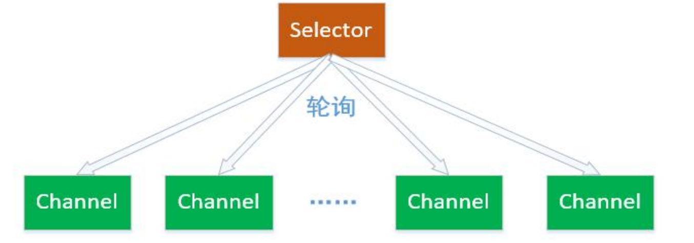
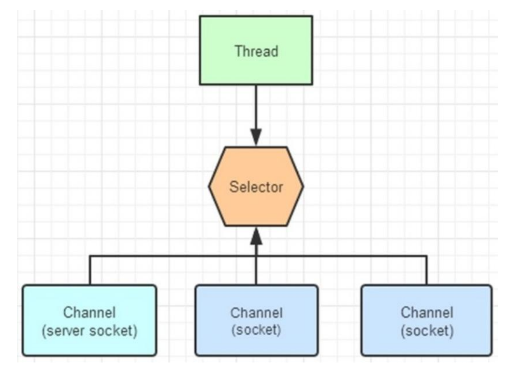

---
# 当前页面内容标题
title: 五、Java NIO（Selector）
# 分类
category:
  - IO
# 标签
tag: 
  - NIO
  - IO
  - java
sticky: false
# 是否收藏在博客主题的文章列表中，当填入数字时，数字越大，排名越靠前。
star: false
# 是否将该文章添加至文章列表中
article: true
# 是否将该文章添加至时间线中
timeline: true
---

# 01、**Java NIO（Selector）** 

## **1.1 Selector 简介** 

### **1**、**Selector**和 **Channel** **关系** 

Selector 一般称 为选择器 ，也可以翻译为 多路复用器 。它是 Java NIO 核心组件中 的一个，用于检查一个或多个 NIO Channel（通道）的状态是否处于可读、可写。如 此可以实现单线程管理多个 channels,也就是可以管理多个网络链接。



使用 Selector 的好处在于： 使用更少的线程来就可以来处理通道了， 相比使用多个 线程，避免了线程上下文切换带来的开销。 

### **2**、可选择通道(SelectableChannel)

（1）不是所有的 Channel 都可以被 Selector 复用的。比方说，FileChannel 就不能 被选择器复用。判断一个 Channel 能被 Selector 复用，有一个前提：判断他是否继承了一个抽象类 SelectableChannel。如果继承了 SelectableChannel，则可以被复 用，否则不能。 

（2）SelectableChannel 类提供了实现通道的可选择性所需要的公共方法。它是所有 支持就绪检查的通道类的父类。所有 socket 通道，都继承了 SelectableChannel 类 都是可选择的，包括从管道(Pipe)对象的中获得的通道。而 FileChannel 类，没有继 承 SelectableChannel，因此是不是可选通道。 

（3）一个通道可以被注册到多个选择器上，但对每个选择器而言只能被注册一次。通 道和选择器之间的关系，使用注册的方式完成。SelectableChannel 可以被注册到 Selector 对象上，在注册的时候，需要指定通道的哪些操作，是 Selector 感兴趣的。



### **3*、*****Channel** **注册到** **Selector** 

（1）使用 Channel.register（Selector sel，int ops）方法，将一个通道注册到一个 选择器时。第一个参数，指定通道要注册的选择器。第二个参数指定选择器需要查询 的通道操作。 

（2）可以供选择器查询的通道操作，从类型来分，包括以下四种：

- 可读 : SelectionKey.OP_READ
- 可写 : SelectionKey.OP_WRITE
- 连接 : SelectionKey.OP_CONNECT
- 接收 : SelectionKey.OP_ACCEPT

如果 Selector 对通道的多操作类型感兴趣，可以用“位或”操作符来实现： 

比如：int key = SelectionKey.OP_READ | SelectionKey.OP_WRITE ; 

（3）选择器查询的不是通道的操作，而是通道的某个操作的一种就绪状态。什么是操 作的就绪状态？一旦通道具备完成某个操作的条件，表示该通道的某个操作已经就绪， 就可以被 Selector 查询到，程序可以对通道进行对应的操作。比方说，某个 SocketChannel 通道可以连接到一个服务器，则处于“连接就绪”(OP_CONNECT)。 

再比方说，一个 ServerSocketChannel 服务器通道准备好接收新进入的连接，则处于 “接收就绪”（OP_ACCEPT）状态。还比方说，一个有数据可读的通道，可以说是 “读就绪”(OP_READ)。一个等待写数据的通道可以说是“写就绪”(OP_WRITE)。

### **4、选择键(SelectionKey)** 

（1）Channel 注册到后，并且一旦通道处于某种就绪的状态，就可以被选择器查询到。 这个工作，使用选择器 Selector 的 select（）方法完成。select 方法的作用，对感兴 趣的通道操作，进行就绪状态的查询。 

（2）Selector 可以不断的查询 Channel 中发生的操作的就绪状态。并且挑选感兴趣 的操作就绪状态。一旦通道有操作的就绪状态达成，并且是 Selector 感兴趣的操作， 就会被 Selector 选中，放入选择键集合中。 

（3）一个选择键，首先是包含了注册在 Selector 的通道操作的类型，比方说 SelectionKey.OP_READ。也包含了特定的通道与特定的选择器之间的注册关系。 

开发应用程序是，选择键是编程的关键。NIO 的编程，就是根据对应的选择键，进行不同的业务逻辑处理。 

（4）选择键的概念，和事件的概念比较相似。一个选择键类似监听器模式里边的一个 事件。由于 Selector 不是事件触发的模式，而是主动去查询的模式，所以不叫事件 Event，而是叫 SelectionKey 选择键。

## **1.2 Selector 的使用方法** 

### **1. Selector 的创建** 

通过调用 Selector.open()方法创建一个 Selector 对象，如下：

```java
// 1、获取 Selector 选择器 
Selector selector = Selector.open();
```

### **2. 注册 Channel 到 Selector** 

要实现 Selector 管理 Channel，需要将 channel 注册到相应的 Selector 上

```java
// 1、获取 Selector 选择器 
Selector selector = Selector.open(); 

// 2、获取通道 
ServerSocketChannel serverSocketChannel = ServerSocketChannel.open(); 

// 3.设置为非阻塞 
serverSocketChannel.configureBlocking(false); 

// 4、绑定连接 
serverSocketChannel.bind(new InetSocketAddress(9999)); 
// 5、将通道注册到选择器上,并制定监听事件为：“接收”事件 serverSocketChannel.register(selector,SelectionKey.OP_ACCEPT);
```

上面通过调用通道的 register()方法会将它注册到一个选择器上。 

首先需要注意的是：

（1）与 Selector 一起使用时，Channel 必须处于非阻塞模式下，否则将抛出异常 IllegalBlockingModeException。这意味着，FileChannel 不能与 Selector 一起使用，因为 FileChannel 不能切换到非阻塞模式，而套接字相关的所有的通道都可以。 

（2）一个通道，并没有一定要支持所有的四种操作。比如服务器通道 ServerSocketChannel 支持 Accept 接受操作，而 SocketChannel 客户端通道则不支持。 可以通过通道上的 validOps()方法，来获取特定通道下所有支持的操作集合。

### **3. 轮询查询就绪操作** 

（1）通过 Selector 的 select（）方法，可以查询出已经就绪的通道操作，这些就绪的 状态集合，包存在一个元素是 SelectionKey 对象的 Set 集合中。 

（2）下面是 Selector 几个重载的查询 select()方法： 

- select():阻塞到至少有一个通道在你注册的事件上就绪了。 
- select(long timeout)：和 select()一样，但最长阻塞事件为 timeout 毫秒。 
- selectNow():非阻塞，只要有通道就绪就立刻返回。 

select()方法返回的 int 值，表示有多少通道已经就绪，更准确的说，是自前一次 select 方法以来到这一次 select 方法之间的时间段上，有多少通道变成就绪状态。 

例如：首次调用 select()方法，如果有一个通道变成就绪状态，返回了 1，若再次调用 select()方法，如果另一个通道就绪了，它会再次返回 1。如果对第一个就绪的channel 没有做任何操作，现在就有两个就绪的通道，但在每次 select()方法调用之间， 只有一个通道就绪了。 

一旦调用 select()方法，并且返回值不为 0 时，在 Selector 中有一个 selectedKeys()方 法，用来访问已选择键集合，迭代集合的每一个选择键元素，根据就绪操作的类型， 完成对应的操作： 

```java
Set selectedKeys = selector.selectedKeys(); 
Iterator keyIterator = selectedKeys.iterator();
while(keyIterator.hasNext()) { 
  SelectionKey key = keyIterator.next(); 
  if(key.isAcceptable()) { 
    // a connection was accepted by a ServerSocketChannel. } else if (key.isConnectable()) { 
    // a connection was established with a remote server. 
  } else if (key.isReadable()) { 
    // a channel is ready for reading 
  } else if (key.isWritable()) { 
    // a channel is ready for writing }keyIterator.remove(); 
  }
```

选择器执行选择的过程，系统底层会依次询问每个通道是否已经就绪，这个过程可能 会造成调用线程进入阻塞状态,那么我们有以下三种方式可以唤醒在 select（）方法中 阻塞的线程。 

wakeup()方法 ：通过调用 Selector 对象的 wakeup（）方法让处在阻塞状态的 select()方法立刻返回该方法使得选择器上的第一个还没有返回的选择操作立即返回。如果当前没有进行中 的选择操作，那么下一次对 select()方法的一次调用将立即返回。 

close()方法 ：通过 close（）方法关闭 Selector， 

该方法使得任何一个在选择操作中阻塞的线程都被唤醒（类似 wakeup（）），同时 使得注册到该 Selector 的所有 Channel 被注销，所有的键将被取消，但是 Channel 本身并不会关闭。 

## **1.3 NIO 编程步骤** 

第一步：创建 Selector 选择器 

第二步：创建 ServerSocketChannel 通道，并绑定监听端口 

第三步：设置 Channel 通道是非阻塞模式 

第四步：把 Channel 注册到 Socketor 选择器上，监听连接事件 

第五步：调用 Selector 的 select 方法（循环调用），监测通道的就绪状况 

第六步：调用 selectKeys 方法获取就绪 channel 集合 

第七步：遍历就绪 channel 集合，判断就绪事件类型，实现具体的业务操作 

第八步：根据业务，决定是否需要再次注册监听事件，重复执行第三步操作

## **1.4 示例代码** 

### **1、服务端代码** 

```java
@Test 
public void ServerDemo() { 
  try { 
    ServerSocketChannel ssc = ServerSocketChannel.open();
    ssc.socket().bind(new InetSocketAddress("127.0.0.1", 8000));
    ssc.configureBlocking(false); 
    
    Selector selector = Selector.open(); 
    // 注册 channel，并且指定感兴趣的事件是 
    Accept ssc.register(selector, SelectionKey.OP_ACCEPT); 
    
    ByteBuffer readBuff = ByteBuffer.allocate(1024); 
    ByteBuffer writeBuff = ByteBuffer.allocate(128);
    writeBuff.put("received".getBytes()); 
    writeBuff.flip(); 
    
    while (true) { 
      int nReady = selector.select(); 
      Set<SelectionKey> keys = selector.selectedKeys(); 
      Iterator<SelectionKey> it = keys.iterator(); 
      
      while (it.hasNext()) { 
        SelectionKey key = it.next(); 
        it.remove(); 
        
        if (key.isAcceptable()) { 
          // 创建新的连接，并且把连接注册到 selector 上，而且， 
          // 声明这个 channel 只对读操作感兴趣。 
          SocketChannel socketChannel = ssc.accept();
          socketChannel.configureBlocking(false); 
          socketChannel.register(selector, SelectionKey.OP_READ); 
        }else if (key.isReadable()) { 
          SocketChannel socketChannel = (SocketChannel) key.channel();
          readBuff.clear(); 
          socketChannel.read(readBuff); 
          
          readBuff.flip(); 
          System.out.println("received : " + new String(readBuff.array()));
          key.interestOps(SelectionKey.OP_WRITE);
        }else if (key.isWritable()) { 
          writeBuff.rewind(); 
          SocketChannel socketChannel = (SocketChannel) key.channel();
          socketChannel.write(writeBuff); 
          key.interestOps(SelectionKey.OP_READ); 
        } 
      } 
    } 
  } catch (IOException e) { 
    e.printStackTrace(); 
  } 
}
```

### **2、客户端代码**

```java
@Test 
public void ClientDemo() { 
  try { 
    SocketChannel socketChannel = SocketChannel.open(); 
    socketChannel.connect(new InetSocketAddress("127.0.0.1", 8000)); 
    
    ByteBuffer writeBuffer = ByteBuffer.allocate(32); 
    ByteBuffer readBuffer = ByteBuffer.allocate(32);
    
    writeBuffer.put("hello".getBytes()); 
    writeBuffer.flip(); 
    
    while (true) { 
      writeBuffer.rewind(); 
      socketChannel.write(writeBuffer); 
      readBuffer.clear(); 
      socketChannel.read(readBuffer); 
    }
} catch (IOException e) { 
  } 
}
```

