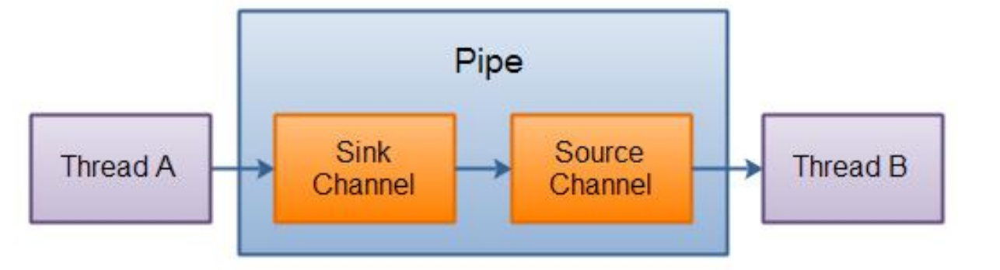

---
# 当前页面内容标题
title: 六、Java NIO（Pipe 和 FileLock）
# 分类
category:
  - IO
# 标签
tag: 
  - NIO
  - IO
  - java
sticky: false
# 是否收藏在博客主题的文章列表中，当填入数字时，数字越大，排名越靠前。
star: false
# 是否将该文章添加至文章列表中
article: true
# 是否将该文章添加至时间线中
timeline: true
---

# **01、Java NIO（Pipe 和 FileLock）**

## **1.1、Pipe**

Java NIO 管道是 2 个线程之间的单向数据连接。Pipe 有一个 source 通道和一个 sink 通道。数据会被写到 sink 通道，从 source 通道读取。



### **1、创建管道**

通过 Pipe.open()方法打开管道。 

```java
Pipe pipe = Pipe.open();
```

### **2、写入管道**

要向管道写数据，需要访问 sink 通道。： 

```java
Pipe.SinkChannel sinkChannel = pipe.sink();
```

通过调用 SinkChannel 的 write()方法，将数据写入 SinkChannel：

```java
String newData = "New String to write to file..." + System.currentTimeMillis();
ByteBuffer buf = ByteBuffer.allocate(48); 
buf.clear(); 
buf.put(newData.getBytes()); 
buf.flip(); 
while(buf.hasRemaining()) { 
  sinkChannel.write(buf); 
}
```

### **3、从管道读取数据** 

从读取管道的数据，需要访问 source 通道，像这样： 

```java
Pipe.SourceChannel sourceChannel = pipe.source(); 
```

调用 source 通道的 read()方法来读取数据： 

```java
ByteBuffer buf = ByteBuffer.allocate(48); 

int bytesRead = sourceChannel.read(buf); 
```

read()方法返回的 int 值会告诉我们多少字节被读进了缓冲区。 

### **4、示例**

```java
@Test 
public void testPipe() throws IOException {
  // 1、获取通道 
  Pipe pipe = Pipe.open(); 
  // 2、获取 sink 管道，用来传送数据 
  Pipe.SinkChannel sinkChannel = pipe.sink(); 
  // 3、申请一定大小的缓冲区 
  ByteBuffer byteBuffer = ByteBuffer.allocate(1024);
  byteBuffer.put("atguigu".getBytes()); 
  byteBuffer.flip(); 
  // 4、sink 发送数据 
  sinkChannel.write(byteBuffer); 
  // 5、创建接收 pipe 数据的 source 管道 
  Pipe.SourceChannel sourceChannel = pipe.source(); 
  // 6、接收数据，并保存到缓冲区中 
  ByteBuffer byteBuffer2 = ByteBuffer.allocate(1024); 
  int length = sourceChannel.read(byteBuffer2); 
  System.out.println(new String(byteBuffer2.array(), 0, length));
  
  sourceChannel.close(); 
  sinkChannel.close(); 
}
```

## **1.2 FileLock** 

### **1、FileLock 简介** 

文件锁在 OS 中很常见，如果多个程序同时访问、修改同一个文件，很容易因为文件 数据不同步而出现问题。给文件加一个锁，同一时间，只能有一个程序修改此文件， 或者程序都只能读此文件，这就解决了同步问题。 

文件锁是进程级别的，不是线程级别的。文件锁可以解决多个进程并发访问、修改同 一个文件的问题，但不能解决多线程并发访问、修改同一文件的问题。使用文件锁时， 同一进程内的多个线程，可以同时访问、修改此文件。文件锁是当前程序所属的 JVM 实例持有的，一旦获取到文件锁（对文件加锁），要调 用 release()，或者关闭对应的 FileChannel 对象，或者当前 JVM 退出，才会释放这个锁。 

一旦某个进程（比如说 JVM 实例）对某个文件加锁，则在释放这个锁之前，此进程不 能再对此文件加锁，就是说 JVM 实例在同一文件上的文件锁是不重叠的（进程级别不能重复在同一文件上获取锁）。

### **2、文件锁分类：** 

==排它锁==：又叫独占锁。对文件加排它锁后，该进程可以对此文件进行读写，该进程独 占此文件，其他进程不能读写此文件，直到该进程释放文件锁。 

==共享锁==：某个进程对文件加共享锁，其他进程也可以访问此文件，但这些进程都只能 读此文件，不能写。线程是安全的。只要还有一个进程持有共享锁，此文件就只能读， 不能写。 

### **3、使用示例：**

```java
//创建 FileChannel 对象，文件锁只能通过 FileChannel 对象来使用 
FileChannel fileChannel=new FileOutputStream("./1.txt").getChannel(); 

//对文件加锁 
FileLock lock=fileChannel.lock(); 

//对此文件进行一些读写操作。 
//....... 

//释放锁 
lock.release();
```

文件锁要通过 FileChannel 对象使用。

### **4、获取文件锁方法** 

**有 4 种获取文件锁的方法：** 

```java
lock() //对整个文件加锁，默认为排它锁。 
  
lock(long position, long size, booean shared) //自定义加锁方式。前 2 个参数 
```

指定要加锁的部分（可以只对此文件的部分内容加锁），第三个参数值指定是否是共享锁。 

```java
tryLock() //对整个文件加锁，默认为排它锁。 

tryLock(long position, long size, booean shared) //自定义加锁方式。 
```

如果指定为共享锁，则其它进程可读此文件，所有进程均不能写此文件，如果某进程 试图对此文件进行写操作，会抛出异常。

### **5、lock 与 tryLock 的区别：** 

lock 是阻塞式的，如果未获取到文件锁，会一直阻塞当前线程，直到获取文件锁 。

tryLock 和 lock 的作用相同，只不过 tryLock 是非阻塞式的，tryLock 是尝试获取文件锁，获取成功就返回锁对象，否则返回 null，不会阻塞当前线程。 

### **6、FileLock 两个方法：** 

```java
boolean isShared()   //此文件锁是否是共享锁 

boolean isValid() //此文件锁是否还有效 
```

在某些 OS 上，对某个文件加锁后，不能对此文件使用通道映射。

### **7、完整例子** 

```java
public class Demo1 { 
  public static void main(String[] args) throws IOException { 
    String input = "atguigu"; 
    System.out.println("输入 :" + input); 
    
    ByteBuffer buf = ByteBuffer.wrap(input.getBytes()); 
    String fp = "D:\\atguigu\\01.txt"; 
    Path pt = Paths.get(fp); 
    FileChannel channel = FileChannel.open(pt,StandardOpenOption.WRITE,StandardOpenOption.APPEND);
    channel.position(channel.size() - 1); // position of a cursor at the end of file 
    // 获得锁方法一：lock()，阻塞方法，当文件锁不可用时，当前进程会被挂起 
    //lock = channel.lock();// 无参 lock()为独占锁 
    // lock = channel.lock(0L, Long.MAX_VALUE, true);//有参 lock()为共享 锁，有写操作会报异常 
    
    // 获得锁方法二：trylock()，非阻塞的方法，当文件锁不可用时，tryLock()会 得到 null
    FileLock lock = channel.tryLock(0,Long.MAX_VALUE,false); 
    System.out.println("共享锁 shared: " + lock.isShared()); 
    channel.write(buf); 
    channel.close(); // Releases the Lock System.out.println("写操作完成."); 
    
    //读取数据 
    readPrint(fp); 
  }
  
  public static void readPrint(String path) throws IOException { 
    FileReader filereader = new FileReader(path); 
    BufferedReader bufferedreader = new BufferedReader(filereader); 
    String tr = bufferedreader.readLine(); 
    System.out.println("读取内容: ");
    
    while (tr != null) { 
      System.out.println(" " + tr); 
      tr = bufferedreader.readLine(); 
    }
    filereader.close(); 
    bufferedreader.close(); 
  } 
}
```

