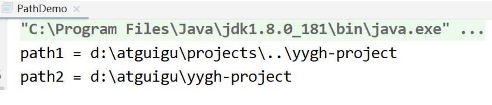

---
# 当前页面内容标题
title: 七、Java NIO（其他）
# 分类
category:
  - IO
# 标签
tag: 
  - NIO
  - IO
  - java
sticky: false
# 是否收藏在博客主题的文章列表中，当填入数字时，数字越大，排名越靠前。
star: false
# 是否将该文章添加至文章列表中
article: true
# 是否将该文章添加至时间线中
timeline: true
---

# 01、Java NIO（其他）

## **1.1 Path** 

### **1、Path 简介** 

Java Path 接口是 Java NIO 更新的一部分，同 Java NIO 一起已经包括在 Java6 和 Java7 中。Java Path 接口是在 Java7 中添加到 Java NIO 的。Path 接口位于 java.nio.file 包中，所以 Path 接口的完全限定名称为 java.nio.file.Path。 

Java Path 实例表示文件系统中的路径。一个路径可以指向一个文件或一个目录。路径 可以是绝对路径，也可以是相对路径。绝对路径包含从文件系统的根目录到它指向的 文件或目录的完整路径。相对路径包含相对于其他路径的文件或目录的路径。 

在许多方面，java.nio.file.Path 接口类似于 java.io.File 类，但是有一些差别。不过， 在许多情况下，可以使用 Path 接口来替换 File 类的使用。 

### **2、创建 Path 实例** 

使用 java.nio.file.Path 实例必须创建一个 Path 实例。可以使用 Paths 类 (java.nio.file.Paths)中的静态方法 Paths.get()来创建路径实例。

示例代码:

```java
import java.nio.file.Path; 
import java.nio.file.Paths; 

public class PathDemo { 
  public static void main(String[] args) { 
    Path path = Paths.get("d:\\atguigu\\001.txt"); 
  } 
}
```

上述代码，可以理解为，Paths.get()方法是 Path 实例的工厂方法。 

### **3、创建绝对路径** 

（1）创建绝对路径，通过调用 Paths.get()方法，给定绝对路径文件作为参数来完成。 

示例代码：

```java
Path path = Paths.get("d:\\atguigu\\001.txt");
```

上述代码中，绝对路径是 d:\atguigu\001.txt。在 Java 字符串中， \是一个转义字符， 需要编写\\，告诉 Java 编译器在字符串中写入一个\字符。 

（2）如果在 Linux、MacOS 等操作字体上，上面的绝对路径可能如下: 

```java
Path path = Paths.get("/home/jakobjenkov/myfile.txt"); 
```

绝对路径现在为/home/jakobjenkov/myfile.txt. 

（3）如果在 Windows 机器上使用了从/开始的路径，那么路径将被解释为相对于当前驱动器。

### **4、创建相对路径** 

Java NIO Path 类也可以用于处理相对路径。您可以使用 Paths.get(basePath, 

relativePath)方法创建一个相对路径。示例代码: 

```java
//代码 1 
Path projects = Paths.get("d:\\atguigu", "projects"); 

//代码 2 
Path file = Paths.get("d:\\atguigu", "projects\\002.txt");
```

代码 1 创建了一个 Java Path 的实例，指向路径(目录):d:\atguigu\projects 

代码 2 创建了一个 Path 的实例，指向路径(文件):d:\atguigu\projects\002.txt 

### **5、Path.normalize()** 

Path 接口的 normalize()方法可以使路径标准化。标准化意味着它将移除所有在路径字符串的中间的.和..代码，并解析路径字符串所引用的路径。 

Path.normalize()示例: 

```java
String originalPath = "d:\\atguigu\\projects\\..\\yygh-project"; 

Path path1 = Paths.get(originalPath); 
System.out.println("path1 = " + path1); 

Path path2 = path1.normalize(); 
System.out.println("path2 = " + path2);
```

输出结果：标准化的路径不包含 projects\..部分



## **1.2** **Files** 

Java NIO Files 类(java.nio.file.Files)提供了几种操作文件系统中的文件的方法。以下 内容介绍 Java NIO Files 最常用的一些方法。java.nio.file.Files 类与 java.nio.file.Path 实例一起工作，因此在学习 Files 类之前，需要先了解 Path 类。 

### **1、Files.createDirectory()** 

Files.createDirectory()方法，用于根据 Path 实例创建一个新目录 

示例： 

```java
Path path = Paths.get("d:\\sgg"); 

try { 
  Path newDir = Files.createDirectory(path); 
} catch(FileAlreadyExistsException e){ 
  // 目录已经存在 
} catch (IOException e) { 
  // 其他发生的异常 e.printStackTrace(); 
}
```

第一行创建表示要创建的目录的 Path 实例。在 try-catch 块中，用路径作为参数调用 Files.createDirectory()方法。如果创建目录成功，将返回一个 Path 实例，该实例指向新创建的路径。 

如果该目录已经存在，则是抛出一个 java.nio.file.FileAlreadyExistsException。如果出现其他错误，可能会抛出 IOException。例如，如果想要的新目录的父目录不存在， 则可能会抛出 IOException。

### **2、Files.copy()** 

**（1）Files.copy()方法从一个路径拷贝一个文件到另外一个目录**示例： 

```java
Path sourcePath = Paths.get("d:\\atguigu\\01.txt"); 
Path destinationPath = Paths.get("d:\\atguigu\\002.txt"); 

try { 
  Files.copy(sourcePath, destinationPath); 
} catch(FileAlreadyExistsException e) { 
  // 目录已经存在 
} catch (IOException e) { 
  // 其他发生的异常 e.printStackTrace(); 
}
```

首先，该示例创建两个 Path 实例。然后，这个例子调用 Files.copy()，将两个 Path 实例作为参数传递。这可以让源路径引用的文件被复制到目标路径引用的文件中。 

如果目标文件已经存在，则抛出一个 java.nio.file.FileAlreadyExistsException 异常。 

如果有其他错误，则会抛出一个 IOException。例如，如果将该文件复制到不存在的目录，则会抛出 IOException。 

**（2）覆盖已存在的文件** 

Files.copy()方法的第三个参数。如果目标文件已经存在，这个参数指示 copy()方法覆盖现有的文件。

```java
Files.copy(sourcePath, destinationPath, StandardCopyOption.REPLACE_EXISTING);
```

### **3、Files.move()** 

Files.move()用于将文件从一个路径移动到另一个路径。移动文件与重命名相同，但是移动文件既可以移动到不同的目录，也可以在相同的操作中更改它的名称。 

示例： 

```java
Path sourcePath = Paths.get("d:\\atguigu\\01.txt"); 
Path destinationPath = Paths.get("d:\\atguigu\\001.txt");

try { 
  Files.move(sourcePath, destinationPath, StandardCopyOption.REPLACE_EXISTING); 
} catch (IOException e) { 
  //移动文件失败 e.printStackTrace(); 
}
```

Files.move()的第三个参数。这个参数告诉 Files.move()方法来覆盖目标路径上的任何现有文件。

### **4、Files.delete()** 

Files.delete()方法可以删除一个文件或者目录。 

示例： 

```java
Path path = Paths.get("d:\\atguigu\\001.txt"); 

try { Files.delete(path); 
    } catch (IOException e) { 
  // 删除文件失败 e.printStackTrace(); 
}
```

创建指向要删除的文件的 Path。然后调用 Files.delete()方法。如果 Files.delete()不能删除文件(例如，文件或目录不存在)，会抛出一个 IOException。 

### **5、Files.walkFileTree()** 

（1）Files.walkFileTree()方法包含递归遍历目录树功能，将 Path 实例和 FileVisitor 作为参数。Path 实例指向要遍历的目录，FileVisitor 在遍历期间被调用。

（2）FileVisitor 是一个接口，必须自己实现 FileVisitor 接口，并将实现的实例传递给 walkFileTree()方法。在目录遍历过程中，您的 FileVisitor 实现的每个方法都将被调用。 

如果不需要实现所有这些方法，那么可以扩展 SimpleFileVisitor 类，它包含FileVisitor 接口中所有方法的默认实现。 

（3）FileVisitor 接口的方法中，每个都返回一个 FileVisitResult 枚举实例。 

FileVisitResult 枚举包含以下四个选项: 

- CONTINUE 继续 
- TERMINATE 终止 
- SKIP_SIBLING 跳过同级 
- SKIP_SUBTREE 跳过子级 

**（4）查找一个名为 001.txt 的文件示例：**

```java
Path rootPath = Paths.get("d:\\atguigu"); 
String fileToFind = File.separator + "001.txt"; 

try { 
  Files.walkFileTree(rootPath, new SimpleFileVisitor<Path>() { 
    
    @Override 
    public FileVisitResult visitFile(Path file, BasicFileAttributes attrs) throws IOException { 
      String fileString = file.toAbsolutePath().toString();
      //System.out.println("pathString = " + fileString);
      
      if(fileString.endsWith(fileToFind)){ 
        System.out.println("file found at path: " + file.toAbsolutePath()); 
        return FileVisitResult.TERMINATE; 
      }
      return FileVisitResult.CONTINUE; 
    } 
  }); 
} catch(IOException e){ 
  e.printStackTrace(); 
}
```

（5）java.nio.file.Files 类包含许多其他的函数，有关这些方法的更多信息，请查看 java.nio.file.Files 类的 JavaDoc。 

## **1.3 AsynchronousFileChannel** 

在 Java 7 中，Java NIO 中添加了 AsynchronousFileChannel，也就是是异步地将数据写入文件。 

### **1、创建 AsynchronousFileChannel** 

通过静态方法 open()创建 

示例： 

```java
Path path = Paths.get("d:\\atguigu\\01.txt"); 

try { 
  AsynchronousFileChannel fileChannel = AsynchronousFileChannel.open(path, StandardOpenOption.READ); 
} catch (IOException e) { 
  e.printStackTrace(); 
}
```

open()方法的第一个参数指向与 AsynchronousFileChannel 相关联文件的 Path 实例。 

第二个参数是一个或多个打开选项，它告诉 AsynchronousFileChannel 在文件上执 行什么操作。在本例中，我们使用了 StandardOpenOption.READ 选项，表示该文件将被打开阅读。

### **2、通过 Future 读取数据**

可以通过两种方式从 AsynchronousFileChannel 读取数据。第一种方式是调用返回 Future 的 read()方法 

示例： 

```java
Path path = Paths.get("d:\\atguigu\\001.txt"); 
AsynchronousFileChannel fileChannel = null; 

try { 
  fileChannel = AsynchronousFileChannel.open(path, StandardOpenOption.READ); 
} catch (IOException e) { 
  e.printStackTrace(); 
}
ByteBuffer buffer = ByteBuffer.allocate(1024); 
long position = 0; 
Future<Integer> operation = fileChannel.read(buffer, position);
while(!operation.isDone()); 

buffer.flip(); 
byte[] data = new byte[buffer.limit()]; 
buffer.get(data); 
System.out.println(new String(data)); 
buffer.clear();
```

上述代码： 

（1）创建了一个 AsynchronousFileChannel， 

（2）创建一个 ByteBuffer，它被传递给 read()方法作为参数，以及一个 0 的位置。 

（3）在调用 read()之后，循环，直到返回的 isDone()方法返回 true。 

（4）读取操作完成后，数据读取到 ByteBuffer 中，然后打印到 System.out 中。

### **3、通过 CompletionHandler 读取数据**

第二种方法是调用 read()方法，该方法将一个 CompletionHandler 作为参数 

示例： 

```java
Path path = Paths.get("d:\\atguigu\\001.txt"); 
AsynchronousFileChannel fileChannel = null; 

try { 
  fileChannel = AsynchronousFileChannel.open(path, StandardOpenOption.READ); 
} catch (IOException e) { 
  e.printStackTrace(); 
}

ByteBuffer buffer = ByteBuffer.allocate(1024); 
long position = 0; 
fileChannel.read(buffer, position, buffer, new CompletionHandler<Integer, ByteBuffer>() { 
  
  @Override 
  public void completed(Integer result, ByteBuffer attachment) {
    System.out.println("result = " + result); attachment.flip(); 
    byte[] data = new byte[attachment.limit()]; 
    attachment.get(data); 
    System.out.println(new String(data)); 
    attachment.clear(); 
  }
  
  @Override 
  public void failed(Throwable exc, ByteBuffer attachment) { 
  }
});
```

（1）读取操作完成，将调用 CompletionHandler 的 completed()方法。 

（2）对于 completed()方法的参数传递一个整数，它告诉我们读取了多少字节，以及传递给 read()方法的“附件”。“附件”是 read()方法的第三个参数。在本代码中， 它是 ByteBuffer，数据也被读取。 

（3）如果读取操作失败，则将调用 CompletionHandler 的 failed()方法。 

### **4、通过 Future 写数据** 

和读取一样，可以通过两种方式将数据写入一个 AsynchronousFileChannel 

示例： 

```java
Path path = Paths.get("d:\\atguigu\\001.txt"); 
AsynchronousFileChannel fileChannel = null; 

try { 
  fileChannel = AsynchronousFileChannel.open(path, StandardOpenOption.WRITE); 
} catch (IOException e) { 
  e.printStackTrace(); 
}

ByteBuffer buffer = ByteBuffer.allocate(1024); 
long position = 0; 
buffer.put("atguigu data".getBytes()); 

buffer.flip(); 
Future<Integer> operation = fileChannel.write(buffer, position); 
buffer.clear(); 

while(!operation.isDone()); 
System.out.println("Write over");
```

首先，AsynchronousFileChannel 以写模式打开。然后创建一个 ByteBuffer，并将 一些数据写入其中。然后，ByteBuffer 中的数据被写入到文件中。最后，示例检查返回的 Future，以查看写操作完成时的情况。 

注意，文件必须已经存在。如果该文件不存在，那么 write()方法将抛出一个 java.nio.file.NoSuchFileException。 

### **5、通过 CompletionHandler 写数据** 

示例： 

```java
Path path = Paths.get("d:\\atguigu\\001.txt"); 
if(!Files.exists(path)){ 
  try { Files.createFile(path); 
      } catch (IOException e) { 
    e.printStackTrace(); 
  } 
}

AsynchronousFileChannel fileChannel = null; 
try { 
  fileChannel = AsynchronousFileChannel.open(path, StandardOpenOption.WRITE); 
} catch (IOException e) { 
  e.printStackTrace(); 
}

ByteBuffer buffer = ByteBuffer.allocate(1024); 
long position = 0; 
buffer.put("atguigu data".getBytes()); 
buffer.flip(); 
fileChannel.write(buffer, position, buffer, new CompletionHandler<Integer, ByteBuffer>() {
  
@Override 
  public void completed(Integer result, ByteBuffer attachment) {
    System.out.println("bytes written: " + result); 
  }
  @Override 
  public void failed(Throwable exc, ByteBuffer attachment) {
    System.out.println("Write failed"); 
    exc.printStackTrace(); 
  } 
});
```

当写操作完成时，将会调用 CompletionHandler 的 completed()方法。如果写失败， 则会调用 failed()方法。 

## **1.4** **字符集（**Charset）

java 中使用 Charset 来表示字符集编码对象 

**Charset 常用静态方法**

```java
public static Charset forName(String charsetName)//通过编码类型获得 Charset 对 象

public static SortedMap<String,Charset> availableCharsets()//获得系统支持的所有 编码方式 

public static Charset defaultCharset()//获得虚拟机默认的编码方式 

public static boolean isSupported(String charsetName)//判断是否支持该编码类型
```

**Charset** **常用普通方法**

```java
public final String name()//获得 Charset 对象的编码类型(String) 
  
public abstract CharsetEncoder newEncoder()//获得编码器对象
  
public abstract CharsetDecoder newDecoder()//获得解码器对象
```

**代码示例：** 

```java
@Test 
public void charSetEncoderAndDecoder() throws CharacterCodingException { 
  Charset charset=Charset.forName("UTF-8"); 
  //1.获取编码器 
  CharsetEncoder charsetEncoder=charset.newEncoder(); 
  //2.获取解码器 
  CharsetDecoder charsetDecoder=charset.newDecoder(); 
  
  //3.获取需要解码编码的数据 
  CharBuffer charBuffer=CharBuffer.allocate(1024); 
  charBuffer.put("字符集编码解码"); 
  charBuffer.flip(); 
  //4.编码 
  ByteBuffer byteBuffer=charsetEncoder.encode(charBuffer); 
  System.out.println("编码后："); 
  for (int i=0;i<byteBuffer.limit();i++) { 
    System.out.println(byteBuffer.get()); 
  }
  
  //5.解码 
  byteBuffer.flip(); 
  CharBuffer charBuffer1=charsetDecoder.decode(byteBuffer); 
  System.out.println("解码后："); 
  System.out.println(charBuffer1.toString()); 
  System.out.println("指定其他格式解码:"); 
  Charset charset1=Charset.forName("GBK"); 
  byteBuffer.flip(); 
  CharBuffer charBuffer2 =charset1.decode(byteBuffer);
  System.out.println(charBuffer2.toString()); 
  
  //6.获取 Charset 所支持的字符编码 
  Map<String ,Charset> map= Charset.availableCharsets();
  Set<Map.Entry<String,Charset>> set=map.entrySet(); 
  for (Map.Entry<String,Charset> entry: set) {
    System.out.println(entry.getKey()+"="+entry.getValue().toString()); 
  } 
}
```


# 总结：

JavaNIO操作步骤：


