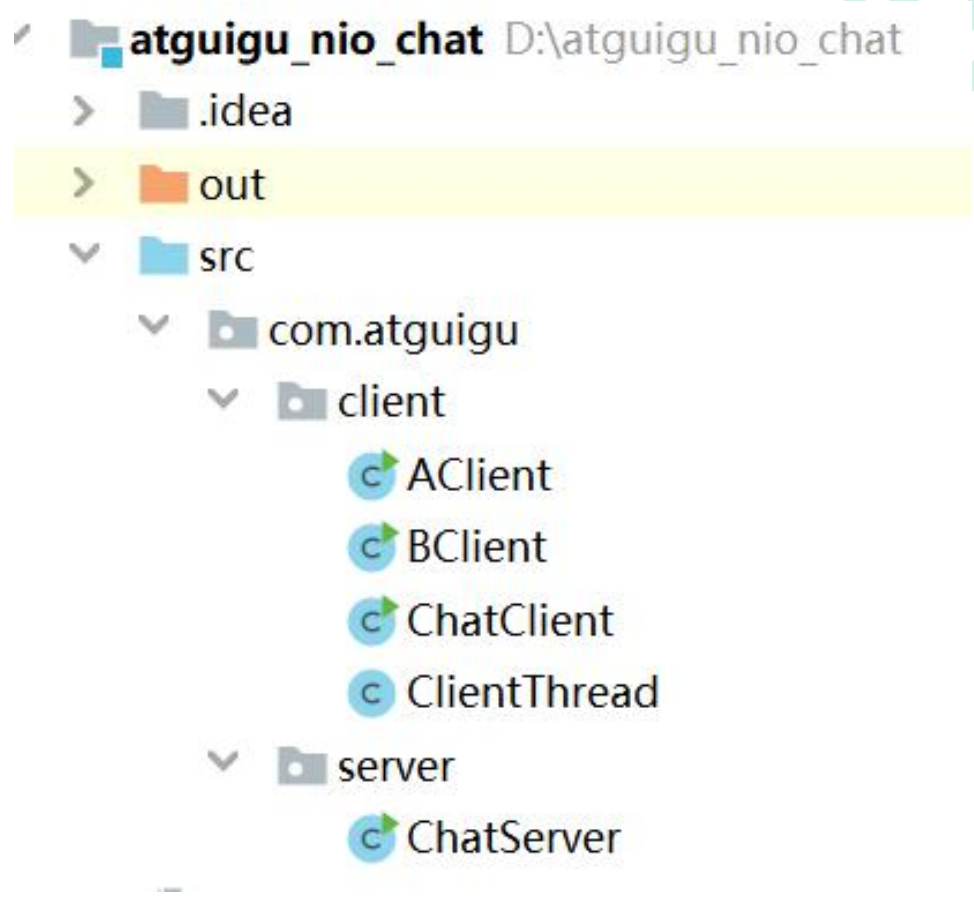

---
# 当前页面内容标题
title: 八、Java NIO 综合案例
# 分类
category:
  - IO
# 标签
tag: 
  - NIO
  - IO
  - java
sticky: false
# 是否收藏在博客主题的文章列表中，当填入数字时，数字越大，排名越靠前。
star: false
# 是否将该文章添加至文章列表中
article: true
# 是否将该文章添加至时间线中
timeline: true
---

# 01、Java NIO综合案例

**使用 Java NIO 完成一个多人聊天室功能**



## **1.1** **服务端代码**

```java
//服务器端 
public class ChatServer { 
  //服务器端启动的方法 
  public void startServer() throws IOException {
    
    //1 创建 Selector 选择器 
    Selector selector = Selector.open(); 
    
    //2 创建 ServerSocketChannel 通道 
    ServerSocketChannel serverSocketChannel = ServerSocketChannel.open(); 
    //3 为 channel 通道绑定监听端口 
    serverSocketChannel.bind(new InetSocketAddress(8000)); 
    //设置非阻塞模式 
    serverSocketChannel.configureBlocking(false); 
    
    //4 把 channel 通道注册到 selector 选择器上 
    serverSocketChannel.register(selector, SelectionKey.OP_ACCEPT);
    System.out.println("服务器已经启动成功了"); 
    
    //5 循环，等待有新链接接入 
    //while(true) 
    for(;;) { 
      //获取 channel 数量 
      int readChannels = selector.select(); 
      
      if(readChannels == 0) { 
        continue; 
      }
      //获取可用的 
      channel Set<SelectionKey> selectionKeys = selector.selectedKeys(); 
      //遍历集合 
      Iterator<SelectionKey> iterator = selectionKeys.iterator(); 
      while (iterator.hasNext()) { 
        SelectionKey selectionKey = iterator.next(); 
        //移除 set 集合当前 
        selectionKey iterator.remove();
        
        //6 根据就绪状态，调用对应方法实现具体业务操作 
        //6.1 如果 accept 状态 
        if(selectionKey.isAcceptable()) {
          acceptOperator(serverSocketChannel,selector); 
        }
        //6.2 如果可读状态 
        if(selectionKey.isReadable()) { 
          readOperator(selector,selectionKey); 
        } 
      } 
    } 
  }
  
  //处理可读状态操作 
  private void readOperator(Selector selector, SelectionKey selectionKey) throws IOException { 
    //1 从 SelectionKey 获取到已经就绪的通道 
    SocketChannel socketChannel = (SocketChannel)selectionKey.channel();
    
    //2 创建 buffer 
    ByteBuffer byteBuffer = ByteBuffer.allocate(1024); 
    
    //3 循环读取客户端消息 
    int readLength = socketChannel.read(byteBuffer); 
    String message = ""; 
    
    if(readLength >0) { 
      //切换读模式 
      byteBuffer.flip(); 
      //读取内容 
      message += Charset.forName("UTF-8").decode(byteBuffer); 
    }
    
    //4 将 channel 再次注册到选择器上，监听可读状态
    socketChannel.register(selector,SelectionKey.OP_READ);
    
    //5 把客户端发送消息，广播到其他客户端 
    if(message.length()>0) { 
      //广播给其他客户端 
      System.out.println(message);
      castOtherClient(message,selector,socketChannel); 
    } 
  }
  
  //广播到其他客户端 
  private void castOtherClient(String message, Selector selector, SocketChannel socketChannel) throws IOException { 
    //1 获取所有已经接入 
    channel Set<SelectionKey> selectionKeySet = selector.keys(); 
    
    //2 循环想所有 channel 广播消息 
    for(SelectionKey selectionKey : selectionKeySet) { 
      //获取每个 channel 
      Channel tarChannel = selectionKey.channel(); 
      //不需要给自己发送 
      if(tarChannel instanceof SocketChannel && tarChannel != socketChannel) {
        ((SocketChannel)tarChannel).write(Charset.forName("UTF8").encode(message)); 
      } 
    } 
  }
  
  //处理接入状态操作 
  private void acceptOperator(ServerSocketChannel serverSocketChannel, Selector selector) throws IOException { 
    //1 接入状态，创建 socketChannel 
    SocketChannel socketChannel = serverSocketChannel.accept(); 
    //2 把 socketChannel 设置非阻塞模式 
    socketChannel.configureBlocking(false);
    
    //3 把 channel 注册到 selector 选择器上，监听可读状态 
    socketChannel.register(selector,SelectionKey.OP_READ); 
    //4 客户端回复信息 
    socketChannel.write(Charset.forName("UTF-8") .encode("欢迎进入聊天室，请注意隐私安全")); 
  }
  
  //启动主方法 
  public static void main(String[] args) { 
    try { 
      new ChatServer().startServer(); 
    } catch (IOException e) { 
      e.printStackTrace(); 
    } 
  } 
}
```

## **1.2** **客户端代码** 

**ChatClient 类** 

```java
//客户端 
public class ChatClient { 
  //启动客户端方法 
  public void startClient(String name) throws IOException { 
    //连接服务端 
    SocketChannel socketChannel = SocketChannel.open(new InetSocketAddress("127.0.0.1",8000)); 
    //接收服务端响应数据 
    Selector selector = Selector.open(); 
    socketChannel.configureBlocking(false); 
    socketChannel.register(selector, SelectionKey.OP_READ);
    
    //创建线程 
    new Thread(new ClientThread(selector)).start(); 
    //向服务器端发送消息 
    Scanner scanner = new Scanner(System.in);
    while(scanner.hasNextLine()) { 
      String msg = scanner.nextLine(); 
      if(msg.length()>0) { 
        socketChannel.write(Charset.forName("UTF-8").encode(name +" : " +msg)); 
      } 
    } 
  } 
}
```

**ClientThread** **类**

```java
public class ClientThread implements Runnable { 
  
  private Selector selector; 
  public ClientThread(Selector selector) { 
    this.selector = selector; 
  }
  
  @Override 
  public void run() { 
    try { 
      for(;;) { 
        //获取 channel 数量 
        int readChannels = selector.select(); 
        if(readChannels == 0) { 
          continue; 
        }
        //获取可用的 channel 
        Set<SelectionKey> selectionKeys = selector.selectedKeys(); 
        //遍历集合
        Iterator<SelectionKey> iterator = selectionKeys.iterator(); 
        while (iterator.hasNext()) { 
          SelectionKey selectionKey = iterator.next(); 
          //移除 set 集合当前 selectionKey 
          iterator.remove(); 
          
          //如果可读状态 
          if(selectionKey.isReadable()) { 
            readOperator(selector,selectionKey); 
          } 
        } 
      } 
    }catch(Exception e) { 
    } 
  }
  
  //处理可读状态操作 
  private void readOperator(Selector selector, SelectionKey selectionKey) throws IOException { 
    //1 从 SelectionKey 获取到已经就绪的通道 
    SocketChannel socketChannel = (SocketChannel)selectionKey.channel();
    //2 创建 buffer 
    ByteBuffer byteBuffer = ByteBuffer.allocate(1024); 
    //3 循环读取客户端消息 
    int readLength = socketChannel.read(byteBuffer); 
    String message = ""; 
    if(readLength >0) { 
      //切换读模式 
      byteBuffer.flip(); 
      //读取内容 
      message += Charset.forName("UTF-8").decode(byteBuffer); 
    }
      //4 将 channel 再次注册到选择器上，监听可读状态
    socketChannel.register(selector,SelectionKey.OP_READ); 
    
    //5 把客户端发送消息，广播到其他客户端 
    if(message.length()>0) {
      //广播给其他客户端 
      System.out.println(message); 
    }
  }
}
```

