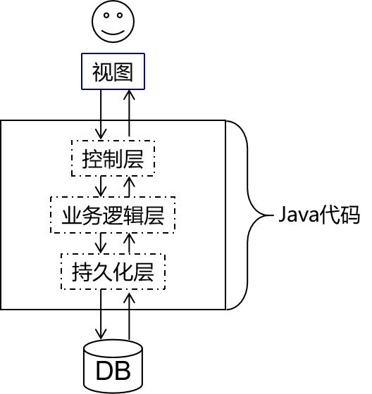

---
# 当前页面内容标题
title: 03、单一架构回顾
# 当前页面图标
icon: java
# 分类
category:
  - web
  - javaweb
  - java
# 标签
tag:
  - java
  - web
sticky: true
# 是否收藏在博客主题的文章列表中，当填入数字时，数字越大，排名越靠前。
star: false
# 是否将该文章添加至文章列表中
article: true
# 是否将该文章添加至时间线中
timeline: true
---

# 03、单一架构回顾

我们从现在的JavaWeb阶段到后面学习SSM框架阶段都是在学习单一架构项目开发的技术。而在JavaWeb阶段由于重点是探讨如何实现Web开发，所以必须学习一部分前端开发的技术。本节就是让大家明确我们现在要学习的内容在整个架构体系中处于什么位置。

## 1、单一架构技术体系

## 2、视图层

严格来说视图分成两层：

- 前端技术：HTML/CSS/JavaScript
- 服务器端页面模板技术：Thymeleaf

其中HTML、CSS、JavaScript都是工作在浏览器上的，所以它们都属于前端技术。而Thymeleaf是在服务器上把动态内容计算出具体数据，所以严格来说Thymeleaf是后端技术。

> 这里大家会有个疑问：为什么在『视图』这个地方已经有HTML、CSS、JavaScript这些前端技术了，能够生成用户可以操作的界面，那为什么还需要Thymeleaf这样一个后端技术呢？
>
> 简单来说原因是Thymeleaf=HTML+动态数据，而HTML不支持动态数据，这部分需要借助Thymeleaf来完成。
>
> 更进一步的细节咱们讲到那再说啦！

## 3、Web2.0

Web2.0是相对于更早的网页开发规范而提出的新规范。Web2.0规范之前的网页开发并没有明确的将HTML、CSS、JavaScript代码分开，而是互相之间纠缠在一起，导致代码维护困难，开发效率很低。

> 在开发中我们把这样彼此纠缠、互相影响的现象称为『耦合』。而把耦合在一起的东西拆解开，让他们彼此独立出来称为『解耦』。各个组成部分独立完成自己负责的功能，和其他模块无关称为『内聚』。
>
> 将来大家经常会听到一句话：软件开发提倡『 高内聚，低耦合』。
>
> 一个软件项目只有做到了高内聚、低耦合才能算得上结构严谨，模块化程度高，有利于开发和维护。

所以Web2.0规范主张将网页代码分成下面三个部分：

- 结构：由HTML实现，负责管理网页的内容。将来网页上不管是静态还是动态的数据都是填写到HTML的标签里。
- 表现：由CSS实现，负责管理网页内容的表现形式。比如：颜色、尺寸、位置、层级等等。也就是给数据穿上一身漂亮的衣服。
- 行为：由JavaScript实现，负责实现网页的动态交互效果。比如：轮播图、表单验证、鼠标滑过显示下拉菜单、鼠标滑过改变背景颜色等等。
