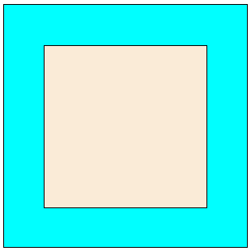
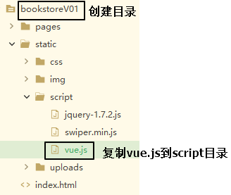
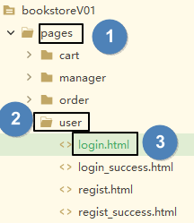
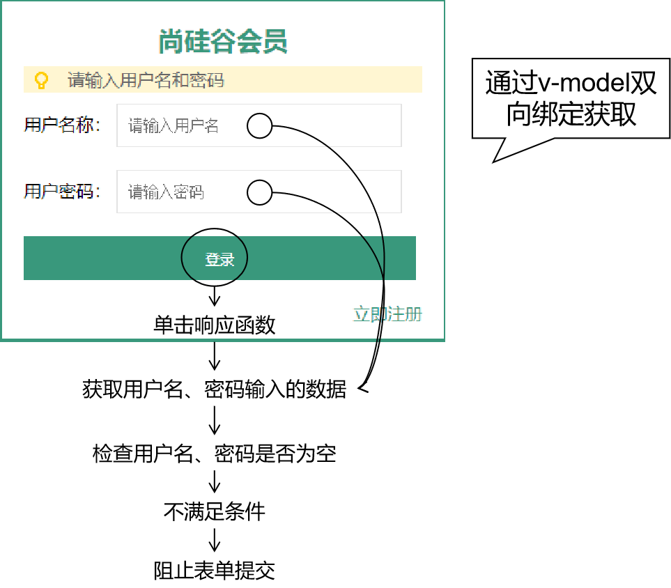

---
# 当前页面内容标题
title: 07、书城项目第一阶段
# 当前页面图标
icon: folder
# 分类
category:
  - web
  - javaweb
  - javascript
  - vue
# 标签
tag:
  - web
  - HTML
  - javascript
  - java
  - CSS
  - vue
sticky: false
# 是否收藏在博客主题的文章列表中，当填入数字时，数字越大，排名越靠前。
star: false
# 是否将该文章添加至文章列表中
article: true
# 是否将该文章添加至时间线中
timeline: true
---

# 07、书城项目第一阶段

## 一、事件驱动补充

### 1、取消控件的默认行为

#### 控件默认行为

- 点超链接会跳转页面
- 点表单提交按钮会提交表单

本来控件的默认行为是天经地义就该如此的，但是如果我们希望点击之后根据我们判断的结果再看是否要跳转，此时默认行为无脑跳转的做法就不符合我们的预期了。

#### 取消方式

调用**事件对象**的**preventDefault()**方法。

##### 超链接举例

HTML代码：

```html
<a id="anchor" href="http://www.baidu.com">超链接</a>
```

JavaScript代码：

```javascript
document.getElementById("anchor").onclick = function() {
    console.log("我点击了一个超链接");
    event.preventDefault();
}
```

##### 表单提交按钮举例

HTML代码：

```html
<form action="http://www.baidu.com" method="post">
    <button id="submitBtn" type="submit">提交表单</button>
</form>
```

JavaScript代码：

```javascript
document.getElementById("submitBtn").onclick = function() {
    console.log("我点击了一个表单提交按钮");
    event.preventDefault();
}
```

### 2、阻止事件冒泡



图中的两个div，他们的HTML标签是：

```html
<div id="outterDiv">
    <div id="innerDiv"></div>
</div>
```

点击里面的div同时也等于点击了外层的div，此时如果两个div上都绑定了单击响应函数那么就都会被触发：

```javascript
document.getElementById("outterDiv").onclick = function() {
    console.log("外层div的事件触发了");
}

document.getElementById("innerDiv").onclick = function() {
    console.log("内层div的事件触发了");
}
```

所以事件冒泡就是一个事件会不断向父元素传递，直到window对象。

如果这不是我们想要的效果那么可以使用**事件对象**的**stopPropagation()**函数阻止。

```javascript
document.getElementById("innerDiv").onclick = function() {
    console.log("内层div的事件触发了");

    event.stopPropagation();
}
```

### 3、Vue事件修饰符

对于事件修饰符，Vue官网的描述是：

> 在事件处理程序中调用 `event.preventDefault()` 或 `event.stopPropagation()` 是非常常见的需求。尽管我们可以在方法中轻松实现这点，但更好的方式是：**方法只有纯粹的数据逻辑，而不是去处理 DOM 事件细节**。

#### 取消控件的默认行为

控件的默认行为指的是：

- 点击超链接跳转页面
- 点击表单提交按钮提交表单

实现这个需求使用的Vue事件修饰符是：**.prevent**

```html
<a href="http://www.baidu.com" @click.prevent="clickAnchor">超链接</a>

<form action="http://www.baidu.com" method="post">
    <button type="submit" @click.prevent="clickSubmitBtn">提交表单</button>
</form>
```

#### 取消事件冒泡

实现这个需求使用的Vue事件修饰符是：**.stop**

```html
<div id="outterDiv" @click="clickOutterDiv">
    <div id="innerDiv" @click.stop="clickInnerDiv"></div>
</div>
```

## 二、正则表达式

### 1、从凤姐的择偶标准说起


本人对伴侣要求如下：

- 第一、必须为北京大学或清华大学硕士毕业生。必须本科硕士连读，中途无跳级，不留级，不转校。在外参加工作后再回校读书者免。
- 第二、必须为经济学专业毕业。非经济学专业毕业则必须精通经济学。或对经济学有浓厚的兴趣。
- 第三、必须具备国际视野，但是无长期定居国外甚至移民的打算。
- 第四、身高176--183左右。长得越帅越好。
- 第五、无生育史。过往所有女友均无因自身而致的堕胎史。
- 第六、东部户籍，即江、浙、沪三地户籍或黑龙江、广东、天津、山东、北京、吉林、辽宁等。
- 东北三省和内蒙古等地户籍，西南地区即重庆、贵州、云南、西藏和湖南、湖北等地籍贯者不予考虑。
- 第七、年龄25--28岁左右。即06届，07届，08届，09届毕业生。有一至两年的工作经验，06级毕业生需年龄在28岁左右，09级毕业生则需聪明过人。且具备丰富的社会实践经验。就职于国家机关，国有企事业单位者不愿考虑。但就职于中石油，中石化等世界顶尖型企业或银行者又比较喜欢。现自主创业者要商榷一番了。

### 2、标准在手，世界我有

#### 模式验证

使用标准衡量一位具体的男士，返回一个布尔值，从而知道这位男士是否满足自己的标准——相当于我们使用正则表达式验证一个字符串是否满足规则。比如验证一个字符串是否是一个身份证号。

#### 匹配读取

对全中国的男士应用这个标准，返回一个数组，遍历这个数组，可以得到所有符合标准的男士——相当于我们使用正则表达式获取一段文本中匹配的子字符串。比如将一篇文章中的电子邮件地址读取出来。

#### 匹配替换

对全中国的男士应用这个标准，把其中已婚的变成未婚，这样凤姐就有机会了——相当于我们使用正则表达式替换所有匹配的部分。比如将一段文字中的”HelloWorld”替换为”HelloJava”。

> 花絮：
>
> 记者：封老师您好！由于您的名字『封捷』和『凤姐』谐音，同学们总是以此来调侃您，说您是尚硅谷『凤姐』，对此您有什么想说的吗？
>
> 封老师：太过分了！我咋能和人家比！
>
> 记者：呃……太意外了，您的意思是？
>
> 封老师：虽然过气了，但人家好歹也是网红呀！

### 3、正则表达式的概念

使用一段**字符串**定义的一个**规则**，用以**检测**某个字符串是否满足这个规则，或将目标字符串中满足规则的部分**读取**出来，又或者将目标字符串中满足标准的部分**替换**为其他字符串。所以正则表达式有三个主要用途：

- 模式验证
- 匹配读取
- 匹配替换


### 4、正则表达式零起步

#### 创建正则表达式对象

##### 使用两个斜杠

```javascript
// 类似创建数组时可以使用[]、创建对象可以使用{}
var reg = /a/;
```

##### 使用new关键字创建RegExp类型的对象

```javascript
// 类似创建数组可以new Array()、创建对象可以使用new Object()
var reg = new RegExp("a");
```

#### 正则表达式的组成

正则表达式本身也是一个字符串，它由两种字符组成：

- 普通字符，例如大、小写英文字母；数字等。
- 元字符：被系统赋予特殊含义的字符。例如：^表示以某个字符串开始，$表示以某个字符串结束。

#### 正则表达式初体验

##### 模式验证

**注意**：这里是使用**正则表达式对象**来**调用**方法。

```javascript
// 创建一个最简单的正则表达式对象
var reg = /o/;

// 创建一个字符串对象作为目标字符串
var str = 'Hello World!';

// 调用正则表达式对象的test()方法验证目标字符串是否满足我们指定的这个模式，返回结果true
console.log("/o/.test('Hello World!')="+reg.test(str));
```

##### 匹配读取

**注意**：这里是使用**字符串对象**来**调用**方法。

```javascript
// 在目标字符串中查找匹配的字符，返回匹配结果组成的数组
var resultArr = str.match(reg);
// 数组长度为1
console.log("resultArr.length="+resultArr.length);

// 数组内容是o
console.log("resultArr[0]="+resultArr[0]);
```

##### 替换

**注意**：这里是使用**字符串对象**来**调用**方法。

```javascript
var newStr = str.replace(reg,'@');
// 只有第一个o被替换了，说明我们这个正则表达式只能匹配第一个满足的字符串
console.log("str.replace(reg)="+newStr);//Hell@ World!

// 原字符串并没有变化，只是返回了一个新字符串
console.log("str="+str);//str=Hello World!
```

#### 匹配方式

##### 全文查找

如果不使用g对正则表达式对象进行修饰，则使用正则表达式进行查找时，仅返回第一个匹配；使用g后，返回所有匹配。

```javascript
// 目标字符串
var targetStr = 'Hello World!';

// 没有使用全局匹配的正则表达式
var reg = /[A-Z]/;
// 获取全部匹配
var resultArr = targetStr.match(reg);
// 数组长度为1
console.log("resultArr.length="+resultArr.length);

// 遍历数组，发现只能得到'H'
for(var i = 0; i < resultArr.length; i++){
    console.log("resultArr["+i+"]="+resultArr[i]);
}
```

对比代码：

```javascript
// 目标字符串
var targetStr = 'Hello World!';

// 使用了全局匹配的正则表达式
var reg = /[A-Z]/g;
// 获取全部匹配
var resultArr = targetStr.match(reg);
// 数组长度为2
console.log("resultArr.length="+resultArr.length);

// 遍历数组，发现可以获取到“H”和“W”
for(var i = 0; i < resultArr.length; i++){
    console.log("resultArr["+i+"]="+resultArr[i]);
}
```

##### 忽略大小写

```javascript
//目标字符串
var targetStr = 'Hello WORLD!';

//没有使用忽略大小写的正则表达式
var reg = /o/g;
//获取全部匹配
var resultArr = targetStr.match(reg);
//数组长度为1
console.log("resultArr.length="+resultArr.length);
//遍历数组，仅得到'o'
for(var i = 0; i < resultArr.length; i++){
    console.log("resultArr["+i+"]="+resultArr[i]);
}
```

对比代码：

```javascript
//目标字符串
var targetStr = 'Hello WORLD!';

//使用了忽略大小写的正则表达式
var reg = /o/gi;
//获取全部匹配
var resultArr = targetStr.match(reg);
//数组长度为2
console.log("resultArr.length="+resultArr.length);
//遍历数组，得到'o'和'O'
for(var i = 0; i < resultArr.length; i++){
    console.log("resultArr["+i+"]="+resultArr[i]);
}
```

##### 多行查找

不使用多行查找模式，目标字符串中不管有没有换行符都会被当作一行。

```javascript
//目标字符串1
var targetStr01 = 'Hello\nWorld!';
//目标字符串2
var targetStr02 = 'Hello';

//匹配以'Hello'结尾的正则表达式，没有使用多行匹配
var reg = /Hello$/;
console.log(reg.test(targetStr01));//false

console.log(reg.test(targetStr02));//true
```

对比代码：

```javascript
//目标字符串1
var targetStr01 = 'Hello\nWorld!';
//目标字符串2
var targetStr02 = 'Hello';

//匹配以'Hello'结尾的正则表达式，使用了多行匹配
var reg = /Hello$/m;
console.log(reg.test(targetStr01));//true

console.log(reg.test(targetStr02));//true
```

### 5、元字符

#### 概念

在正则表达式中被赋予特殊含义的字符，不能被直接当做普通字符使用。如果要匹配元字符本身，需要对元字符进行转义，转义的方式是在元字符前面加上“\”，例如：^

#### 常用元字符

| 代码 | 说明                                                         |
| ---- | ------------------------------------------------------------ |
| .    | 匹配除换行字符以外的任意字符。                               |
| \w   | 匹配字母或数字或下划线等价于[a-zA-Z0-9_]                     |
| \W   | 匹配任何非单词字符。等价于[^A-Za-z0-9_]                      |
| \s   | 匹配任意的空白符，包括空格、制表符、换页符等等。等价于[\f\n\r\t\v]。 |
| \S   | 匹配任何非空白字符。等价于[^\f\n\r\t\v]。                    |
| \d   | 匹配数字。等价于[0-9]。                                      |
| \D   | 匹配一个非数字字符。等价于[^0-9]                             |
| \b   | 匹配单词的开始或结束                                         |
| ^    | 匹配字符串的开始，但在[]中使用表示取反                       |
| $    | 匹配字符串的结束                                             |

##### 例1

```javascript
var str = 'one two three four';
// 匹配全部空格
var reg = /\s/g;
// 将空格替换为@
var newStr = str.replace(reg,'@'); // one@two@three@four
console.log("newStr="+newStr);
```

##### 例2

```javascript
var str = '今年是2014年';
// 匹配至少一个数字
var reg = /\d+/g;
str = str.replace(reg,'abcd');
console.log('str='+str); // 今年是abcd年
```

##### 例3

```javascript
var str01 = 'I love Java';
var str02 = 'Java love me';
// 匹配以Java开头
var reg = /^Java/g;
console.log('reg.test(str01)='+reg.test(str01)); // flase
console.log("<br />");
console.log('reg.test(str02)='+reg.test(str02)); // true
```

##### 例4

```javascript
var str01 = 'I love Java';
var str02 = 'Java love me';
// 匹配以Java结尾
var reg = /Java$/g;
console.log('reg.test(str01)='+reg.test(str01)); // true
console.log("<br />");
console.log('reg.test(str02)='+reg.test(str02)); // flase
```

### 6、字符集合

| 语法格式    | 示例                                                         | 说明                                               |
| ----------- | ------------------------------------------------------------ | -------------------------------------------------- |
| [字符列表]  | 正则表达式：[abc] 含义：目标字符串包含abc中的任何一个字符 目标字符串：plain 是否匹配：是 原因：plain中的“a”在列表“abc”中 | 目标字符串中任何一个字符出现在字符列表中就算匹配。 |
| [^字符列表] | [^abc] 含义：目标字符串包含abc以外的任何一个字符 目标字符串：plain 是否匹配：是 原因：plain中包含“p”、“l”、“i”、“n” | 匹配字符列表中未包含的任意字符。                   |
| [字符范围]  | 正则表达式：[a-z] 含义：所有小写英文字符组成的字符列表 正则表达式：[A-Z] 含义：所有大写英文字符组成的字符列表 | 匹配指定范围内的任意字符。                         |

```javascript
var str01 = 'Hello World';
var str02 = 'I am Tom';
//匹配abc中的任何一个
var reg = /[abc]/g;
console.log('reg.test(str01)='+reg.test(str01));//flase
console.log('reg.test(str02)='+reg.test(str02));//true
```

### 7、重复

```
| 代码  | 说明           |
| ----- | -------------- |
| *     | 重复零次或多次 |
| +     | 重复一次或多次 |
| ?     | 重复零次或一次 |
| {n}   | 重复n次        |
| {n,}  | 重复n次或多次  |
| {n,m} | 重复n到m次     |
```

```javascript
console.log("/[a]{3}/.test('aa')="+/[a]{3}/g.test('aa')); // flase
console.log("/[a]{3}/.test('aaa')="+/[a]{3}/g.test('aaa')); // true
console.log("/[a]{3}/.test('aaaa')="+/[a]{3}/g.test('aaaa')); // true
```

### 8、在正则表达式中表达『或者』

使用符号：|

```javascript
// 目标字符串
var str01 = 'Hello World!';
var str02 = 'I love Java';
// 匹配'World'或'Java'
var reg = /World|Java/g;
console.log("str01.match(reg)[0]="+str01.match(reg)[0]);//World
console.log("str02.match(reg)[0]="+str02.match(reg)[0]);//Java
```

### 9、常用正则表达式

| 需求     | 正则表达式                                            |
| -------- | ----------------------------------------------------- |
| 用户名   | /^[a-zA-Z_][a-zA-Z_\-0-9]{5,9}$/                      |
| 密码     | /^[a-zA-Z0-9_\-@\#\&\*]{6,12}$/                       |
| 前后空格 | /^\s+\|\s+$/g                                         |
| 电子邮箱 | /^[a-zA-Z0-9_\.-]+@([a-zA-Z0-9-]+[\.]{1})+[a-zA-Z]+$/ |

## 三、第一阶段要实现的功能

### 01、准备工作

创建目录后，把一整套现成的前端页面复制到新建的目录下，然后用HBuilderX打开这个目录。然后把vue.js文件复制到script目录下。



### 02、登录页面的表单验证

#### 规则设定

- 用户名非空
- 密码非空

#### 在login.html页面中加入Vue的环境

```html
    </body>
    <script src="/bookstoreV01/static/script/vue.js" type="text/javascript" charset="utf-8"></script>
</html>
```



#### 思路



#### 代码实现

##### HTML代码

```html
<form id="loginForm" action="login_success.html">
    <label>用户名称：</label>
    <input class="itxt" type="text" v-model:value="username" placeholder="请输入用户名" autocomplete="off" tabindex="1" name="username" id="username" />
    <br />
    <br />
    <label>用户密码：</label>
    <input class="itxt" type="password" v-model:value="password" placeholder="请输入密码" autocomplete="off" tabindex="1" name="password" id="password" />
    <br />
    <br />
    <button type="submit" id="sub_btn" @click="loginCheck">登录</button>
</form>
```

##### Vue代码

```javascript
new Vue({
    "el":"#loginForm",
    "data":{
        "username":"",
        "password":""
    },
    "methods":{
        "loginCheck":function(){

            // 判断用户名或密码是否为空
            if(this.username == "" || this.password == "") {
                // 如果不满足验证条件，那么阻止表单提交
                event.preventDefault();
            }

        }
    }
});
```

### 2、注册页面的表单验证

#### HTML代码

```html
<form id="registerForm" action="regist_success.html">
    <div class="form-item">
        <div>
            <label>用户名称:</label>
            <input v-model:value="username" type="text" placeholder="请输入用户名" />
            <span></span>
        </div>
        <span>{{usernameCheckMessage}}</span>
    </div>
    <div class="form-item">
        <div>
            <label>用户密码:</label>
            <input v-model:value="password" type="password" placeholder="请输入密码" />
        </div>
        <span class="errMess">密码的长度至少为8位</span>
    </div>
    <div class="form-item">
        <div>
            <label>确认密码:</label>
            <input v-model:value="passwordConfirm" type="password" placeholder="请输入确认密码" />
        </div>
        <span class="errMess">密码两次输入不一致</span>
    </div>
    <div class="form-item">
        <div>
            <label>用户邮箱:</label>
            <input v-model:value="email" type="text" placeholder="请输入邮箱" />
        </div>
        <span class="errMess">请输入正确的邮箱格式</span>
    </div>
    <div class="form-item">
        <div>
            <label>验证码:</label>
            <div class="verify">
                <input v-model:value="code" type="text" placeholder="" />
                
            </div>
        </div>
        <span class="errMess">请输入正确的验证码</span>
    </div>
    <button type="submit" @click="registerCheck" class="btn">注册</button>
</form>
```

#### Vue代码

```javascript
new Vue({
    "el":"#registerForm",
    "data":{
        "username":"",
        "password":"",
        "passwordConfirm":"",
        "email":"",
        "code":"",
        "usernameCheckMessage":""
    },
    "watch":{
        "username":function(inputValue){
            var usernameRegExp = /^[A-Z,a-z,0-9,_]{5,8}$/;

            if (usernameRegExp.test(this.username)) {
                this.usernameCheckMessage = "";                        
            }else{
                this.usernameCheckMessage = "用户名不符合规则";
            }
        }
    },
    "methods":{
        "registerCheck":function(){

            // 1.检查用户名
            var usernameRegExp = /^[A-Z,a-z,0-9,_]{5,8}$/;

            if (!usernameRegExp.test(this.username)) {

                // 如果不满足条件，则阻止表单提交
                event.preventDefault();

                // 有任何一个条件不满足，后面就没必要检查了，所以函数可以停止执行
                return ;
            }

            // 2.检查密码
            var passwordRegExp = /^[A-Z,a-z,0-9,_]{5,8}$/;

            if (!passwordRegExp.test(this.password)) {

                // 如果不满足条件，则阻止表单提交
                event.preventDefault();

                // 有任何一个条件不满足，后面就没必要检查了，所以函数可以停止执行
                return ;
            }

            // 3.检查确认密码是否和密码一致
            if (this.password != this.passwordConfirm) {

                // 如果不满足条件，则阻止表单提交
                event.preventDefault();

                // 有任何一个条件不满足，后面就没必要检查了，所以函数可以停止执行
                return ;

            }

            // 4.检查电子邮件
            var emailRegExp = /^[a-zA-Z0-9_\.-]+@([a-zA-Z0-9-]+[\.]{1})+[a-zA-Z]+$/;

            if (!emailRegExp.test(this.email)) {

                // 如果不满足条件，则阻止表单提交
                event.preventDefault();

                // 有任何一个条件不满足，后面就没必要检查了，所以函数可以停止执行
                return ;
            }

            // 5.检查验证码
            var codeRegExp = /[A-Z,a-z,0-9]{5}/;

            if(!codeRegExp.test(this.code)) {
                // 如果不满足条件，则阻止表单提交
                event.preventDefault();

                // 有任何一个条件不满足，后面就没必要检查了，所以函数可以停止执行
                return ;
            }
        }
    }
});
```
