---
# 当前页面内容标题
title: 11、书城项目第二阶段
# 当前页面图标
icon: folder
# 分类
category:
  - web
  - javaweb
  - java
# 标签
tag:
  - javaweb
  - java
sticky: true
# 是否收藏在博客主题的文章列表中，当填入数字时，数字越大，排名越靠前。
star: false
# 是否将该文章添加至文章列表中
article: true
# 是否将该文章添加至时间线中
timeline: true
---

# 11、书城项目第二阶段

## 一、不带数据库的登录注册

### 1、创建动态Web工程

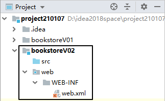

### 2、把V1中的页面粘贴过来

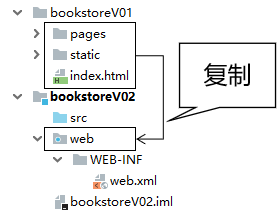

### 3、使用base标签统一设置路径基准

#### base标签的语法规则

- base标签要写在head标签内
- base标签必须写在所有其他有路径的标签的前面
- base标签使用href属性设置路径的基准
- base标签生效的机制是：最终的访问地址=base标签href属性设置的基准+具体标签内的路径
- 对于想要参考base标签的具体标签，如果路径是以斜杠开头，那么它将不参考base标签

#### base标签使用举例

```html
<head>
    <meta charset="UTF-8"/>
    <meta name="viewport" content="width=device-width, initial-scale=1.0"/>
    <title>书城首页</title>
    <base href="/bookstore/"/>
    <link rel="stylesheet" href="static/css/minireset.css"/>
    <link rel="stylesheet" href="static/css/common.css"/>
    <link rel="stylesheet" href="static/css/iconfont.css"/>
    <link rel="stylesheet" href="static/css/index.css"/>
    <link rel="stylesheet" href="static/css/swiper.min.css"/>
</head>
```

### 4、基于base标签调整整个页面的路径

#### base标签的代码

在需要的页面把下面的base标签代码粘贴到head标签内、需要路径的标签前即可

```html
<base href="/bookstore/"/>
```

#### 对需要统一调整的路径执行替换

Ctrl+r调出替换操作窗口


具体操作时请参考页面的实际情况进行替换。

### 5、基本假设

为了实现『不带数据库』的登录注册，我们需要假设：系统中目前已有用户：

| 用户名 | 密码   |
| ------ | ------ |
| tom    | 123456 |

### 6、登录功能

#### 明确目标

在服务器端检查用户通过表单提交的用户名、密码是否正确。

- 成功：跳转到login_success.html页面
- 失败：返回错误消息

#### 思路

友情提示：分析业务功能，捋清思路最好的办法就是画流程图


#### 代码

##### 创建LoginServlet

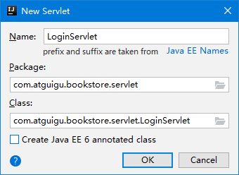

> 创建Packages时的规范：
>
> 公司或组织域名倒序.项目名.模块名.具体包名
>
> 或
>
> 公司或组织域名倒序.项目名.具体包名

下面是完整的Servlet配置信息：

```xml
<servlet>
    <servlet-name>LoginServlet</servlet-name>
    <servlet-class>com.atguigu.bookstore.servlet.LoginServlet</servlet-class>
</servlet>
<servlet-mapping>
    <servlet-name>LoginServlet</servlet-name>
    <url-pattern>/LoginServlet</url-pattern>
</servlet-mapping>
```

##### 完成doPost()方法中的代码

```java
protected void doPost(HttpServletRequest request, HttpServletResponse response) throws ServletException, IOException {

    // 1.声明两个变量，用于存储假设的用户名、密码
    String usernameSystem = "tom";
    String passwordSystem = "123456";

    // 2.获取请求参数中的用户名、密码
    String usernameForm = request.getParameter("username");
    String passwordForm = request.getParameter("password");

    // 3.执行判断
    if(usernameSystem.equals(usernameForm) && passwordSystem.equals(passwordForm)) {

        // 4.登录成功：重定向到登录成功页面
        response.sendRedirect(request.getContextPath() + "/pages/user/login_success.html");

    }else{

        // 5.登录失败
        response.setContentType("text/html;charset=UTF-8");
        response.getWriter().write("抱歉！用户名或密码不正确，请重新输入！");

    }

}
```

##### HTML页面设置表单提交地址

```html
<form id="loginForm" action="LoginServlet" method="post">
    <label>用户名称：</label>
    <input class="itxt" type="text" v-model:value="username" placeholder="请输入用户名" autocomplete="off" tabindex="1" name="username" id="username" />
    <br />
    <br />
    <label>用户密码：</label>
    <input class="itxt" type="password" v-model:value="password" placeholder="请输入密码" autocomplete="off" tabindex="1" name="password" id="password" />
    <br />
    <br />
    <button type="submit" id="sub_btn" @click="loginCheck">登录</button>
</form>
```

#### 提示消息改进探索

以下代码仅供参考：

```java
// 5.登录失败
// 返回提示消息方案一：过于简陋
// response.setContentType("text/html;charset=UTF-8");
// response.getWriter().write("抱歉！用户名或密码不正确，请重新输入！");

// 返回提示消息方案二：没有提示消息，让用户非常困惑
// request.getRequestDispatcher("/pages/user/login.html").forward(request, response);

// 返回提示消息方案三：确实能在登录页面显示提示消息，但是实现的方式让我想骂人
response.setContentType("text/html;charset=UTF-8");
PrintWriter writer = response.getWriter();
writer.write("<!DOCTYPE html>");
writer.write("<html>");
writer.write("    <head>");
writer.write("        <base href='/bookstore/' />");
```

### 7、注册功能

#### 明确目标

用户提交注册表单后，检查用户名是否被占用

- 没有被占用：注册成功
- 已经被占用：注册失败

#### 思路

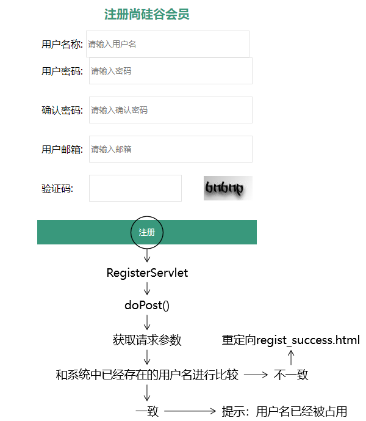

#### 代码

##### 创建RegisterServlet

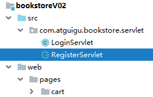

完整配置信息：

```xml
<servlet>
    <servlet-name>RegisterServlet</servlet-name>
    <servlet-class>com.atguigu.bookstore.servlet.RegisterServlet</servlet-class>
</servlet>
<servlet-mapping>
    <servlet-name>RegisterServlet</servlet-name>
    <url-pattern>/RegisterServlet</url-pattern>
</servlet-mapping>
```

##### 完成doPost()方法中的代码

```java
protected void doPost(HttpServletRequest request, HttpServletResponse response) throws ServletException, IOException {

    // 1.声明变量保存系统内置的用户名
    String usernameSystem = "jerry";

    // 2.获取请求参数
    String usernameForm = request.getParameter("username");

    // 3.比较
    if (usernameSystem.equals(usernameForm)) {

        // 4.说明用户名已经被占用，需要提示错误消息
        response.setContentType("text/html;charset=UTF-8");
        PrintWriter writer = response.getWriter();
        writer.write("抱歉！用户名已经被占用，请重新输入！");

    }else{

        // 5.说明用户名可用，跳转到注册成功页面
        response.sendRedirect(request.getContextPath() + "/pages/user/regist_success.html");

    }

}
```

##### HTML页面调整表单中的设置

```html
<form id="registerForm" action="RegisterServlet" method="post">
    <div class="form-item">
        <div>
            <label>用户名称:</label>
            <input v-model:value="username" type="text" name="username" placeholder="请输入用户名" />
            <span></span>
        </div>
        <span>{{usernameCheckMessage}}</span>
    </div>
    <div class="form-item">
        <div>
            <label>用户密码:</label>
            <input v-model:value="password" type="password" name="password" placeholder="请输入密码" />
        </div>
        <span class="errMess">密码的长度至少为8位</span>
    </div>
    <div class="form-item">
        <div>
            <label>确认密码:</label>
            <input v-model:value="passwordConfirm" type="password" placeholder="请输入确认密码" />
        </div>
        <span class="errMess">密码两次输入不一致</span>
    </div>
    <div class="form-item">
        <div>
            <label>用户邮箱:</label>
            <input v-model:value="email" type="text" name="email" placeholder="请输入邮箱" />
        </div>
        <span class="errMess">请输入正确的邮箱格式</span>
    </div>
    <div class="form-item">
        <div>
            <label>验证码:</label>
            <div class="verify">
                <input v-model:value="code" type="text" name="code" placeholder="" />
                
            </div>
        </div>
        <span class="errMess">请输入正确的验证码</span>
    </div>
    <button type="submit" @click="registerCheck" class="btn">注册</button>
</form>
```

## 二、三层架构

### 1、三层架构划分

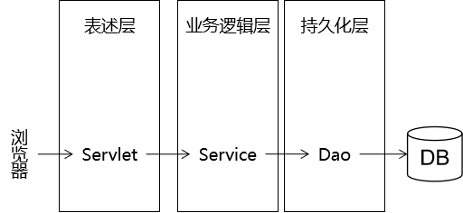

- 表述层：负责处理浏览器请求、返回响应、页面调度
- 业务逻辑层：负责处理业务逻辑，根据业务逻辑把持久化层从数据库查询出来的数据进行运算、组装，封装好后返回给表述层，也可以根据业务功能的需要调用持久化层把数据保存到数据库、修改数据库中的数据、删除数据库中的数据
- 持久化层：根据上一层的调用对数据库中的数据执行增删改查的操作

### 2、三层架构好处

如果不做三层架构形式的拆分：


所有和当前业务功能需求相关的代码全部耦合在一起，如果其中有任何一个部分出现了问题，牵一发而动全身，导致其他无关代码也要进行相应的修改。这样的话代码会非常难以维护。

所以为了提高开发效率，需要对代码进行模块化的拆分。整个项目模块化、组件化程度越高，越容易管理和维护，出现问题更容易排查。

### 3、三层架构和模型的关系

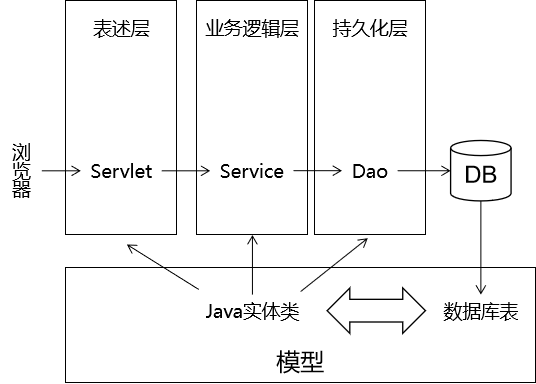

模型对整个项目中三层架构的每一层都提供支持，具体体现是使用模型对象**封装业务功能数据**。

> Java实体类有很多不同名称：
>
> - POJO：Plain old Java Object，传统的普通的Java对象
> - entity：实体类
> - bean或Java bean
> - domain：领域模型

### 4、模型开发的要求

#### ORM

ORM：Object Relative Mapping对象关系映射

对象：Java对象

关系：关系型数据库

映射：Java对象和数据库表之间的对应关系

| Java类             | 数据库表                       |
| ------------------ | ------------------------------ |
| 类                 | 表                             |
| 属性               | 字段/列                        |
| 对象               | 记录/行                        |
| 属性按照驼峰式命名 | 字段名各个单词之间用下划线分开 |

#### Java实体类的要求

- 必须有一个无参构造器

  将来使用框架后，大量的对象都是框架通过反射来创建的。

  Class< T > clazz = Class.forName("全类名");

  clazz.newInstance();

- 通过getXxx()、setXxx()方法定义属性：getXxx()或setXxx()方法去掉get或set后，Xxx把首字母小写，得到的xxx就是属性名。

```java
public class User {

    private String safeUserName;

    public String getUserName(){
        return this.safeUserName;
    }

    public void setUserName(String userName){
        this.safeUserName = userName;
    }

}
```

在上面例子中，getXxx()、setXxx()方法定义的属性是userName，不是safeUserName。

## 三、建模

### 1、创建数据库

```sql
CREATE DATABASE bookstore210107 CHARACTER SET utf8;
USE `bookstore210107`;
```

### 2、创建数据库表

物理建模的思路[参考这里](https://heavy_code_industry.gitee.io/code_heavy_industry/pro001-javaweb/lecture/bookstore02/xxx)。

```sql
CREATE TABLE t_user(
    user_id INT PRIMARY KEY AUTO_INCREMENT,
    user_name CHAR(100),
    user_pwd CHAR(100),
    email CHAR(100)
);
```

### 3、创建Java实体类

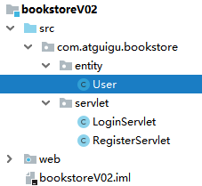

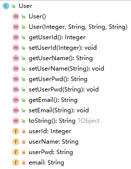

```java
public class User {

    private Integer userId;// user_id
    private String userName;// user_name
    private String userPwd;// user_pwd
    private String email;// email
    ……
```

## 四、持久化层

### 1、加入所需jar包

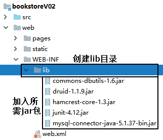

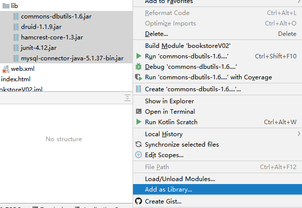

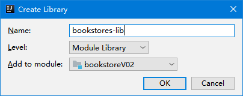

### 2、创建连接数据库的工具类

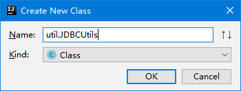

### 3、创建外部属性文件

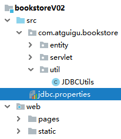

```properties
driverClassName=com.mysql.jdbc.Driver
url=jdbc:mysql://127.0.0.1:3306/bookstore210107
username=root
password=123456
initialSize=10
maxActive=20
maxWait=10000
```

注意：这里是上课演示时使用的参数，大家操作时要改成自己的。

### 4、在JDBCUtils类中创建数据源对象

```java
private static DataSource dataSource;

static {

    // 1.创建一个用于存储外部属性文件信息的Properties对象
    Properties properties = new Properties();

    // 2.使用当前类的类加载器加载外部属性文件：jdbc.properties
    InputStream inputStream = JDBCUtils.class.getClassLoader().getResourceAsStream("jdbc.properties");

    try {

        // 3.将外部属性文件jdbc.properties中的数据加载到properties对象中
        properties.load(inputStream);

        // 4.创建数据源对象
        dataSource = DruidDataSourceFactory.createDataSource(properties);

    } catch (Exception e) {
        e.printStackTrace();
    }

}
```

### 5、声明工具方法操作数据库连接

```java
    /**
     * 从数据源中获取数据库连接
     * @return 数据库连接对象
     */
    public static Connection getConnection() {

        Connection connection = null;

        try {
            connection = dataSource.getConnection();
        } catch (SQLException e) {
            e.printStackTrace();
            throw new RuntimeException(e);
        }

        return connection;

    }

    /**
     * 释放数据库连接
     * @param connection 要执行释放操作的连接对象
     */
    public static void releaseConnection(Connection connection) {

        if (connection != null) {

            try {
                connection.close();
            } catch (SQLException e) {
                e.printStackTrace();
                throw new RuntimeException(e);
            }

        }

    }
```

测试代码如下：

```java
public class BookstoreTest {

    @Test
    public void testConnection() {

        Connection connection = JDBCUtils.getConnection();
        System.out.println("connection = " + connection);

    }

}
```

### 6、创建BaseDao

#### DAO概念

DAO：Data Access Object数据访问对象

DAL：Data Access Layer数据访问层

#### 创建Java类

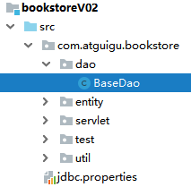

#### 编写通用方法

```java
/**
 * 各个具体Dao类的基类，泛型T对应具体实体类类型
 * @param <T>
 */
public class BaseDao<T> {

    private QueryRunner queryRunner = new QueryRunner();

    /**
     * 通用的增删改方法
     * @param sql 要执行的SQL语句
     * @param param 为SQL语句准备好的参数
     * @return 受影响的行数
     */
    public int update(String sql, Object ... param) {

        int updatedRowCount = 0;

        Connection connection = JDBCUtils.getConnection();

        try {

            updatedRowCount = queryRunner.update(connection, sql, param);

        }
        // 为了让上层方法调用方便，将编译时异常捕获
        catch (SQLException e) {
            e.printStackTrace();

            // 为了不掩盖问题，将编译时异常封装为运行时异常抛出
            throw new RuntimeException(e);
        } finally {

            // 关闭数据库连接
            JDBCUtils.releaseConnection(connection);

        }

        return updatedRowCount;

    }

    /**
     * 查询单个对象
     * @param clazz 单个对象所对应的实体类类型
     * @param sql   查询单个对象所需要的SQL语句
     * @param param SQL语句的参数
     * @return      查询到的单个对象
     */
    public T getBean(Class<T> clazz, String sql, Object ... param) {

        Connection connection = JDBCUtils.getConnection();

        T t = null;

        try {

            t = queryRunner.query(connection, sql, new BeanHandler<>(clazz), param);
        } catch (SQLException e) {
            e.printStackTrace();

            throw new RuntimeException(e);
        } finally {

            // 关闭数据库连接
            JDBCUtils.releaseConnection(connection);

        }

        return t;
    }

    /**
     * 查询集合对象
     * @param clazz 集合中单个对象所对应的实体类类型
     * @param sql   查询集合所需要的SQL语句
     * @param param SQL语句的参数
     * @return      查询到的集合对象
     */
    public List<T> getBeanList(Class<T> clazz, String sql, Object ... param) {

        Connection connection = JDBCUtils.getConnection();

        List<T> list = null;

        try {

            list = queryRunner.query(connection, sql, new BeanListHandler<>(clazz), param);
        } catch (SQLException e) {
            e.printStackTrace();

            throw new RuntimeException(e);
        } finally {

            // 关闭数据库连接
            JDBCUtils.releaseConnection(connection);

        }

        return list;
    }

}
```

测试方法：

```java
@Test
public void testUpdate() {
    BaseDao<Object> baseDao = new BaseDao<>();

    String sql = "insert into t_user(user_name,user_pwd) values(?,?)";

    int count = baseDao.update(sql, "罗志祥", "789456");

    System.out.println("count = " + count);
}

@Test
public void testGetBean() {
    BaseDao<User> baseDao = new BaseDao<>();

    // user_id userId
    // user_name userName
    // user_pwd userPwd
    String sql = "select user_id userId,user_name userName,user_pwd userPwd from t_user where user_id=?";

    User user = baseDao.getBean(User.class, sql, 2);

    System.out.println("user = " + user);
}

@Test
public void testGetBeanList() {
    BaseDao<User> baseDao = new BaseDao<>();

    String sql = "select user_id userId,user_name userName,user_pwd userPwd from t_user";

    List<User> userList = baseDao.getBeanList(User.class, sql);

    for (User user : userList) {
        System.out.println("user = " + user);
    }
}
```

### 7、创建UserDao

#### 用户登录注册功能中的组件关系图

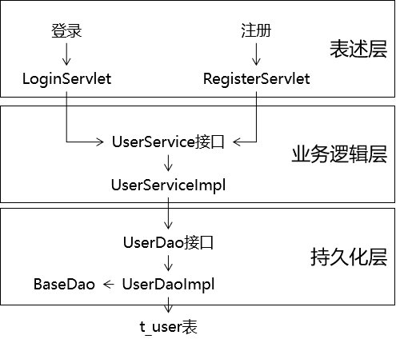

#### 声明UserDao接口

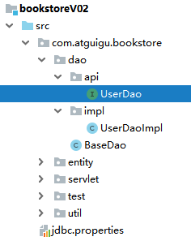

```java
public interface UserDao {

    /**
     * 根据用户名查询User对象
     * @param username 用户名
     * @return 查询到的User对象
     */
    User selectUserByName(String username);

    /**
     * 将User对象保存到数据库
     * @param user 要保存的User对象
     * @return 受影响的行数
     */
    int insertUser(User user);

}
```

#### 声明UserDaoImpl实现类

```java
public class UserDaoImpl extends BaseDao<User> implements UserDao {
    @Override
    public User selectUserByName(String username) {

        String sql = "select user_id userId,user_name userName,user_pwd userPwd,email from t_user where user_name=?";

        return super.getBean(User.class, sql, username);
    }

    @Override
    public int insertUser(User user) {

        String sql = "insert into t_user(user_name,user_pwd,email) values(?,?,?)";

        return super.update(sql, user.getUserName(), user.getUserPwd(), user.getEmail());
    }
}
```

#### 测试方法

```java
@Test
public void testUserDaoGetUserByName() {

    UserDao userDao = new UserDaoImpl();

    User user = userDao.selectUserByName("陈冠希");

    System.out.println("user = " + user);

}

@Test
public void testUserDaoSaveUser() {
    UserDao userDao = new UserDaoImpl();

    User user = new User(null, "陈冠希", "666666", "aaa@qq.com");

    int count = userDao.insertUser(user);

    System.out.println("count = " + count);
}
```

## 五、完成带数据库的登录注册

### 1、密码加密

#### 加密方式介绍

- 对称加密：在知道密文和加密算法的情况下，能够反推回明文
- 非对称加密：
  - 加密：使用私钥加密
  - 解密：使用公钥解密

#### 加密算法：HASH

- 特点1：不可逆
- 特点2：加密后，密文长度固定
- 特点3：输入数据不变，输出数据也保证不变；输入数据变化，输出数据一定变化

常见的HASH算法举例：

- MD5
- SHA1
- SHA512
- CRC32

#### 执行加密的工具方法

```java
public class MD5Util {

    /**
     * 针对明文字符串执行MD5加密
     * @param source
     * @return
     */
    public static String encode(String source) {

        // 1.判断明文字符串是否有效
        if (source == null || "".equals(source)) {
            throw new RuntimeException("用于加密的明文不可为空");
        }

        // 2.声明算法名称
        String algorithm = "md5";

        // 3.获取MessageDigest对象
        MessageDigest messageDigest = null;
        try {
            messageDigest = MessageDigest.getInstance(algorithm);
        } catch (NoSuchAlgorithmException e) {
            e.printStackTrace();
        }

        // 4.获取明文字符串对应的字节数组
        byte[] input = source.getBytes();

        // 5.执行加密
        byte[] output = messageDigest.digest(input);

        // 6.创建BigInteger对象
        int signum = 1;
        BigInteger bigInteger = new BigInteger(signum, output);

        // 7.按照16进制将bigInteger的值转换为字符串
        int radix = 16;
        String encoded = bigInteger.toString(radix).toUpperCase();

        return encoded;
    }

}
```

### 2、注册功能

#### 目标

检查用户名是否可用，如果用户名可用则保存User对象

#### 思路

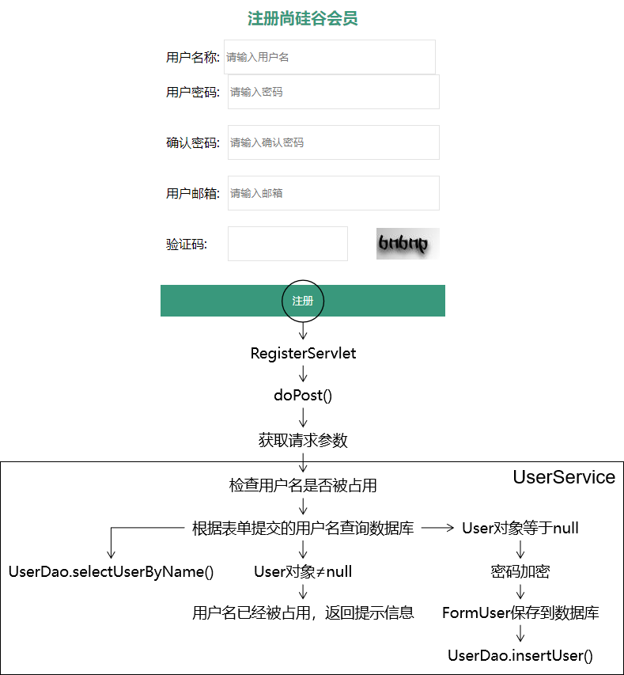

#### 代码

##### [1]创建UserService

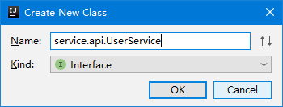

```java
public interface UserService {

    void doRegister(User userForm);

    User doLogin(User userForm);

}
```

开发中，接口设计和接口中方式定义的理念：

- 方法的返回值应该对应这个方法本身的业务功能
  - 写操作：没有返回值
  - 读操作：有返回值，返回值就是查询的结果
- 方法执行是否成功
  - 成功：不抛异常
  - 失败：抛异常

> 启发：
>
> 上层方法向下层方法布置任务：方法名、方法的参数
>
> 下层方法向上层方法反馈结果：返回值、是否抛异常

##### [2]实现UserService接口

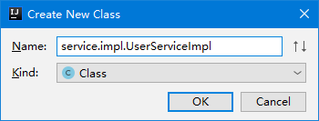

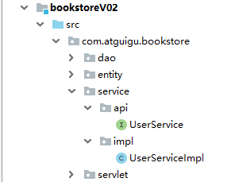

###### (1)UserDao声明为成员变量

说明：将来在Servlet中使用Service的时候，也是同样声明为成员变量，那么从Servlet、Service到Dao就都是**『单实例，多线程』**方式运行。

```java
public class UserServiceImpl implements UserService {

    private UserDao userDao = new UserDaoImpl();

    @Override
    public void doRegister(User userForm) {

    }

    @Override
    public User doLogin(User userForm) {

        return null;
    }
}
```

理由：

- 创建对象的操作只执行一次
- 对象在内存中只保存一份，不会过多占用内存空间

###### (2)实现注册功能

```java
@Override
public void doRegister(User userForm) {

    // 1.从userForm对象中获取用户通过表单提交的用户名
    String userName = userForm.getUserName();

    // 2.根据用户名调用UserDao方法查询对应的User对象
    User userDB = userDao.selectUserByName(userName);

    // 3.检查User对象是否为空
    if (userDB != null) {
        // 4.如果User对象不为空，则抛出异常，通知上层调用方法：用户名已经被占用
        throw new RuntimeException("用户名已经被占用");
    }

    // 5.对表单提交的密码执行MD5加密
    // ①取出表单的密码
    String userPwd = userForm.getUserPwd();

    // ②执行加密
    String encode = MD5Util.encode(userPwd);

    // ③将加密得到的密文字符串设置回userForm对象
    userForm.setUserPwd(encode);

    // 6.调用UserDao方法将userForm对象保存到数据库
    userDao.insertUser(userForm);
}
```

##### [3]修改RegisterServlet

```java
protected void doPost(HttpServletRequest request, HttpServletResponse response) throws ServletException, IOException {

    // 1.从请求参数中获取数据封装为User对象
    String username = request.getParameter("username");
    String password = request.getParameter("password");
    String email = request.getParameter("email");

    User userForm = new User(null, username, password, email);

    // 2.调用UserService的方法执行注册
    try {
        userService.doRegister(userForm);

        // 3.如果没有抛出异常那么就跳转到注册成功的页面
        // 选择重定向的原因：跳转到regist_success.html页面后，用户刷新浏览器不会重复提交注册表单
        response.sendRedirect(request.getContextPath()+"/pages/user/regist_success.html");
    } catch (Exception e) {
        e.printStackTrace();

        // 4.如果抛出了异常
        response.setContentType("text/html;charset=UTF-8");
        response.getWriter().write("注册失败：" + e.getMessage());
    }

}
```

### 3、登录功能

#### 关键点提示

对用户密码进行验证时，无法将密文解密为明文，只能将明文再次加密为密文，**『比较密文是否一致』**。

#### 思路

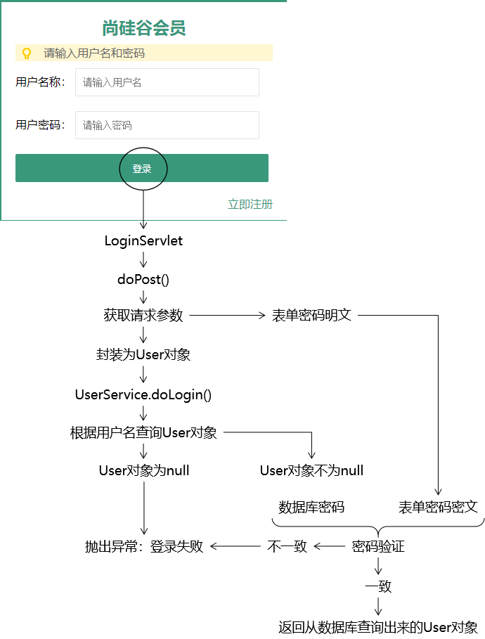

#### 代码

##### [1]UserService接口的doLogin()

```java
@Override
public User doLogin(User userForm) {

    // 1.获取表单提交的用户名
    String userName = userForm.getUserName();

    // 2.根据用户名调用UserDao方法查询User对象
    User userDB = userDao.selectUserByName(userName);

    // 3.检查数据库查询的User对象是否为null
    if (userDB == null) {
        // 4.如果数据库查询的User对象为null，说明用户名不正确，抛出异常：登录失败
        throw new RuntimeException("用户名或密码不正确");
    }

    // 5.密码验证
    // ①获取表单提交的密码
    String userPwdForm = userForm.getUserPwd();

    // ②对表单提交的密码进行加密
    String encode = MD5Util.encode(userPwdForm);

    // ③获取数据库查询到的密码
    String userPwdDB = userDB.getUserPwd();

    // ④比较表单密码和数据库密码
    if (Objects.equals(encode, userPwdDB)) {
        // 6.如果密码验证成功，则将从数据库查询出来的User对象返回
        return userDB;

    }else{
        // 7.如果密码验证失败，说明密码不正确，抛出异常：登录失败
        throw new RuntimeException("用户名或密码不正确");
    }

}
```

##### [2]LoginServlet的doPost()方法

```java
protected void doPost(HttpServletRequest request, HttpServletResponse response) throws ServletException, IOException {

    // 1.从请求参数中获取用户名和密码
    String username = request.getParameter("username");
    String password = request.getParameter("password");

    // 2.封装为User对象
    User userForm = new User(null, username, password, null);

    // 3.调用UserService的方法执行登录验证
    try {
        User userDB = userService.doLogin(userForm);

        // 4.登录成功后跳转到登录成功页面
        response.sendRedirect(request.getContextPath() + "/pages/user/login_success.html");
    } catch (Exception e) {
        e.printStackTrace();

        // 5.登录失败则显示提示消息
        response.setContentType("text/html;charset=UTF-8");
        response.getWriter().write("登录失败：" + e.getMessage());
    }

}
```
