---
# 当前页面内容标题
title: 12、Thymeleaf
# 当前页面图标
icon: java
# 分类
category:
  - thymeleaf
  - javaweb
  - java
# 标签
tag:
  - javaweb
  - java
  - thymeleaf
sticky: true
# 是否收藏在博客主题的文章列表中，当填入数字时，数字越大，排名越靠前。
star: false
# 是否将该文章添加至文章列表中
article: true
# 是否将该文章添加至时间线中
timeline: true
---

# 12、Thymeleaf

> 官网：https://www.thymeleaf.org/
>
> github：https://github.com/thymeleaf/
>
> 中文文档：https://fanlychie.github.io/post/thymeleaf.html
>
> 参考文章：https://www.cnblogs.com/msi-chen/p/10974009.html

## 一、MVC

### 1、提出问题

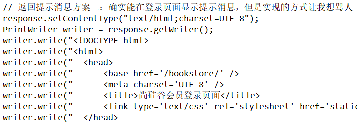

我们对HTML的新的期待：既能够正常显示页面，又能在页面中包含动态数据部分。而动态数据单靠HTML本身是无法做到的，所以此时我们需要引入服务器端动态视图模板技术。

### 2、从三层结构到MVC

#### MVC概念

M：Model模型

V：View视图

C：Controller控制器

MVC是在表述层开发中运用的一种设计理念。主张把**封装数据的『模型』**、**显示用户界面的『视图』**、**协调调度的『控制器』**分开。

好处：

- 进一步实现各个组件之间的解耦
- 让各个组件可以单独维护
- 将视图分离出来以后，我们后端工程师和前端工程师的对接更方便

#### MVC和三层架构之间关系

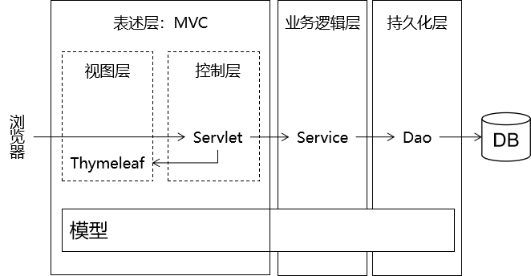

### 3、前后端工程师对接方式

- 服务器端渲染：前端工程师把前端页面一整套做好交给后端工程师
- 前后端分离：开会商量JSON格式，然后分头开发。在后端程序尚不可用时，前端工程师会使用Mock.js生成假数据使用，在后端程序可用后再连接实际后端程序获取真实数据。

[查看详细内容](http://heavy_code_industry.gitee.io/code_heavy_industry/pro000-dev-story/chapter05/content.html)

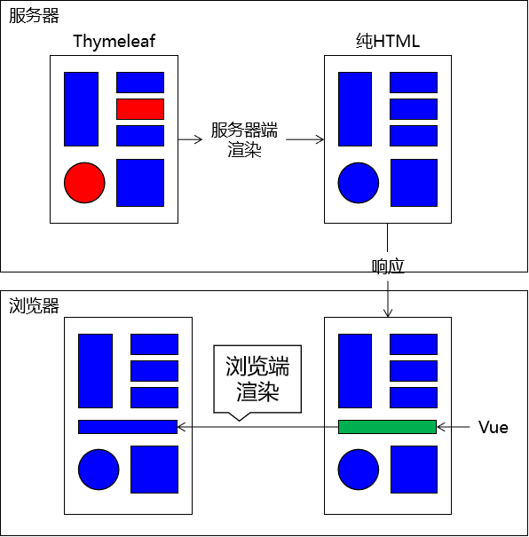


## 二、Thymeleaf简介

### 1、Thymeleaf的同行

JSP、Freemarker、Velocity等等，它们有一个共同的名字：**服务器端模板技术**。

### 2、Thymeleaf官方文档中的介绍

[官网地址(opens new window)](https://www.thymeleaf.org/)

[官方文档](https://heavy_code_industry.gitee.io/code_heavy_industry/pro001-javaweb/lecture/chapter08/Thymeleaf-3.0.11.pdf)

> Thymeleaf is a modern server-side Java template engine for both web and standalone environments, capable of processing HTML, XML, JavaScript, CSS and even plain text. The main goal of Thymeleaf is to provide an elegant and highly-maintainable way of creating templates. To achieve this, it builds on the concept of Natural Templates to inject its logic into template files in a way that doesn’t affect the template from being used as a design prototype. This improves communication of design and bridges the gap between design and development teams. Thymeleaf has also been designed from the beginning with Web Standards in mind – especially HTML5 – allowing you to create fully validating templates if that is a need for you.

### 3、Thymeleaf优势

- SpringBoot官方推荐使用的视图模板技术，和SpringBoot完美整合。
- 不经过服务器运算仍然可以直接查看原始值，对前端工程师更友好。

```html
<!DOCTYPE html>
<html lang="en" xmlns:th="http://www.thymeleaf.org">
<head>
    <meta charset="UTF-8">
    <title>Title</title>
</head>
<body>

    <p th:text="${hello}">Original Value</p>

</body>
</html>
```

### 4、物理视图和逻辑视图

#### 物理视图

在Servlet中，将请求转发到一个HTML页面文件时，使用的完整的转发路径就是**物理视图**。

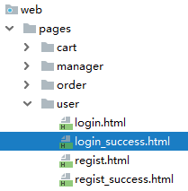

> /pages/user/login_success.html

如果我们把所有的HTML页面都放在某个统一的目录下，那么转发地址就会呈现出明显的规律：

> /pages/user/login.html /pages/user/login_success.html /pages/user/regist.html /pages/user/regist_success.html
>
> ……

路径的开头都是：/pages/user/

路径的结尾都是：.html

所以，路径开头的部分我们称之为**视图前缀**，路径结尾的部分我们称之为**视图后缀**。

#### 逻辑视图

物理视图=视图前缀+逻辑视图+视图后缀

上面的例子中：

| 视图前缀     | 逻辑视图      | 视图后缀 | 物理视图                       |
| ------------ | ------------- | -------- | ------------------------------ |
| /pages/user/ | login         | .html    | /pages/user/login.html         |
| /pages/user/ | login_success | .html    | /pages/user/login_success.html |

## 三、在服务器端引入Thymeleaf环境

### 1、加入jar包

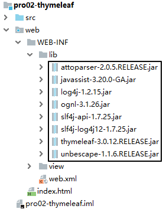

### 2、配置上下文参数

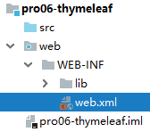

物理视图=视图前缀+逻辑视图+视图后缀

```xml
<!-- 在上下文参数中配置视图前缀和视图后缀 -->
<context-param>
    <param-name>view-prefix</param-name>
    <param-value>/WEB-INF/view/</param-value>
</context-param>
<context-param>
    <param-name>view-suffix</param-name>
    <param-value>.html</param-value>
</context-param>
```

说明：param-value中设置的前缀、后缀的值不是必须叫这个名字，可以根据实际情况和需求进行修改。

> 为什么要放在WEB-INF目录下？
>
> 原因：WEB-INF目录不允许浏览器直接访问，所以我们的视图模板文件放在这个目录下，是一种保护。以免外界可以随意访问视图模板文件。
>
> 访问WEB-INF目录下的页面，都必须通过Servlet转发过来，简单说就是：不经过Servlet访问不了。
>
> 这样就方便我们在Servlet中检查当前用户是否有权限访问。
>
> 那放在WEB-INF目录下之后，重定向进不去怎么办？
>
> 重定向到Servlet，再通过Servlet转发到WEB-INF下。

### 3、创建Servlet基类

这个类大家直接**复制粘贴**即可，将来使用框架后，这些代码都将被取代。

```java
import org.thymeleaf.TemplateEngine;
import org.thymeleaf.context.WebContext;
import org.thymeleaf.templatemode.TemplateMode;
import org.thymeleaf.templateresolver.ServletContextTemplateResolver;

import javax.servlet.ServletContext;
import javax.servlet.ServletException;
import javax.servlet.http.HttpServlet;
import javax.servlet.http.HttpServletRequest;
import javax.servlet.http.HttpServletResponse;
import java.io.IOException;

public class ViewBaseServlet extends HttpServlet {

    private TemplateEngine templateEngine;

    @Override
    public void init() throws ServletException {

        // 1.获取ServletContext对象
        ServletContext servletContext = this.getServletContext();

        // 2.创建Thymeleaf解析器对象
        ServletContextTemplateResolver templateResolver = new ServletContextTemplateResolver(servletContext);

        // 3.给解析器对象设置参数
        // ①HTML是默认模式，明确设置是为了代码更容易理解
        templateResolver.setTemplateMode(TemplateMode.HTML);

        // ②设置前缀
        String viewPrefix = servletContext.getInitParameter("view-prefix");

        templateResolver.setPrefix(viewPrefix);

        // ③设置后缀
        String viewSuffix = servletContext.getInitParameter("view-suffix");

        templateResolver.setSuffix(viewSuffix);

        // ④设置缓存过期时间（毫秒）
        templateResolver.setCacheTTLMs(60000L);

        // ⑤设置是否缓存
        templateResolver.setCacheable(true);

        // ⑥设置服务器端编码方式
        templateResolver.setCharacterEncoding("utf-8");

        // 4.创建模板引擎对象
        templateEngine = new TemplateEngine();

        // 5.给模板引擎对象设置模板解析器
        templateEngine.setTemplateResolver(templateResolver);

    }

    protected void processTemplate(String templateName, HttpServletRequest req, HttpServletResponse resp) throws IOException {
        // 1.设置响应体内容类型和字符集
        resp.setContentType("text/html;charset=UTF-8");

        // 2.创建WebContext对象
        WebContext webContext = new WebContext(req, resp, getServletContext());

        // 3.处理模板数据
        templateEngine.process(templateName, webContext, resp.getWriter());
    }
}
```

### 4、HelloWorld

#### 创建index.html

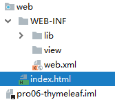

### 在index.html编写超链接

```html
<a href="/view/TestThymeleafServlet">初步测试Thymeleaf</a>
```

#### 创建Servlet

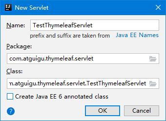

```xml
<servlet>
    <servlet-name>TestThymeleafServlet</servlet-name>
    <servlet-class>com.atguigu.thymeleaf.servlet.TestThymeleafServlet</servlet-class>
</servlet>
<servlet-mapping>
    <servlet-name>TestThymeleafServlet</servlet-name>
    <url-pattern>/TestThymeleafServlet</url-pattern>
</servlet-mapping>
```

#### 修改Servlet继承的父类

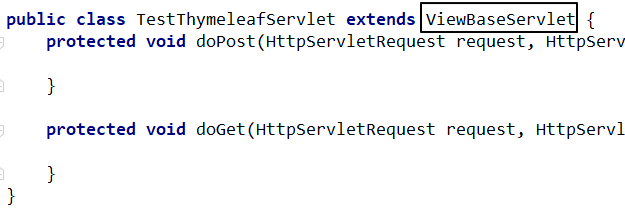

#### 在doGet()方法中跳转到Thymeleaf页面

```java
protected void doGet(HttpServletRequest request, HttpServletResponse response) throws ServletException, IOException {

    // 1.声明当前请求要前往的视图名称
    String viewName = "target";

    // 2.调用ViewBaseServlet父类中的解析视图模板的方法
    super.processTemplate(viewName, request, response);

}
```

#### Thymeleaf页面

```html
<!DOCTYPE html>

<!-- 在html标签内加入Thymeleaf名称空间的声明 -->
<html lang="en" xmlns:th="http://www.thymeleaf.org">
<head>
    <meta charset="UTF-8">
    <title>Title</title>
</head>
<body>

    <!-- 在p标签的基础上，使用Thymeleaf的表达式，解析了一个URL地址 -->
    <p th:text="@{'/aaa/bbb/ccc'}">Thymeleaf将在这里显示一个解析出来的URL地址</p>

</body>
</html>
```

## 四、基本语法：th名称空间

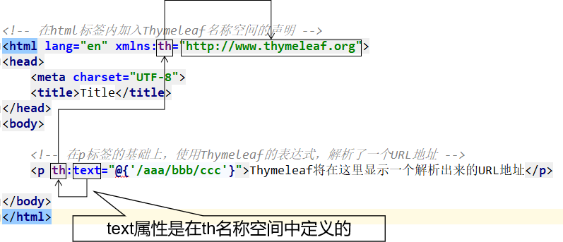

## 五、基本语法：表达式语法

### 1、修改标签文本值

代码示例：

```html
<p th:text="标签体新值">标签体原始值</p>
```

#### th:text作用

- 不经过服务器解析，直接用浏览器打开HTML文件，看到的是『标签体原始值』
- 经过服务器解析，Thymeleaf引擎根据th:text属性指定的『标签体新值』去**替换**『标签体原始值』

#### 字面量

『字面量』是一个经常会遇到的概念，我们可以对照『变量』来理解它的含义。

```java
// a是变量，100是字面量
int a = 100;
System.out.println("a = " + a);
```

- 变量：变量名字符串本身不是它的值，它指向的才是它的值
- 字面量：它就是字面上的含义，我们从『字面』上看到的直接就是它的值

现在我们在th:text属性中使用的就是『字面量』，它**不指代任何其他值**。

### 2、修改指定属性值

代码示例：

```html
<input type="text" name="username" th:value="文本框新值" value="文本框旧值" />
```

语法：任何HTML标签原有的属性，前面加上『th:』就都可以通过Thymeleaf来设定新值。

### 3、解析URL地址

#### 基本语法

代码示例：

```html
<p th:text="@{/aaa/bbb/ccc}">标签体原始值</p>
```

经过解析后得到：

> /view/aaa/bbb/ccc

所以@{}的作用是**在字符串前附加『上下文路径』**

> 这个语法的好处是：实际开发过程中，项目在不同环境部署时，Web应用的名字有可能发生变化。所以上下文路径不能写死。而通过@{}动态获取上下文路径后，不管怎么变都不怕啦！

#### 首页使用URL地址解析

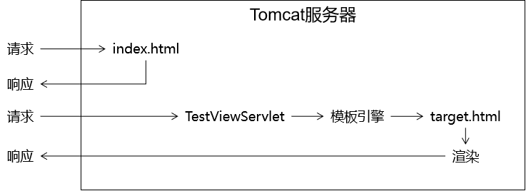

如果我们直接访问index.html本身，那么index.html是不需要通过Servlet，当然也不经过模板引擎，所以index.html上的Thymeleaf的任何表达式都不会被解析。

解决办法：通过Servlet访问index.html，这样就可以让模板引擎渲染页面了：

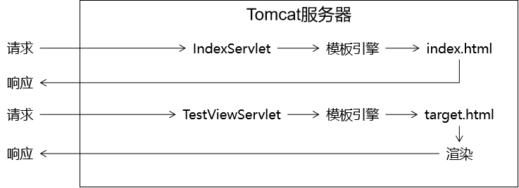

进一步的好处：

通过上面的例子我们看到，所有和业务功能相关的请求都能够确保它们通过Servlet来处理，这样就方便我们统一对这些请求进行特定规则的限定。

#### 给URL地址后面附加请求参数

参照官方文档说明：

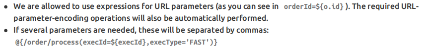

### 4、直接执行表达式

Servlet代码：

```java
request.setAttribute("reqAttrName", "<span>hello-value</span>");
```

页面代码：

```html
<p>有转义效果：[[${reqAttrName}]]</p>
<p>无转义效果：[(${reqAttrName})]</p>
```

执行效果：

```html
<p>有转义效果：<span>hello-value</span></p>
<p>无转义效果：<span>hello-value</span></p>
```

## 六、基本语法：访问域对象

### 1、域对象

#### 请求域

在请求转发的场景下，我们可以借助HttpServletRequest对象内部给我们提供的存储空间，帮助我们携带数据，把数据发送给转发的目标资源。

请求域：HttpServletRequest对象内部给我们提供的存储空间

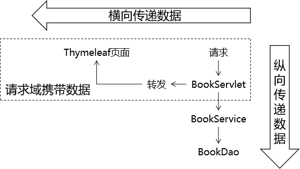

#### 会话域

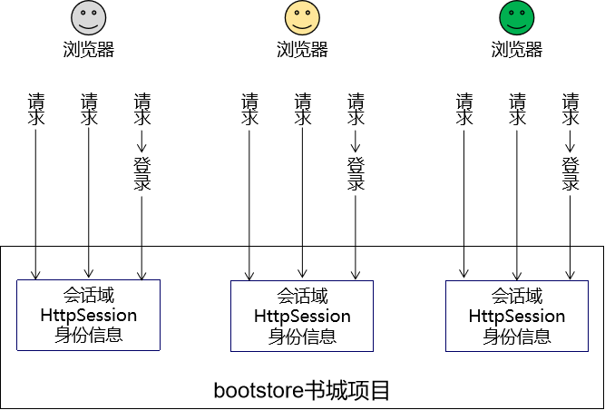

#### 应用域

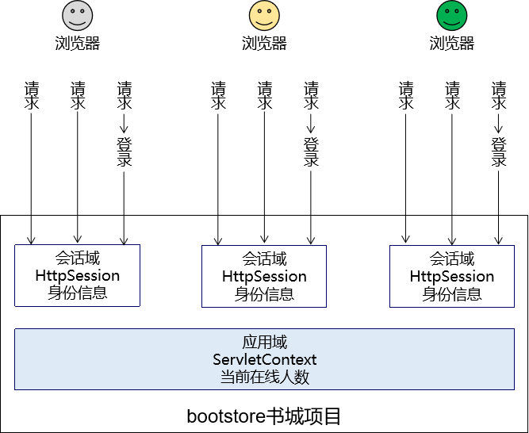

> PS：在我们使用的视图是JSP的时候，域对象有4个
>
> - pageContext
> - request：请求域
> - session：会话域
> - application：应用域
>
> 所以在JSP的使用背景下，我们可以说域对象有4个，现在使用Thymeleaf了，没有pageContext。

### 2、在Servlet中将数据存入属性域

#### 操作请求域

Servlet中代码：

```java
String requestAttrName = "helloRequestAttr";
String requestAttrValue = "helloRequestAttr-VALUE";

request.setAttribute(requestAttrName, requestAttrValue);
```

Thymeleaf表达式：

```html
<p th:text="${helloRequestAttr}">request field value</p>
```

#### 作会话域

Servlet中代码：

```java
// ①通过request对象获取session对象
HttpSession session = request.getSession();

// ②存入数据
session.setAttribute("helloSessionAttr", "helloSessionAttr-VALUE");
```

Thymeleaf表达式：

```html
<p th:text="${session.helloSessionAttr}">这里显示会话域数据</p>
```

#### 操作应用域

Servlet中代码：

```java
// ①通过调用父类的方法获取ServletContext对象
ServletContext servletContext = getServletContext();

// ②存入数据
servletContext.setAttribute("helloAppAttr", "helloAppAttr-VALUE");
```

Thymeleaf表达式：

```html
<p th:text="${application.helloAppAttr}">这里显示应用域数据</p>
```

## 七、基本语法：获取请求参数

具体来说，我们这里探讨的是在页面上（模板页面）获取请求参数。底层机制是：

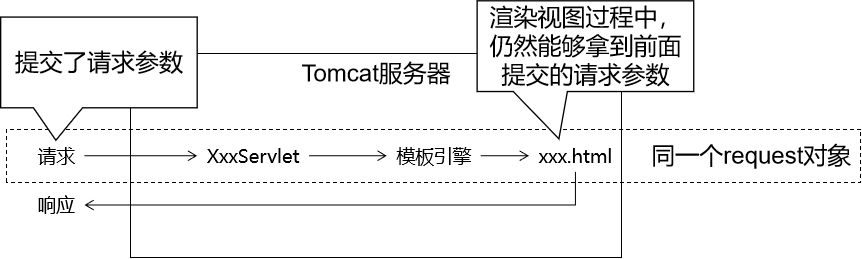

### 1、一个名字一个值

页面代码：

```html
<p th:text="${param.username}">这里替换为请求参数的值</p>
```

页面显示效果：

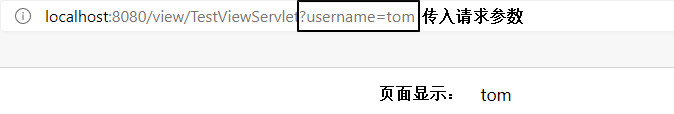

### 2、一个名字多个值

页面代码：

```html
<p th:text="${param.team}">这里替换为请求参数的值</p>
```

页面显示效果：

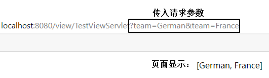

如果想要精确获取某一个值，可以使用数组下标。页面代码：

```html
<p th:text="${param.team[0]}">这里替换为请求参数的值</p>
<p th:text="${param.team[1]}">这里替换为请求参数的值</p>
```

页面显示效果：

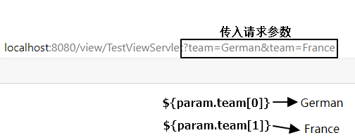

## 八、基本语法：内置对象

### 1、概念

所谓内置对象其实就是在表达式中**可以直接使用**的对象。

### 2、基本内置对象


用法举例：

```html
<h3>表达式的基本内置对象</h3>
<p th:text="${#request.getClass().getName()}">这里显示#request对象的全类名</p>
<p th:text="${#request.getContextPath()}">调用#request对象的getContextPath()方法</p>
<p th:text="${#request.getAttribute('helloRequestAttr')}">调用#request对象的getAttribute()方法，读取属性域</p>
```

基本思路：

- 如果不清楚这个对象有哪些方法可以使用，那么就通过getClass().getName()获取全类名，再回到Java环境查看这个对象有哪些方法
- 内置对象的方法可以直接调用
- 调用方法时需要传参的也可以直接传入参数

### 3、公共内置对象

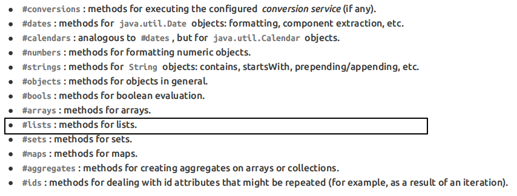

Servlet中将List集合数据存入请求域：

```java
request.setAttribute("aNotEmptyList", Arrays.asList("aaa","bbb","ccc"));
request.setAttribute("anEmptyList", new ArrayList<>());
```

页面代码：

```html
<p>#list对象isEmpty方法判断集合整体是否为空aNotEmptyList：<span th:text="${#lists.isEmpty(aNotEmptyList)}">测试#lists</span></p>
<p>#list对象isEmpty方法判断集合整体是否为空anEmptyList：<span th:text="${#lists.isEmpty(anEmptyList)}">测试#lists</span></p>
```

公共内置对象对应的源码位置：

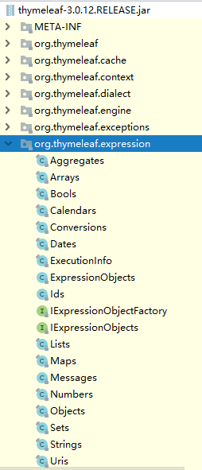

## 九、基本语法：${}中的表达式本质是OGNL

### 1、OGNL

OGNL：Object-Graph Navigation Language对象-图 导航语言

### 2、对象图

从根对象触发，通过特定的语法，逐层访问对象的各种属性。

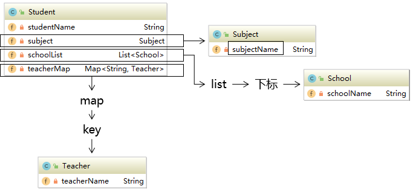

### 3、OGNL语法

#### 起点

在Thymeleaf环境下，${}中的表达式可以从下列元素开始：

- 访问属性域的起点
  - 请求域属性名
  - session
  - application
- param
- 内置对象
  - \#request
  - \#session
  - \#lists
  - \#strings

#### 属性访问语法

- 访问对象属性：使用getXxx()、setXxx()方法定义的属性
  - 对象.属性名
- 访问List集合或数组
  - 集合或数组[下标]
- 访问Map集合
  - Map集合.key
  - Map集合['key']

## 十、基本语法：分支与迭代

### 1、分支

### if和unless

让标记了th:if、th:unless的标签根据条件决定是否显示。

示例的实体类：

```java
public class Employee {

    private Integer empId;
    private String empName;
    private Double empSalary;
```

示例的Servlet代码：

```java
protected void doGet(HttpServletRequest request, HttpServletResponse response) throws ServletException, IOException {

    // 1.创建ArrayList对象并填充
    List<Employee> employeeList = new ArrayList<>();

    employeeList.add(new Employee(1, "tom", 500.00));
    employeeList.add(new Employee(2, "jerry", 600.00));
    employeeList.add(new Employee(3, "harry", 700.00));

    // 2.将集合数据存入请求域
    request.setAttribute("employeeList", employeeList);

    // 3.调用父类方法渲染视图
    super.processTemplate("list", request, response);
}
```

示例的HTML代码：

```html
<table>
    <tr>
        <th>员工编号</th>
        <th>员工姓名</th>
        <th>员工工资</th>
    </tr>
    <tr th:if="${#lists.isEmpty(employeeList)}">
        <td colspan="3">抱歉！没有查询到你搜索的数据！</td>
    </tr>
    <tr th:if="${not #lists.isEmpty(employeeList)}">
        <td colspan="3">有数据！</td>
    </tr>
    <tr th:unless="${#lists.isEmpty(employeeList)}">
        <td colspan="3">有数据！</td>
    </tr>
</table>
```

if配合not关键词和unless配合原表达式效果是一样的，看自己的喜好。

#### switch

```html
<h3>测试switch</h3>
<div th:switch="${user.memberLevel}">
    <p th:case="level-1">银牌会员</p>
    <p th:case="level-2">金牌会员</p>
    <p th:case="level-3">白金会员</p>
    <p th:case="level-4">钻石会员</p>
</div>
```

### 2、迭代

```html
<h3>测试each</h3>
<table>
    <thead>
        <tr>
            <th>员工编号</th>
            <th>员工姓名</th>
            <th>员工工资</th>
        </tr>
    </thead>
    <tbody th:if="${#lists.isEmpty(employeeList)}">
        <tr>
            <td colspan="3">抱歉！没有查询到你搜索的数据！</td>
        </tr>
    </tbody>
    <tbody th:if="${not #lists.isEmpty(employeeList)}">
        <!-- 遍历出来的每一个元素的名字 : ${要遍历的集合} -->
        <tr th:each="employee : ${employeeList}">
            <td th:text="${employee.empId}">empId</td>
            <td th:text="${employee.empName}">empName</td>
            <td th:text="${employee.empSalary}">empSalary</td>
        </tr>
    </tbody>
</table>
```

在迭代过程中，可以参考下面的说明使用迭代状态：

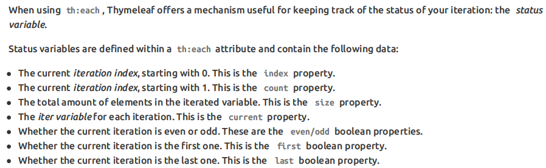

```html
<h3>测试each</h3>
<table>
    <thead>
        <tr>
            <th>员工编号</th>
            <th>员工姓名</th>
            <th>员工工资</th>
            <th>迭代状态</th>
        </tr>
    </thead>
    <tbody th:if="${#lists.isEmpty(employeeList)}">
        <tr>
            <td colspan="3">抱歉！没有查询到你搜索的数据！</td>
        </tr>
    </tbody>
    <tbody th:if="${not #lists.isEmpty(employeeList)}">
        <!-- 遍历出来的每一个元素的名字 : ${要遍历的集合} -->
        <tr th:each="employee,empStatus : ${employeeList}">
            <td th:text="${employee.empId}">empId</td>
            <td th:text="${employee.empName}">empName</td>
            <td th:text="${employee.empSalary}">empSalary</td>
            <td th:text="${empStatus.count}">count</td>
        </tr>
    </tbody>
</table>
```

## 十一、基本语法：包含其他模板文件

### 1、应用场景

抽取各个页面的公共部分：

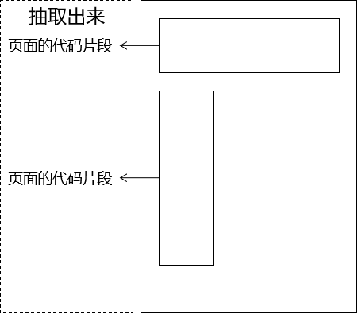

### 2、创建页面的代码片段

使用th:fragment来给这个片段命名：

```html
<div th:fragment="header">
    <p>被抽取出来的头部内容</p>
</div>
```

### 3、包含到有需要的页面

| 语法       | 效果                                                     |
| ---------- | -------------------------------------------------------- |
| th:insert  | 把目标的代码片段整个插入到当前标签内部                   |
| th:replace | 用目标的代码替换当前标签                                 |
| th:include | 把目标的代码片段去除最外层标签，然后再插入到当前标签内部 |

页面代码举例：

```html
<!-- 代码片段所在页面的逻辑视图 :: 代码片段的名称 -->
<div id="badBoy" th:insert="segment :: header">
    div标签的原始内容
</div>

<div id="worseBoy" th:replace="segment :: header">
    div标签的原始内容
</div>

<div id="worstBoy" th:include="segment :: header">
    div标签的原始内容
</div>
```

## 加餐 最凝练的CRUD

### 1、建模

#### 物理建模

```sql
CREATE DATABASE `view-demo`CHARACTER SET utf8;
USE `view-demo`;
CREATE TABLE t_soldier(
    soldier_id INT PRIMARY KEY AUTO_INCREMENT,
    soldier_name CHAR(100),
    soldier_weapon CHAR(100)
);
```

#### 逻辑建模

```java
public class Soldier {

    private Integer soldierId;
    private String soldierName;
    private String soldierWeapon;
```

### 2、总体架构

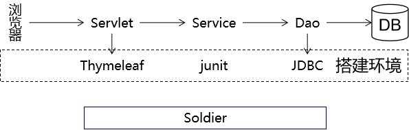

### 3、搭建持久化层所需环境

#### 导入jar包

> commons-dbutils-1.6.jar druid-1.1.9.jar hamcrest-core-1.3.jar junit-4.12.jar mysql-connector-java-5.1.37-bin.jar

#### 创建jdbc.properties

维护基本连接信息

```properties
driverClassName=com.mysql.jdbc.Driver
url=jdbc:mysql://127.0.0.1:3306/view-demo
username=root
password=123456
initialSize=10
maxActive=20
maxWait=10000
```

### 创建JDBCUtils工具类

```java
import com.alibaba.druid.pool.DruidDataSourceFactory;

import javax.sql.DataSource;
import java.io.InputStream;
import java.sql.Connection;
import java.sql.SQLException;
import java.util.Properties;

public class JDBCUtil {

    // 将数据源对象设置为静态属性，保证大对象的单一实例
    private static DataSource dataSource;

    static {

        // 1.创建一个用于存储外部属性文件信息的Properties对象
        Properties properties = new Properties();

        // 2.使用当前类的类加载器加载外部属性文件：jdbc.properties
        InputStream inputStream = JDBCUtil.class.getClassLoader().getResourceAsStream("jdbc.properties");

        try {

            // 3.将外部属性文件jdbc.properties中的数据加载到properties对象中
            properties.load(inputStream);

            // 4.创建数据源对象
            dataSource = DruidDataSourceFactory.createDataSource(properties);

        } catch (Exception e) {
            e.printStackTrace();
        }

    }

    /**
     * 从数据源中获取数据库连接
     * @return 数据库连接对象
     */
    public static Connection getConnection() {

        Connection connection = null;

        try {
            connection = dataSource.getConnection();
        } catch (SQLException e) {
            e.printStackTrace();

            throw new RuntimeException(e);
        }

        return connection;

    }

    /**
     * 释放数据库连接
     * @param connection 要执行释放操作的连接对象
     */
    public static void releaseConnection(Connection connection) {

        if (connection != null) {

            try {
                connection.close();
            } catch (SQLException e) {
                e.printStackTrace();

                throw new RuntimeException(e);
            }
        }
    }
}
```

测试能否正常连接数据库：

```java
public class DemoTest {

    @Test
    public void testConnection() {
        Connection connection = JDBCUtil.getConnection();
        System.out.println("connection = " + connection);
    }
}
```

#### BaseDao

```java
public class BaseDao<T> {

    private QueryRunner queryRunner = new QueryRunner();

    /**
     * 通用的增删改方法
     * @param sql
     * @param param
     * @return
     */
    public int update(String sql, Object ... param) {

        Connection connection = JDBCUtil.getConnection();

        int count = 0;
        try {
            count = queryRunner.update(connection, sql, param);
        } catch (SQLException e) {
            e.printStackTrace();

            throw new RuntimeException(e);

        } finally {

            // 关闭数据库连接
            JDBCUtil.releaseConnection(connection);

        }

        return count;
    }

    /**
     * 查询单个对象的通用方法
     * @param clazz
     * @param sql
     * @param param
     * @return
     */
    public T getBean(Class<T> clazz, String sql, Object ... param) {

        Connection connection = JDBCUtil.getConnection();

        T bean = null;
        try {
            bean = queryRunner.query(connection, sql, new BeanHandler<>(clazz), param);
        } catch (SQLException e) {
            e.printStackTrace();
            throw new RuntimeException(e);
        } finally {

            // 关闭数据库连接
            JDBCUtil.releaseConnection(connection);

        }

        return bean;
    }

    /**
     * 查询集合对象的通用方法
     * @param clazz
     * @param sql
     * @param param
     * @return
     */
    public List<T> getBeanList(Class<T> clazz, String sql, Object ... param) {

        Connection connection = JDBCUtil.getConnection();

        List<T> beanList = null;

        try {
            beanList = queryRunner.query(connection, sql, new BeanListHandler<>(clazz), param);
        } catch (SQLException e) {
            e.printStackTrace();
            throw new RuntimeException(e);
        } finally {

            // 关闭数据库连接
            JDBCUtil.releaseConnection(connection);

        }

        return beanList;
    }
}
```

### 4、搭建表述层所需环境

本质上就是Thymeleaf所需要的环境

#### 导入jar包

> attoparser-2.0.5.RELEASE.jar javassist-3.20.0-GA.jar log4j-1.2.15.jar ognl-3.1.26.jar slf4j-api-1.7.25.jar slf4j-log4j12-1.7.25.jar thymeleaf-3.0.12.RELEASE.jar unbescape-1.1.6.RELEASE.jar

#### 创建ViewBaseServlet

```java
import org.thymeleaf.TemplateEngine;
import org.thymeleaf.context.WebContext;
import org.thymeleaf.templatemode.TemplateMode;
import org.thymeleaf.templateresolver.ServletContextTemplateResolver;

import javax.servlet.ServletContext;
import javax.servlet.ServletException;
import javax.servlet.http.HttpServlet;
import javax.servlet.http.HttpServletRequest;
import javax.servlet.http.HttpServletResponse;
import java.io.IOException;

public class ViewBaseServlet extends HttpServlet {

    private TemplateEngine templateEngine;

    @Override
    public void init() throws ServletException {

        // 1.获取ServletContext对象
        ServletContext servletContext = this.getServletContext();

        // 2.创建Thymeleaf解析器对象
        ServletContextTemplateResolver templateResolver = new ServletContextTemplateResolver(servletContext);

        // 3.给解析器对象设置参数
        // ①HTML是默认模式，明确设置是为了代码更容易理解
        templateResolver.setTemplateMode(TemplateMode.HTML);

        // ②设置前缀
        String viewPrefix = servletContext.getInitParameter("view-prefix");

        templateResolver.setPrefix(viewPrefix);

        // ③设置后缀
        String viewSuffix = servletContext.getInitParameter("view-suffix");

        templateResolver.setSuffix(viewSuffix);

        // ④设置缓存过期时间（毫秒）
        templateResolver.setCacheTTLMs(60000L);

        // ⑤设置是否缓存
        templateResolver.setCacheable(true);

        // ⑥设置服务器端编码方式
        templateResolver.setCharacterEncoding("utf-8");

        // 4.创建模板引擎对象
        templateEngine = new TemplateEngine();

        // 5.给模板引擎对象设置模板解析器
        templateEngine.setTemplateResolver(templateResolver);

    }

    protected void processTemplate(String templateName, HttpServletRequest req, HttpServletResponse resp) throws IOException {
        // 1.设置响应体内容类型和字符集
        resp.setContentType("text/html;charset=UTF-8");

        // 2.创建WebContext对象
        WebContext webContext = new WebContext(req, resp, getServletContext());

        // 3.处理模板数据
        templateEngine.process(templateName, webContext, resp.getWriter());
    }
}
```

#### 配置web.xml

```xml
<!-- 在上下文参数中配置视图前缀和视图后缀 -->
<context-param>
    <param-name>view-prefix</param-name>
    <param-value>/WEB-INF/view/</param-value>
</context-param>
<context-param>
    <param-name>view-suffix</param-name>
    <param-value>.html</param-value>
</context-param>
```

#### 创建view目录

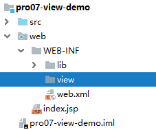

### 5、功能清单

- 显示首页：浏览器通过index.html访问首页Servlet，然后再解析对应的模板视图
- 显示列表：在首页点击超链接，跳转到目标页面把所有士兵的信息列表显示出来
- 删除信息：在列表上点击删除超链接，执行信息的删除操作
- 新增信息：
  - 在列表页面点击超链接跳转到新增士兵信息的表单页面
  - 在新增信息的表单页面点击提交按钮执行保存
- 更新信息：
  - 在列表上点击更新超链接，跳转到更新士兵信息的表单页面：表单回显
  - 在更新信息的表单页面点击提交按钮执行更新

### 6、显示首页

#### 目标

浏览器访问index.html，通过首页Servlet，渲染视图，显示首页。

#### 思路

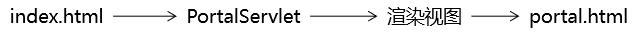

#### 代码

##### [1]创建PortalServlet

```xml
<servlet>
    <servlet-name>PortalServlet</servlet-name>
    <servlet-class>com.atguigu.demo.servlet.PortalServlet</servlet-class>
</servlet>
<servlet-mapping>
    <servlet-name>PortalServlet</servlet-name>
    <url-pattern>/index.html</url-pattern>
</servlet-mapping>
```

Servlet代码：

```java
public class PortalServlet extends ViewBaseServlet {

    @Override
    protected void doGet(HttpServletRequest request, HttpServletResponse response) throws ServletException, IOException {

        String viewName = "portal";

        super.processTemplate(viewName, request, response);

    }

    @Override
    protected void doPost(HttpServletRequest request, HttpServletResponse response) throws ServletException, IOException {
    }
}
```

##### [2]创建portal.html

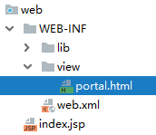

```html
<!DOCTYPE html>
<html lang="en" xmlns:th="http://www.thymeleaf.org">
<head>
    <meta charset="UTF-8">
    <title>士兵信息管理系统</title>
</head>
<body>

    <a th:href="@{/SoldierServlet?method=showList}">显示士兵信息列表</a>

</body>
</html>
```

### 7、显示列表

#### 目标

在目标页面显示所有士兵信息，士兵信息是从数据库查询出来的

#### 思路

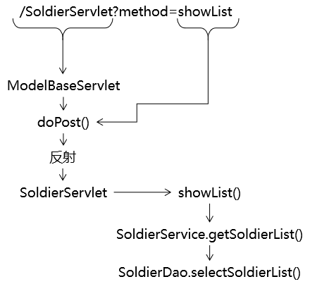

#### 代码

##### [1]ModelBaseServlet

创建这个基类的原因是：我们希望每一个模块能够对应同一个Servlet，这个模块所需要调用的所有方法都集中在同一个Servlet中。如果没有这个ModelBaseServlet基类，我们doGet()、doPost()方法可以用来处理请求，这样一来，每一个方法都需要专门创建一个Servlet（就好比咱们之前的LoginServlet、RegisterServlet其实都应该合并为UserServlet）。

```java
public class ModelBaseServlet extends ViewBaseServlet {

    protected void doGet(HttpServletRequest request, HttpServletResponse response) throws ServletException, IOException {

        // 在doGet()方法中调用doPost()方法，这样就可以在doPost()方法中集中处理所有请求
        doPost(request, response);
    }

    protected void doPost(HttpServletRequest request, HttpServletResponse response) throws ServletException, IOException {

        // 1.从请求参数中获取method对应的数据
        String method = request.getParameter("method");

        // 2.通过反射调用method对应的方法
        // ①获取Class对象
        Class<? extends ModelBaseServlet> clazz = this.getClass();

        try {
            // ②获取method对应的Method对象
            Method methodObject = clazz.getDeclaredMethod(method, HttpServletRequest.class, HttpServletResponse.class);

            // ③打开访问权限
            methodObject.setAccessible(true);

            // ④通过Method对象调用目标方法
            methodObject.invoke(this, request, response);
        } catch (Exception e) {
            e.printStackTrace();

            throw new RuntimeException(e);
        }
    }

}
```

##### [2]SoldierDao.selectSoldierList()

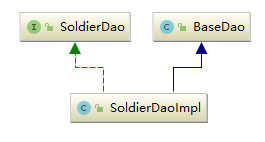

接口方法：

```java
public interface SoldierDao {

    List<Soldier> selectSoldierList();
}
```

实现类方法：

```java
public class SoldierDaoImpl extends BaseDao<Soldier> implements SoldierDao {
    @Override
    public List<Soldier> selectSoldierList() {

        String sql = "select soldier_id soldierId,soldier_name soldierName,soldier_weapon soldierWeapon from t_soldier";

        return getBeanList(Soldier.class, sql);
    }
}
```

##### [3]SoldierService.getSoldierList()

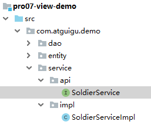

接口方法：

```java
public interface SoldierService {

    List<Soldier> getSoldierList();
}
```

实现类方法：

```java
public class SoldierServiceImpl implements SoldierService {

    private SoldierDao soldierDao = new SoldierDaoImpl();

    @Override
    public List<Soldier> getSoldierList() {

        List<Soldier> soldierList = soldierDao.selectSoldierList();

        return soldierList;
    }
}
```

##### [4]SoldierServlet.showList()

```java
protected void showList(HttpServletRequest request, HttpServletResponse response) throws ServletException, IOException {

    // 1.调用Service方法获取集合数据
    List<Soldier> soldierList = soldierService.getSoldierList();

    // 2.将集合数据存入请求域
    request.setAttribute("soldierList", soldierList);

    // 3.渲染视图（在渲染的过程中，已经包含了转发）
    processTemplate("list", request, response);
}
```

### 8、删除功能

#### 目标

点击页面上的超链接，把数据库表中的记录删除。

#### 思路

##### [1]先不考虑后续

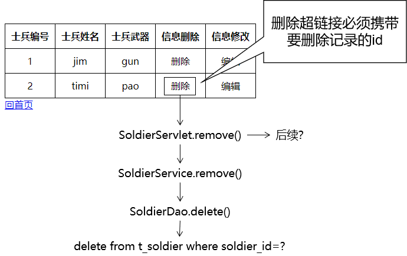

##### [2]加上后续返回响应页面

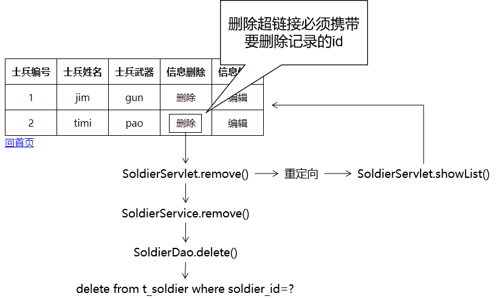

#### 代码

##### [1]完成删除超链接

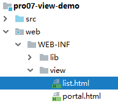

```html
<a th:href="@{/SoldierServlet(soldierId=${soldier.soldierId},method='remove')}">删除</a>
```

```txt
> 关于@{地址}附加请求参数的语法格式：
> 只有一个请求参数：@{地址(请求参数名=普通字符串)}或@{地址(请求参数名=${需要解析的表达式})}
> 多个请求参数：@{地址(名=值,名=值)}
```

官方文档中的说明如下：


##### [2]Servlet方法

```java
protected void remove(HttpServletRequest request, HttpServletResponse response) throws ServletException, IOException {

    // 1.从请求参数中获取士兵信息的id值
    String soldierId = request.getParameter("soldierId");

    // 2.调用Service方法执行删除操作
    soldierService.remove(soldierId);

    // 3.后续……
    // 方案一：还是直接前往list.html，需要重新查询soldierList数据，代码重复
    // 1.调用Service方法获取集合数据
    // List<Soldier> soldierList = soldierService.getSoldierList();

    // 2.将集合数据存入请求域
    // request.setAttribute("soldierList", soldierList);

    // processTemplate("list", request, response);

    // 方案二：直接调用隔壁的showList()
    // 也能实现需求，但是总感觉这样调用方法破坏了程序的结构
    // showList(request, response);

    // 方案三：通过请求转发的方式间接调用showList()方法
    // request.getRequestDispatcher("/SoldierServlet?method=showList").forward(request, response);

    // 方案四：通过请求重定向的方式间接调用showList()方法
    response.sendRedirect(request.getContextPath() + "/SoldierServlet?method=showList");
}
```

##### [3]Service方法

```java
    @Override
    public void remove(String soldierId) {
        soldierDao.delete(soldierId);
    }
```

##### [4]Dao方法

```java
    @Override
    public void delete(String soldierId) {
        String sql = "delete from t_soldier where soldier_id=?";

        update(sql, soldierId);
    }
```

### 9、前往新增信息的表单页面

#### 创建超链接

```html
<a th:href="@{/SoldierServlet?method=toAddPage}">前往新增页面</a>
```

#### Servlet

```java
protected void toAddPage(HttpServletRequest request, HttpServletResponse response) throws ServletException, IOException {
    processTemplate("add-page", request, response);
}
```

#### 创建表单页面

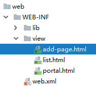

```html
<form th:action="@{/SoldierServlet}" method="post">

    <input type="hidden" name="method" value="saveSoldier" />

    士兵姓名：<input type="text" name="soldierName" /><br/>
    士兵武器：<input type="text" name="soldierWeapon" /><br/>

    <button type="submit">保存</button>

</form>
```

### 10、执行保存

#### 目标

提交表单后，将表单数据封装为Soldier对象，然后将Soldier对象保存到数据库。

#### 思路

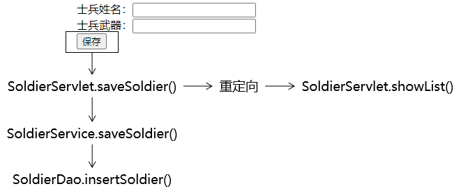

#### 代码

##### [1]Servlet方法

```java
protected void saveSoldier(HttpServletRequest request, HttpServletResponse response) throws ServletException, IOException {

    // 1.获取请求参数
    String soldierName = request.getParameter("soldierName");
    String soldierWeapon = request.getParameter("soldierWeapon");

    // 2.创建Soldier对象
    Soldier soldier = new Soldier(null, soldierName, soldierWeapon);

    // 3.调用Service方法
    soldierService.saveSoldier(soldier);

    // 4.重定向请求
    response.sendRedirect(request.getContextPath() + "/SoldierServlet?method=showList");
}
```

##### [2]Service方法

```java
    @Override
    public void saveSoldier(Soldier soldier) {

        soldierDao.insertSoldier(soldier);

    }
```

##### [3]Dao方法

```java
    @Override
    public void insertSoldier(Soldier soldier) {

        String sql = "insert into t_soldier(soldier_name,soldier_weapon) values(?,?)";

        update(sql, soldier.getSoldierName(), soldier.getSoldierWeapon());
    }
```

### 11、前往修改信息的表单页面

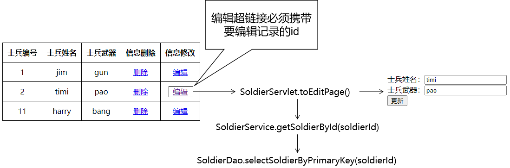

#### 创建超链接

```html
<a th:href="@{/SoldierServlet(soldierId=${soldier.soldierId},method=toEditPage)}">编辑</a>
```

#### Servlet方法

```java
protected void toEditPage(HttpServletRequest request, HttpServletResponse response) throws ServletException, IOException {

    // 1.从请求参数获取soldierId
    String soldierId = request.getParameter("soldierId");

    // 2.根据soldierId查询Soldier对象
    Soldier soldier = soldierService.getSoldierById(soldierId);

    // 3.将Soldier对象存入请求域
    request.setAttribute("soldier", soldier);

    // 4.前往更新的表单页面
    processTemplate("edit-page", request, response);

}
```

#### Service方法

```java
    @Override
    public Soldier getSoldierById(String soldierId) {
        return soldierDao.selectSoldierByPrimaryKey(soldierId);
    }
```

#### Dao方法

```java
@Override
public Soldier selectSoldierByPrimaryKey(String soldierId) {
    String sql = "select soldier_id soldierId,soldier_name soldierName,soldier_weapon soldierWeapon from t_soldier where soldier_id=?";

    return getBean(Soldier.class, sql, soldierId);
}
```

#### 表单页面

```html
<form th:action="@{/SoldierServlet}" method="post">

    <input type="hidden" name="method" value="updateSoldier" />
    <input type="hidden" name="soldierId" th:value="${soldier.soldierId}" />

    士兵姓名：<input type="text" name="soldierName" th:value="${soldier.soldierName}" /><br/>
    士兵武器：<input type="text" name="soldierWeapon" th:value="${soldier.soldierWeapon}" /><br/>

    <button type="submit">更新</button>

</form>
```

### 12、执行更新

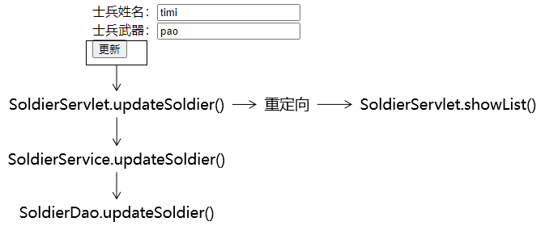

#### Servlet方法

```java
protected void updateSoldier(HttpServletRequest request, HttpServletResponse response) throws ServletException, IOException {

    // 1.获取请求参数
    String soldierIdOrigin = request.getParameter("soldierId");
    Integer soldierId = Integer.parseInt(soldierIdOrigin);
    String soldierName = request.getParameter("soldierName");
    String soldierWeapon = request.getParameter("soldierWeapon");

    // 2.封装对象
    Soldier soldier = new Soldier(soldierId, soldierName, soldierWeapon);

    // 3.调用Service方法执行更新
    soldierService.updateSoldier(soldier);

    // 4.重定向请求
    response.sendRedirect(request.getContextPath() + "/SoldierServlet?method=showList");
}
```

#### Service方法

```java
    @Override
    public void updateSoldier(Soldier soldier) {

        soldierDao.updateSoldier(soldier);

    }
```

#### Dao方法

```java
@Override
public void updateSoldier(Soldier soldier) {
    String sql = "update t_soldier set soldier_name=?,soldier_weapon=? where soldier_id=?";
    update(sql, soldier.getSoldierName(), soldier.getSoldierWeapon(), soldier.getSoldierId());
}
```

### 13、请求字符集设置

- 设置请求体字符集需要调用request.setCharacterEncoding("UTF-8");
- request.setCharacterEncoding("UTF-8");要求在所有request.getParameter()前面
- 在执行子类Servlet方法时，其实都是先调用父类ModelBaseServlet的doPost()方法
- doPost()方法中包含获取method请求参数的操作
- 所以最前面的request.getParameter()在doPost()方法中
- 所以request.setCharacterEncoding("UTF-8");要放在doPost()方法的request.getParameter()前面

```java
protected void doPost(HttpServletRequest request, HttpServletResponse response) throws ServletException, IOException {

    // 0.在所有request.getParameter()前面设置解析请求体的字符集
    request.setCharacterEncoding("UTF-8");

    // 1.从请求参数中获取method对应的数据
    String method = request.getParameter("method");

    // ……
}
```
