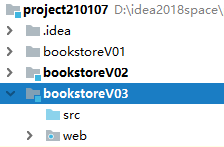
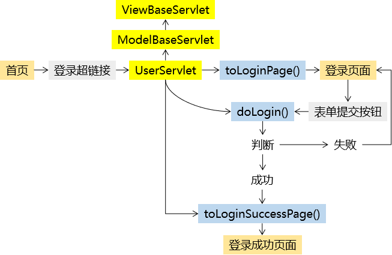
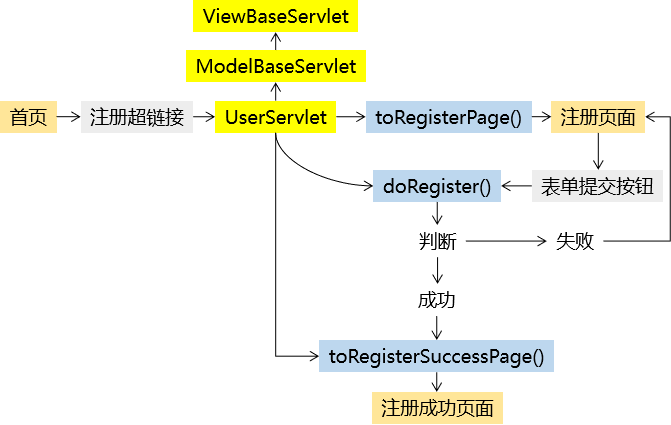
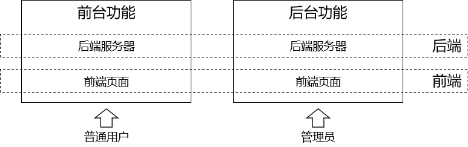
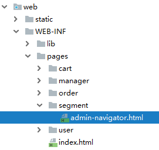

---
# 当前页面内容标题
title: 13、书城项目第三阶段
# 当前页面图标
icon: folder
# 分类
category:
  - javaweb
  - java
# 标签
tag:
  - javaweb
  - java
sticky: true
# 是否收藏在博客主题的文章列表中，当填入数字时，数字越大，排名越靠前。
star: false
# 是否将该文章添加至文章列表中
article: true
# 是否将该文章添加至时间线中
timeline: true
---

# 13、书城项目第三阶段

## 一、创建module，迁移代码

### 1、创建module



把index.jsp删除

### 2、加入jar包

> attoparser-2.0.5.RELEASE.jar commons-dbutils-1.6.jar druid-1.1.9.jar hamcrest-core-1.3.jar javassist-3.20.0-GA.jar junit-4.12.jar log4j-1.2.15.jar mysql-connector-java-5.1.37-bin.jar ognl-3.1.26.jar slf4j-api-1.7.25.jar slf4j-log4j12-1.7.25.jar thymeleaf-3.0.12.RELEASE.jar unbescape-1.1.6.RELEASE.jar

### 3、从V02迁移代码

#### ①src目录下的Java源代码

- 在V02的module中的src目录上点右键
- show in explorer在操作系统的窗口内打开
- 在操作系统的窗口内复制package目录和jdbc.properties
- 在操作系统的窗口内粘贴到V03的module中的src目录下
- 在V03的src目录下，找到上一个版本的Servlet，全部删除
- 创建两个子包
  - 存放Servlet基类：com.atguigu.bookstore.servlet.base
  - 存放Servlet子类：com.atguigu.bookstore.servlet.model
- 从view-demo中，将两个基类迁移过来
  - 视图基类：ViewBaseServlet
  - 方法分发基类：ModelBaseServlet

#### ②前端页面

- 将V02中的pages目录整体复制到V03 module的**WEB-INF目录**下
- 将V02中的static目录整体复制到V03 module的**web目录**下
- 将V02中的index.html复制到V03 module的WEB-INF/pages目录下，将来通过Servlet访问

### 4、显示首页

#### 配置web.xml

```xml
<!-- 在上下文参数中配置视图前缀和视图后缀 -->
<context-param>
    <param-name>view-prefix</param-name>
    <param-value>/WEB-INF/pages/</param-value>
</context-param>
<context-param>
    <param-name>view-suffix</param-name>
    <param-value>.html</param-value>
</context-param>
```

**注意**：这里需要将WEB-INF下的view改成pages，和当前项目环境的目录结构一致。

#### 创建PortalServlet

**注意**：这个PortalServlet映射的地址是/index.html，这样才能保证访问首页时访问它。

```xml
<servlet>
    <servlet-name>PortalServlet</servlet-name>
    <servlet-class>com.atguigu.bookstore.servlet.model.PortalServlet</servlet-class>
</servlet>
<servlet-mapping>
    <servlet-name>PortalServlet</servlet-name>
    <url-pattern>/index.html</url-pattern>
</servlet-mapping>
```

**注意**：PortalServlet服务于首页的显示，为了降低用户访问首页的门槛，不能附加任何请求参数，所以不能继承ModelBaseServlet，只能继承ViewBaseServlet。

```java
public class PortalServlet extends ViewBaseServlet {

    protected void doGet(HttpServletRequest request, HttpServletResponse response) throws ServletException, IOException {

        // 将两种请求方式的处理逻辑合并到一个方法
        doPost(request, response);
    }

    protected void doPost(HttpServletRequest request, HttpServletResponse response) throws ServletException, IOException {

        // 声明视图名称
        String viewName = "index";

        // 解析模板视图
        processTemplate(viewName, request, response);
    }
}
```

#### 调整index.html

- 加入Thymeleaf名称空间

```html
<html lang="en" xmlns:th="http://www.thymeleaf.org">
```

- 修改base标签

```html
<base th:href="@{/}" href="/bookstore/"/>
```

## 二、完成用户模块

### 1、重构登录功能

#### ①思路



#### ②实现：创建并组装组件

##### [1]创建UserServlet

web.xml中的配置：

```xml
<servlet>
    <servlet-name>UserServlet</servlet-name>
    <servlet-class>com.atguigu.bookstore.servlet.model.UserServlet</servlet-class>
</servlet>
<servlet-mapping>
    <servlet-name>UserServlet</servlet-name>
    <url-pattern>/UserServlet</url-pattern>
</servlet-mapping>
```

Java代码：

```java
public class UserServlet extends ModelBaseServlet {
    protected void doLogin(HttpServletRequest request, HttpServletResponse response) throws ServletException, IOException {

    }

    protected void toLoginPage(HttpServletRequest request, HttpServletResponse response) throws ServletException, IOException {

    }

    protected void toLoginSuccessPage(HttpServletRequest request, HttpServletResponse response) throws ServletException, IOException {

    }
}
```

**注意**：记得修改UserServlet继承的类ModelBaseServlet。

##### [2]把UserService组件组装到UserServlet中

```java
public class UserServlet extends ModelBaseServlet {

    private UserService userService = new UserServiceImpl();
```

#### ③实现：前往登录页面

##### [1]修改首页中登录超链接

```html
<a href="UserServlet?method=toLoginPage" class="login">登录</a>
```

##### [2]完成UserServlet.toLoginPage()方法

```java
protected void toLoginPage(HttpServletRequest request, HttpServletResponse response) throws ServletException, IOException {
    String viewName = "user/login";

    processTemplate(viewName, request, response);
}
```

#### [3]调整登录页面代码

- 加入Thymeleaf名称空间

```html
<html lang="en" xmlns:th="http://www.thymeleaf.org">
```

- 修改base标签

```html
<base th:href="@{/}" href="/bookstore/" />
```

- 修改form标签action属性

```html
<form id="loginForm" action="UserServlet" method="post">
```

- 增加method请求参数的表单隐藏域

```html
<input type="hidden" name="method" value="doLogin" />
```

- 根据条件显示登录失败消息

```html
<p style="color: red;font-weight: bold;" th:if="${not #strings.isEmpty(message)}" th:text="${message}">这里根据条件显示登录失败消息</p>
```

##### [4]回显表单中的用户名

遇到问题：使用th:value="${param.username}"确实实现了服务器端渲染，但是实际打开页面并没有看到。原因是页面渲染顺序：

- 服务器端渲染
- 服务器端将渲染结果作为响应数据返回给浏览器
- 浏览器加载HTML文档
- 读取到Vue代码后，执行Vue代码
- Vue又进行了一次浏览器端渲染，覆盖了服务器端渲染的值

解决办法：将服务器端渲染的结果设置到Vue对象的data属性中。

```javascript
new Vue({
    "el":"#loginForm",
    "data":{
        "username":"[[${param.username}]]",
        "password":""
    },
```

#### 实现：前往登录成功页面

UserServlet.toLoginSuccessPage()

```java
protected void toLoginSuccessPage(HttpServletRequest request, HttpServletResponse response) throws ServletException, IOException {
    String viewName = "user/login_success";

    processTemplate(viewName, request, response);
}
```

login_success.html

```html
<html lang="en" xmlns:th="http://www.thymeleaf.org">
    ……
<base th:href="@{/}" href="/bookstore/"/>
```

#### ⑤实现：完成登录操作

```java
protected void doLogin(HttpServletRequest request, HttpServletResponse response) throws ServletException, IOException {

    // 1.从请求参数中获取用户名和密码
    String username = request.getParameter("username");
    String password = request.getParameter("password");

    // 2.封装为User对象
    User userForm = new User(null, username, password, null);

    // 3.调用UserService的方法执行登录验证
    try {
        User userDB = userService.doLogin(userForm);

        // 4.登录成功后跳转到登录成功页面
        response.sendRedirect(request.getContextPath() + "/UserServlet?method=toLoginSuccessPage");
    } catch (Exception e) {
        e.printStackTrace();

        // 5.登录失败则显示提示消息
        // ①将登录失败的提示消息存入请求域
        request.setAttribute("message", e.getMessage());

        // ②执行登录页面的模板渲染
        String viewName = "user/login";

        processTemplate(viewName, request, response);
    }

}
```

### 2、重构注册功能

#### ①思路



#### ②实现：前往注册页面

##### [1]修改首页中注册超链接

```html
<a href="UserServlet?method=toRegisterPage" class="register">注册</a>
```

##### [2]完成UserServlet.toRegisterPage()方法

```java
protected void toRegisterPage(HttpServletRequest request, HttpServletResponse response) throws ServletException, IOException {

    String viewName = "user/regist";

    processTemplate(viewName, request, response);

}
```

##### [3]调整注册页面代码

```html
<html lang="en" xmlns:th="http://www.thymeleaf.org">
    ……
<base th:href="@{/}" href="/bookstore/"/>
    ……
    <form id="registerForm" action="UserServlet" method="post">
                    <input type="hidden" name="method" value="doRegister" />
        ……
        <p style="color: red;font-weight: bold;" th:if="${not #strings.isEmpty(message)}" th:text="${message}">这里根据条件显示注册失败消息</p>
```

```javascript
new Vue({
    "el":"#registerForm",
    "data":{
        "username":"[[${param.username}]]",
        "password":"",
        "passwordConfirm":"",
        "email":"[[${param.email}]]",
        "code":"",
        "usernameCheckMessage":""
    }
```

#### ③实现：前往注册成功页面

UserServlet：

```java
protected void toRegisterSuccessPage(HttpServletRequest request, HttpServletResponse response) throws ServletException, IOException {

    String viewName = "user/regist_success";

    processTemplate(viewName, request, response);

}
```

regist_success.html：

```html
<html lang="en" xmlns:th="http://www.thymeleaf.org">
    ……
<base th:href="@{/}" href="/bookstore/"/>
```

#### ④实现：完成注册操作

```java
protected void doRegister(HttpServletRequest request, HttpServletResponse response) throws ServletException, IOException {
    // 1.从请求参数中获取数据封装为User对象
    String username = request.getParameter("username");
    String password = request.getParameter("password");
    String email = request.getParameter("email");

    User userForm = new User(null, username, password, email);

    // 2.调用UserService的方法执行注册
    try {
        userService.doRegister(userForm);

        // 3.如果没有抛出异常那么就跳转到注册成功的页面
        // 选择重定向的原因：跳转到regist_success.html页面后，用户刷新浏览器不会重复提交注册表单
        response.sendRedirect(request.getContextPath()+"/UserServlet?method=toRegisterSuccessPage");
    } catch (Exception e) {
        e.printStackTrace();

        // 4.如果抛出了异常
        request.setAttribute("message", e.getMessage());

        String viewName = "user/regist";

        processTemplate(viewName, request, response);
    }
}
```

## 三、进入后台开发

### 1、概念辨析



### 2、访问后台首页

#### ①思路

首页→后台系统超链接→AdminServlet.toPortalPage()→manager.html

#### ②实现：创建AdminServlet

web.xml

```xml
<servlet>
    <servlet-name>AdminServlet</servlet-name>
    <servlet-class>com.atguigu.bookstore.servlet.model.AdminServlet</servlet-class>
</servlet>
<servlet-mapping>
    <servlet-name>AdminServlet</servlet-name>
    <url-pattern>/AdminServlet</url-pattern>
</servlet-mapping>
```

Java代码：

```java
public class AdminServlet extends ModelBaseServlet {
    protected void toPortalPage(HttpServletRequest request, HttpServletResponse response) throws ServletException, IOException {

        String viewName = "manager/manager";

        processTemplate(viewName, request, response);

    }
}
```

#### ③实现：调整manager.html

```html
<html lang="en" xmlns:th="http://www.thymeleaf.org">
<head>
    <base th:href="@{/}" href="/bookstore/"/>
```

然后去除页面上的所有“../”。

#### ④实现：抽取页面公共部分

##### [1]公共部分内容

三个超链接：

```html
          <a href="./book_manager.html" class="order">图书管理</a>
          <a href="./order_manager.html" class="destory">订单管理</a>
          <a href="../../index.html" class="gohome">返回商城</a>
```

##### [2]抽取它们的理由

为了实现链接地址修改时：一处修改，处处生效

##### [3]创建包含代码片段的页面



```html
<!DOCTYPE html>
<html lang="en" xmlns:th="http://www.thymeleaf.org">
<head>
    <meta charset="UTF-8">
    <title>Title</title>
</head>
<body>

    <!-- 使用th:fragment属性给代码片段命名 -->
    <div th:fragment="navigator">
        <a href="book_manager.html" class="order">图书管理</a>
        <a href="order_manager.html" class="destory">订单管理</a>
        <a href="index.html" class="gohome">返回商城</a>
    </div>

</body>
</html>
```

##### [4]在有需要的页面引入片段

```html
<div th:include="segment/admin-navigator :: navigator"></div>
```

## 四、后台图书CRUD

> C：Create 增
>
> R：Retrieve 查
>
> U：Update 改
>
> D：Delete 删

### 1、建模

#### ①物理建模

[点击这里查看SQL文件](https://heavy_code_industry.gitee.io/code_heavy_industry/pro001-javaweb/lecture/bookstore03/bookstore.sql)

> 注：上面链接建议点右键→目标另存为，直接打开会显示乱码

#### ②逻辑建模

```java
package com.atguigu.bookstore.entity;

public class Book {

    private Integer bookId;
    private String bookName;
    private String author;
    private Double price;
    private Integer sales;
    private Integer stock;
    private String imgPath;
```

### 2、创建并组装组件

#### ①创建Servlet

**注意**：由于项目分成『前台』和『后台』，所以Servlet也分成两个：

- 前台：BookPortalServlet
- 后台：BookManagerServlet

#### ②创建BookService

- 接口：BookService
- 实现类：BookServiceImpl

#### ③创建BookDao

- 接口：BookDao
- 实现类：BookDaoImpl

#### ④组装

- 给BookManagerServlet组装BookService
- 给BookService组装BookDao

### 3、图书列表显示功能

#### ①思路

manager.html→图书管理超链接→BookManagerServlet→showBookList()→book_manager.html

#### ②实现：修改图书管理超链接

超链接所在文件位置：

> WEB-INF/pages/segment/admin-navigator.html

```html
<a href="BookManagerServlet?method=showBookList" class="order">图书管理</a>
```

#### ③实现：BookManagerServlet.showBookList()

```java
protected void showBookList(HttpServletRequest request, HttpServletResponse response) throws ServletException, IOException {

    // 1.调用Service方法查询图书列表
    List<Book> bookList = bookService.getBookList();

    // 2.将图书列表数据存入请求域
    request.setAttribute("bookList", bookList);

    // 3.执行视图模板渲染
    String viewName = "manager/book_manager";

    processTemplate(viewName, request, response);

}
```

#### ④实现：BookService.getBookList()

```java
    @Override
    public List<Book> getBookList() {
        return bookDao.selectBookList();
    }
```

#### ⑤实现：BookDao.selectBookList()

```java
@Override
public List<Book> selectBookList() {

    String sql = "select book_id bookId, book_name bookName, author, price, sales, stock, img_path imgPath from t_book order by book_Id desc";

    return getBeanList(Book.class, sql);
}
```

#### ⑥实现：调整book_manager.html

- Thymeleaf名称空间
- base标签
- 路径中的../和./
- 包含进来的代码片段

#### ⑦实现：在book_manager.html中迭代显示图书列表

```html
<tbody th:if="${#lists.isEmpty(bookList)}">
    <tr>
        <td colspan="7">抱歉，没有查询到您要的数据！</td>
    </tr>
</tbody>
<tbody th:if="${not #lists.isEmpty(bookList)}">
    <tr th:each="book : ${bookList}">
        <td>
            
        </td>
        <td th:text="${book.bookName}">活着</td>
        <td th:text="${book.price}">100.00</td>
        <td th:text="${book.author}">余华</td>
        <td th:text="${book.sales}">200</td>
        <td th:text="${book.stock}">400</td>
        <td>
            <a href="book_edit.html">修改</a><a href="" class="del">删除</a>
        </td>
    </tr>
</tbody>
```

### 4、图书删除功能

#### ①思路

book_manager.html→删除超链接→BookManagerServlet.removeBook()→重定向显示列表功能

#### ②实现：删除超链接

```html
<a th:href="@{/BookManagerServlet(method=removeBook,bookId=${book.bookId})}" class="del">删除</a>
```

#### ③实现：BookManagerServlet.removeBook()

```java
protected void removeBook(HttpServletRequest request, HttpServletResponse response) throws ServletException, IOException {

    // 1.从请求参数中获取bookId
    String bookId = request.getParameter("bookId");

    // 2.调用Service方法执行删除
    bookService.removeBook(bookId);

    // 3.重定向到显示列表功能
    response.sendRedirect(request.getContextPath() + "/BookManagerServlet?method=showBookList");

}
```

#### ④实现：BookService.removeBook()

```java
    @Override
    public void removeBook(String bookId) {
        bookDao.deleteBook(bookId);
    }
```

#### ⑤实现：BookDao.deleteBook()

```java
    @Override
    public void deleteBook(String bookId) {
        String sql = "delete from t_book where book_id=?";

        update(sql, bookId);
    }
```

### 5、新增图书功能

#### ①思路

book_manager.html→添加图书超链接→BookManagerServlet.toAddPage()→book_add.html

book_add.html→提交表单→BookManagerServlet.saveBook()→重定向显示列表功能

#### ②实现：添加图书超链接

```html
<a href="BookManagerServlet?method=toAddPage">添加图书</a>
```

#### ③实现：BookManagerServlet.toAddPage()

```html
protected void toAddPage(HttpServletRequest request, HttpServletResponse response) throws ServletException, IOException {

    String viewName = "book_add";

    processTemplate(viewName, request, response);

}
```

#### ④实现：book_add.html

由book_edit.html复制出来，然后调整表单标签：

```html
<form action="BookManagerServlet" method="post">
    <input type="hidden" name="method" value="saveBook" />
    <input type="text" name="bookName" placeholder="请输入名称"/>
    <input type="number" name="price" placeholder="请输入价格"/>
    <input type="text" name="author" placeholder="请输入作者"/>
    <input type="number" name="sales" placeholder="请输入销量"/>
    <input type="number" name="stock" placeholder="请输入库存"/>
```

#### ⑤实现：BookManagerServlet.saveBook()

```java
protected void saveBook(HttpServletRequest request, HttpServletResponse response) throws ServletException, IOException {

    // 1.获取请求参数
    String bookName = request.getParameter("bookName");
    String price = request.getParameter("price");
    String author = request.getParameter("author");
    String sales = request.getParameter("sales");
    String stock = request.getParameter("stock");

    // 2.封装对象

    // ※imgPath按说应该通过文件上传的方式提供，但是现在这个技术还没学
    // 所以暂时使用一个固定值
    String imgPath = "static/uploads/mi.jpg";

    Book book = new Book(null, bookName, author, Double.parseDouble(price), Integer.parseInt(sales), Integer.parseInt(stock), imgPath);

    // 3.调用Service方法执行保存
    bookService.saveBook(book);

    // 4.重定向到显示列表页面
    response.sendRedirect(request.getContextPath() + "/BookManagerServlet?method=showBookList");
}
```

#### ⑥实现：BookService.saveBook()

```java
    @Override
    public void saveBook(Book book) {
        bookDao.insertBook(book);
    }
```

#### ⑦实现：BookDao.insertBook()

```java
@Override
public void insertBook(Book book) {
    String sql = "insert  into `t_book`(`book_name`,`author`,`price`,`sales`,`stock`,`img_path`) values (?,?,?,?,?,?)";

    update(sql, book.getBookName(), book.getAuthor(), book.getPrice(), book.getSales(), book.getStock(), book.getImgPath());
}
```

### 6、修改图书功能

#### ①思路

book_manager.html→修改图书超链接→BookManagerServlet.toEditPage()→book_edit.html（表单回显）

book_edit.html→提交表单→BookManagerServlet.updateBook()→重定向显示列表功能

#### ②实现：修改图书超链接

```html
<a th:href="@{/BookManagerServlet(method=toEditPage,bookId=${book.bookId})}">删除</a>
```

#### ③实现：BookManagerServlet.toEditPage()

```java
protected void toEditPage(HttpServletRequest request, HttpServletResponse response) throws ServletException, IOException {

    // 1.从请求参数中获取bookId
    String bookId = request.getParameter("bookId");

    // 2.根据bookId查询对应的Book对象
    Book book = bookService.getBookById(bookId);

    // 3.把Book对象存入请求域
    request.setAttribute("book", book);

    // 4.渲染视图
    String viewName = "manager/book_edit";

    processTemplate(viewName, request, response);

}
```

#### ④实现：BookService.getBookById()

```java
    @Override
    public Book getBookById(String bookId) {
        return bookDao.selectBookByPrimaryKey(bookId);
    }
```

#### ⑤实现：BookDao.selectBookByPrimaryKey()

```java
@Override
public Book selectBookByPrimaryKey(String bookId) {

    String sql = "select book_id bookId, book_name bookName, author, price, sales, stock, img_path imgPath from t_book where book_id=?";

    return getBean(Book.class, sql, bookId);
}
```

#### ⑥实现：book_edit.html（表单回显）

```html
<form action="BookManagerServlet" method="post">
    <input type="hidden" name="method" value="updateBook" />
    <input type="text" name="bookName" th:value="${book.bookName}" placeholder="请输入名称"/>
    <input type="number" name="price" th:value="${book.price}" placeholder="请输入价格"/>
    <input type="text" name="author" th:value="${book.author}" placeholder="请输入作者"/>
    <input type="number" name="sales" th:value="${book.sales}" placeholder="请输入销量"/>
    <input type="number" name="stock" th:value="${book.stock}" placeholder="请输入库存"/>

    <button class="btn">更新</button>
```

#### ⑦实现：BookManagerServlet.updateBook()

```java
protected void updateBook(HttpServletRequest request, HttpServletResponse response) throws ServletException, IOException {

    // 1.获取请求参数
    String bookId = request.getParameter("bookId");
    String bookName = request.getParameter("bookName");
    String price = request.getParameter("price");
    String author = request.getParameter("author");
    String sales = request.getParameter("sales");
    String stock = request.getParameter("stock");

    // 2.封装对象
    Book book = new Book(Integer.parseInt(bookId), bookName, author, Double.parseDouble(price), Integer.parseInt(sales), Integer.parseInt(stock), null);

    // 3.调用Service方法执行更新
    bookService.updateBook(book);

    // 4.渲染视图
    response.sendRedirect(request.getContextPath() + "/BookManagerServlet?method=showBookList");
}
```

#### ⑧实现：BookService.updateBook()

```java
    @Override
    public void updateBook(Book book) {
        bookDao.updateBook(book);
    }
```

#### ⑨实现：BookDao.updateBook()

**注意**：这里不修改imgPath字段

```java
@Override
public void updateBook(Book book) {
    String sql = "update t_book set book_name=?, author=?, price=?, sales=?, stock=? where book_id=?";

    update(sql, book.getBookName(), book.getAuthor(), book.getPrice(), book.getSales(), book.getStock(), book.getBookId());
}
```

## 五、前台图书展示

### 1、思路

index.html→PortalServlet.doPost()→把图书列表数据查询出来→渲染视图→页面迭代显示图书数据

### 2、实现：PortalServlet.doPost()

```java
public class PortalServlet extends ViewBaseServlet {

    private BookService bookService = new BookServiceImpl();

    protected void doGet(HttpServletRequest request, HttpServletResponse response) throws ServletException, IOException {

        // 将两种请求方式的处理逻辑合并到一个方法
        doPost(request, response);
    }

    protected void doPost(HttpServletRequest request, HttpServletResponse response) throws ServletException, IOException {

        // 查询图书列表数据
        List<Book> bookList = bookService.getBookList();

        // 将图书列表数据存入请求域
        request.setAttribute("bookList", bookList);

        // 声明视图名称
        String viewName = "index";

        // 解析模板视图
        processTemplate(viewName, request, response);

    }

}
```

### 3、实现：页面迭代显示图书数据

页面文件：index.html

```html
<div class="list-content" th:if="${#lists.isEmpty(bookList)}">
    抱歉，本商城现在没有上架任何商品
</div>
<div class="list-content" th:if="${not #lists.isEmpty(bookList)}">
    <div class="list-item" th:each="book : ${bookList}">
        
        <p>书名:<span th:text="${book.bookName}">活着</span></p>
        <p>作者:<span th:text="${book.author}">余华</span></p>
        <p>价格:￥<span th:text="${book.price}">66.6</span></p>
        <p>销量:<span th:text="${book.sales}">230</span></p>
        <p>库存:<span th:text="${book.stock}">1000</span></p>
        <button>加入购物车</button>
    </div>
</div>
```
