---
# 当前页面内容标题
title: 14、会话控制
# 当前页面图标
icon: java
# 分类
category:
  - javaweb
  - 会话
  - java
# 标签
tag:
  - javaweb
  - cookie
  - session
  - java
sticky: true
# 是否收藏在博客主题的文章列表中，当填入数字时，数字越大，排名越靠前。
star: false
# 是否将该文章添加至文章列表中
article: true
# 是否将该文章添加至时间线中
timeline: true
---

# 14、会话控制

## 一、提出问题与解决方案核心代码

### 1、提出问题

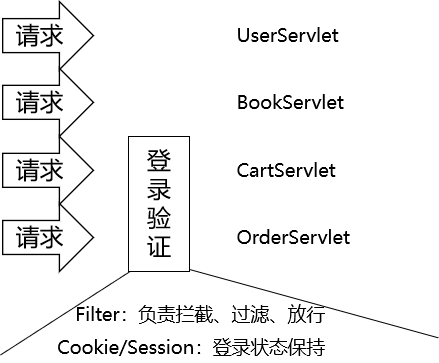

保持用户登录状态，背后的底层逻辑是：服务器在接收到用户请求的时候，有办法判断这个请求来自于之前的某一个用户。所以保持登录状态，本质上是保持**『会话状态』**

### 2、解决方案

#### ①结论

使用HttpSession对象，将数据存入**会话域**就能保持会话状态。

```java
HttpSession session = request.getSession();
session.setAttribute("user", user);
```

#### ②demo体验

#### [1]准备环境

参考[会话控制demo原始纯净版](https://heavy_code_industry.gitee.io/code_heavy_industry/pro001-javaweb/lecture/chapter09/pro08-cookie-and-session.zip)

#### [2]创建将数据存入会话域的Servlet

```java
public class HelloWorldServlet extends ModelBaseServlet {
    protected void setValue(HttpServletRequest request, HttpServletResponse response) throws ServletException, IOException {

        // 1.通过request对象获取session对象
        HttpSession session = request.getSession();

        // 2.设置数据名称和数据的值
        String attrName = "sessionHelloAttrName";
        String attrValue = "sessionHelloAttrValue";

        // 3.将数据存入会话域
        session.setAttribute(attrName, attrValue);

        // 4.渲染视图
        processTemplate("page-target", request, response);
    }
}
```

#### [3]在其他页面从会话域取出数据

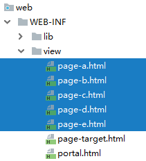

```html
<div th:if="${#strings.isEmpty(session.sessionHelloAttrName)}">
    没有从会话域获取到数据
</div>
<div th:if="${not #strings.isEmpty(session.sessionHelloAttrName)}">
    <p>从会话域读取到：<span th:text="${session.sessionHelloAttrName}"></span></p>
</div>
```

#### [4]操作效果

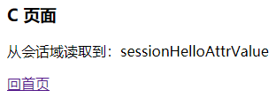

## 二、Cookie的工作机制

### 1、HTTP协议和会话控制

HTTP协议本身是无状态的。单靠HTTP协议本身无法判断一个请求来自于哪一个浏览器，所以也就没法识别用户的身份状态。

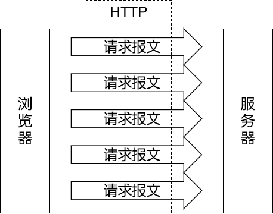

### 2、Cookie介绍

#### ①本质

- 在浏览器端临时存储数据
- 键值对
- 键和值都是字符串类型
- 数据量很小

#### ②Cookie在浏览器和服务器之间的传递

##### [1]没有Cookie的状态

在服务器端没有创建Cookie并返回的情况下，浏览器端不会保存Cookie信息。双方在请求和响应的过程中也不会携带Cookie的数据。

##### [2]创建Cookie对象并返回

```java
// 1.创建Cookie对象
Cookie cookie = new Cookie("cookie-message", "hello-cookie");

// 2.将Cookie对象添加到响应中
response.addCookie(cookie);

// 3.返回响应
processTemplate("page-target", request, response);
```

##### [3]服务器端返回Cookie的响应消息头

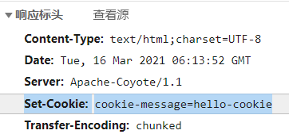

##### [4]浏览器拿到Cookie之后

浏览器拿到Cookie之后，以后的每一个请求都会携带Cookie信息。

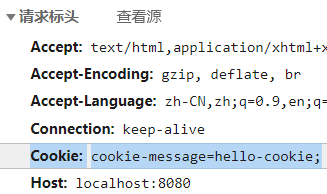

##### [5]服务器端读取Cookie的信息

```java
// 1.通过request对象获取Cookie的数组
Cookie[] cookies = request.getCookies();

// 2.遍历数组
for (Cookie cookie : cookies) {
    System.out.println("cookie.getName() = " + cookie.getName());
    System.out.println("cookie.getValue() = " + cookie.getValue());
    System.out.println();
}
```

#### ③Cookie时效性

##### [1]理论

- 会话级Cookie
  - 服务器端并没有明确指定Cookie的存在时间
  - 在浏览器端，Cookie数据存在于内存中
  - 只要浏览器还开着，Cookie数据就一直都在
  - 浏览器关闭，内存中的Cookie数据就会被释放
- 持久化Cookie
  - 服务器端明确设置了Cookie的存在时间
  - 在浏览器端，Cookie数据会被保存到硬盘上
  - Cookie在硬盘上存在的时间根据服务器端限定的时间来管控，不受浏览器关闭的影响
  - 持久化Cookie到达了预设的时间会被释放

服务器端返回Cookie时附带过期时间的响应消息头如下：

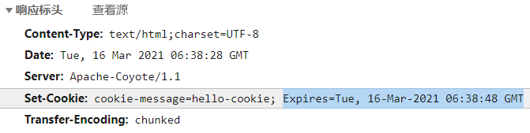

服务器通知浏览器删除Cookie时的响应消息头如下：

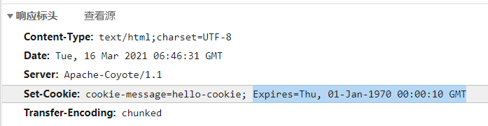

##### [2]代码

```java
// ※给Cookie设置过期时间
// 正数：Cookie的过期时间，以秒为单位
// 负数：表示这个Cookie是会话级的Cookie，浏览器关闭时释放
// 0：通知浏览器立即删除这个Cookie
cookie.setMaxAge(20);
```

##### [3]会话和持久化Cookie对比

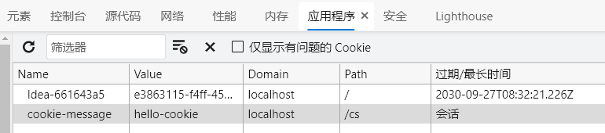

#### ④Cookie的domain和path

上网时间长了，本地会保存很多Cookie。对浏览器来说，访问互联网资源时不能每次都把所有Cookie带上。浏览器会使用Cookie的domain和path属性值来和当前访问的地址进行比较，从而决定是否携带这个Cookie。

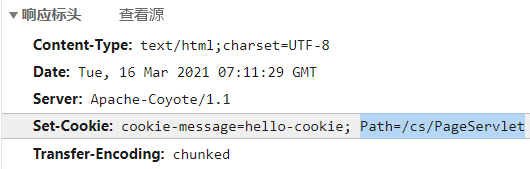

## 三、Session的工作机制

### 1、文字描述

前提：浏览器正常访问服务器

- 服务器端没调用request.getSession()方法：什么都不会发生
- 服务器端调用了request.getSession()方法
  - 服务器端检查当前请求中是否携带了JSESSIONID的Cookie
    - 有：根据JSESSIONID在服务器端查找对应的HttpSession对象
      - 能找到：将找到的HttpSession对象作为request.getSession()方法的返回值返回
      - 找不到：服务器端新建一个HttpSession对象作为request.getSession()方法的返回值返回
    - 无：服务器端新建一个HttpSession对象作为request.getSession()方法的返回值返回

### 2、流程图描述

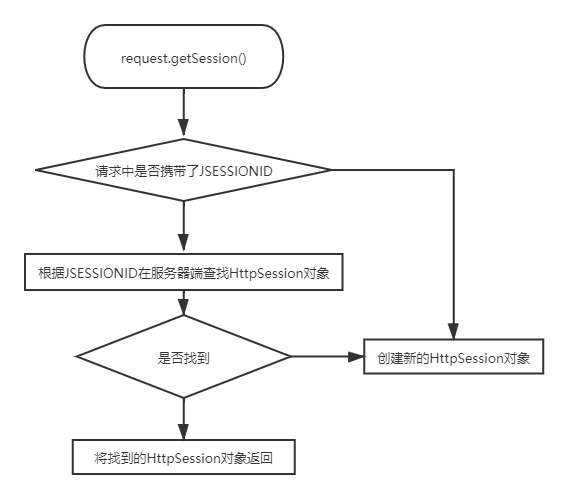

### 3、代码验证

```java
// 1.调用request对象的方法尝试获取HttpSession对象
HttpSession session = request.getSession();

// 2.调用HttpSession对象的isNew()方法
boolean wetherNew = session.isNew();

// 3.打印HttpSession对象是否为新对象
System.out.println("wetherNew = " + (wetherNew?"HttpSession对象是新的":"HttpSession对象是旧的"));

// 4.调用HttpSession对象的getId()方法
String id = session.getId();

// 5.打印JSESSIONID的值
System.out.println("JSESSIONID = " + id);
```

### 4、时效性

#### ①为什么Session要设置时限

用户量很大之后，Session对象相应的也要创建很多。如果一味创建不释放，那么服务器端的内存迟早要被耗尽。

#### ②设置时限的难点

从服务器端的角度，很难精确得知类似浏览器关闭的动作。而且即使浏览器一直没有关闭，也不代表用户仍然在使用。

#### ③服务器端给Session对象设置最大闲置时间

- 默认值：1800秒

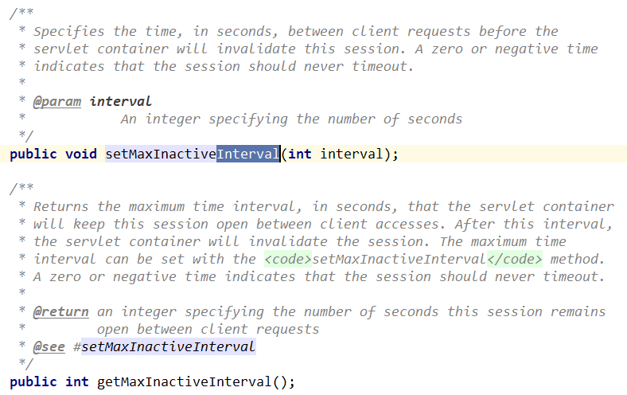

最大闲置时间生效的机制如下：

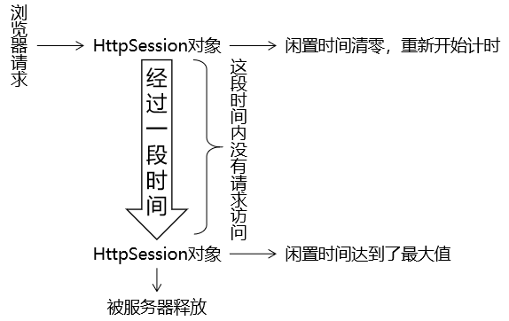

#### ④代码验证

```java
// ※测试时效性
// 获取默认的最大闲置时间
int maxInactiveIntervalSecond = session.getMaxInactiveInterval();
System.out.println("maxInactiveIntervalSecond = " + maxInactiveIntervalSecond);

// 设置默认的最大闲置时间
session.setMaxInactiveInterval(15);
```

#### ⑤强制Session立即失效

```java
session.invalidate();
```

