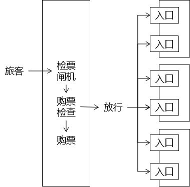
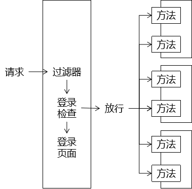
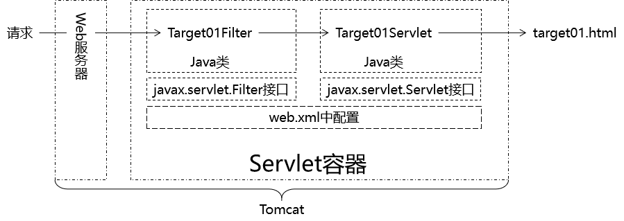
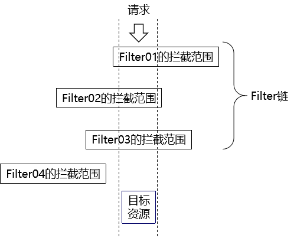

---
# 当前页面内容标题
title: 16、过滤器
# 当前页面图标
icon: java
# 分类
category:
  - javaweb
  - java
  - filter
# 标签
tag:
  - javaweb
  - java
  - filter
sticky: true
# 是否收藏在博客主题的文章列表中，当填入数字时，数字越大，排名越靠前。
star: false
# 是否将该文章添加至文章列表中
article: true
# 是否将该文章添加至时间线中
timeline: true
---

# 16、过滤器

## 一、过滤器简介

### 1、通过类比了解过滤器作用

#### ①坐地铁



#### ②登录检查



### 2、过滤器的三要素

#### ①拦截

过滤器之所以能够对请求进行预处理，关键是对请求进行拦截，把请求拦截下来才能够做后续的操作。而且对于一个具体的过滤器，它必须明确它要拦截的请求，而不是所有请求都拦截。

#### ②过滤

根据业务功能实际的需求，看看在把请求拦截到之后，需要做什么检查或什么操作，写对应的代码即可。

#### ③放行

过滤器完成自己的任务或者是检测到当前请求符合过滤规则，那么可以将请求放行。所谓放行，就是让请求继续去访问它原本要访问的资源。

> 友情提示：将来学习SpringMVC时，会学习SpringMVC中的『拦截器』，同样具备三要素。

## 二、HelloWord

### 1、思路



### 2、操作步骤

#### ①准备工作

- 创建module
- 加入Thymeleaf环境
- 完成首页访问功能
- 创建Target01Servlet以及target01.html
- 创建SpecialServlet以及special.html

#### ②创建Filter

##### [1]创建Target01Filter类

- 要点1：实现javax.servlet.Filter接口
- 要点2：在doFilter()方法中执行过滤
- 要点3：如果满足过滤条件使用 chain.doFilter(request, response);放行
- 要点4：如果不满足过滤条件转发或重定向请求
  - 附带问题：Thymeleaf模板渲染。这里我们选择的解决办法是跳转到一个Servlet，由Servlet负责执行模板渲染返回页面。

```java
public class Target01Filter implements Filter {
    @Override
    public void init(FilterConfig filterConfig) throws ServletException {

    }

    @Override
    public void doFilter(ServletRequest request, ServletResponse response, FilterChain chain) throws IOException, ServletException {

        // 1.打印一句话表明Filter执行了
        System.out.println("过滤器执行：Target01Filter");

        // 2.检查是否满足过滤条件
        // 人为设定一个过滤条件：请求参数message是否等于monster
        // 等于：放行
        // 不等于：将请求跳转到另外一个页面
        // ①获取请求参数
        String message = request.getParameter("message");

        // ②检查请求参数是否等于monster
        if ("monster".equals(message)) {

            // ③执行放行
            // FilterChain对象代表过滤器链
            // chain.doFilter(request, response)方法效果：将请求放行到下一个Filter，
            // 如果当前Filter已经是最后一个Filter了，那么就将请求放行到原本要访问的目标资源
            chain.doFilter(request, response);

        }else{

            // ④跳转页面
            request.getRequestDispatcher("/SpecialServlet?method=toSpecialPage").forward(request, response);

        }

    }

    @Override
    public void destroy() {

    }
}
```

##### [2]配置Target01Filter类

> 这一步也可以叫『注册』。

```xml
<!-- 配置Target01Filter -->
<filter>
    <!-- 配置Filter的友好名称 -->
    <filter-name>Target01Filter</filter-name>

    <!-- 配置Filter的全类名，便于Servlet容器创建Filter对象 -->
    <filter-class>com.atguigu.filter.filter.Target01Filter</filter-class>
</filter>

<!-- 配置Filter要拦截的目标资源 -->
<filter-mapping>
    <!-- 指定这个mapping对应的Filter名称 -->
    <filter-name>Target01Filter</filter-name>

    <!-- 通过请求地址模式来设置要拦截的资源 -->
    <url-pattern>/Target01Servlet</url-pattern>
</filter-mapping>
```

## 三、过滤器生命周期

### 1、回顾Servlet生命周期

[Servlet生命周期](http://heavy_code_industry.gitee.io/code_heavy_industry/pro001-javaweb/lecture/chapter07/verse03.html)

### 2、Filter生命周期

和Servlet生命周期类比，Filter生命周期的关键区别是：**在Web应用启动时创建对象**

| 生命周期阶段 | 执行时机         | 执行次数 |
| ------------ | ---------------- | -------- |
| 创建对象     | Web应用启动时    | 一次     |
| 初始化       | 创建对象后       | 一次     |
| 拦截请求     | 接收到匹配的请求 | 多次     |
| 销毁         | Web应用卸载前    | 一次     |

## 四、过滤器匹配规则

本节要探讨的是在filter-mapping中如何将Filter同它要拦截的资源关联起来。

### 1、精确匹配

指定被拦截资源的完整路径：

```xml
<!-- 配置Filter要拦截的目标资源 -->
<filter-mapping>
    <!-- 指定这个mapping对应的Filter名称 -->
    <filter-name>Target01Filter</filter-name>

    <!-- 通过请求地址模式来设置要拦截的资源 -->
    <url-pattern>/Target01Servlet</url-pattern>
</filter-mapping>
```

### 2、模糊匹配

相比较精确匹配，使用模糊匹配可以让我们创建一个Filter就能够覆盖很多目标资源，不必专门为每一个目标资源都创建Filter，提高开发效率。

#### ①前杠后星

在我们配置了url-pattern为/user/*之后，请求地址只要是/user开头的那么就会被匹配。

```xml
<filter-mapping>
    <filter-name>Target02Filter</filter-name>

    <!-- 模糊匹配：前杠后星 -->
    <!--
        /user/Target02Servlet
        /user/Target03Servlet
        /user/Target04Servlet
    -->
    <url-pattern>/user/*</url-pattern>
</filter-mapping>
```

**极端情况：/\*匹配所有请求**

#### ②前星后缀

下面我们使用png图片来测试后缀拦截的效果，并不是只能拦截png扩展名。

##### [1]创建一组img标签

```html
    <br/>
    <br/>
    <br/>
    <br/>
    <br/>
    <br/>
```

##### [2]创建Filter

```xml
<filter>
    <filter-name>Target04Filter</filter-name>
    <filter-class>com.atguigu.filter.filter.Target04Filter</filter-class>
</filter>
<filter-mapping>
    <filter-name>Target04Filter</filter-name>
    <url-pattern>*.png</url-pattern>
</filter-mapping>
```

#### ③前杠后缀，星号在中间

配置方式如下：

```xml
<url-pattern>/*.png</url-pattern>
```

按照这个配置启动Web应用时会抛出异常：

> java.lang.IllegalArgumentException: Invalid /*.png in filter mapping

**结论：这么配是\**不允许\**的！**

### 3、匹配Servlet名称[了解]

```xml
<filter-mapping>
    <filter-name>Target05Filter</filter-name>

    <!-- 根据Servlet名称匹配 -->
    <servlet-name>Target01Servlet</servlet-name>
</filter-mapping>
```

## 五、过滤器链

### 1、概念

- 多个Filter的**拦截范围**如果存在**重合部分**，那么这些Filter会形成**Filter链**。
- 浏览器请求重合部分对应的目标资源时，会**依次经过**Filter链中的每一个Filter。
- Filter链中每一个Filter执行的**顺序是由web.xml中filter-mapping配置的顺序决定**的。



### 2、测试

#### ①准备工作

创建超链接访问一个普通的Servlet即可。

#### ②创建多个Filter拦截Servlet

```xml
<filter-mapping>
    <filter-name>TargetChain03Filter</filter-name>
    <url-pattern>/Target05Servlet</url-pattern>
</filter-mapping>
<filter-mapping>
    <filter-name>TargetChain02Filter</filter-name>
    <url-pattern>/Target05Servlet</url-pattern>
</filter-mapping>
<filter-mapping>
    <filter-name>TargetChain01Filter</filter-name>
    <url-pattern>/Target05Servlet</url-pattern>
</filter-mapping>
```

控制台打印效果：

> 过滤器执行：Target03Filter[模糊匹配 前杠后星 /*] 测试Filter链：TargetChain03Filter 测试Filter链：TargetChain02Filter 测试Filter链：TargetChain01Filter

