---
# 当前页面内容标题
title: 17、书城项目第五阶段
# 当前页面图标
icon: folder
# 分类
category:
  - javaweb
  - java
# 标签
tag:
  - javaweb
  - java
sticky: true
# 是否收藏在博客主题的文章列表中，当填入数字时，数字越大，排名越靠前。
star: false
# 是否将该文章添加至文章列表中
article: true
# 是否将该文章添加至时间线中
timeline: true
---

# 17、书城项目第五阶段

## 一、登录检查

### 1、目标

把项目中需要保护的功能保护起来，没有登录不允许访问。但是我们不考虑后台登录检查，仅完成前台登录检查。

- 购物车功能
- 订单功能

### 2、思路

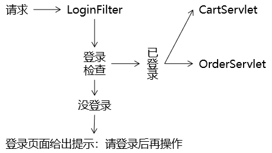

### 3、代码实现

#### ①拦截受保护资源的请求

购物车资源地址：/protected/CartServlet

订单资源地址：/protected/OrderServlet

Filter拦截的地址：/protected/*

#### ②对访问购物车资源的地址进行修改

##### [1]首页加入购物车

```html
<a th:href="@{/protected/CartServlet(method=addCart,bookId=${book.bookId})}">加入购物车</a>
```

##### [2]首页显示购物车

```html
<a href="protected/CartServlet?method=showCart" class="cart iconfont icon-gouwuche">购物车</a>
```

##### [3]cart.html清空购物车

```html
<a @click="clearCart" href="protected/CartServlet?method=clearCart" class="clear-cart">清空购物车</a>
```

##### [4]cart.html删除超链接

```html
<a @click="removeConfirm" th:href="@{/protected/CartServlet(method=removeItem,bookId=${cartItemEntry.value.bookId})}">删除</a>
```

##### [5]cart.html中Vue代码

凡是涉及到window.location.href都需要修改：

```javascript
window.location.href = "protected/CartServlet?method=decrease&bookId="+bookId;
……
```

#### ③web.xml中修改CartServlet的url-pattern

```xml
<servlet>
    <servlet-name>CartServlet</servlet-name>
    <servlet-class>com.atguigu.bookstore.servlet.model.CartServlet</servlet-class>
</servlet>
<servlet-mapping>
    <servlet-name>CartServlet</servlet-name>
    <url-pattern>/protected/CartServlet</url-pattern>
</servlet-mapping>
```

#### ④创建执行登录检查的Filter

##### [1]Filter类

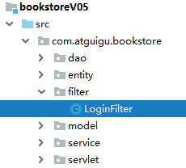

```
 <?xml version="1.0" encoding="UTF-8"?>
 <beans xmlns="http://www.springframework.org/schema/beans"
       xmlns:xsi="http://www.w3.org/2001/XMLSchema-instance"
       xmlns:context="http://www.springframework.org/schema/context"
       xsi:schemaLocation="http://www.springframework.org/schema/beans
    http://www.springframework.org/schema/beans/spring-beans.xsd
    http://www.springframework.org/schema/context
    http://www.springframework.org/schema/context/spring-context.xsd">

    <!-- 扫描service相关的bean -->
    <context:component-scan base-package="com.kuang.service" />

    <!--BookServiceImpl注入到IOC容器中-->
    <bean id="BookServiceImpl" class="com.kuang.service.BookServiceImpl">
        <property name="bookMapper" ref="bookMapper"/>
    </bean>

    <!-- 配置事务管理器 -->
    <bean id="transactionManager" class="org.springframework.jdbc.datasource.DataSourceTransactionManager">
        <!-- 注入数据库连接池 -->
        <property name="dataSource" ref="dataSource" />
    </bean>

 </beans>
```

##### [2]注册Filter类

```xml
<filter>
    <filter-name>LoginFilter</filter-name>
    <filter-class>com.atguigu.bookstore.filter.LoginFilter</filter-class>
</filter>
<filter-mapping>
    <filter-name>LoginFilter</filter-name>
    <url-pattern>/protected/*</url-pattern>
</filter-mapping>
```

## 二、结账

### 1、创建订单模型

#### ①物理建模

##### [1]t_order表

```sql
CREATE TABLE t_order(
    order_id INT PRIMARY KEY AUTO_INCREMENT,
    order_sequence VARCHAR(200),
    create_time VARCHAR(100),
    total_count INT,
    total_amount DOUBLE,
    order_status INT,
    user_id INT
);
```

| 字段名         | 字段作用       |
| -------------- | -------------- |
| order_id       | 主键           |
| order_sequence | 订单号         |
| create_time    | 订单创建时间   |
| total_count    | 订单的总数量   |
| total_amount   | 订单的总金额   |
| order_status   | 订单的状态     |
| user_id        | 下单的用户的id |

- 虽然order_sequence也是一个不重复的数值，但是不使用它作为主键。数据库表的主键要使用没有业务功能的字段来担任。
- 订单的状态
  - 待支付（书城项目中暂不考虑）
  - 已支付，待发货：0
  - 已发货：1
  - 确认收货：2
  - 发起退款或退货（书城项目中暂不考虑）
- 用户id
  - 从逻辑和表结构的角度来说，这其实是一个外键。
  - 但是开发过程中建议先不要加外键约束：因为开发过程中数据尚不完整，加了外键约束开发过程中使用测试数据非常不方便，建议项目预发布时添加外键约束测试。

##### [2]t_order_item表

```sql
CREATE TABLE t_order_item(
    item_id INT PRIMARY KEY AUTO_INCREMENT,
    book_name VARCHAR(20),
    price DOUBLE,
    img_path VARCHAR(50),
    item_count INT,
    item_amount DOUBLE,
    order_id VARCHAR(20)
);
```

| 字段名称    | 字段作用                     |
| ----------- | ---------------------------- |
| item_id     | 主键                         |
| book_name   | 书名                         |
| price       | 单价                         |
| item_count  | 当前订单项的数量             |
| item_amount | 当前订单项的金额             |
| order_id    | 当前订单项关联的订单表的主键 |

说明：book_name、author、price这三个字段其实属于t_book表，我们把它们加入到t_order_item表中，其实并不符合数据库设计三大范式。这里做不符合规范的操作的原因是：将这几个字段加入当前表就不必在显示数据时和t_book表做关联查询，提高查询的效率，这是一种变通的做法。

#### ②逻辑模型

##### [1]Order类

```java
public class Order {

    private Integer orderId;
    private String orderSequence;
    private String createTime;
    private Integer totalCount;
    private Double totalAmount;
    private Integer orderStatus = 0;
    private Integer userId;
```

##### [2]OrdrItem类

```java
public class OrderItem {

    private Integer itemId;
    private String bookName;
    private Double price;
    private String imgPath;
    private Integer itemCount;
    private Double itemAmount;
    private Integer orderId;
```

### 2、创建组件

#### ①持久化层

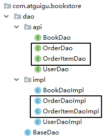

#### ②业务逻辑层

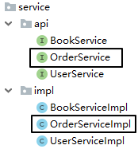

#### ③表述层

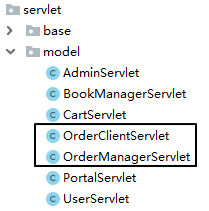

### 3、结账功能

#### ①具体操作清单

- 创建订单对象
- 给订单对象填充数据
  - 生成订单号
  - 生成订单的时间
  - 从购物车迁移总数量和总金额
  - 从已登录的User对象中获取userId并设置到订单对象中
- 将订单对象保存到数据库中
- 获取订单对象在数据库中自增主键的值
- 根据购物车中的CartItem集合逐个创建OrderItem对象
  - 每个OrderItem对象对应的orderId属性都使用前面获取的订单数据的自增主键的值
- 把OrderItem对象的集合保存到数据库
- 每一个item对应的图书增加销量
- 每一个item对应的图书减少库存
- 清空购物车

#### ②思路

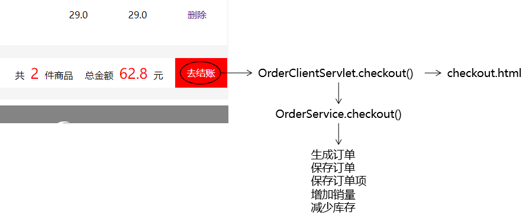

#### ③代码实现

##### [1]购物车页面结账超链接

cart.html

```html
<a class="pay" href="protected/OrderClientServlet?method=checkout">去结账</a>
```

##### [2]OrderClientServlet.checkout()

```java
protected void checkout(HttpServletRequest request, HttpServletResponse response) throws ServletException, IOException {

    // 1.获取HttpSession对象
    HttpSession session = request.getSession();

    // 2.获取购物车对象
    Cart cart = (Cart) session.getAttribute("cart");
    if (cart == null) {
        String viewName = "cart/cart";

        processTemplate(viewName, request, response);

        return ;
    }

    // 3.获取已登录的用户对象
    User user = (User) session.getAttribute("user");

    // 4.调用Service方法执行结账的业务逻辑
    String orderSequence = orderService.checkout(cart, user);

    // 5.清空购物车
    session.removeAttribute("cart");

    // 6.将订单号存入请求域
    request.setAttribute("orderSequence", orderSequence);

    // 7.将页面跳转到下单成功页面
    String viewName = "cart/checkout";
    processTemplate(viewName, request, response);
}
```

##### [3]OrderService.checkout()

```java
@Override
public String checkout(Cart cart, User user) {

    // 从User对象中获取userId
    Integer userId = user.getUserId();

    // 创建订单对象
    Order order = new Order();

    // 给订单对象填充数据
    // 生成订单号=系统时间戳
    String orderSequence = System.currentTimeMillis() + "_" + userId;

    // 生成订单的时间
    SimpleDateFormat simpleDateFormat = new SimpleDateFormat("yyyy-MM-dd hh:mm:ss");
    String createTime = simpleDateFormat.format(new Date());

    // 从购物车迁移总数量和总金额
    Integer totalCount = cart.getTotalCount();
    Double totalAmount = cart.getTotalAmount();

    order.setOrderSequence(orderSequence);
    order.setCreateTime(createTime);
    order.setTotalCount(totalCount);
    order.setTotalAmount(totalAmount);

    // 将订单对象保存到数据库中
    // ※说明：这里对insertOrder()方法的要求是获取自增的主键并将自增主键的值设置到Order对象的orderId属性中
    orderDao.insertOrder(order);

    // 获取订单对象在数据库中自增主键的值
    Integer orderId = order.getOrderId();

    // 根据购物车中的CartItem集合逐个创建OrderItem对象
    Map<String, CartItem> cartItemMap = cart.getCartItemMap();
    Collection<CartItem> cartItems = cartItemMap.values();
    List<CartItem> cartItemList = new ArrayList<>(cartItems);

    // 为了便于批量保存OrderItem，创建Object[][]
    // 二维数组第一维：SQL语句的数量
    // 二维数组第二维：SQL语句中参数的数量
    Object[][] saveOrderItemParamArr = new Object[cartItems.size()][6];

    // 为了便于批量更新Book，创建Object[][]
    Object[][] updateBookParamArr = new Object[cartItems.size()][3];

    for (int i = 0;i < cartItemList.size(); i++) {

        CartItem cartItem = cartItemList.get(i);

        // 为保存OrderItem创建Object[]
        Object[] orderItemParam = new Object[6];

        // book_name,price,img_path,item_count,item_amount,order_id
        orderItemParam[0] = cartItem.getBookName();
        orderItemParam[1] = cartItem.getPrice();
        orderItemParam[2] = cartItem.getImgPath();
        orderItemParam[3] = cartItem.getCount();
        orderItemParam[4] = cartItem.getAmount();
        orderItemParam[5] = orderId;

        // 将一维数组存入二维数组中
        saveOrderItemParamArr[i] = orderItemParam;

        // 创建数组用于保存更新Book数据的信息
        String[] bookUpdateInfoArr = new String[3];

        // 增加的销量
        bookUpdateInfoArr[0] = cartItem.getCount() + "";

        // 减少的库存
        bookUpdateInfoArr[1] = cartItem.getCount() + "";

        // bookId
        bookUpdateInfoArr[2] = cartItem.getBookId();

        // 将数组存入List集合
        updateBookParamArr[i] = bookUpdateInfoArr;
    }

    // 把OrderItem对象的集合保存到数据库：批量操作
    orderItemDao.insertOrderItemArr(saveOrderItemParamArr);

    // 使用bookUpdateInfoList对图书数据的表执行批量更新操作
    bookDao.updateBookByParamArr(updateBookParamArr);

    // 返回订单号
    return orderSequence;
}
```

##### [4]orderDao.insertOrder(order)

```java
@Override
public void insertOrder(Order order) {

    // ※DBUtils没有封装获取自增主键的方法，需要我们使用原生的JDBC来完成
    // 1.获取数据库连接
    Connection connection = JDBCUtils.getConnection();

    // 2.创建PreparedStatement对象
    String sql = "INSERT INTO t_order(order_sequence,create_time,total_count,total_amount,order_status,user_id) VALUES(?,?,?,?,?,?)";

    try {

        // ①创建PreparedStatement对象，指明需要自增的主键
        PreparedStatement preparedStatement = connection.prepareStatement(sql, PreparedStatement.RETURN_GENERATED_KEYS);

        // ②给PreparedStatement对象设置SQL语句的参数
        preparedStatement.setString(1, order.getOrderSequence());
        preparedStatement.setString(2, order.getCreateTime());
        preparedStatement.setInt(3, order.getTotalCount());
        preparedStatement.setDouble(4, order.getTotalAmount());
        preparedStatement.setInt(5, order.getOrderStatus());
        preparedStatement.setInt(6, order.getUserId());

        // ③执行更新
        preparedStatement.executeUpdate();

        // ④获取封装了自增主键的结果集
        ResultSet generatedKeysResultSet = preparedStatement.getGeneratedKeys();

        // ⑤解析结果集
        if (generatedKeysResultSet.next()) {
            int orderId = generatedKeysResultSet.getInt(1);

            order.setOrderId(orderId);
        }

    } catch (SQLException e) {
        e.printStackTrace();

        throw new RuntimeException(e);
    } finally {
        JDBCUtils.releaseConnection(connection);
    }

}
```

##### [5]BaseDao.batchUpdate()

```java
/**
 * 通用的批量增删改方法
 * @param sql
 * @param params 执行批量操作的二维数组
 *               每一条SQL语句的参数是一维数组
 *               多条SQL语句的参数就是二维数组
 * @return 每一条SQL语句返回的受影响的行数
 */
public int[] batchUpdate(String sql, Object[][] params) {

    Connection connection = JDBCUtils.getConnection();

    int[] rowCountArr = null;

    try {
        rowCountArr = queryRunner.batch(connection, sql, params);
    } catch (SQLException e) {
        e.printStackTrace();

        throw new RuntimeException(e);
    } finally {
        JDBCUtils.releaseConnection(connection);
    }

    return rowCountArr;

}
```

##### [6]orderItemDao.insertOrderItemArr(saveOrderItemParamArr)

```java
@Override
public void insertOrderItemArr(Object[][] saveOrderItemParamArr) {
    String sql = "INSERT INTO t_order_item(book_name,price,img_path,item_count,item_amount,order_id) VALUES(?,?,?,?,?,?)";

    super.batchUpdate(sql, saveOrderItemParamArr);
}
```

##### [7]bookDao.updateBookByParamArr(updateBookParamArr)

```java
@Override
public void updateBookByParamArr(Object[][] updateBookParamArr) {
    String sql = "update t_book set sales=sales+?,stock=stock-? where book_id=?";
    super.batchUpdate(sql, updateBookParamArr);
}
```

## 三、结账过程中使用事务（重要）

### 1、事务回顾

#### ①ACID属性

- A：原子性 事务中包含的数据库操作缺一不可，整个事务是不可再分的。
- C：一致性 事务执行之前，数据库中的数据整体是正确的；事务执行之后，数据库中的数据整体仍然是正确的。
  - 事务执行成功：提交（commit）
  - 事务执行失败：回滚（rollback）
- I：隔离性 数据库系统同时执行很多事务时，各个事务之间基于不同隔离级别能够在一定程度上做到互不干扰。简单说就是：事务在并发执行过程中彼此隔离。
- D：持久性 事务一旦提交，就永久保存到数据库中，不可撤销。

#### ②隔离级别

##### [1]并发问题

| 并发问题   | 问题描述                                                     |
| ---------- | ------------------------------------------------------------ |
| 脏读       | 当前事务读取了其他事务尚未提交的修改 如果那个事务回滚，那么当前事务读取到的修改就是错误的数据 |
| 不可重复读 | 当前事务读取同一个数据，第一次和第二次不一致                 |
| 幻读       | 当前事务在执行过程中，数据库表增减或减少了一些记录，感觉像是出现了幻觉 |

##### [2]隔离级别

| 隔离级别 | 描述                                           | 能解决的并发问题       |
| -------- | ---------------------------------------------- | ---------------------- |
| 读未提交 | 允许当前事务读取其他事务尚未提交的修改         | 啥问题也解决不了       |
| 读已提交 | 允许当前事务读取其他事务已经提交的修改         | 脏读                   |
| 可重复读 | 当前事务执行时锁定当前记录，不允许其他事务操作 | 脏读、不可重复读       |
| 串行化   | 当前事务执行时锁定当前表，不允许其他事务操作   | 脏读、不可重复读、幻读 |

### 2、JDBC事务控制

#### ①同一个数据库连接

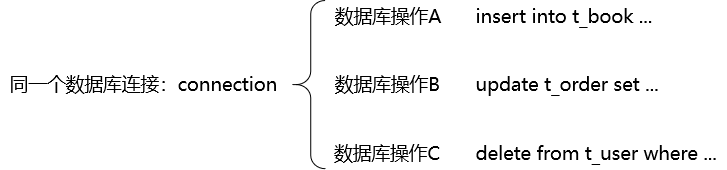

#### ②关闭事务的自动提交

```java
connection.setAutoCommit(false);
```

#### ③提交事务

```java
connection.commit();
```

#### ④回滚事务

```java
connection.rollBack();
```

#### ⑤事务整体的代码块

```java
try{

    // 关闭事务的自动提交
    connection.setAutoCommit(false);

    // 事务中包含的所有数据库操作

    // 提交事务
    connection.commit();
}catch(Excetion e){

    // 回滚事务
    connection.rollBack();

}finally{

    // 释放数据库连接
    connection.close();

}
```

### 3、将事务对接到书城项目中

#### ①三层架构中事务要对接的位置

从逻辑上来说，一个事务对应一个业务方法（Service层的一个方法）。

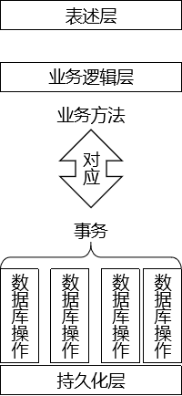

#### ②假想

每一个Service方法内部，都套用了事务操作所需要的try...catch...finally块。

#### ③假想代码的缺陷

- 会出现大量的冗余代码：我们希望能够抽取出来，只写一次
- 对核心业务功能是一种干扰：我们希望能够在编写业务逻辑代码时专注于业务本身，而不必为辅助性质的套路代码分心
- 将持久化层对数据库的操作写入业务逻辑层，是对业务逻辑层的一种污染，导致持久化层和业务逻辑层耦合在一起

#### ④事务代码抽取

- 只要是Filter拦截到的请求都会从doFilter()方法经过
- chain.doFilter(req, resp);可以包裹住将来要执行的所有方法
- 事务操作的try...catch...finally块只要把chain.doFilter(req, resp)包住，就能够包住将来要执行的所有方法

```java
public void doFilter(ServletRequest req, ServletResponse resp, FilterChain chain) throws ServletException, IOException {

    try{

        // 关闭事务的自动提交
        connection.setAutoCommit(false);

        // 『事务中包含的所有数据库操作』就在chain.doFilter(req, resp);将来要调用的方法中
        // 所以用事务的try...catch...finally块包住chain.doFilter(req, resp);
        // 就能让所有事务方法都『享受』到事务功能的『服务』。
        // 所谓框架其实就是把常用的『套路代码』抽取出来，为大家服务，我们享受框架服务提高开发效率。
        chain.doFilter(req, resp);

        // 提交事务
        connection.commit();
    }catch(Excetion e){

        // 回滚事务
        connection.rollBack();

    }finally{

        // 释放数据库连接
        connection.close();

    }

}
```

#### ⑤在Filter中获取数据库连接

```java
public void doFilter(ServletRequest req, ServletResponse resp, FilterChain chain) throws ServletException, IOException {

    try{

        // 获取数据库连接
        Connection connection = JDBCUtils.getConnection();

        // 关闭事务的自动提交
        connection.setAutoCommit(false);

        // 『事务中包含的所有数据库操作』就在chain.doFilter(req, resp);将来要调用的方法中
        // 所以用事务的try...catch...finally块包住chain.doFilter(req, resp);
        // 就能让所有事务方法都『享受』到事务功能的『服务』。
        // 所谓框架其实就是把常用的『套路代码』抽取出来，为大家服务，我们享受框架服务提高开发效率。
        chain.doFilter(req, resp);

        // 提交事务
        connection.commit();
    }catch(Excetion e){

        // 回滚事务
        connection.rollBack();

    }finally{

        // 释放数据库连接
        connection.close();

    }

}
```

#### ⑥保证所有数据库操作使用同一个连接

**『重要发现』**：在书城项目中所有执行SQL语句的代码都是通过**JDBCUtils.getConnection()**方法获取数据库连接。所以我们可以通过**重构JDBCUtils.getConnection()**方法实现：所有数据库操作使用同一个连接。

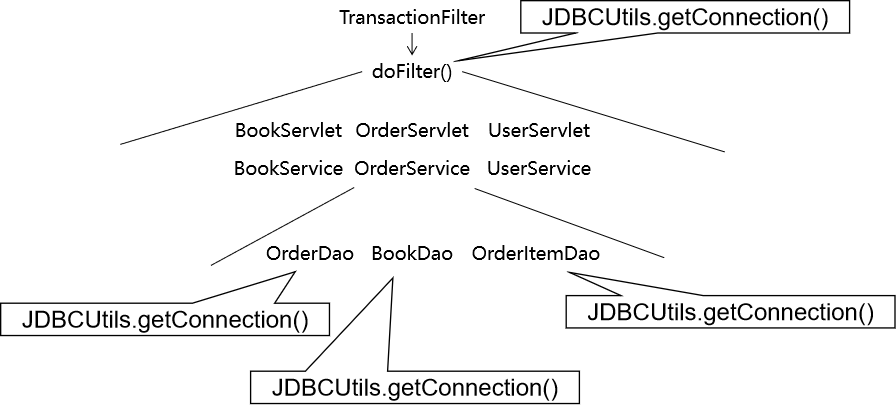

##### [1]从数据源中只拿出一个

为了保证各个需要Connection对象的地方使用的都是同一个对象，我们从数据源中只获取一个Connection。不是说整个项目只用一个Connection，而是说调用JDBCUtils.getConnection()方法时，只使用一个。所以落实到代码上就是：每次调用getConnection()方法时先检查是否已经拿过了，拿过就给旧的，没拿过给新的。

##### [2]公共区域

为了保证各个方法中需要Connection对象时都能拿到同一个对象，需要做到：将唯一的对象存入一个大家都能接触到的地方。

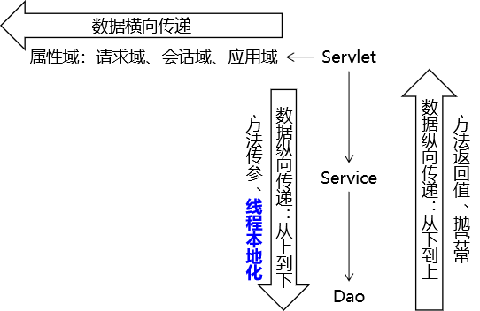

#### ⑦线程本地化

##### [1]确认同一个线程

在从Filter、Servlet、Service一直到Dao运行的过程中，我们始终都没有做类似new Thread().start()这样开启新线程的操作，所以整个过程在同一个线程中。

##### [2]一条小河

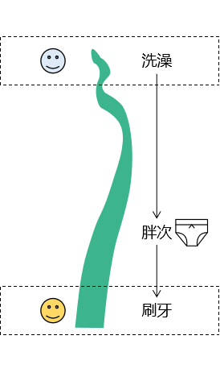

##### [3]一个线程

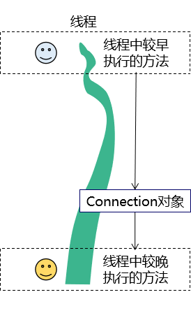

##### [4]代码

java.lang.ThreadLocal的set()方法：

```java
    public void set(T value) {
        Thread t = Thread.currentThread();
        ThreadLocalMap map = getMap(t);
        if (map != null)
            map.set(this, value);
        else
            createMap(t, value);
    }
```

java.lang.TheadLocal的get()方法：

```java
    public T get() {
        Thread t = Thread.currentThread();
        ThreadLocalMap map = getMap(t);
        if (map != null) {
            ThreadLocalMap.Entry e = map.getEntry(this);
            if (e != null) {
                @SuppressWarnings("unchecked")
                T result = (T)e.value;
                return result;
            }
        }
        return setInitialValue();
    }
```

所以TheadLocal的基本原理是：它在内部维护了一个Map，需要存入数据时，就以this为键，要存入的数据为值，存入Map。需要取出数据时，就以this为键，从Map中取出数据。

##### [5]结论

如果我们需要将数据在整个项目中按照**从上到下**的方式传递，但是又**没法通过方法的参数**来实现，这时使用线程本地化技术是一个非常好的选择。

#### ⑧异常向上抛出的线路


上图中标记颜色的位置都是有try...catch块的代码，需要逐个检查一下，catch块捕获的异常是否转换为运行时异常又再次抛出。

如果没有抛出，异常就不会传递到Filter中，TransactionFilter就会认为代码执行过程中没有发生问题，从而提交事务，但是实际上应该回滚。下面是一个例子：

```java
/**
 * 通用的批量增删改方法
 * @param sql
 * @param params 执行批量操作的二维数组
 *               每一条SQL语句的参数是一维数组
 *               多条SQL语句的参数就是二维数组
 * @return 每一条SQL语句返回的受影响的行数
 */
public int[] batchUpdate(String sql, Object[][] params) {

    Connection connection = JDBCUtils.getConnection();

    int[] rowCountArr = null;

    try {
        rowCountArr = queryRunner.batch(connection, sql, params);
    } catch (SQLException e) {
        e.printStackTrace();

        throw new RuntimeException(e);
    } finally {
        JDBCUtils.releaseConnection(connection);
    }

    return rowCountArr;

}
```

### 4、代码实现

#### ①重构JDBCUtils类

- 要点1：将ThreadLocal对象声明为静态成员变量
- 要点2：重构获取数据库连接的方法
- 要点3：重构释放数据库连接的方法

```java
/**
 * 功能1：创建数据源对象
 * 功能2：获取数据库连接并绑定到当前线程上
 * 功能3：释放数据库连接并从当前线程移除
 */
public class JDBCUtils {

    // 将数据源对象设置为静态属性，保证大对象的单一实例
    private static DataSource dataSource;

    // 将ThreadLocal对象设置为静态成员变量，保证以此为键时从Map中取值能够取到同一个值
    private static ThreadLocal<Connection> threadLocal = new ThreadLocal<>();

    static {

        // 1.创建一个用于存储外部属性文件信息的Properties对象
        Properties properties = new Properties();

        // 2.使用当前类的类加载器加载外部属性文件：jdbc.properties
        InputStream inputStream = JDBCUtils.class.getClassLoader().getResourceAsStream("jdbc.properties");

        try {

            // 3.将外部属性文件jdbc.properties中的数据加载到properties对象中
            properties.load(inputStream);

            // 4.创建数据源对象
            dataSource = DruidDataSourceFactory.createDataSource(properties);

        } catch (Exception e) {
            e.printStackTrace();
        }

    }

    /**
     * 从数据源中获取数据库连接
     * @return 数据库连接对象
     */
    public static Connection getConnection() {

        // 1.尝试从当前线程获取Connection对象
        Connection connection = threadLocal.get();

        if (connection == null) {

            try {
                // 2.如果从当前线程上没有获取到Connection对象那么从数据源获取
                connection = dataSource.getConnection();

                // 3.将Connection对象绑定到当前线程
                threadLocal.set(connection);

            } catch (SQLException e) {
                e.printStackTrace();

                throw new RuntimeException(e);
            }

        }

        // 4.返回Connection对象
        return connection;

    }

    /**
     * 释放数据库连接
     * @param connection 要执行释放操作的连接对象
     */
    public static void releaseConnection(Connection connection) {

        if (connection != null) {

            try {
                connection.close();

                // 将Connection对象从当前线程移除
                threadLocal.remove();

            } catch (SQLException e) {
                e.printStackTrace();

                throw new RuntimeException(e);
            }

        }

    }
}
```

#### ②重构BaseDao

- 要点：去除释放数据库连接的操作（转移到TransactionFilter中）

```java
/**
 * 各个具体Dao类的基类，泛型T对应具体实体类类型
 * @param <T>
 */
public class BaseDao<T> {

    private QueryRunner queryRunner = new QueryRunner();

    /**
     * 通用的批量增删改方法
     * @param sql
     * @param params 执行批量操作的二维数组
     *               每一条SQL语句的参数是一维数组
     *               多条SQL语句的参数就是二维数组
     * @return 每一条SQL语句返回的受影响的行数
     */
    public int[] batchUpdate(String sql, Object[][] params) {

        Connection connection = JDBCUtils.getConnection();

        int[] rowCountArr = null;

        try {
            rowCountArr = queryRunner.batch(connection, sql, params);
        } catch (SQLException e) {
            e.printStackTrace();

            throw new RuntimeException(e);
        }/* finally {
            JDBCUtils.releaseConnection(connection);
        }*/

        return rowCountArr;

    }

    /**
     * 通用的增删改方法
     * @param sql 要执行的SQL语句
     * @param param 为SQL语句准备好的参数
     * @return 受影响的行数
     */
    public int update(String sql, Object ... param) {

        int updatedRowCount = 0;

        Connection connection = JDBCUtils.getConnection();

        try {

            updatedRowCount = queryRunner.update(connection, sql, param);

        }
        // 为了让上层方法调用方便，将编译时异常捕获
        catch (SQLException e) {
            e.printStackTrace();

            // 为了不掩盖问题，将编译时异常封装为运行时异常抛出
            throw new RuntimeException(e);
        }/* finally {

            // 关闭数据库连接
            JDBCUtils.releaseConnection(connection);

        }*/

        return updatedRowCount;

    }

    /**
     * 查询单个对象
     * @param clazz 单个对象所对应的实体类类型
     * @param sql   查询单个对象所需要的SQL语句
     * @param param SQL语句的参数
     * @return      查询到的单个对象
     */
    public T getBean(Class<T> clazz, String sql, Object ... param) {

        Connection connection = JDBCUtils.getConnection();

        T t = null;

        try {

            t = queryRunner.query(connection, sql, new BeanHandler<>(clazz), param);
        } catch (SQLException e) {
            e.printStackTrace();

            throw new RuntimeException(e);
        }/* finally {

            // 关闭数据库连接
            JDBCUtils.releaseConnection(connection);

        }*/

        return t;
    }

    /**
     * 查询集合对象
     * @param clazz 集合中单个对象所对应的实体类类型
     * @param sql   查询集合所需要的SQL语句
     * @param param SQL语句的参数
     * @return      查询到的集合对象
     */
    public List<T> getBeanList(Class<T> clazz, String sql, Object ... param) {

        Connection connection = JDBCUtils.getConnection();

        List<T> list = null;

        try {

            list = queryRunner.query(connection, sql, new BeanListHandler<>(clazz), param);
        } catch (SQLException e) {
            e.printStackTrace();

            throw new RuntimeException(e);
        }/* finally {

            // 关闭数据库连接
            JDBCUtils.releaseConnection(connection);

        }*/

        return list;
    }

}
```

**注意**：OrderDao中insertOrder()方法也要去掉关闭数据库连接的操作。

```java
@Override
public void insertOrder(Order order) {

    // ※DBUtils没有封装获取自增主键的方法，需要我们使用原生的JDBC来完成
    // 1.获取数据库连接
    Connection connection = JDBCUtils.getConnection();

    // 2.创建PreparedStatement对象
    String sql = "INS222ERT INTO t_order(order_sequence,create_time,total_count,total_amount,order_status,user_id) VALUES(?,?,?,?,?,?)";

    try {

        // ①创建PreparedStatement对象，指明需要自增的主键
        PreparedStatement preparedStatement = connection.prepareStatement(sql, PreparedStatement.RETURN_GENERATED_KEYS);

        // ②给PreparedStatement对象设置SQL语句的参数
        preparedStatement.setString(1, order.getOrderSequence());
        preparedStatement.setString(2, order.getCreateTime());
        preparedStatement.setInt(3, order.getTotalCount());
        preparedStatement.setDouble(4, order.getTotalAmount());
        preparedStatement.setInt(5, order.getOrderStatus());
        preparedStatement.setInt(6, order.getUserId());

        // ③执行更新
        preparedStatement.executeUpdate();

        // ④获取封装了自增主键的结果集
        ResultSet generatedKeysResultSet = preparedStatement.getGeneratedKeys();

        // ⑤解析结果集
        if (generatedKeysResultSet.next()) {
            int orderId = generatedKeysResultSet.getInt(1);

            order.setOrderId(orderId);
        }

    } catch (SQLException e) {
        e.printStackTrace();

        throw new RuntimeException(e);
    } /*finally {
        JDBCUtils.releaseConnection(connection);
    }*/

}
```

#### ③创建一个用于显示通用错误信息的页面

##### [1]创建页面

这个页面可以从login_success.html复制过来

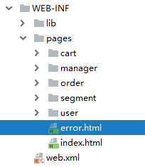

##### [2]创建Servlet跳转到页面

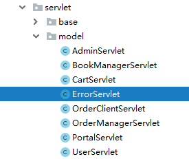

```java
protected void showSystemError(HttpServletRequest request, HttpServletResponse response) throws ServletException, IOException {

    String viewName = "error";

    processTemplate(viewName, request, response);

}
```

#### ④创建TransactionFilter

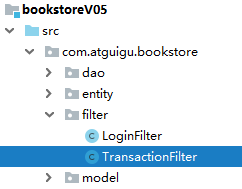

```xml
<filter>
    <filter-name>TransactionFilter</filter-name>
    <filter-class>com.atguigu.bookstore.filter.TransactionFilter</filter-class>
</filter>
<filter-mapping>
    <filter-name>TransactionFilter</filter-name>
    <url-pattern>/*</url-pattern>
</filter-mapping>
```

Java代码如下：

```java
public class TransactionFilter implements Filter {

    private static final Set<String> PUBLIC_STATIC_RESOURCE_EXT_NAME_SET = new HashSet<>();

    static {
        PUBLIC_STATIC_RESOURCE_EXT_NAME_SET.add(".png");
        PUBLIC_STATIC_RESOURCE_EXT_NAME_SET.add(".css");
        PUBLIC_STATIC_RESOURCE_EXT_NAME_SET.add(".js");
        PUBLIC_STATIC_RESOURCE_EXT_NAME_SET.add(".jpg");
        PUBLIC_STATIC_RESOURCE_EXT_NAME_SET.add(".gif");
    }

    public void doFilter(ServletRequest req, ServletResponse resp, FilterChain chain) throws ServletException, IOException {

        // 排除掉静态资源，它们和数据库操作没有关系
        // 1.给请求和响应对象转换类型
        HttpServletRequest request = (HttpServletRequest) req;
        HttpServletResponse response = (HttpServletResponse) resp;

        // 2.获取当前请求的ServletPath
        String servletPath = request.getServletPath();

        // 3.检查servletPath中是否包含“.”
        if (servletPath.contains(".")) {

            int index = servletPath.lastIndexOf(".");

            String extensionName = servletPath.substring(index);

            if (PUBLIC_STATIC_RESOURCE_EXT_NAME_SET.contains(extensionName)) {
                chain.doFilter(request, response);

                return ;
            }
        }

        // 执行事务操作
        // 1.获取数据库连接
        Connection connection = JDBCUtils.getConnection();

        // 2.使用try...catch...finally块管理事务
        try{

            // 3.关闭事务的自动提交
            connection.setAutoCommit(false);

            // 4.尝试执行目标代码
            chain.doFilter(request, response);

            // 5.如果上面的操作没有抛出异常
            connection.commit();

        }catch (Exception e){

            // 6.如果上面的操作抛出了异常
            try {
                connection.rollback();
            } catch (SQLException e1) {
                e1.printStackTrace();
            }

            // 7.捕获到异常后，跳转到专门的页面显示提示消息
            String message = e.getMessage();
            request.setAttribute("error", message);
            request.getRequestDispatcher("/ErrorServlet?method=showSystemError").forward(request, response);

        }finally {

            // 8.不管前面操作是成功还是失败，到这里都要释放数据库连接
            JDBCUtils.releaseConnection(connection);

        }

    }

    public void init(FilterConfig config) throws ServletException {}
    public void destroy() {}
}
```
