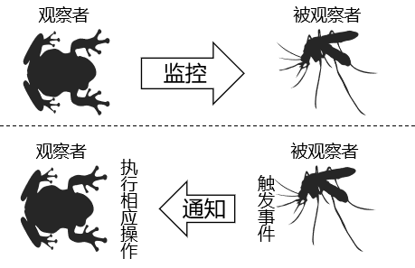
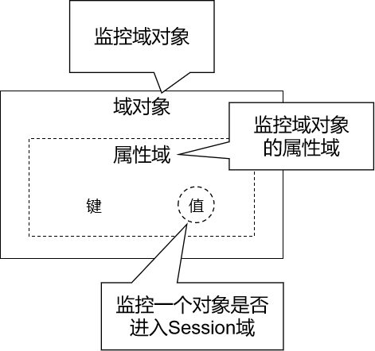

---
# 当前页面内容标题
title: 18、Listener 监听器
# 当前页面图标
icon: java
# 分类
category:
  - javaweb
  - java
  - listener
# 标签
tag:
  - javaweb
  - java
  - listener
sticky: true
# 是否收藏在博客主题的文章列表中，当填入数字时，数字越大，排名越靠前。
star: false
# 是否将该文章添加至文章列表中
article: true
# 是否将该文章添加至时间线中
timeline: true
---

# 18、Listener 监听器

## 一、观察者模式

二十三种设计模式之一：



- 观察者：监控『被观察者』的行为，一旦发现『被观察者』触发了事件，就会调用事先准备好的方法执行操作。
- 被观察者：『被观察者』一旦触发了被监控的事件，就会被『观察者』发现。

## 二、监听器简介

### 1、概念

监听器：专门用于对其他对象身上发生的事件或状态改变进行监听和相应处理的对象，当被监视的对象发生情况时，立即采取相应的行动。 **Servlet监听器**：Servlet规范中定义的一种特殊类，它用于监听Web应用程序中的ServletContext，HttpSession 和HttpServletRequest等域对象的创建与销毁事件，以及监听这些域对象中的属性发生修改的事件。

### 2、分类



- 域对象监听器
- 域对象的属性域监听器
- Session域中数据的监听器

### 3、监听器列表

#### ①ServletContextListener

作用：监听ServletContext对象的创建与销毁

| 方法名                                      | 作用                     |
| ------------------------------------------- | ------------------------ |
| contextInitialized(ServletContextEvent sce) | ServletContext创建时调用 |
| contextDestroyed(ServletContextEvent sce)   | ServletContext销毁时调用 |

ServletContextEvent对象代表从ServletContext对象身上捕获到的事件，通过这个事件对象我们可以获取到ServletContext对象。

#### ②HttpSessionListener

作用：监听HttpSession对象的创建与销毁

| 方法名                                 | 作用                      |
| -------------------------------------- | ------------------------- |
| sessionCreated(HttpSessionEvent hse)   | HttpSession对象创建时调用 |
| sessionDestroyed(HttpSessionEvent hse) | HttpSession对象销毁时调用 |

HttpSessionEvent对象代表从HttpSession对象身上捕获到的事件，通过这个事件对象我们可以获取到触发事件的HttpSession对象。

#### ③ServletRequestListener

作用：监听ServletRequest对象的创建与销毁

| 方法名                                      | 作用                         |
| ------------------------------------------- | ---------------------------- |
| requestInitialized(ServletRequestEvent sre) | ServletRequest对象创建时调用 |
| requestDestroyed(ServletRequestEvent sre)   | ServletRequest对象销毁时调用 |

ServletRequestEvent对象代表从HttpServletRequest对象身上捕获到的事件，通过这个事件对象我们可以获取到触发事件的HttpServletRequest对象。另外还有一个方法可以获取到当前Web应用的ServletContext对象。

#### ④ServletContextAttributeListener

作用：监听ServletContext中属性的创建、修改和销毁

| 方法名                                               | 作用                                 |
| ---------------------------------------------------- | ------------------------------------ |
| attributeAdded(ServletContextAttributeEvent scab)    | 向ServletContext中添加属性时调用     |
| attributeRemoved(ServletContextAttributeEvent scab)  | 从ServletContext中移除属性时调用     |
| attributeReplaced(ServletContextAttributeEvent scab) | 当ServletContext中的属性被修改时调用 |

ServletContextAttributeEvent对象代表属性变化事件，它包含的方法如下：

| 方法名              | 作用                     |
| ------------------- | ------------------------ |
| getName()           | 获取修改或添加的属性名   |
| getValue()          | 获取被修改或添加的属性值 |
| getServletContext() | 获取ServletContext对象   |

#### ⑤HttpSessionAttributeListener

作用：监听HttpSession中属性的创建、修改和销毁

| 方法名                                        | 作用                              |
| --------------------------------------------- | --------------------------------- |
| attributeAdded(HttpSessionBindingEvent se)    | 向HttpSession中添加属性时调用     |
| attributeRemoved(HttpSessionBindingEvent se)  | 从HttpSession中移除属性时调用     |
| attributeReplaced(HttpSessionBindingEvent se) | 当HttpSession中的属性被修改时调用 |

HttpSessionBindingEvent对象代表属性变化事件，它包含的方法如下：

| 方法名       | 作用                          |
| ------------ | ----------------------------- |
| getName()    | 获取修改或添加的属性名        |
| getValue()   | 获取被修改或添加的属性值      |
| getSession() | 获取触发事件的HttpSession对象 |

#### ⑥ServletRequestAttributeListener

作用：监听ServletRequest中属性的创建、修改和销毁

| 方法名                                               | 作用                                 |
| ---------------------------------------------------- | ------------------------------------ |
| attributeAdded(ServletRequestAttributeEvent srae)    | 向ServletRequest中添加属性时调用     |
| attributeRemoved(ServletRequestAttributeEvent srae)  | 从ServletRequest中移除属性时调用     |
| attributeReplaced(ServletRequestAttributeEvent srae) | 当ServletRequest中的属性被修改时调用 |

ServletRequestAttributeEvent对象代表属性变化事件，它包含的方法如下：

| 方法名               | 作用                             |
| -------------------- | -------------------------------- |
| getName()            | 获取修改或添加的属性名           |
| getValue()           | 获取被修改或添加的属性值         |
| getServletRequest () | 获取触发事件的ServletRequest对象 |

#### ⑦HttpSessionBindingListener

作用：监听某个对象在Session域中的创建与移除

| 方法名                                      | 作用                              |
| ------------------------------------------- | --------------------------------- |
| valueBound(HttpSessionBindingEvent event)   | 该类的实例被放到Session域中时调用 |
| valueUnbound(HttpSessionBindingEvent event) | 该类的实例从Session中移除时调用   |

HttpSessionBindingEvent对象代表属性变化事件，它包含的方法如下：

| 方法名       | 作用                          |
| ------------ | ----------------------------- |
| getName()    | 获取当前事件涉及的属性名      |
| getValue()   | 获取当前事件涉及的属性值      |
| getSession() | 获取触发事件的HttpSession对象 |

#### ⑧HttpSessionActivationListener

作用：监听某个对象在Session中的序列化与反序列化。

| 方法名                                    | 作用                                  |
| ----------------------------------------- | ------------------------------------- |
| sessionWillPassivate(HttpSessionEvent se) | 该类实例和Session一起钝化到硬盘时调用 |
| sessionDidActivate(HttpSessionEvent se)   | 该类实例和Session一起活化到内存时调用 |

HttpSessionEvent对象代表事件对象，通过getSession()方法获取事件涉及的HttpSession对象。

## 三、ServletContextListener

### 1、实用性

将来学习SpringMVC的时候，会用到一个ContextLoaderListener，这个监听器就实现了ServletContextListener接口，表示对ServletContext对象本身的生命周期进行监控。

### 2、具体用法

#### ①创建监听器类

```java
public class AtguiguListener implements ServletContextListener {
    @Override
    public void contextInitialized(
            // Event对象代表本次事件，通过这个对象可以获取ServletContext对象本身
            ServletContextEvent sce) {
        System.out.println("Hello，我是ServletContext，我出生了！");

        ServletContext servletContext = sce.getServletContext();
        System.out.println("servletContext = " + servletContext);
    }

    @Override
    public void contextDestroyed(ServletContextEvent sce) {
        System.out.println("Hello，我是ServletContext，我打算去休息一会儿！");
    }
}
```

#### ②注册监听器

```xml
<!-- 每一个listener标签对应一个监听器配置，若有多个监听器，则配置多个listener标签即可 -->
<listener>
    <!-- 配置监听器指定全类名即可 -->
    <listener-class>com.atguigu.listener.AtguiguListener</listener-class>
</listener>
```

事件触发过程中控制台日志的打印：

> Connected to server [2021-03-20 04:23:20,982] Artifact pro10-listener:war exploded: Artifact is being deployed, please wait... 三月 20, 2021 4:23:21 下午 org.apache.catalina.deploy.WebXml setVersion 警告: Unknown version string [4.0]. Default version will be used. Hello，我是ServletContext，我出生了！ servletContext = org.apache.catalina.core.ApplicationContextFacade@6a66017e [2021-03-20 04:23:21,426] Artifact pro10-listener:war exploded: Artifact is deployed successfully [2021-03-20 04:23:21,426] Artifact pro10-listener:war exploded: Deploy took 444 milliseconds 三月 20, 2021 4:23:30 下午 org.apache.catalina.startup.HostConfig deployDirectory 信息: Deploying web application directory D:\software\apache-tomcat-7.0.57\webapps\manager 三月 20, 2021 4:23:31 下午 org.apache.catalina.startup.HostConfig deployDirectory 信息: Deployment of web application directory D:\software\apache-tomcat-7.0.57\webapps\manager has finished in 124 ms [2021-03-20 04:24:06,422] Artifact pro10-listener:war exploded: Artifact is being deployed, please wait... Hello，我是ServletContext，我打算去休息一会儿！ Hello，我是ServletContext，我出生了！ servletContext = org.apache.catalina.core.ApplicationContextFacade@2a55374c [2021-03-20 04:24:07,115] Artifact pro10-listener:war exploded: Artifact is deployed successfully [2021-03-20 04:24:07,115] Artifact pro10-listener:war exploded: Deploy took 694 milliseconds

