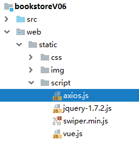
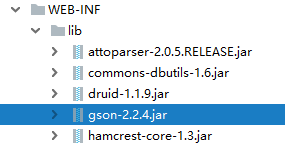
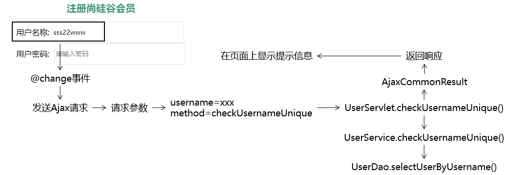
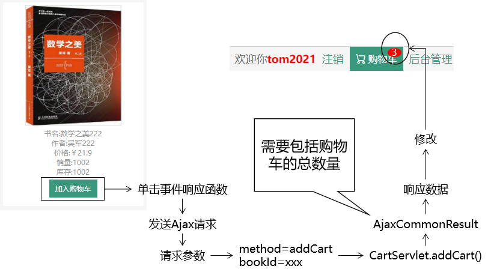
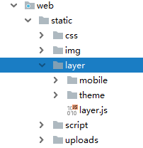
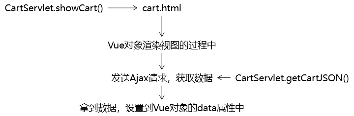
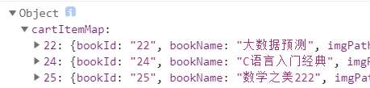

---
# 当前页面内容标题
title: 20、书城项目第六阶段
# 当前页面图标
icon: folder
# 分类
category:
  - javaweb
  - java
# 标签
tag:
  - javaweb
  - java
sticky: true
# 是否收藏在博客主题的文章列表中，当填入数字时，数字越大，排名越靠前。
star: false
# 是否将该文章添加至文章列表中
article: true
# 是否将该文章添加至时间线中
timeline: true
---

# 20、书城项目第六阶段

## 一、注册页面用户名唯一性检查优化

### 1、准备工作

- 创建module
- 迁移代码

### 2、加入Ajax开发环境

#### ①前端所需axios库



#### ②后端所需Gson库



### 3、封装AjaxCommonsResult

#### ①模型的作用

在整个项目中，凡是涉及到给Ajax请求返回响应，我们都封装到AjaxCommonsResult类型中。

#### ②模型的代码

```java
public class AjaxCommonResult<T> {

    public static final String SUCCESS = "SUCCESS";
    public static final String FAILED = "FAILED";

    private String result;
    private String message;
    private T data;
```

各个属性的含义：

| 属性名  | 含义                                                        |
| ------- | ----------------------------------------------------------- |
| SUCCESS | 代表服务器端处理请求成功                                    |
| FAILED  | 代表服务器端处理请求失败                                    |
| result  | 服务器端处理请求的结果，取值在SUCCESS和FAILED二者中选择一个 |
| message | 失败消息                                                    |
| data    | 针对查询操作返回的数据                                      |

#### ③模型的好处

- 作为整个团队开发过程中，前后端交互时使用的统一的数据格式
- 有利于团队成员之间的协助，提高开发效率

### 4、功能实现

#### ①定位功能的位置

在用户输入用户名之后，立即检查这个用户名是否可用。

#### ②思路

##### [1]给用户名输入框绑定的事件类型

结论：不能在针对username设定的watch中发送Ajax请求。

原因：服务器端响应的速度跟不上用户输入的速度，而且服务器端异步返回响应数据，无法保证和用户输入的顺序完全一致。此时有下面几点问题：

- 给服务器增加不必要的压力
- 用户输入的数据在输入过程中是不断发生变化的
- 响应数据和输入顺序不对应，会发生错乱

解决办法：绑定的事件类型使用『值改变』事件。

##### [2]流程图



#### ③代码实现

##### [0]在当前页面引入axios库文件

```html
<script src="static/script/axios.js" type="text/javascript" charset="utf-8"></script>
```

##### [1]给用户名输入框绑定值改变事件

```html
<input v-model:value="username" @change="usernameUniqueCheck" type="text" name="username" placeholder="请输入用户名" />
```

##### [2]JavaScript代码

```javascript
var registerApp = new Vue({
    "el":"#registerForm",
    "data":{
        "username":"[[${param.username}]]",
        "password":"",
        "passwordConfirm":"",
        "email":"[[${param.email}]]",
        "code":"",
        "usernameCheckMessage":""
    },
    "watch":{……},
    "methods":{
        ……,
        ……,
        "usernameUniqueCheck":function () {

            // 获取用户在文本框中输入的数据
            var username = this.username;

            // 发送Ajax请求执行检查
            axios({
                "method":"post",
                "url":"UserServlet",
                "params":{
                    "method":"checkUsernameUnique",
                    "username":username
                }
            }).then(function (response) {

                // 1.从响应数据中获取请求处理结果
                var result = response.data.result;

                // 2.判断result的值
                if (result == "SUCCESS") {

                    // 3.用户名可用
                    // 注意：现在我们在then()的回调函数中，this已经不再指向Vue对象了
                    // 所以，我们通过Vue对象的变量名来访问Vue对象
                    registerApp.usernameCheckMessage = "用户名可用";

                } else {

                    // 4.用户名不可用
                    registerApp.usernameCheckMessage = response.data.message;

                }

            }).catch(function (error) {
                console.log(error);
            });

        }
    }
});
```

##### [3]UserServlet

```java
protected void checkUsernameUnique(HttpServletRequest request, HttpServletResponse response) throws ServletException, IOException {

    AjaxCommonResult<String> ajaxResult = null;

    // 1.从请求参数中获取用户名
    String username = request.getParameter("username");

    try {
        // 2.调用Service方法检查用户名是否被占用
        userService.checkUsernameUnique(username);

        // 3.按照检测成功的结果创建AjaxCommonResult对象
        ajaxResult = new AjaxCommonResult<>(AjaxCommonResult.SUCCESS, null, null);
    } catch (Exception e) {
        e.printStackTrace();

        // 4.按照检测失败的结果创建AjaxCommonResult对象
        ajaxResult = new AjaxCommonResult<>(AjaxCommonResult.FAILED, e.getMessage(), null);
    }

    // 5.根据ajaxResult对象返回响应数据
    // ①创建Gson对象
    Gson gson = new Gson();

    // ②执行JSON数据转换
    String json = gson.toJson(ajaxResult);

    // ③设置响应体内容类型
    response.setContentType("application/json;charset=UTF-8");
    response.getWriter().write(json);

}
```

##### [4]UserService

```java
@Override
public void checkUsernameUnique(String username) {

    User user = userDao.selectUserByName(username);

    if (user != null) {
        throw new RuntimeException("用户名已经被占用");
    }

}
```

## 二、加入购物车

### 1、思路



### 2、代码实现

### ①加入layer弹层组件



```html
<script type="text/javascript" src="static/script/jquery-1.7.2.js"></script>
<script type="text/javascript" src="static/layer/layer.js"></script>
```

#### ②顶层bar绑定Vue对象

Thymeleaf在服务器端渲染的过程中将购物车总数量计算得到，通过表达式设置写入JavaScript代码，作为Vue对象的初始值。然后由Vue对象通过v-show判断是否显示数量标签。

##### [1]在HTML标签上标记id

由于要考虑是否登录的情况，所以id加到了两种情况外层的div

```html
<div id="topBarApp" class="w">
    <div class="topbar-left">
        <i>送至:</i>
        <i>北京</i>
        <i class="iconfont icon-ai-arrow-down"></i>
    </div>
    <div class="topbar-right" th:if="${session.user == null}">
        <a href="UserServlet?method=toLoginPage" class="login">登录</a>
        <a href="UserServlet?method=toRegisterPage" class="register">注册</a>
        <a href="protected/CartServlet?method=showCart" class="cart iconfont icon-gouwuche">购物车</a>
        <a href="AdminServlet?method=toPortalPage" class="admin">后台管理</a>
    </div>
    <!--          登录后风格-->
    <div class="topbar-right" th:if="${session.user != null}">
        <span>欢迎你<b th:text="${session.user.userName}">张总</b></span>
        <a href="#" class="register">注销</a>
        <a href="protected/CartServlet?method=showCart" class="cart iconfont icon-gouwuche">
            购物车
            <div class="cart-num" v-show="totalCount > 0">{{totalCount}}</div>
        </a>
        <a href="pages/manager/book_manager.html" class="admin">后台管理</a>
    </div>
</div>
```

##### [2]创建Vue对象

```javascript
// topBarApp对象的totalCount属性的初始值是Thymeleaf在服务器端运算出来用表达式设置的
var topBarApp = new Vue({
    "el": "#topBarApp",
    "data": {
        "totalCount": [[${(session.cart == null)?"0":session.cart.totalCount}]]
    }
});
```

#### ③图书列表div绑定Vue对象

##### [1]在HTML标签上标记id

目的是为了便于创建Vue对象

```html
<div id="bookListApp" class="list-content" th:if="${not #lists.isEmpty(bookList)}">
    <div class="list-item" th:each="book : ${bookList}">
        
        <p>书名:<span th:text="${book.bookName}">活着</span></p>
        <p>作者:<span th:text="${book.author}">余华</span></p>
        <p>价格:￥<span th:text="${book.price}">66.6</span></p>
        <p>销量:<span th:text="${book.sales}">230</span></p>
        <p>库存:<span th:text="${book.stock}">1000</span></p>
        <!--<button>加入购物车</button>-->
        <a th:href="@{/protected/CartServlet(method=addCart,bookId=${book.bookId})}">加入购物车</a>
    </div>
</div>
```

##### [2]在首页引入Vue和axios库文件

```html
<script src="static/script/vue.js" type="text/javascript" charset="utf-8"></script>
<script src="static/script/axios.js" type="text/javascript" charset="utf-8"></script>
```

##### [3]创建Vue对象

```javascript
<script type="text/javascript">
    new Vue({
        "el":"#bookListApp"
    });
</script>
```

##### [4]绑定单击响应函数

给加入购物车按钮绑定单击响应函数

```html
<button @click="addToCart">加入购物车</button>
```

Vue代码：

```javascript
new Vue({
    "el":"#bookListApp",
    "methods":{
        "addToCart":function () {

        }
    }
});
```

##### [5]将bookId设置到按钮中

为了便于在按钮的单击响应函数中得到bookId的值

```html
<button th:id="${book.bookId}" @click="addToCart">加入购物车</button>
```

##### [6]在单击响应函数中发送Ajax请求

```javascript
new Vue({
    "el":"#bookListApp",
    "methods":{
        "addToCart":function () {

            // event：事件对象
            // event.target：当前事件操作的对象
            // event.target.id：前事件操作的对象的id属性的值
            var bookId = event.target.id;

            axios({
                "method":"post",
                "url":"protected/CartServlet",
                "params":{
                    "method":"addCart",
                    "bookId":bookId
                }
            }).then(function (response) {

                var result = response.data.result;

                if (result == "SUCCESS") {
                    // 给出提示：加入购物车成功
                    layer.msg("加入购物车成功");

                    // 从响应数据中获取购物车总数量
                    // response.data其实就是AjaxCommonResult对象的JSON格式
                    // response.data.data就是访问AjaxCommonResult对象的data属性
                    var totalCount = response.data.data;

                    // 修改页头位置购物车的总数量
                    topBarApp.totalCount = totalCount;

                }else {

                    // 给出提示：response.data.message
                    layer.msg(response.data.message);

                }

            }).catch(function (error) {
                console.log(error);
            });
        }
    }
});
```

#### ④后端代码

CartServlet

```java
protected void addCart(HttpServletRequest request, HttpServletResponse response) throws ServletException, IOException {

    // 1.从请求参数中获取bookId
    String bookId = request.getParameter("bookId");

    // 2.根据bookId查询图书数据
    Book book = bookService.getBookById(bookId);

    // 3.获取Session对象
    HttpSession session = request.getSession();

    // 4.尝试从Session域获取购物车对象
    Cart cart = (Cart) session.getAttribute("cart");

    // 5.判断Cart对象是否存在
    if (cart == null) {

        // 6.如果不存在，则创建新的Cart对象
        cart = new Cart();

        // 7.将新创建的Cart对象存入Session域
        session.setAttribute("cart", cart);
    }

    // 8.添加购物车
    cart.addCartItem(book);

    // 9.给Ajax返回JSON格式响应
    // ①创建AjaxCommonResult对象
    AjaxCommonResult<Integer> result = new AjaxCommonResult<>(AjaxCommonResult.SUCCESS, null, cart.getTotalCount());

    // ②创建Gson对象
    Gson gson = new Gson();

    // ③将AjaxCommonResult对象转换为JSON字符串
    String json = gson.toJson(result);

    // ④设置响应体的内容类型
    response.setContentType("application/json;charset=UTF-8");

    // ⑤返回响应
    response.getWriter().write(json);

}
```

## 三、显示购物车数据

### 1、思路



### 2、代码实现

#### ①CartServlet增加getCartJSON()方法

##### [1]Cart模型的局限性



目前的Cart对象转换为JSON后，没有totalCount、totalAmount这样的属性，Map结构也不如LIst遍历方便。

##### [2]调整方式

把前端页面需要的属性，存入Map中即可。

##### [3]方法代码

```java
protected void getCartJSON(HttpServletRequest request, HttpServletResponse response) throws ServletException, IOException {

    AjaxCommonResult<Map<String, Object>> result = null;

    // 1.获取Session对象
    HttpSession session = request.getSession();

    // 2.尝试获取购物车对象
    Cart cart = (Cart) session.getAttribute("cart");

    // 3.检查cart对象是否为空
    if (cart == null) {
        result = new AjaxCommonResult<>(AjaxCommonResult.FAILED, null, null);
    } else {

        Map<String, Object> cartJSONMap = new HashMap<>();
        cartJSONMap.put("totalCount", cart.getTotalCount());
        cartJSONMap.put("totalAmount", cart.getTotalAmount());
        cartJSONMap.put("cartItemList", cart.getCartItemMap().values());

        result = new AjaxCommonResult<Map<String, Object>>(AjaxCommonResult.SUCCESS, null, cartJSONMap);
    }

    // 4.将AjaxCommonResult对象转换为JSON作为响应返回
    Gson gson = new Gson();
    String json = gson.toJson(result);
    response.setContentType("application/json;charset=UTF-8");
    response.getWriter().write(json);

}
```

#### ②前端代码

##### [1]去除Thymeleaf痕迹

将cart.html页面中，由Thymeleaf渲染数据的部分去掉。

##### [2]使用Vue对象初步接管页面渲染

```javascript
    new Vue({
        "el":"#appCart",
        "data":{
            "cart":"empty"
        },
```

HTML标签：

```html
<tbody v-if="cart == 'empty'">
    <tr>
        <td colspan="6">购物车还是空空的，赶紧去添加吧！</td>
    </tr>
</tbody>
```

#### [3]在mounted生命周期环境发Ajax请求

记得加入axios库：

```html
<script src="static/script/axios.js" type="text/javascript" charset="utf-8"></script>
```

```javascript
var cartApp = new Vue({
    "el":"#appCart",
    "data":{
        "cart":"empty"
    },
    "mounted":function () {
        axios({
            "method":"post",
            "url":"protected/CartServlet",
            "params":{
                "method":"getCartJSON"
            }
        }).then(function (response) {

            // 1.从响应数据中获取请求处理结果
            var result = response.data.result;

            // 2.检查结果是成功还是失败
            if (result == "SUCCESS") {

                // 3.获取购物车数据并赋值给Vue对象
                cartApp.cart = response.data.data;

                console.log(cartApp.cart);
            }

        }).catch(function (error) {
            console.log(error);
        });
    },
    ……
```

##### [4]完成Vue页面渲染

```html
<div id="appCart" class="w">
    <table>
        <thead>
        <tr>
            <th>图片</th>
            <th>商品名称</th>
            <th>数量</th>
            <th>单价</th>
            <th>金额</th>
            <th>操作</th>
        </tr>
        </thead>
        <tbody v-if="cart == 'empty'">
            <tr>
                <td colspan="6">购物车还是空空的，赶紧去添加吧！</td>
            </tr>
        </tbody>
        <tbody v-if="cart != 'empty'">
        <tr v-for="cartItem in cart.cartItemList">
            <td>
                
            </td>
            <td>{{cartItem.bookName}}</td>
            <td>
                <input type="hidden" name="bookId" :value="cartItem.bookId" />
                <span @click="itemDecrease" class="count">-</span>
                <input @change="itemCountChange" class="count-num" type="text" :value="cartItem.count"/>
                <span @click="itemIncrease" class="count">+</span>
            </td>
            <td>{{cartItem.price}}</td>
            <td>{{cartItem.amount}}</td>
            <td><a @click="removeConfirm" href="protected/CartServlet">删除</a></td>
        </tr>
        </tbody>
    </table>
    <div class="footer">
        <div class="footer-left">
            <a @click="clearCart" href="protected/CartServlet?method=clearCart" class="clear-cart">清空购物车</a>
            <a href="index.html">继续购物</a>
        </div>
        <div class="footer-right">
            <div>共<span>{{cart.totalCount}}</span>件商品</div>
            <div class="total-price">总金额{{cart.totalAmount}}元</div>
            <a class="pay" href="protected/OrderClientServlet?method=checkout">去结账</a>
        </div>
    </div>
</div>
```

