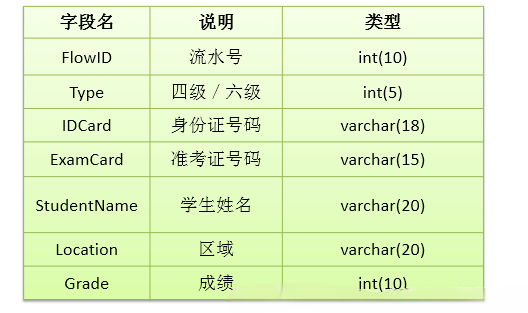
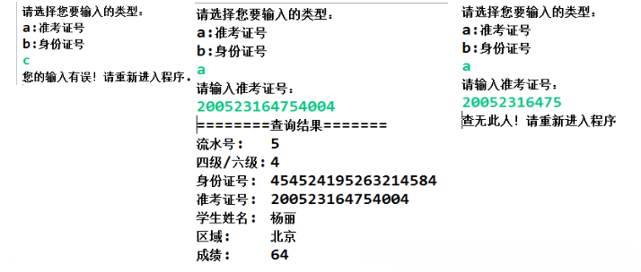

---
# 当前页面内容标题
title: 04、章节练习
# 分类
category:
  - jdbc
# 标签
tag: 
  - jdbc
  - java
  - 数据库
sticky: false
# 是否收藏在博客主题的文章列表中，当填入数字时，数字越大，排名越靠前。
star: false
# 是否将该文章添加至文章列表中
article: true
# 是否将该文章添加至时间线中
timeline: true
---

# 04、章节练习

**练习题1：从控制台向数据库的表customers中插入一条数据，表结构如下：**

![[外链图片转存失败,源站可能有防盗链机制,建议将图片保存下来直接上传(img-K60HjC6g-1601475477301)(尚硅谷_宋红康_JDBC.assets/1555580275036.png)]](./images/20200930222347318.png)

**练习题2：创立数据库表 examstudent，表结构如下：**

向数据表中添加如下数据：

**代码实现1：插入一个新的student 信息**

请输入考生的详细信息

- Type:
- IDCard:
- ExamCard:
- StudentName:
- Location:
- Grade:

信息录入成功!

**代码实现2：在 eclipse中建立 java 程序：输入身份证号或准考证号可以查询到学生的基本信息。结果如下：**

**代码实现3：完成学生信息的删除功能**

![[外链图片转存失败,源站可能有防盗链机制,建议将图片保存下来直接上传(img-6Flrsirn-1601475477312)(尚硅谷_宋红康_JDBC.assets/1555580965019.png)]](./images/20200930222429782.png)