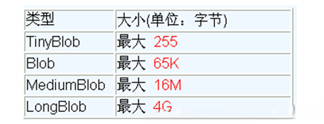

---
# 当前页面内容标题
title: 05、操作BLOB类型字段
# 分类
category:
  - jdbc
# 标签
tag: 
  - jdbc
  - java
  - 数据库
sticky: false
# 是否收藏在博客主题的文章列表中，当填入数字时，数字越大，排名越靠前。
star: false
# 是否将该文章添加至文章列表中
article: true
# 是否将该文章添加至时间线中
timeline: true
---

# 05、操作BLOB类型字段

## 5.1 MySQL BLOB类型

- MySQL中，BLOB是一个二进制大型对象，是一个可以存储大量数据的容器，它能容纳不同大小的数据。
- 插入BLOB类型的数据必须使用PreparedStatement，因为BLOB类型的数据无法使用字符串拼接写的。
- MySQL的四种BLOB类型(除了在存储的最大信息量上不同外，他们是等同的)



- 实际使用中根据需要存入的数据大小定义不同的BLOB类型。

- 需要注意的是：如果存储的文件过大，数据库的性能会下降。
- 如果在指定了相关的Blob类型以后，还报错：xxx too large，那么在mysql的安装目录下，找my.ini文件加上如下的配置参数： **max_allowed_packet**=16M。同时注意：修改了my.ini文件之后，需要重新启动mysql服务。

## 5.2 向数据表中插入大数据类型

```java
//获取连接
Connection conn = JDBCUtils.getConnection();
		
String sql = "insert into customers(name,email,birth,photo)values(?,?,?,?)";
PreparedStatement ps = conn.prepareStatement(sql);

// 填充占位符
ps.setString(1, "徐海强");
ps.setString(2, "xhq@126.com");
ps.setDate(3, new Date(new java.util.Date().getTime()));
// 操作Blob类型的变量
FileInputStream fis = new FileInputStream("xhq.png");
ps.setBlob(4, fis);
//执行
ps.execute();
		
fis.close();
JDBCUtils.closeResource(conn, ps);

```

## 5.3 修改数据表中的Blob类型字段

```java
Connection conn = JDBCUtils.getConnection();
String sql = "update customers set photo = ? where id = ?";
PreparedStatement ps = conn.prepareStatement(sql);

// 填充占位符
// 操作Blob类型的变量
FileInputStream fis = new FileInputStream("coffee.png");
ps.setBlob(1, fis);
ps.setInt(2, 25);

ps.execute();

fis.close();
JDBCUtils.closeResource(conn, ps);
```

## 5.4 从数据表中读取大数据类型

```java
String sql = "SELECT id, name, email, birth, photo FROM customer WHERE id = ?";
conn = getConnection();
ps = conn.prepareStatement(sql);
ps.setInt(1, 8);
rs = ps.executeQuery();
if(rs.next()){
	Integer id = rs.getInt(1);
    String name = rs.getString(2);
	String email = rs.getString(3);
    Date birth = rs.getDate(4);
	Customer cust = new Customer(id, name, email, birth);
    System.out.println(cust); 
    //读取Blob类型的字段
	Blob photo = rs.getBlob(5);
	InputStream is = photo.getBinaryStream();
	OutputStream os = new FileOutputStream("c.jpg");
	byte [] buffer = new byte[1024];
	int len = 0;
	while((len = is.read(buffer)) != -1){
		os.write(buffer, 0, len);
	}
    JDBCUtils.closeResource(conn, ps, rs);
		
	if(is != null){
		is.close();
	}
		
	if(os !=  null){
		os.close();
	}
    
}
```