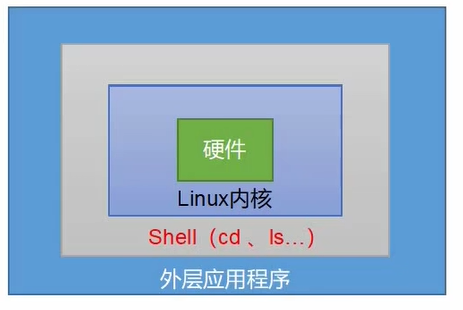

---
# 当前页面内容标题
title: 快速上手Shell编程
# 当前页面图标
icon: shell
# 分类
category:
  - linux
  - shell
# 标签
tag: 
  - linux
  - centos
  - shell
sticky: false
# 是否收藏在博客主题的文章列表中，当填入数字时，数字越大，排名越靠前。
star: false
# 是否将该文章添加至文章列表中
article: true
# 是否将该文章添加至时间线中
timeline: true
---

## 1. Shell概述

 Shell是一个命令[解释器](https://so.csdn.net/so/search?q=解释器&spm=1001.2101.3001.7020)，它接收应用程序/用户命令，然后调用操作系统内核。



Shell是一个功能强大的编程语言，易编写、易调试、灵活性强。

1. Linux提供的Shell解析器有

```bash
cat /etc/shells
```

2. bash和sh的关系

```bash
cd /bin
ll | grep bash

[root@lys bin]# echo $SHELL
/bin/bash
```

## 2. Shell 脚本入门

（1）脚本格式

 脚本以#!/bin/bash开头 （指定解析器）

（2）第一个[Shell脚本](https://so.csdn.net/so/search?q=Shell脚本&spm=1001.2101.3001.7020) helloworld.sh

```bash
touch helloworld.sh
vim helloworld.sh

# 内容
# !/bin/bash
echo "hellow world"
```

（3）脚本的常用执行方式

1. bash或sh + 脚本的相对路径或绝对路径 （不用赋予脚本+x权限）（重新开了一个进程执行bash命令）

```bash
sh ./helloworld.sh
bash ./helloworld.sh
```

2. 采用输入脚本的绝对路径或相对路径执行脚本（必须具有可执行权限+x）（本质是使用当前的bash进程执行命令）

```bash
./helloworld.sh
```

3. 【了解】在脚本的路径前加“.”或者source

```bash
source helloworld.sh 
. helloworld.sh
```

原因：

 前两种方式都是在当前shell找那个打开一个子shell来执行脚本内容，当脚本内容结束，则子shell关系，回到父shell中。

 第三种，也就是使用在脚本路径前加”." 或者source的方式，可以使脚本内容在当前shell里执行，而无需打开子shell。这就是为什么我们每次要修改完/etc/profile文件以后，需要source一下的原因。

 开子shell与不开子shell的却别就在于，环境变量的集成关系，如在子shell中设置的当前变量，父shell是不可见的。

**子Shell**

```bash
[root@lys shell]# ps -f
UID        PID  PPID  C STIME TTY          TIME CMD
root      1907 10679  0 12:46 pts/1    00:00:00 ps -f
root     10679 10672  0 09:47 pts/1    00:00:00 -bash
[root@lys shell]# bash
[root@lys shell]# ps -f
UID        PID  PPID  C STIME TTY          TIME CMD
root      1970 10679  0 12:46 pts/1    00:00:00 bash
root      2006  1970  0 12:46 pts/1    00:00:00 ps -f
root     10679 10672  0 09:47 pts/1    00:00:00 -bash
[root@lys shell]# exit
exit
[root@lys shell]# ps -f
UID        PID  PPID  C STIME TTY          TIME CMD
root      2034 10679  0 12:46 pts/1    00:00:00 ps -f
root     10679 10672  0 09:47 pts/1    00:00:00 -bash
```

## 3. 变量

### 3.1 系统预定义变量

常用系统变量

HOME、PWD、SHELL、USER

(1)查看系统变量的值

```bash
echo $HOME
```

(2)显示当前Shell中所有变量：

```bash
env
set # 包含所有系统自定义和用户自定义的变量 
printenv $USER
printenv USER
```

### 3.2 自定义变量

（1）基本语法

1. 定义变量：变量名=变量，注意，= 前后不能有空格
2. 撤销变量：usset变量名
3. 声明静态变量：readonly变量，注意：不能unset

（2）变量定义规则

1. 变量名称可以由字母、数字和下划线组成，但是不能以数字开头，环境变量名建议大写。
2. 等号两侧不能有空格
3. 在bash中，变量默认类型都是字符串类型，无法进行数值运算。
4. 变量的值如果有空格，需要使用双引号或单引号括起来。

```bash
[root@lys shell]# a=2
[root@lys shell]# echo $a
2
# 提升为全部变量
[root@lys shell]# export a

new_var='hello linux'
vim helloworld.sh
# 追加
echo $new_var

sh helloworld.sh
#发现没有值
# 使用一下命令就有值
. hellworld.sh
sourcce hellowrld.sh
```

计算

```bash
a=$((1+5))
a=$[1+5]
```

定义只读变量

```bash
readonly=5f
```

撤销变量

```bash
unset a
```

### 3.3 特殊变量

#### 3.3.1 $n

```sh
$n  n为数字，$0代表该脚本名称，$1-9 代表第一到第九个参数，十以上的参数需要用大括号标识如{10}
```

```bash
vim helloworld.sh
echo "hello，$1"
# 执行
sh helloworld.sh a
# 输出
hello，a
```

示例2

```bash
#!/bin/bash
echo '======$n====='
echo script name: $0
echo 1st paramater: $1
echo 2nd paramater: $2

[root@lys shell]#  sh parameter.sh 0 1 2
======$n=====
script name: parameter.sh
1st paramater: 0
2nd paramater: 1

# 获取调用文件名称
basename
```

#### 3.3.2 $#

$# 获取所有输入参数个数，常用于循环，判断参数的个数是否正确以及加强脚本的健壮性

```bash
vim parameter.sh 
#!/bin/bash
echo '======$n====='
echo script name: $0
echo 1st paramater: $1
echo 2nd paramater: $2
echo '======$#====='
echo paramter numbers: $#


sh parameter.sh ab cd
# 结果
======$n=====
script name: parameter.sh
1st paramater: ab
2nd paramater: cd
======$#=====
paramter numbers: 2
```

#### 3.3.3 ∗ 、 *、∗、@

 ∗ 这个变量代表命令行中所有的参数，*把所有的参数看成一个整体

 @ 这个变量也代表命令行中所有的参数，不过@把每个参数区分对待

```bash
vim paramter.sh
#!/bin/bash
echo '======$n====='
echo script name: $0
echo 1st paramater: $1
echo 2nd paramater: $2
echo '======$#====='
echo paramter numbers: $#
echo $*
echo $@


[root@lys shell]# sh parameter.sh ab cd
======$n=====
script name: parameter.sh
1st paramater: ab
2nd paramater: cd
======$#=====
paramter numbers: 2
ab cd
ab cd
```

#### 3.3.4 $?

 $? 最后一次执行的命令的返回状态。如果这个变量的值为0，证明上一个命令正确执行；如果这个变量非0（具体是哪个数，由命令自己来决定）则证明上一命令执行不正确了）

```bash
[root@lys shell]# ./helloworld.sh 
helloworld
hello，
[root@lys shell]# echo $?
0

# 如果错误执行，就非0
[root@lys shell]# $?
-bash: 0: command not found
[root@lys shell]# echo $?
127
```

## 4 运算符

$((运算式)) 或 $[运算式]

计算 （2+3）*4

```bash
[root@lys shell]# echo $[(2+3)*4]
20
```

expr使用

```bash
expr 1 + 2
3

# 乘法需转义
expr 5 \* 2
10
```

命令替换

```bash
[root@lys shell]# a=$(expr 2 + 2)
[root@lys shell]# echo $a
4


[root@lys shell]# a=`expr 5 + 2`
[root@lys shell]# echo $a
7
```

加法脚本

```bash
#!/bin/bash
sum=$[$1 + $2]
echo $sum          
```

## 5 条件判断

基本语法

 test condition

[ condition] （注意condition前后要有空格）

注意: 条件非空即为true, [lys] 返回true, [ ]返回false

常用判断条件

（1）两个整数之间比较

-eq 等于（equal）

-ne 不等于 （not equal)

-lt 小于 （less than)

-le 小于等于 （less equal)

-gt 大于 （greate than)

-ge 大于等于 （greater equal)

注：如果是字符串之间的比较，用等号”=“判断相等；用”！=“判断不等。

（2）按照文件权限进行判断

-r 有读的权限（read)

-w 有写的权限 （write)

-x 有执行的权限 （execute)


```bash
# 判断文件是否有可执行权限
[root@lys shell]# [ -x helloworld.sh ]
[root@lys shell]# echo $?
0
# 结果0代表有
```


（3）按照文件类型进行判断

-e 文件存在（existence)

-f 文件存在并且是一个常规的文件（file)

-d 文件存在并且是一个目录（directory)

案例实操

1. 23是否大于等于22

```bash
$ [ 23 -ge 22 ]
```

2. 判断文件是否有可执行权限

```bash
$ [ -x helloworld.sh ]
```

3. 文件是否存在

```bash
$ [ -e helloworld.sh]
```

## 6 流程控制

### 6.1 if判断

（1）单分支

```sh
if [条件判断]; then
	程序
fi
```

或者

```sh
if [ 条件判断式 ]
then 
	程序
fi
```

```sh
if [ "$1"x = "lys"x ]
then
        echo 'welcome, lys'
fi   
```

```sh
if [ $a -gt 18 -a $a -lt 35]; then echo OK; fi 
-a and
-o or
```

多分支

```sh
if [ 条件判断式 ]
then 
	程序

```

```sh
if [ $2 -lt 18 ]
then
        echo "未成年人"
elif [ $2 -lt 35 ]
then
        echo "中年人"
else
        echo "成年人"
fi

```

### 6.2 case语句

基本语法

```bash
case $变量名 in
"值1")
;;
"值2")
;;
*)
	如果变量的值都不是以上的值，则执行此程序
;;
esac

```

注意事项：

（1）case行尾必须为单词 “in”, 每个模式匹配必须以有括号")" 结束

（2）双分号“;;"表示命令序列结束，相当于java的breakl

（3）最后的“*）"表示默认模式，相当于java中的default

```bash
case $1 in
1)
        echo "one"
;;
2)
        echo "two"
;;
3)
        echo "three"
;;
*)
        echo "number else"
;;
esac

sh case_test.sh 1

```

### 6.3 for 循环

基本语法

```bash
for ((初始值; 循环控制条件; 变量变化 ))
do 
	程序
done
```

```bash
#!/bin/bash

for (( i=1; i <= $1 ; i++  ))
do
        sum=$[ $sum + $i ]

done;

echo $sum

```

```sh
 for os in linux windows macos; do echo $os; done
```

```sh
for i in {1..100}; do sum=$[$sum+$i]; done; echo $sum
```

for 与 ∗ 和 * 和∗和@

```bash
echo '$#'
for para in $*
do
        echo $para
done


echo '$@'
for para in $@
do
        echo $para
done


[root@lys shell]# sh for_test2.sh 1 2 3 
$#
1
2
3
$@
1
2
3
```

如果使用引号包围起来

```bash
echo '$#'
for para in "$*"
do
        echo $para
done


echo '$@'
for para in "$@"
do
        echo $para
done


[root@lys shell]# sh for_test2.sh 1 2 3 
$#
1 2 3
$@
1
2
3
```

### 6.4 while循环

```sh
while [ 条件判断式 ]
do 	
	程序
done

```

while循环实现 1+100

```sh
i=1
sum=0
while [ $i -le 100 ]
do
        sum=$[ $sum + $i ]
        i=$[$i + 1]
# 		let sum+=i
#		let i++ let 实现方式 
done;
echo $sum
```

### 7 read读取控制台输入

基本语法

 read (选项) （参数）

 -p：指定读取值时的提示符：

 -t：指定读取值时等待的时间（秒）如果-t不加表示一直等待

 参数：

 变量：指定读取值的变量名

案例实操

 提示7秒内，读取控制台输入的名称

```sh
read -t 10 -p "请输入您的名称：" name
echo "welcome $name"
```

## 7 函数

### 7.1 系统函数

#### 7.1.1 basename

 basename [string/pathname] [suffix] basename命令会删除所有的前缀包括最后一个（“/")字符，然后再字符串显示出来

 basename 可以理解为取路径里的文件名称

 选项:

 suffix为后缀，如果suffix被指定了，basename会讲pathname或string中的suffix去掉。

```sh
filename="$1"_log_$(date +%s)
echo $filename
```

basename 基础用法

```bash
[root@lys shell]# basename helloworld.sh 
helloworld.sh

[root@lys shell]# basename helloworld.sh .sh
helloworld
```

#### 8.1.2 dirname

 dirname 文件**绝对路径** 从给定的包含绝对路径的文件名中取出文件名（非目录的部分)，然后返回剩下的路径（目录的部分））

 dirname 可以理解为取文件路径的绝对路径名称

 获取hellowolrd.sh的目录名称

### 7.2 自定义函数

```sh
[function] funname[()]

{
	Action;

    [return int;]

}
```

经验技巧

 （1）必须在调用函数地方之前，先声明函数，shell脚本是逐行运行。不会像其他语言一样先编译。

 （2）函数返回值，只能通过$?系统变量获得，可以显示加：return返回，如果不加，将以最后一条命令运行结果作为返回值。return后跟述职n(0–255)

计算两数的和

```sh
function add(){
        s=$[$1+$2]
        echo "sum=$s"
}
read -p "请输入第一个整数" a
read -p "请输入第二个整数" b
add $a $b
```

使用#？最大只能返回255

```sh
function add(){
        s=$[$1+$2]
        return $s
}
read -p "请输入第一个整数" a
read -p "请输入第二个整数" b
add $a $b
echo "sum="$?
```

使用$()获取值

```sh
function add(){
        s=$[$1+$2]
        echo $s
}
read -p "请输入第一个整数" a
read -p "请输入第二个整数" b
sum=$(add $a $b)
echo "sum=$sum"
```

## 8 综合案例

### 8.1 归档文件

 实际生产中，往往需要对重要数据进行归档备份。

需求：实现一个每天对指定目录归档备份的脚本，输入一个目录名称（末尾不带/）,将目录下所有文件按天归档保存，并将归档日期附加在归档文件名上，放在/root/archive下。

 这里使用到了归档命令：tar

 后面可以加上-c表示归档。加上-z选项表示同时进行压缩，得到的文件后缀名为tar.gz

 脚本实现：

```sh
 #!/bin/bash


#首先判断输入参数个数是否为1
if [ $# -ne 1 ]
then
        echo "参数个数错误！应该输入一个参数，作为归档目录"
        exit
fi

# 从参数中获取目录名称
if [ -d $1 ]
then
        echo 
else
        echo
        echo "目录不存在!"
        exit
fi

DIR_NAME=$(basename $1)
DIR_PATH=$(cd $(dirname $1); pwd)


# 获取当前日期
DATE=$(date +%y%m%d)
# 生成的归档文件名称
FILE=archive_${DIR_NAME}_$DATE.tar.gz
DEST=/root/archive/$FILE

# 开始归档
echo "开始归档..."
echo 

tar -zcf $DEST  $DIR_PATH/$DIR_NAME

if [ $? -eq 0 ]
then
        echo
        echo "归档成功"
        echo "归档文件为：$DEST"
else
        echo "归档出现问题"
        echo 
fi
exit
```

执行

```bash
 mkdir /root/archive
 sh tar.sh ../shell/
```

定时执行

```bash
crontab -e
0 2 * * * /java-project/shell/tar.sh /java-project/shell
```

## 9 正则表达式入门

 正则表达式使用单个字符串来描述、匹配一系列符合某个语法规则的字符串。在很多文本编辑器里，正则表达式通常被用来检索、替换那些符合某个模式的文本。在Linux中，grep，sed，awk等文本处理工具都支持通过正则表达式进行模式匹配。

### 9.1 常规匹配

 一串不包含规则字符的正则表达式匹配它自己，例如：

```bash
cat /etc/passwd | grep lys
```

就会匹配所有包含lys的行

### 9.2 常用特殊字符

1. 特殊字符: ^

   ^匹配一行的开头，例如：

   ```bash
   cat /etc/passwd | grep ^a
   ```

   会匹配出所有的a开头的行

2. 特殊字符：$

   $ 匹配一行的结束，例如：

   ```bash
   cat /etc/passwd | grep t$
   ```

   查找空行

   ```bash
   cat helloworld.sh | grep ^$
   ```

3. 特殊字符：.

   ```bash
   cat /etc/passwd | grep r..t
   ```

   会匹配包含rabt,rbbt,rxdt,root等的所有行

4. 特殊字符：*

   *不单独使用，他上一个字符连用，表示上一个字符0次或多次，例如

   ```bash
   cat /etc/passwd | grep ro*t
   ```

   会匹配rt,rot,root,roooor等

   .*会匹配全部

5. 字符区间（中括号）：[]

   [] 表示匹配某个范围内的一个字符，例如

   [6,8]-------匹配6或者8，

   [0-9]------匹配一个0-9的数字

   [0-9]*-----匹配任意长度的数字字符串

   [a-z] — 匹配一个a-z之间的字符串

   [a-z]* ------ 匹配任意长度的字母字符串

   [a-z,e-f]-- 匹配a-c，或者e-f之间的任意字符

   ```sh
   cat /etc/passwd | grep r[a,b,c]*t
   ```

   会匹配rt,rat,raat等等行

6. 特殊字符：\

    \标识转义，并不会单独使用。由于所有特殊字符都有其特定匹配模式，当我们想匹配某一特殊字符本身时（例如，我想找出所有包含’$'的行），就需要将转义符合特殊字符连用，来表示特殊字符本身，例如

   ```sh
   cat /etc/passwd | grep 'a\$b'
   ```

   就会匹配所有包含a$b的行。主要需要使用单引号将表达式引起来、

## 10 文本处理工具

### 10.1 cut

 cut的工作就是“剪”,具体的说 就是在文件中负责剪切数据用的。cut命令从文件的每一行剪切字节、字符和字段并将这些字节、字符和字段输出。

基本用法

 cut [选项参数] filename

 说明：默认分隔符是制表符

| 选项参数 | 功能                                           |
| -------- | ---------------------------------------------- |
| -f       | 列号，提前第几列                               |
| -d       | 分隔符，按照指定分隔符分割列，默认是制表符“\t" |
| -c       | 按字符进行切割 后加加n 表示取第几列 比如 -c 1  |

数据准备

```bash
dong shen
guan zhen
wo wo
lai lai
le le
```

切割 cut.txt 第一列

```bash
cut -d " " -f 1 cut.sh 
```

截取第二列

```bash
cut -d " " -f 2 cut.sh 
```

截取区间

```bash
cut -d " " -f 1-4 cut.sh 
cut -d " " -f -4 cut.sh
cut -d " " -f 4- cut.sh 
```

在cut切割guan

```bash
cat cut.sh | grep guan | cut -d " " -f 1
```

选取系统 PATH 变量值，第 2 个“：”开始后的所有路径：

```sh
echo $PATH 
/java-project/jdk1.8.0_321/bin:/usr/local/sbin:/usr/local/bin:/usr/sbin:/usr/bin:/root/bi

echo $PATH | cut -d ":" -f 3-
/usr/local/bin:/usr/sbin:/usr/bin:/root/bin
```

切割 ifconfig 后打印的 IP 地址

```bash
ifconfig ens33 | grep netmask | cut -d " " -f 10
```

### 10.2 awk

 一个强大的文本分析工具，把文件逐行的读入，以空格为默认分隔符将每行切片，切开的部分再进行分析处理。

基本用法

 awk [选项参数] ‘/pattern1/{action}’ ‘/patten2/{action2}’ filename

 pattern：表示awk在数据中查找的内容，就是匹配模式

 action:在匹配内容时所执行的一系列命令

| 选项参数 | 功能                 |
| -------- | -------------------- |
| -F       | 指定输入文件分隔符   |
| -v       | 赋值一个用户定义变量 |

案例实操

（1）数据准备

搜索passwd文件以root关键字开头的所有行，并输出该行的第7列

```sh
#cut 实现
 cat /etc/passwd | grep ^root | cut -d ";" -f 7
# awk实现
cat /etc/passwd | awk -F ":" '/^root/ {print $7}'
ps -ef | awk '{print $}'
# 打印文件大小
ll -l | awk '{print $5}'
```

搜索passwd文件以root关键字开头的所有行，并输出该行的第1列和第7列，中间以“，”号分割。

```bash
cat /etc/passwd | awk -F ":" '/^root/ {print $1","$7}'
```

(4)只显示/etc/passwd的第一列和第七列，以逗号分割，且在所有行前面添加列名"begin"在最后一行添加"end"

```sh
cat /etc/passwd | awk -F ":" 'BEGIN{print "begin"}{print $1","$7}END{print "end"}'
```

(5)将passwd文件中的用户id增加1并输出

```bash
cat /etc/passwd | awk -F ":" '{print $3+1}'
# 使用变量
cat /etc/passwd | awk -v i=1 -F ":" '{print $3+i}'
```

awk的内置变量

| 变量     | 说明                                   |
| -------- | -------------------------------------- |
| FILENAME | 文件名                                 |
| NR       | 已读的记录数（行号）                   |
| DF       | 浏览记录的域的个数（切割后，列的个数） |

案例实操

 （1）统计passwd文件名，每行的行号，每行的列数

```sh
cat /etc/passwd | awk  -F ":" '{print "文件名 :"FILENAME "行号：" NR "列数: "NF }'
```

(2) 查询ifconfig命令和输出结果中的空行所在的行号

```bash
  ifconfig | awk '/^$/ {print "空行: " NR}' 
```

## 11 综合应用

 我们可以利用 Linux 自带的 mesg 和 write 工具，向其它用户发送消息。

 需求：实现一个向某个用户快速发送消息的脚本，输入用户名作为第一个参数，后面直 接跟要发送的消息。脚本需要检测用户是否登录在系统中、是否打开消息功能，以及当前发送消息是否为空。

前置知识

```sh
who 查看有多少控制台
[root@bogon logs]# who
root     pts/0        2022-05-26 17:34 (124.64.252.49)
root     pts/1        2022-05-27 10:12 (120.244.202.117)
root     pts/2        2022-05-27 11:37 (58.34.52.34)
root     pts/5        2022-05-27 10:16 (120.244.202.117)
root     pts/6        2022-05-27 19:10 (120.245.102.201)
root     pts/8        2022-05-25 10:18 (124.64.252.49)

# 向某个控制台发出消息
write root pts/1
hi
```

脚本实现如下：

```sh
#!/bin/bash/

# 查看用户是否登录
login_user=$(who | grep -i -m 1 $1 | awk '{print $1}' )

if [ -z $login_user ]
then
	echo "$1 不在线！"
	echo "脚本退出"
	exit
fi


# 查看用户是否开启消息功能
is_allowed=$(who -T | grep -i -m 1 $1 | awk '{print $2}' )

if [ $is_allowed != "+" ]
then
	echo "$1 没有开启消息功能"
	echo "脚本退出..."
	exit
fi

# 确认是否有消息发送

if [ -z $2 ]
then
	echo "没有消息发送"
	echo "脚本退出"
	exit
fi


# 从参数中获取要发送的消息
whole_msg=$(echo $* | cut -d " " -f 2-)

# 获取用户登录的终端
user_terminal=$(who | grep -i -m 1 $1 | awk '{print $2}' )


# 写入要发送的消息
echo $whole_msg | write $login_user $user_terminal

if [ $? != 0 ]
then 
	echo "发送失败！"
else
	echo "发送成功!"
fi

exit

```

获取文件大小

```bash
filename="XXXX.jar"
filesize=`ls -l $filename | awk '{ print $5 }'`
filesize=$(stat -c%s "$filename")
```