---
# 当前页面内容标题
title: 十一、RabbitMQ集群
# 分类
category:
  - rabbitmq
# 标签
tag: 
  - rabbitmq
  - 消息中间件
  - MQ
sticky: false
# 是否收藏在博客主题的文章列表中，当填入数字时，数字越大，排名越靠前。
star: false
# 是否将该文章添加至文章列表中
article: true
# 是否将该文章添加至时间线中
timeline: true
---

## 01、clustering

### 使用集群的原因

最开始我们介绍了如何安装及运行RabbitMQ服务，不过这些是单机版的，无法满足目前真实应用的要求。如果RabbitMQ服务器遇到内存崩溃、机器掉电或者主板故障等情况，该怎么办？单台RabbitMQ服务器可以满足每秒1000条消息的吞吐量，那么如果应用需要RabbitMQ服务满足每秒10万条消息的吞吐量呢？购买昂贵的服务器来增强单机RabbitMQ务的性能显得捉襟见肘，搭建一个RabbitMQ集群才是解决实际问题的关键。

### 搭建步骤

1. 修改3台机器的主机名称

```sh
vim	/etc/hostname
```

2. 配置各个节点的hosts文件，让各个节点都能互相识别对方

```sh
vim	/etc/hosts

10.211.55.74	node1
10.211.55.75	node2
10.211.55.76	node3
```

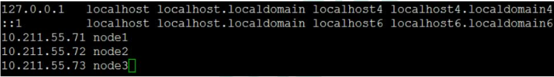

3. 以确保各个节点的cookie文件使用的是同一个值

在node1上执行远程操作命令

```sh
scp /var/lib/rabbitmq/.erlang.cookie root@node2:/var/lib/rabbitmq/.erlang.cookie

scp
/var/lib/rabbitmq/.erlang.cookie
root@node3:/var/lib/rabbitmq/.erlang.cookie
```

4. 启动RabbitMQ服务,顺带启动Erlang虚拟机和RbbitMQ应用服务(在三台节点上分别执行以下命令)

```sh
rabbitmq-server	-detached
```

5. 在节点2执行

```sh
rabbitmqctl	stop_app

# (rabbitmqctl stop会将Erlang虚拟机关闭，rabbitmqctl stop_app只关闭RabbitMQ服务)

rabbitmqctl reset

rabbitmqctl join_cluster rabbit@node1

rabbitmqctl start_app(只启动应用服务)
```

6. 在节点3执行

```sh
rabbitmqctl stop_app
rabbitmqctl reset
rabbitmqctl join_cluster rabbit@node2
rabbitmqctl	start_app
```

7. 集群状态

```sh
rabbitmqctl cluster_status
```

8. 需要重新设置用户

创建账号

```sh
rabbitmqctl add_user admin 123
```

设置用户角色

```sh
rabbitmqctl	set_user_tags admin administrator
```

设置用户权限

```sh
rabbitmqctl set_permissions -p "/" admin ".*" ".*" ".*"
```

9. 解除集群节点(node2和node3机器分别执行)

```sh
rabbitmqctl	stop_app
rabbitmqctl reset
rabbitmqctl start_app
rabbitmqctl	cluster_status
rabbitmqctl	forget_cluster_node rabbit@node2(node1机器上执行)
```

## 02、镜像队列

### 使用镜像的原因

如果RabbitMQ集群中只有一个Broker节点，那么该节点的失效将导致整体服务的临时性不可用，并且也可能会导致消息的丢失。可以将所有消息都设置为持久化，并且对应队列的durable属性也设置为true，但是这样仍然无法避免由于缓存导致的问题：因为消息在发送之后和被写入磁盘井执行刷盘动作之间存在一个短暂却会产生问题的时间窗。通过publisherconfirm机制能够确保客户端知道哪些消息己经存入磁盘，尽管如此，一般不希望遇到因单点故障导致的服务不可用。

引入镜像队列(MirrorQueue)的机制，可以将队列镜像到集群中的其他Broker节点之上，如果集群中的一个节点失效了，队列能自动地切换到镜像中的另一个节点上以保证服务的可用性。

### 搭建步骤

1. 启动三台集群节点

2. 随便找一个节点添加policy

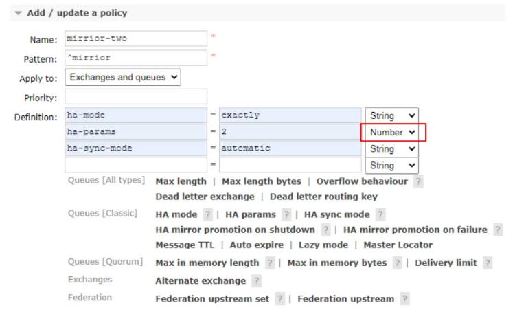

3. 在node1上创建一个队列发送一条消息，队列存在镜像队列

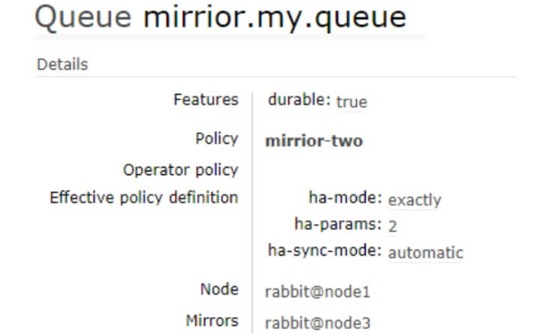

4. 停掉node1之后发现node2成为镜像队列

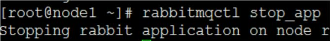

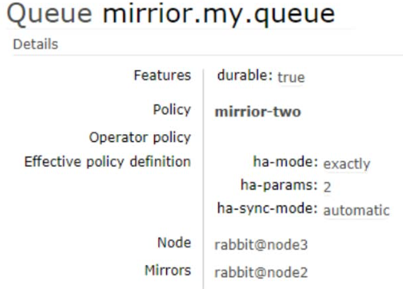

5. 就算整个集群只剩下一台机器了依然能消费队列里面的消息

> 说明队列里面的消息被镜像队列传递到相应机器里面了

## 03、Haproxy+Keepalive实现高可用负载均衡

### 整体架构图

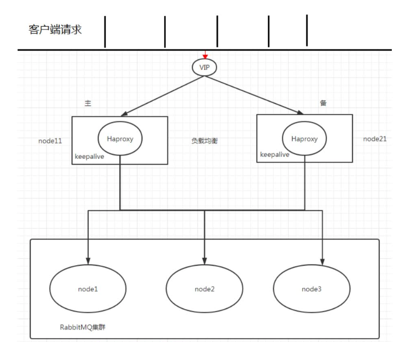

### Haproxy实现负载均衡

HAProxy提供高可用性、负载均衡及基于TCPHTTP应用的代理，支持虚拟主机，它是免费、快速并且可靠的一种解决方案，包括Twitter,Reddit,StackOverflow,GitHub在内的多家知名互联网公司在使用。HAProxy实现了一种事件驱动、单一进程模型，此模型支持非常大的井发连接数。

> 扩展nginx,lvs,haproxy之间的区别:http://www.ha97.com/5646.html

### 搭建步骤

1. 下载haproxy(在node1和node2)

```sh
yum -y install haproxy
```

2. 修改node1和node2的haproxy.cfg

```sh
vim /etc/haproxy/haproxy.cfg
```

需要修改红色IP为当前机器IP

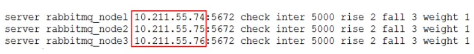

3. 在两台节点启动haproxy

```sh
haproxy -f /etc/haproxy/haproxy.cfg
ps -ef | grep haproxy
```

4. 访问地址

```
http://10.211.55.71:8888/stats
```

### Keepalived实现双机(主备)热备

试想如果前面配置的HAProxy主机突然宕机或者网卡失效，那么虽然RbbitMQ集群没有任何故障但是对于外界的客户端来说所有的连接都会被断开结果将是灾难性的为了确保负载均衡服务的可靠性同样显得十分重要，这里就要引入Keepalived它能够通过自身健康检查、资源接管功能做高可用(双机热备)，实现故障转移。

### 搭建步骤

1. 下载keepalived

```sh
yum -y install keepalived
```

2. 节点node1配置文件

```sh
vim /etc/keepalived/keepalived.conf
```

把资料里面的keepalived.conf修改之后替换

3. 节点node2配置文件

> 需要修改global_defs的router_id,如:nodeB
>
> 其次要修改vrrp_instance_VI中state为"BACKUP"；
>
> 最后要将priority设置为小于100的值

4. 添加haproxy_chk.sh

(为了防止HAProxy服务挂掉之后Keepalived还在正常工作而没有切换到Backup上，所以这里需要编写一个脚本来检测HAProxy务的状态,当HAProxy服务挂掉之后该脚本会自动重启HAProxy的服务，如果不成功则关闭Keepalived服务，这样便可以切换到Backup继续工作)

```sh
vim /etc/keepalived/haproxy_chk.sh(可以直接上传文件)
```

修改权限

```sh
chmod777 /etc/keepalived/haproxy_chk.sh
```

5. 启动keepalive命令(node1和node2启动)

```sh
systemctl start keepalived
```

6. 观察Keepalived的日志

```sh
tail -f /var/log/messages -n 200
```

7. 观察最新添加的vip

```sh
ip add show
```

8. node1模拟keepalived关闭状态

```sh
systemctl stop keepalived
```

9. 使用vip地址来访问rabbitmq集群

## 04、Federation Exchange

### 使用它的原因

(broker北京)，(broker深圳)彼此之间相距甚远，网络延迟是一个不得不面对的问题。有一个在北京的业务(Client北京)需要连接(broker北京)，向其中的交换器exchangeA发送消息，此时的网络延迟很小，(Client北京)可以迅速将消息发送至exchangeA中，就算在开启了publisherconfirm机制或者事务机制的情况下，也可以迅速收到确认信息。此时又有个在深圳的业务(Client深圳)需要向exchangeA发送消息，那么(Client深圳) (broker北京)之间有很大的网络延迟，(Client深圳)将发送消息至exchangeA会经历一定的延迟，尤其是在开启了publisherconfirm机制或者事务机制的情况下，(Client深圳)会等待很长的延迟时间来接收(broker北京)的确认信息，进而必然造成这条发送线程的性能降低，甚至造成一定程度上的阻塞。

将业务(Client深圳)部署到北京的机房可以解决这个问题，但是如果(Client深圳)调用的另些服务都部署在深圳，那么又会引发新的时延问题，总不见得将所有业务全部部署在一个机房，那么容灾又何以实现？这里使用Federation插件就可以很好地解决这个问题。

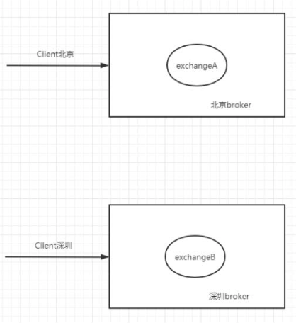

### 搭建步骤

1. 需要保证每台节点单独运行

2. 在每台机器上开启`federation`相关插件

```sh
rabbitmq-plugins enable rabbitmq_federation

rabbitmq-plugins enable rabbitmq_federation_management
```


3. 原理图(先运行consumer在node2创建fed_exchange)

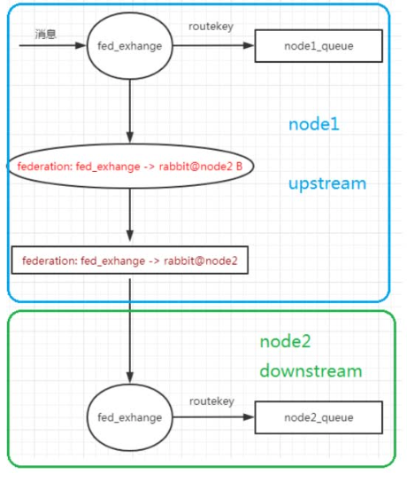

4. 在downstream(node2)配置upstream(node1)

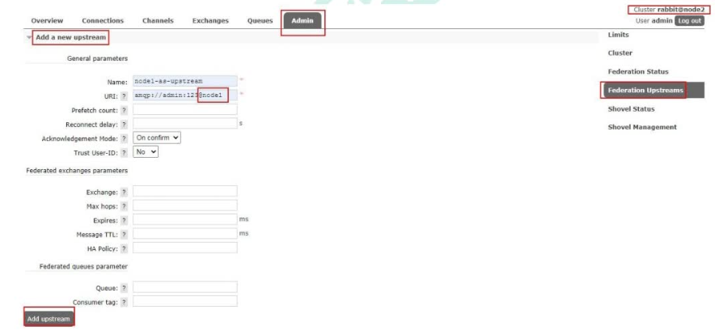

5. 添加policy

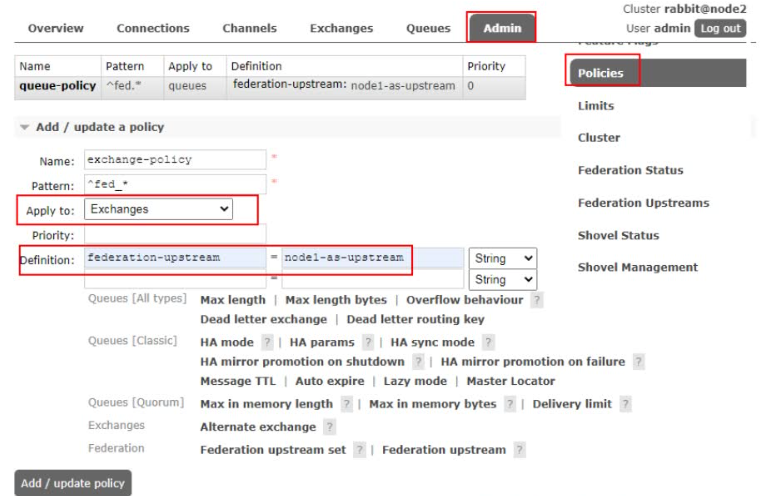

6. 成功的前提


## 05、Federation Queue

### 使用它的原因

联邦队列可以在多个Broker节点(或者集群)之间为单个队列提供均衡负载的功能。一个联邦队列可以连接一个或者多个上游队列(upstreamqueue)，并从这些上游队列中获取消息以满足本地消费者消费消息的需求。

### 搭建步骤

1. 原理图


2. 添加upstream(同上)

3. 添加policy

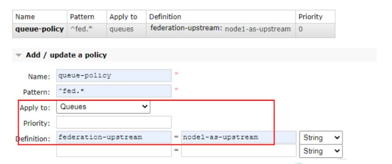

## 06、Shovel

### 使用它的原因

Federation具备的数据转发功能类似，Shovel够可靠、持续地从一个Broker中的队列(作为源端，即source)拉取数据并转发至另一个Broker中的交换器(作为目的端，即destination)。作为源端的队列和作为目的端的交换器可以同时位于同一个Broker，也可以位于不同的Broker上。Shovel可以翻译为"铲子"，是一种比较形象的比喻，这个"铲子"可以将消息从一方"铲子"另一方。Shovel行为就像优秀的客户端应用程序能够负责连接源和目的地、负责消息的读写及负责连接失败问题的处理。

### 搭建步骤

1. 开启插件(需要的机器都开启)

```sh
rabbitmq-plugins enable rabbitmq_shovel

rabbitmq-plugins enable rabbitmq_shovel_management
```


2. 原理图(在源头发送的消息直接回进入到目的地队列)

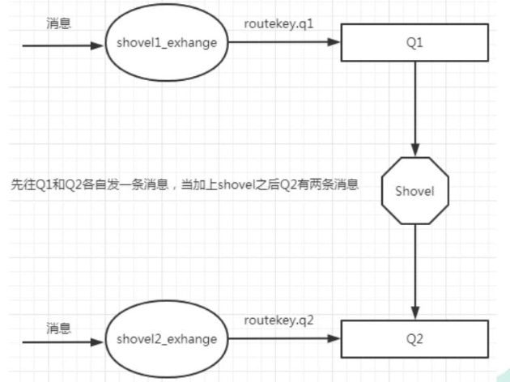

3. 添加shovel源和目的地

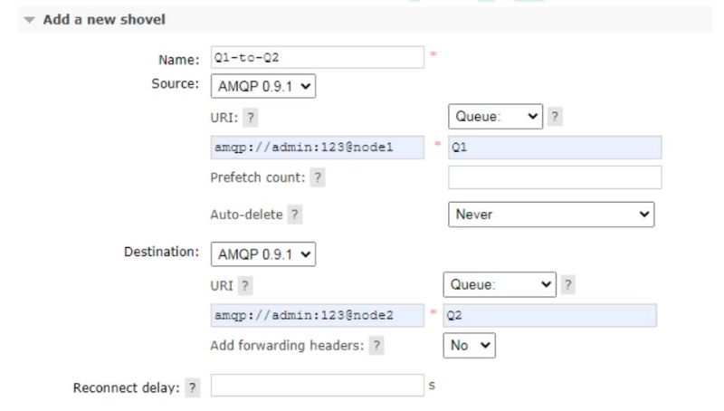