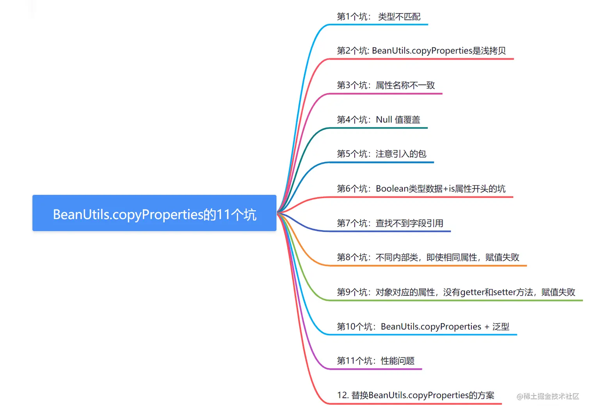
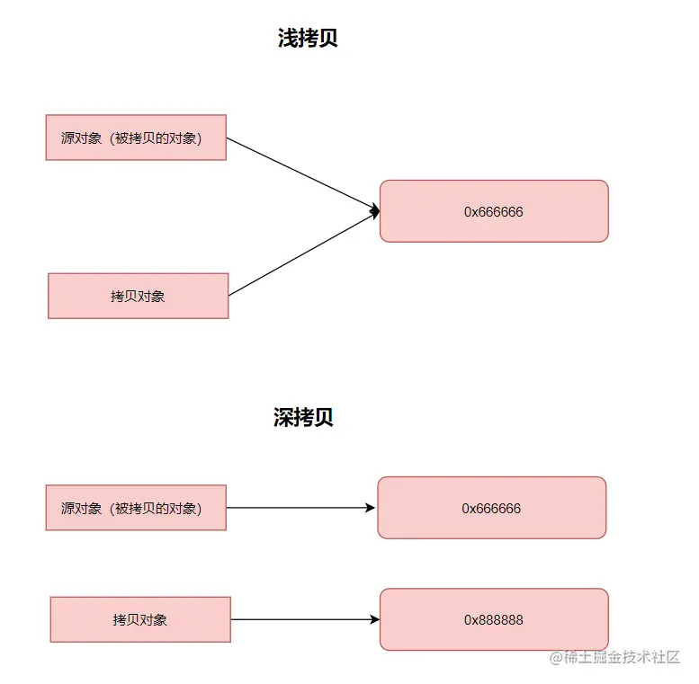
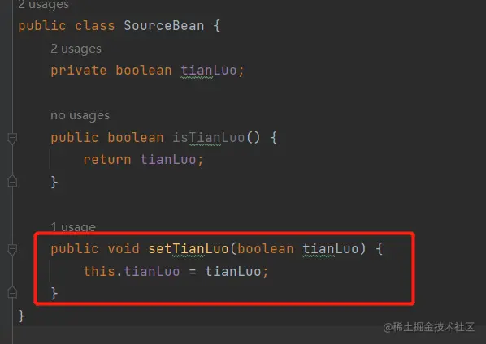
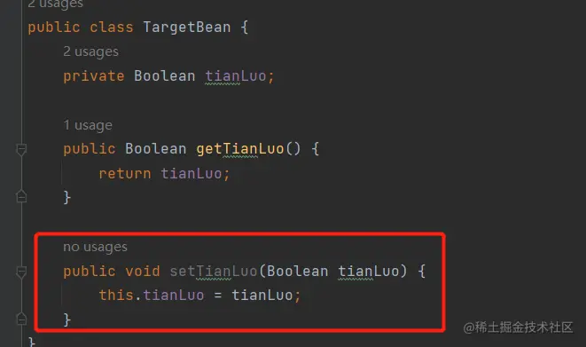

我们日常开发中，经常涉及到`DO、DTO、VO`对象属性拷贝赋值，很容易想到`org.springframework.beans.BeanUtils`的`copyProperties`。它会自动通过反射机制获取源对象和目标对象的属性，**并将对应的属性值进行复制**。可以减少手动编写属性复制代码的工作量，提高代码的可读性和维护性。

但是你知道嘛？使用`BeanUtils`的`copyProperties`，会有好几个坑呢，今天田螺哥个大家盘点一下哈：



## 第1个坑： 类型不匹配

```java
@Data
public class SourceBean {
    private Long age;
}

@Data
public class TargetBean {
    private String age;
}

public class Test {

    public static void main(String[] args) {
        SourceBean source = new SourceBean();
        source.setAge(25L);

        TargetBean target = new TargetBean();
        BeanUtils.copyProperties(source, target);

        System.out.println(target.getAge());  //拷贝赋值失败，输出null
    }
}
```

在上述`demo`中，源对象`SourceBean`的`age`属性是一个`Long`类型，而目标对象`TargetBean`的`age`属性是一个`String`类型。由于类型不匹配，`BeanUtils.copyProperties`不会赋值成功的。我跑`demo`的结果，控制台输出`null`。

## 第2个坑: BeanUtils.copyProperties是浅拷贝

先给大家复习一下，什么是深拷贝？什么是浅拷贝？

- 浅拷贝是指创建一个新对象，该对象的属性值与原始对象相同，但对于引用类型的属性，仍然共享相同的引用。换句话说，浅拷贝只复制对象及其引用，而不复制引用指向的对象本身。
- 深拷贝是指创建一个新对象，该对象的属性值与原始对象相同，包括引用类型的属性。深拷贝会递归复制引用对象，创建全新的对象，**以确保拷贝后的对象与原始对象完全独立**。



我再给个代码`demo`给大家看看哈：

```java
public class Address {
    private String city;
    //getter 和 setter 方法省略
}

public class Person {
    private String name;
    private Address address;
    //getter 和 setter 方法省略
}

 Person sourcePerson = new Person();
 sourcePerson.setName("John");
 Address address = new Address();
 address.setCity("New York");
 sourcePerson.setAddress(address);

 Person targetPerson = new Person();
 BeanUtils.copyProperties(sourcePerson, targetPerson);

 sourcePerson.getAddress().setCity("London");

 System.out.println(targetPerson.getAddress().getCity());  // 输出为 "London"
```

在上述示例中，源对象`Person`的属性`address`是一个引用类型。当使用`BeanUtils.copyProperties`方法进行属性复制时，实际上只复制了引用，即目标对象`targetPerson`的 `address` 属性引用和源对象 `sourcePerson` 的 `address` 属性引用指向同一个对象。因此，当修改源对象的`address`对象时，目标对象的`address`对象也会被修改。

大家日常开发中，要注意这个坑哈~

## 第3个坑：属性名称不一致

```java
 public class SourceBean {
    private String username;

    // getter 和 setter 方法省略
}

public class TargetBean {
    private String userName;
    // getter 和 setter 方法省略
}

 SourceBean source = new SourceBean();
 source.setUsername("捡田螺的小男孩");

 TargetBean target = new TargetBean();
 BeanUtils.copyProperties(source, target);

 System.out.println(target.getUserName());   // 输出为 null
```

在上述示例中，源对象`SourceBean` 的属性名称是`username`，而目标对象`TargetBean`的属性名称也是`userName`。**但是**，两个 `username`，一个N是大写，一个n是小写，即**属性名称不一致**，`BeanUtils.copyProperties`方法无法自动映射这些属性（无法忽略大小写自动匹配），因此目标对象的`userName`属性值为`null`。

大家日常开发中，要注意这个坑哈~ **比如大小写不一致，差一两个字母等等**。

## 第4个坑：Null 值覆盖

```java
@Data
public class SourceBean {

    private String name;
    private String address;

}

@Data
public class TargetBean {

    private String name;
    private String address;
}

SourceBean source = new SourceBean();
source.setName("John");
source.setAddress(null);

TargetBean target = new TargetBean();
target.setAddress("田螺address");
BeanUtils.copyProperties(source, target);

System.out.println(target.getAddress());  // 输出为 null
```

在上述示例中，源对象 SourceBean 的 address 属性值为 null。默认情况下，BeanUtils.copyProperties 方法会将源对象中的 null 值属性覆盖到目标对象中。因此，目标对象的 address 属性值也为 null。

如果你不希望 null 值覆盖目标对象中的属性，可以使用 BeanUtils.copyProperties 方法的重载方法，并传入一个自定义的 ConvertUtilsBean 实例来进行配置。

## 第5个坑：注意引入的包

`BeanUtils.copyProperties`其实有两个包，分别是`spring、apache`。大家注意一下哈，这两个包，是有点不一样的：

```java
//org.springframework.beans.BeanUtils(源对象在左边，目标对象在右边)
public static void copyProperties(Object source, Object target) throws BeansException 
//org.apache.commons.beanutils.BeanUtils（源对象在右边，目标对象在左边）
public static void copyProperties(Object dest, Object orig) throws IllegalAccessException, InvocationTargetException
```

大家使用的时候，要注意一下哈，千万注意自己引入的哪个`BeanUtils`，写对应参数位置。

## 第6个坑：Boolean类型数据+is属性开头的坑

把`SourceBean和TargetBean`中的都有个属性`isTianLuo`,它们的数据类型保持不变,但是一个为基本类型`boolean`，一个为包装类型`Boolean`

```java
@Data
public class SourceBean {
    private boolean isTianLuo;
}

@Data
public class TargetBean {
    private Boolean isTianLuo;
}
```

跑测试用里的时候，发现赋值不上：

```java
SourceBean source = new SourceBean();
source.setTianLuo(true);

TargetBean target = new TargetBean();
BeanUtils.copyProperties(source, target);
System.out.println(target.getIsTianLuo()); // 输出为 null
```

为什么呢？即使是一个包装类型，一个基本类型，应该可以赋值上才对的。

> 这是因为当属性类型为`boolean`时，属性名以`is`开头,属性名会去掉前面的`is`，因此源对象和目标对象属性对不上啦。

大家使用`BeanUtils.copyProperties`过程中，要注意哈~

## 第7个坑：查找不到字段引用

在某些开发场景呢，如果我们要修改某个字段的赋值，我们可能会全文搜索它的所有`set`方法，看哪些地方引用到。



但是呢，如果使用`BeanUtils.copyProperties`，**就不知道是否引用到对应的ste方法啦**，**即查找不到字段引用**。这就可能导致你会漏掉修改对应的字段。



## 第8个坑：不同内部类，即使相同属性，也是赋值失败

```java
@Data
public class CopySource {

    public String outerName;
    public CopySource.InnerClass innerClass;

    @Data
    public static class InnerClass {
        public String InnerName;
    }
}

@Data
public class CopyTarget {
    public String outerName;
    public CopyTarget.InnerClass innerClass;

    @Data
   public static class InnerClass {
        public String InnerName;
    }
}

CopySource test1 = new CopySource();
test1.outerName = "outTianluo";

CopySource.InnerClass innerClass = new CopySource.InnerClass();
innerClass.InnerName = "innerTianLuo";
test1.innerClass = innerClass;

System.out.println(test1);
CopyTarget test2 = new CopyTarget();
BeanUtils.copyProperties(test1, test2);

System.out.println(test2);  //输出CopyTarget(outerName=outTianluo, innerClass=null)
```

以上`demo`中，`CopySource`和`CopyTarget`各自存在一个内部类`InnerClass`，虽然这个内部类属性也相同，类名也相同，但是在不同的类中，因此`Spring`会认为属性不同,不会`Copy`;

如果要复制成功，可以让他们指向同一个内部类。

## 第9个坑：bean对应的属性，没有getter和setter方法，赋值失败

`BeanUtils.copyProperties`要拷贝属性值成功，需要对应的`bean`要有`getter和setter`方法。因为它是用反射拿到set和get方法再去拿属性值和设置属性值的。

```java
@Data
public class SourceBean {
    private String value;
}

@Getter   //没有对应的setter方法
public class TargetBean {
    private String value;
}

SourceBean source = new SourceBean();
source.setValue("捡田螺的小男孩");

TargetBean target = new TargetBean();
BeanUtils.copyProperties(source, target);
System.out.println(target.getValue()); //输出null 
```

## 第10个坑：BeanUtils.copyProperties + 泛型

如果BeanUtils.copyProperties遇到泛型，也是很可能赋值失败的哈。大家看下这个例子：

```java
@Data
public class CopySource {

    public String outerName;
    public List<CopySource.InnerClass> clazz;

    @Data
    public static class InnerClass {
        public String InnerName;
    }
}

@ToString
@Data
public class CopyTarget {
    public String outerName;
    public List<CopyTarget.InnerClass> clazz;

    @Data
    public static class InnerClass {
        public String InnerName;
    }
}

CopySource test1 = new CopySource();
test1.outerName = "outTianluo";

CopySource.InnerClass innerClass = new CopySource.InnerClass();
innerClass.InnerName = "innerTianLuo";

List<CopySource.InnerClass> clazz = new ArrayList<>();
clazz.add(innerClass);
test1.setClazz(clazz);

System.out.println(test1);
CopyTarget test2 = new CopyTarget();
BeanUtils.copyProperties(test1, test2);

System.out.println(test2);  //输出CopyTarget(outerName=outTianluo, clazz=null)
```

这里面的例子，`BeanUtils.copyProperties`方法拷贝包含泛型属性的对象`clazz`。`CopyTarget`和`CopySource`的泛型属性类型不匹配，因此拷贝赋值失败。

如果是低版本的包，泛型如果不匹配，则会报错，高本版则知识拷贝赋值失败。

## 第11个坑：性能问题

由于这些`BeanUtils`类都是采用反射机制实现的，对程序的效率也会有影响。我跑了个`demo`对比：

```java
SourceBean sourceBean = new SourceBean();
sourceBean.setName("tianLuoBoy");
TargetBean target = new TargetBean();

long beginTime = System.currentTimeMillis();
for (int i = 0; i < 100000; i++) {  //循环10万次
      target.setName(sourceBean.getName());
}
System.out.println("common setter time:" + (System.currentTimeMillis() - beginTime));

long beginTime1 = System.currentTimeMillis();
for (int i = 0; i < 100000; i++) {  //循环10万次
    BeanUtils.copyProperties(sourceBean, target);
}
System.out.println("bean copy time:" + (System.currentTimeMillis() - beginTime1));

//输出
common setter time:3
bean copy time:331
```

可以发现，简单的`setter`和`BeanUtils.copyProperties`对比，性能差距非常大。因此，慎用`BeanUtils.copyProperties！！！`

## 12. 替换BeanUtils.copyProperties的方案

以上聊了`BeanUtils.copyProperties`的11个坑，都是在跟大家聊，要慎用`BeanUtils.copyProperties`。那有没有推荐替换它的方案呢。

第一种，那就是使用原始的`setter和getter`方法。

> 使用手动的setter方法进行属性赋值。这种方法可能需要编写更多的代码，但是可以提供更细粒度的控制，并且在性能方面通常比BeanUtils.copyProperties更高效。

```java
Target target = new Target();
target.setName(source.getName());
target.setAge(source.getAge());
```

如果实在对象`bean`的属性比较多的话，可以使用插件`GenerateAllSetter`，它可以一键生成对象的`set`方法，挺方便的。


第二种方案，使用映射工具库，如`MapStruct、ModelMapper`等，它们可以自动生成属性映射的代码。这些工具库可以减少手动编写setter方法的工作量，并提供更好的性能。

使用`MapStruct`的示例：

```java
@Mapper
public interface SourceTargetMapper {
    SourceTargetMapper INSTANCE = Mappers.getMapper(SourceTargetMapper.class);

    @Mapping(source = "name", target = "name")
    @Mapping(source = "age", target = "age")
    Target mapToTarget(Source source);
}

Target target = SourceTargetMapper.INSTANCE.mapToTarget(source);

觉得有收获的伙伴，给个三连支持一下哈，感谢~
```
