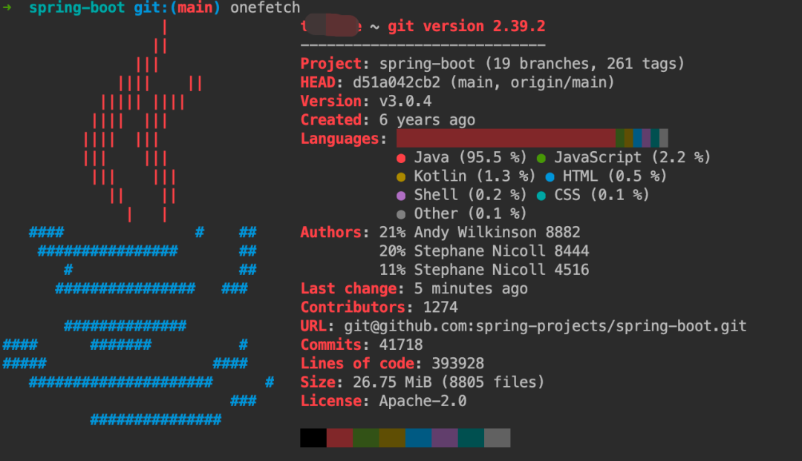
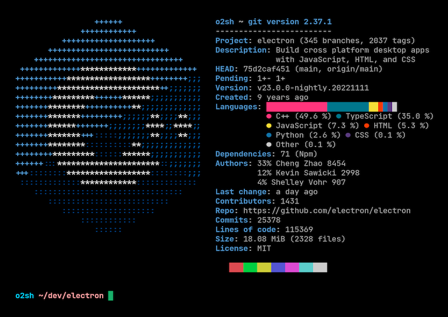

---
# 当前页面内容标题
title: Github标星7k！这款Git可视化工具，值得一试！
# 分类
category:
  - git
# 标签
tag: 
  - git
  - 开源工具
sticky: false
# 是否收藏在博客主题的文章列表中，当填入数字时，数字越大，排名越靠前。
star: false
# 是否将该文章添加至文章列表中
article: true
# 是否将该文章添加至时间线中
timeline: true
---

作为一名程序员，在软件开发过程中，了解代码仓库的状态和信息是非常重要的。今天给大家介绍一款可视化的 Git 工具——Onefetch。Onefetch 是一个能够快速展示代码仓库信息的命令行工具，它使用 Rust 编写的，轻量且易于使用。

## 项目介绍

Onefetch 可以识别当前目录中的许多版本控制系统，如 Git、Mercurial、Subversion 等，并显示相关信息，如当前分支、提交哈希、提交时间和作者。它还可以识别编程语言和框架，并显示它们的版本和图标。

除此之外，Onefetch 还支持多种自定义选项，比如可以显示图标、显示/隐藏某些信息、显示/隐藏标题等。

Onefetch 的最大优势在于它的轻量级和易用性，它可以很快地安装和使用。并且，Onefetch 的界面简洁明了，只需要在终端中输入命令就可以显示代码仓库的信息。这让开发人员可以快速了解代码仓库的状态，而无需打开 IDE 或者其他重量级的工具。

## 项目安装

Onefetch 的安装也非常简单。如果是 Mac 用户，直接用 brew 命令安装即可：

```sh
brew install onefetch
```

如果是 Windows 用户，则从项目主页直接下载最新的 exe 安装包安装即可：

```shell
地址：https://github.com/o2sh/onefetch/releases/tag/2.16.0
```

## 项目使用

安装成功后，我们在命令行中切换到任意一个 git 项目的路径下，执行命令`onefetch`即可。

之后我们便可以看到该项目的详细信息啦，如图，我查看了 springboot 的 git 仓库信息：



可以看到，左侧是 JAVA 语言的图标，右侧是 git 仓库的信息，包含了分支数量、创建时间、语言分布占比、作者、仓库大小与代码行数等。

再换一个 C++ 的项目试试看，如图：



有意思的是，描述信息的标题文字的颜色，对应的是语言图标的主题颜色。

命令行也可以指定参数执行，比较常用的参数有以下这些：

- `onefetch -d <FIELD>`：禁止显示的域，比如你不想展示作者信息，可以用`onefetch -d authors`命令

- `onefetch -o <FIELD>`：输出的格式，可以指定为 JSON 格式输出，比如`onefetch -o json`

- `onefetch -E`：展示作者的 email 信息

- `onefetch -i`：指定展示图片的路径

## 总结

Onefetch 是一个简单、易用的命令行工具，能够快速展示代码仓库的状态和信息。它的轻量级和可定制性让开发人员可以更快地了解代码仓库的状态，而无需打开重量级的工具，所以赶快来尝试一下吧。

```
项目地址：
https://github.com/o2sh/onefetch
```

