---
# 当前页面内容标题
title: 这五款牛逼的 IDEA 插件，堪称代码质量检查利器！
# 分类
category:
  - idea
# 标签
tag: 
  - idea
  - 开发工具插件
sticky: false
# 是否收藏在博客主题的文章列表中，当填入数字时，数字越大，排名越靠前。
star: false
# 是否将该文章添加至文章列表中
article: true
# 是否将该文章添加至时间线中
timeline: true
---

随着业务的发展，系统会越来越庞大，原本简单稳定的功能，可能在不断迭代后复杂度上升，潜在的风险也随之暴露，导致最终服务不稳定，造成业务价值的损失。而为了减少这种情况，其中一种比较好的方式就是提高代码质量，比如通过代码审查，从而降低错误风险，但是，代码审查难度大，代码缺陷、漏洞不易发现，且审查工作随着代码量增加而增加，审查效率低。

工欲善其事，必先利其器，因此，这篇文章给大家介绍几种检查代码质量的利器，Alibaba Java Coding Guidelines、CheckStyle、PMD、FindBugs、SonarLint，让你在关注代码质量的同时，减少 code review 的工作量，提高 code review 的效率，并通过代码质量分析去反向提升我们的代码编写能力

## 一、Alibaba Java Coding Guidelines

### 1、整体介绍：

Alibaba Java Coding Guidelines 专注于Java代码规范，目的是让开发者更加方便、快速规范代码格式。该插件在扫描代码后，将不符合规约的代码按 Blocker、Critical、Major 三个等级显示出来，并且大部分可以自动修复，它还基于 Inspection 机制提供了实时检测功能，编写代码的同时也能快速发现问题所在。

阿里巴巴规约扫描包括：

- OOP规约

- 并发处理

- 控制语句

- 命名规约

- 常量定义

- 注释规范

### 2、安装步骤：

`File > Settings > Plugins > Marketplace`搜索 “`Alibaba Java Coding Guidelines`”，按照提示进行安装，然后重启即可。

### 3、使用说明：

3.1、运行方式：

（1）可以Tools > 阿里编码规约 > 编码规约扫描

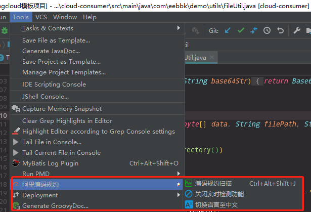

（2）在编辑界面或者项目区域点击右键，在右键菜单中选择“编码规约扫描”即可：

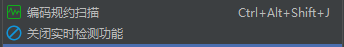

3.2、菜单功能：

- **编码规约扫描**：开始扫描代码

- **打开/关闭实时检测功能**：实时检测代码，一般机器性能比较好的话可以开启这项功能

- **切换语言至英文**：中英文切换

3.3、运行结果：

扫描完成后显示结果如下，我们可以看到扫描结果主要分为 Blocker（阻挡者）、Critical（严重问题）、Major（主要的）三个大类，它们表示的是问题的严重程度，严重程度由高到低为：`Blocker > Critical > Major`，至于每一类中都会包含什么样的问题，图中的内容已经说明了一切。

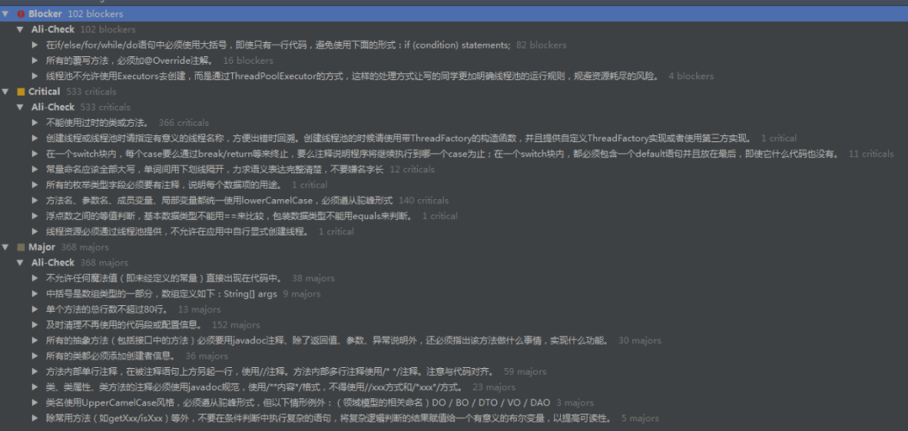

选中其中的一个问题项目，会出现如下内容（如果当前鼠标点击的是最终项，右边区域显示的是其它的内容，后面会再讲到）：

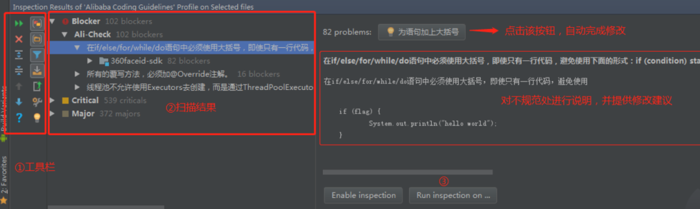

（1）指定区域搜索同一类问题：

当点击③处的按钮时，会弹出如下按钮：

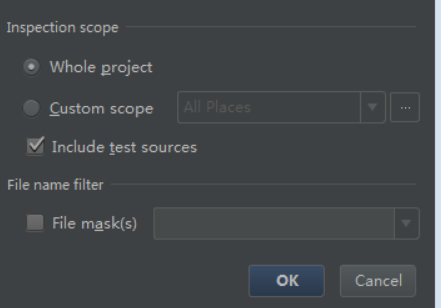

这里选择扫描区域，来扫描鼠标选中的同类问题。如果按照默认选择，那么运行后的结果就如下图所示：

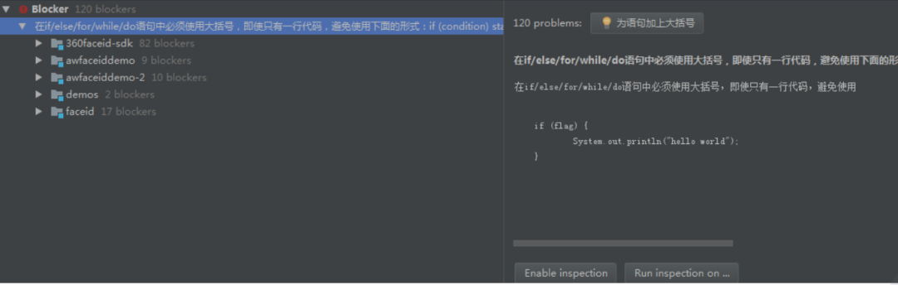

这里我们可以看到，显示了整个Project中的所有该类的问题。

（2）预览具体的不规范代码：

如果点击的是最终的问题点或者问题所在的类文件，那显示的就是如下界面，预览该处不规范的代码。

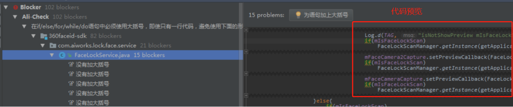

3.4、工具栏功能介绍：

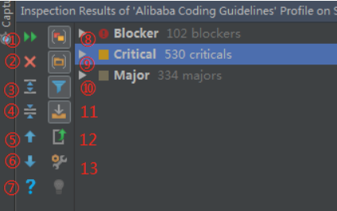

- `Rerun Inspection`：重新运行一次扫描

- `Close`：关闭真个AJCG面板

- `Expand All`：展开结果的树状结构，整个结果是树状结构的。

- `Collapse All`：收起结果的树状结构

- `Go Pre Problem`：选择上一个问题

- `Go Next Problem`：选择下一个问题

- `Help`：帮助

- `Group by Serverity`：（不知道如何描述）

- `Group by derectory`：按目录分组/按类名分组间切换

- `Filter resoled items`：过滤掉已经解决的项

- `Autoscroll to Source`：自动滚动到源码

- `Export`：导出，可以导出为XML和HTML两种格式

- `Edit Settings`：编辑设置

## 二、CheckStyle：

### 1、整体介绍：

CheckStyle 侧重检查编码格式和代码风格规范，如命名规范、Javadoc注释规范、空格规范、size度量（如过长的方法）、重复代码、多余Imports等，从而有效约束开发人员更好地遵循代码编写规范。Checkstyle主要是文法层面的代码编写规范的分析，对bug几乎没什么发现能力。

Checkstyle插件中默认内置有2个执行代码检查的配置文件（Sun Checks 和 Sun Checks），但是这两个文件检查的非常详细严格，即使优秀的开源项目也会检查出来有非常多的错误告信息，所以需要导入我们自定义的配置文件。

### 2、安装步骤：

通过 `File > Settings > Plugins > Marketplace` 搜索 “CheckStyle”，按照提示进行安装，然后重启即可。

### 3、使用说明：

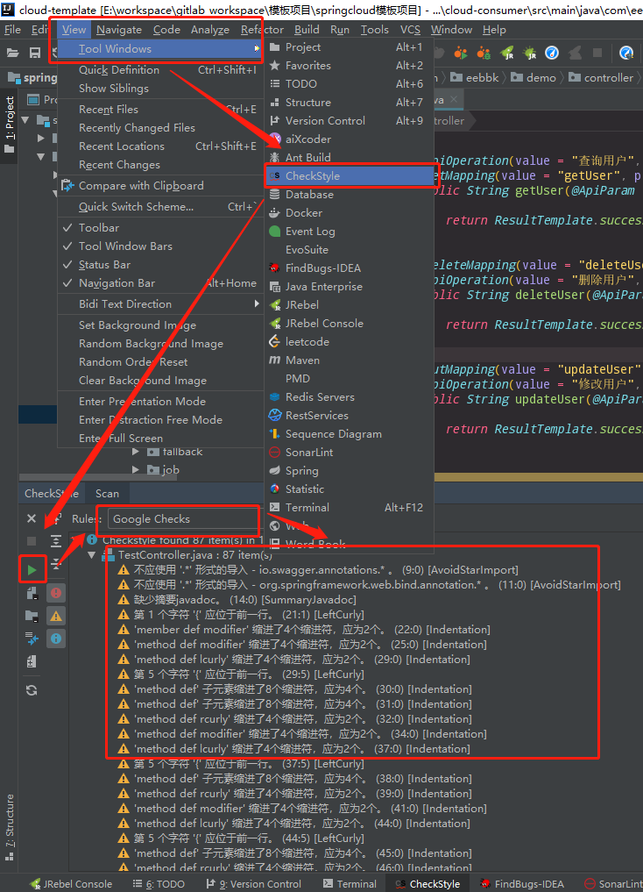

可以看到基本都是一些缩进啥的编码规范，可以不用太关注

## 三、PMD

### 1、整体介绍：

PMD侧重面向安全编码规则，且具备一定的数据流分析和路径分析能力，能力比CheckStyle稍微强点，并且 PMD 支持自定义规则，PMD可以直接使用的规则包括以下内容：

- **潜在的bug**：空的`try/catch/finally/switch`语句

- **未使用的代码（Dead code）**：未使用的变量、参数、私有方法等

- **可选的代码**：`String/StringBuffer`的滥用

- **复杂的表达式**：不必须的if语句、可被while替代的for循环

- **重复的代码**：拷贝/粘贴代码意味着拷贝/粘贴bugs

- **循环体创建新对象**：尽量不要在循环体内实例化新对象

- **资源关闭**：Connect，Result，Statement等使用之后确保关闭掉

### 2、安装步骤：

通过 `File > Settings > Plugins > Marketplace` 搜索 “`PMDPlugin`”，按照提示进行安装，然后重启即可

### 3、使用说明：

- 参考文章：http://wjhsh.net/andy-songwei-p-11830812.html

3.1、运行方式：

（1）从Tools菜单中启动：

通过 `Tools > Run PMD` 可以看到如下的界面，如果通过该方式启动，扫描的范围就是整个项目中的文件了。

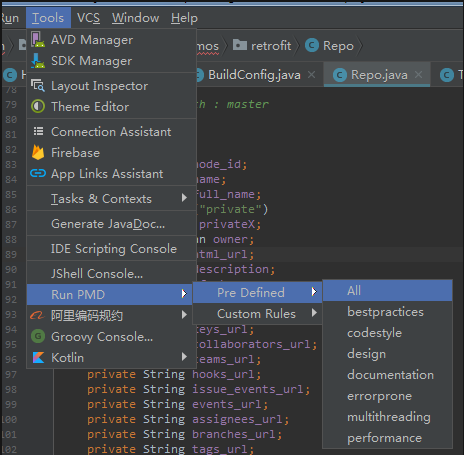

- **Pre Defined**：预定义的规则，也就是插件自带的检测规则。后面展开的列表中列出了所有的规则列表，想扫描哪一种类型的问题，点击即可。其中“All”表示使用所有的规则。

- **Custom Rules**：自定义的检测规则，PMD允许用户根据需要自定义检查规则，默认这里是不可点击的，需要在设置中导入自定义规则文件后方可选择。

（2）从右键菜单中启动：

在文件或者编辑器中点击右键，也可以看到“Run PMD”选项，如果通过该方式启动， 检测范围取决于鼠标或光标当前所选中的区域。

3.2、运行结果：

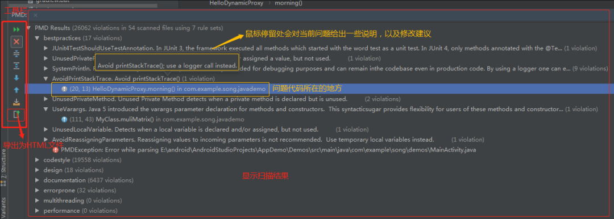

运行后会出现如上所示的面板，左边工具栏，鼠标停留在上面会提示其功能；右边显示了检测结果，当点击具体某一问题项时，会跳转到对应的源码中。

3.3、配置检测规则：

通过 `File > Settings > Other Settings > PMD` 可以打开检测规则的设置界面：

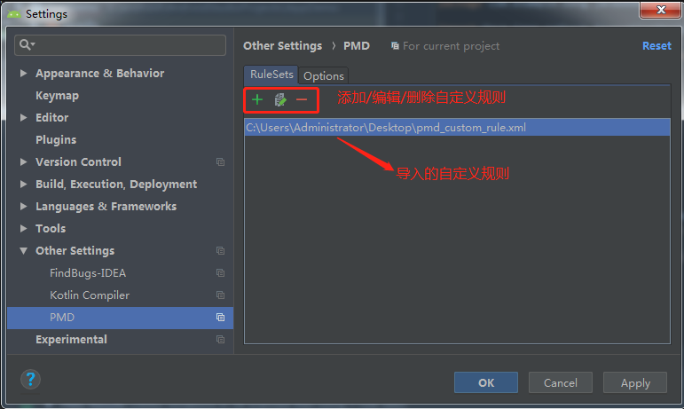

在 “RuleSets（规则设置）” 界面可以管理自定义的检测规则。因为在实际工作中，可能需要根据实际情况自定义检测规则，就可以通过这里导入，如果要使用它，需要在启动PMD进行检测时选择该自定义规则。

点击“Options”选项卡，在其中可以配置一些检测规则选项：

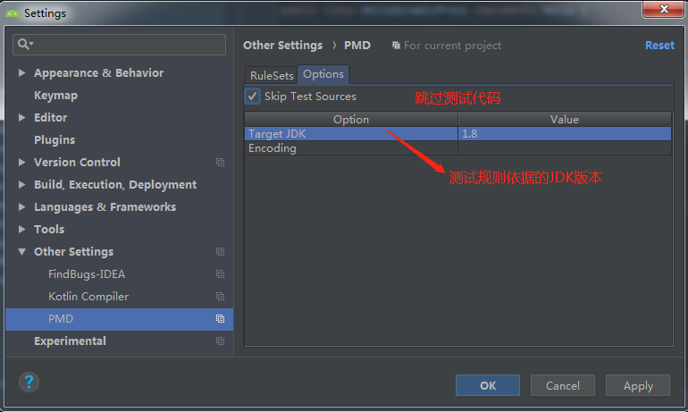

其中重点需要留意的是“Skip TestSource”这一项，因为在项目中有不少Android Studio自动生成的测试代码，如下所示，选择上述选项后可以将其过滤掉。

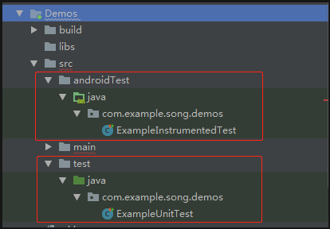

## 四、FindBugs：

### 1、整体介绍：

FindBugs 侧重于发现代码中存在的bug，如运行时错误检测（空指针检查、未合理关闭资源、字符串相同判断错（==，而不是equals）等），它可以简单高效全面地帮助我们发现程序代码中存在的bug以及潜在隐患，针对各种问题，它提供了简单的修改意见供我们参考

### 2、安装步骤：

通过 `File > Settings > Plugins > Marketplace` 搜索 “FindBugs”，按照提示进行安装，然后重启即可

### 3、使用说明：

FindBugs 可以分析单个文件、包下面的所有文件、整个module下的文件、整个project下的文件，右键想要分析的文件名/包名`/module`名`/project`

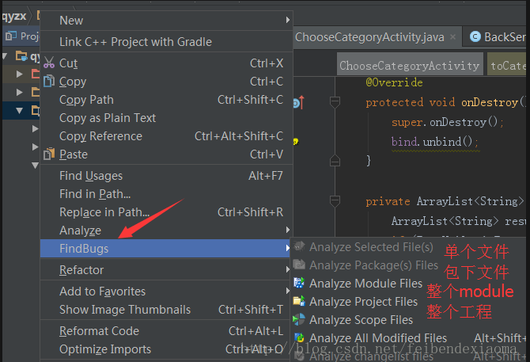

分析完之后就会出现结果面板

点击对应的item在右边会定位到具体的代码，这是根据提示进行处理修改就行

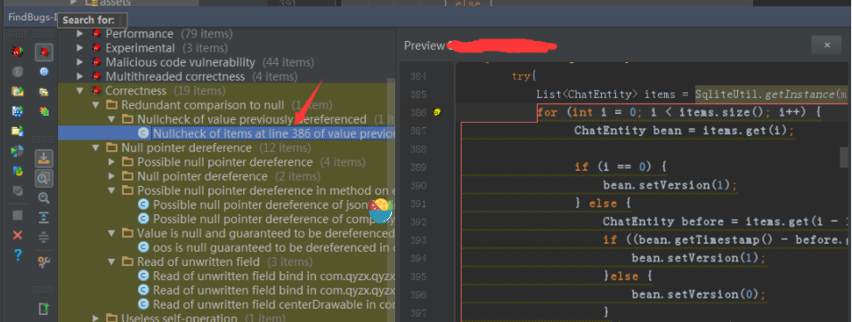

### 4、附：常见的错误信息

4.1、Bad practice 代码坏习惯：

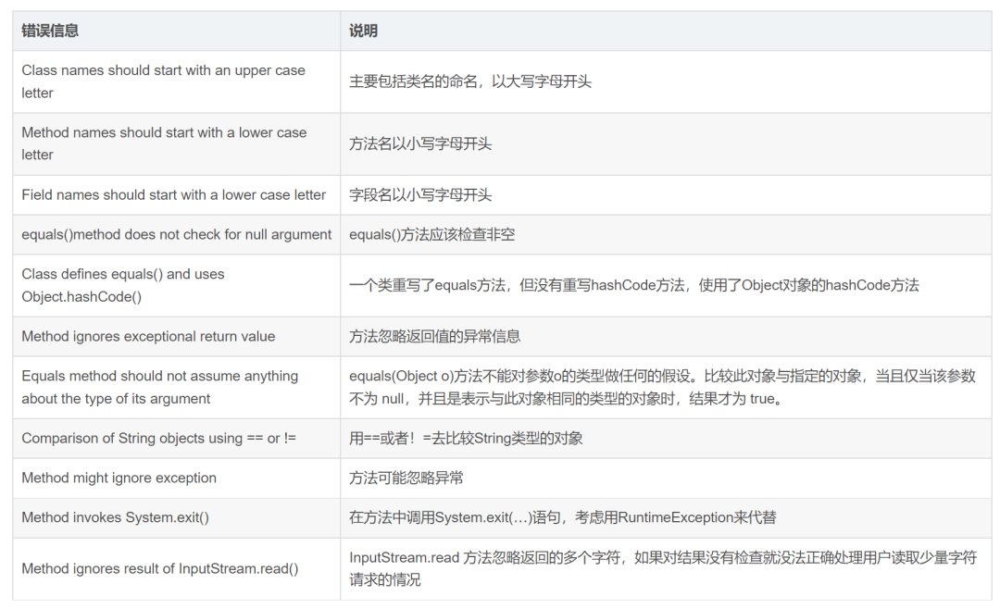

4.2、Dodgy code 糟糕的代码：

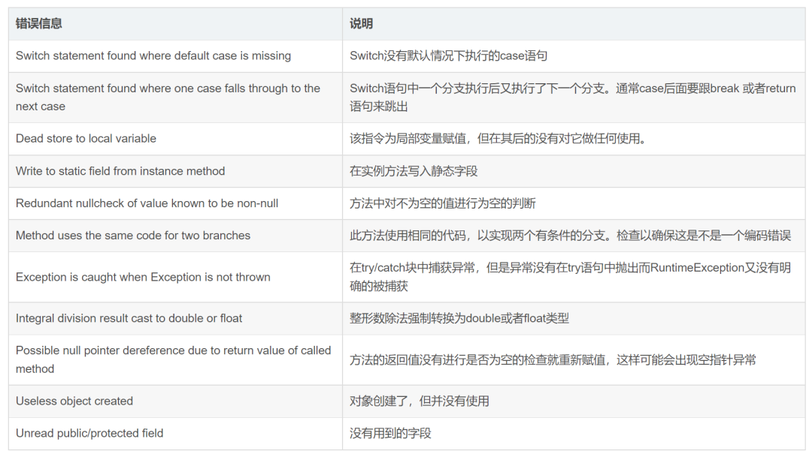

4.3、Internationalization 代码国际化相关：

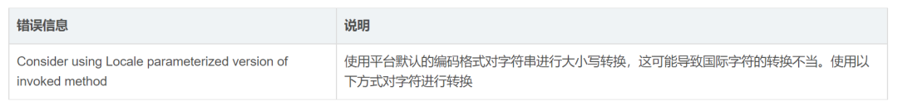

4.4、Performance 代码性能相关：

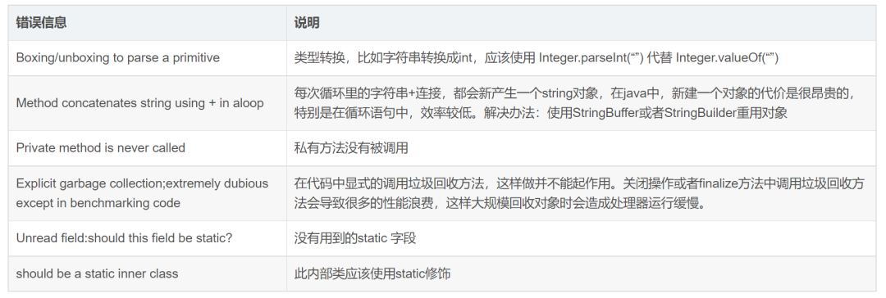

4.5、Experimental：

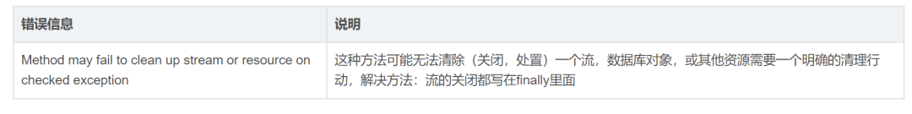

4.6、Malicious code vulnerability 恶意破坏代码相关：

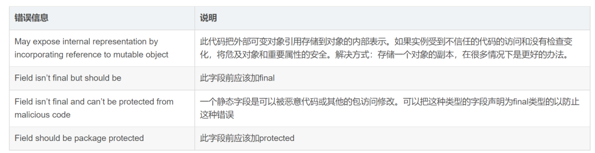

4.7、Multitreaded correctness 多线程代码正确性相关：

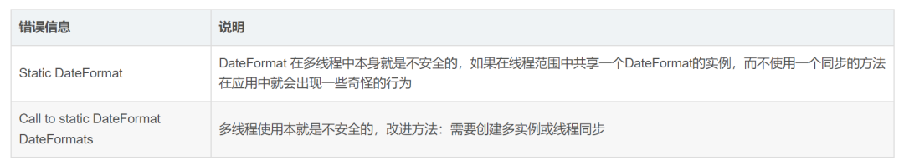

4.8、Correctness 代码正确性相关：

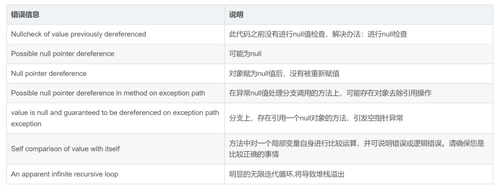

## 五、SonarLint：

### 1、整体介绍：

sonar 比 `Findbugs` 高了一个层级，它不仅关注常规静态BUG，还关注到了如代码质量、包与包、类与类之间的依赖情况，代码耦合情况，类、方法、文件的复杂度，代码中是否包含大量复制粘贴的代码，关注的是项目代码整体的健康情况。sonar 有两种使用方式：插件和客户端，sonar 的插件名称为 `sonarLint`。

### 2、安装步骤：

通过 `File > Settings > Plugins > Marketplace` 搜索 “SonarLint”，按照提示进行安装，然后重启即可

### 3、使用说明：

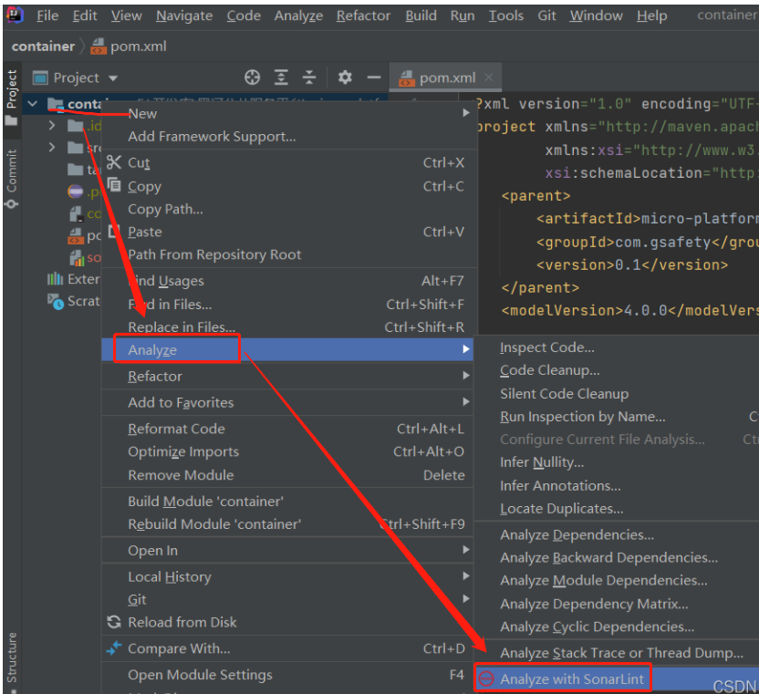

右键项目或者文件进行如上图所示操作，执行之后可以看到如下信息，如果代码中有不合理的地方会在report中显示，同时点击错误的地方在右边会给出建议的修改供参考。

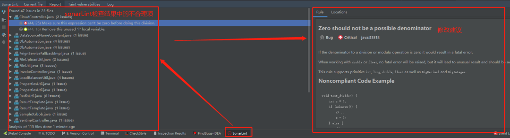

### 4、配置 SonarLint 服务端：

4.1、配置 Sonar 服务器：

`sonarLint` 插件的使用场景是自用自审，但 sonar 也提供了平台版本，使用场景则是他审，sonar 平台的搭建就不在这篇文章介绍了，感兴趣的读者可以自己上网查看，我们这里主要介绍如何在 `sonarLint` 插件中配置关联 sonar 平台服务器的工程，进行本地检查：

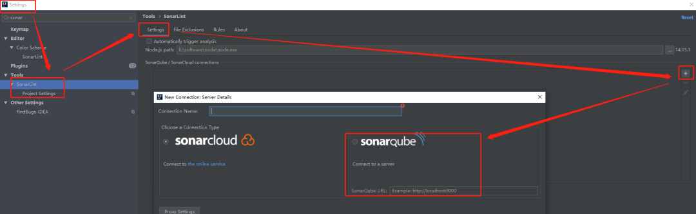

点击新增按钮，输入`Configuration Name`，配置`sonarlint` 服务器的地址，然后下拉框选择 `Login/Password`，输入 `sonarlint`服务器的账号密码

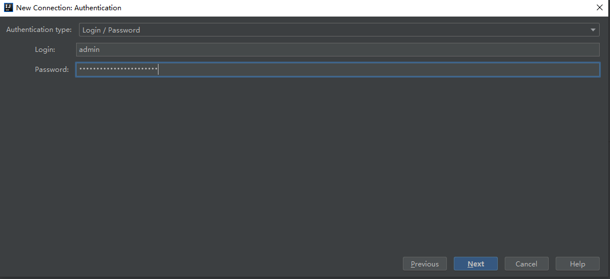

4.2、具体 Sonar工程配置：

配置完服务器之后，需要针对具体工程进行配置，点击 `connection`下拉框，选择上面配置好的服务器连接，然后点击 `Search in list`，找到对应的工程：

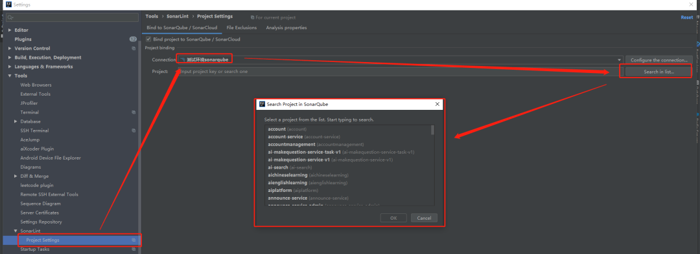

4.3、使用 SonarLint 检查：

配置完上面两步之后，接下来就可以选择要进行检查的类或者目录进行 `sonarlint` 检查了（跟第3点的使用方式一致），同时，在 commit 代码的时候，勾选 “`Perform Sonarlint analysis`”，会针对你要提交的代码进行sonarlint检查

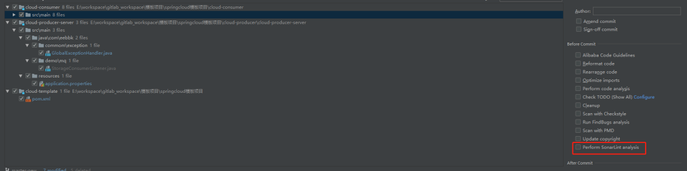

## 总结

- 检查代码规范的话，直接使用 `Alibaba Java Coding Guidelines` 就可以了

- 找 BUG 的话，使用 `PMD、Findbugs、SonarLint` 相互补充：

- `PMD` 自定义能力强，用来自定义项目BUG规则非常好用

- `Findbugs` 找 BUG 能力很强，我们拿找到的BUG给新员工培训也很好。

- `SonarLint` 规则丰富，比 Findbugs 能覆盖到更全的场景

