---
# 当前页面内容标题
title: Eclipse的常用设置与快捷键
# 分类
category:
  - eclipse
# 标签
tag: 
  - eclipse
  - 开发工具
sticky: false
# 是否收藏在博客主题的文章列表中，当填入数字时，数字越大，排名越靠前。
star: false
# 是否将该文章添加至文章列表中
article: true
# 是否将该文章添加至时间线中
timeline: true
---

# Eclipse的常用设置与快捷键

# 一、eclipse常用快捷键

|                         描述                         |                            快捷键                            |
| :--------------------------------------------------: | :----------------------------------------------------------: |
|                    补全代码的声明                    |                           alt + /                            |
|                  `自动生成返回对象`                  | 方法一：将光标放在该段代码任意位置，按ctrl+1,弹出 Assign statement to new local varible,enter，点击即可 |
|                  `自动生成返回对象`                  | 方法二：将光标放在该段代码任意位置，按ctrl+2后直接按L键。就会自动补全了 |
|        `调出生成 getter/setter/构造器等结构`         |                       alt + shift + s                        |
|                       `反撤销`                       |                           ctrl + y                           |
|                       批量导包                       |                       ctrl + shift + o                       |
|                     使用单行注释                     |                           ctrl + /                           |
|                     使用多行注释                     |                       ctrl + shift + /                       |
|                     取消多行注释                     |                       ctrl + shift + \                       |
|                   复制指定行的代码                   |             ctrl + alt + down 或 ctrl + alt + up             |
|                   删除指定行的代码                   |                           ctrl + d                           |
|                     上下移动代码                     |                    alt + up 或 alt + down                    |
|                 切换到下一行代码空位                 |                        shift + enter                         |
|                 切换到上一行代码空位                 |                     ctrl + shift + enter                     |
|                     如何查看源码                     |          ctrl + 选中指定的结构 或 ctrl + shift + t           |
|                退回到前一个编辑的页面                |                          alt + left                          |
|     进入到下一个编辑的页面(针对于上面那条来说的)     |                         alt + right                          |
|           光标选中指定的类，查看继承树结构           |                           ctrl + t                           |
|                      格式化代码                      |                       ctrl + shift + f                       |
| 在当前类中，显示类结构，并支持搜索指定的方法、属性等 |                           ctrl + o                           |
|         批量修改指定的变量名、方法名、类名等         |                       alt + shift + r                        |
|          选中的结构的大小写的切换：变成大写          |                       ctrl + shift + x                       |
|          选中的结构的大小写的切换：变成小写          |                       ctrl + shift + y                       |
|         显示当前选择资源(工程 or 文件)的属性         |                         alt + enter                          |
|      快速查找：参照选中的 Word 快速定位到下一个      |                           ctrl + k                           |
|                     关闭当前窗口                     |                           ctrl + w                           |
|                    关闭所有的窗口                    |                       ctrl + shift + w                       |
|              查看指定的结构使用过的地方              |                        ctrl + alt + g                        |
|                      查找与替换                      |                           ctrl + f                           |
|                  最大化当前的 View                   |                           ctrl + m                           |

- 快捷键的更改

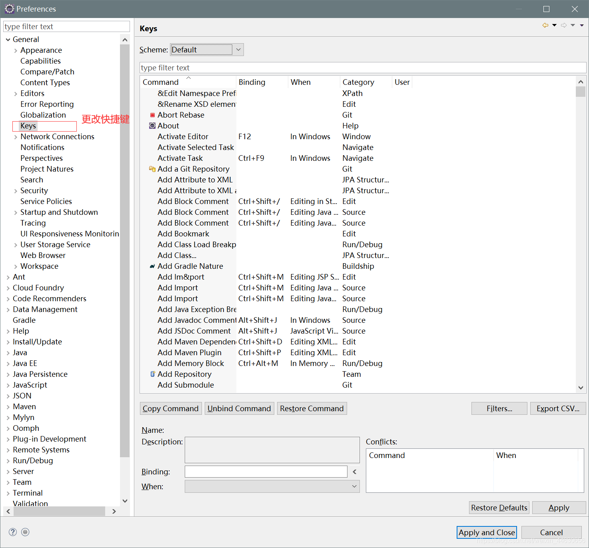

# 二、将eclipse设置为自动提示

Window–>Preferences–>Java–>Editor–>Content Assist

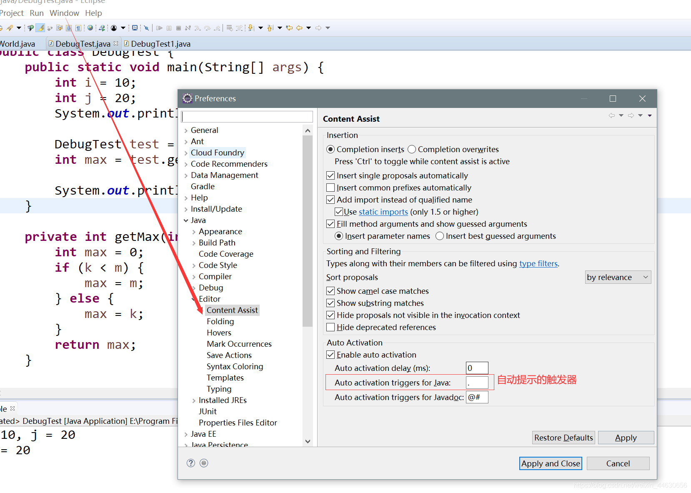

将Auto activation triggers for Java后面的.改为**`abcdefghijklmnopqrstuvwsyz.`**

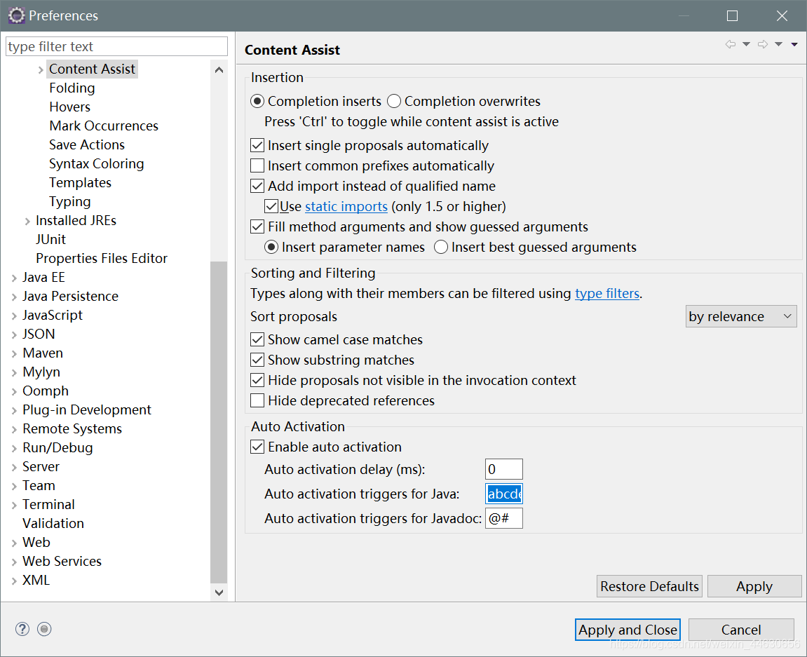

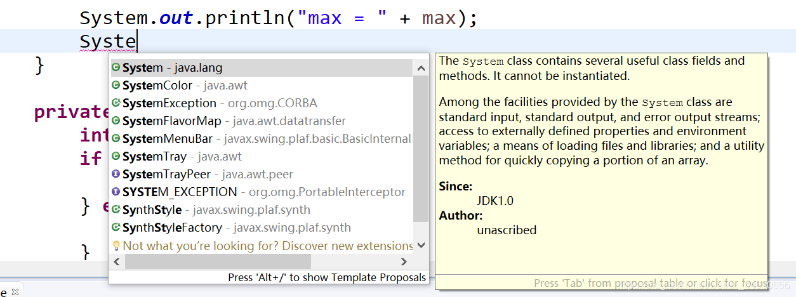

即可实现同idea的自动提示功能

# 三、单元测试的使用

步骤：

> 1. 选中当前工程 - 右键选择：build path - add libraries - JUnit 4 - 下一步
>
> 2. 创建Java类，进行单元测试。
>
> 3. 此时的Java类要求：① 此类是public的 ②此类提供公共的无参的构造器
>
> 4. 此类中声明单元测试方法。
>
> 5. 此时的单元测试方法：方法的权限是public,没有返回值，没有形参
>
> 6. 此单元测试方法上需要声明注解：@Test,并在单元测试类中导入：import org.junit.Test;
>
> 7. 写完代码以后，左键双击单元测试方法名，右键：run as - JUnit Test
>
>    说明：
>
> 1. 如果执行结果没有任何异常：绿条
> 2. 如果执行结果出现异常：红条

- 方法一：

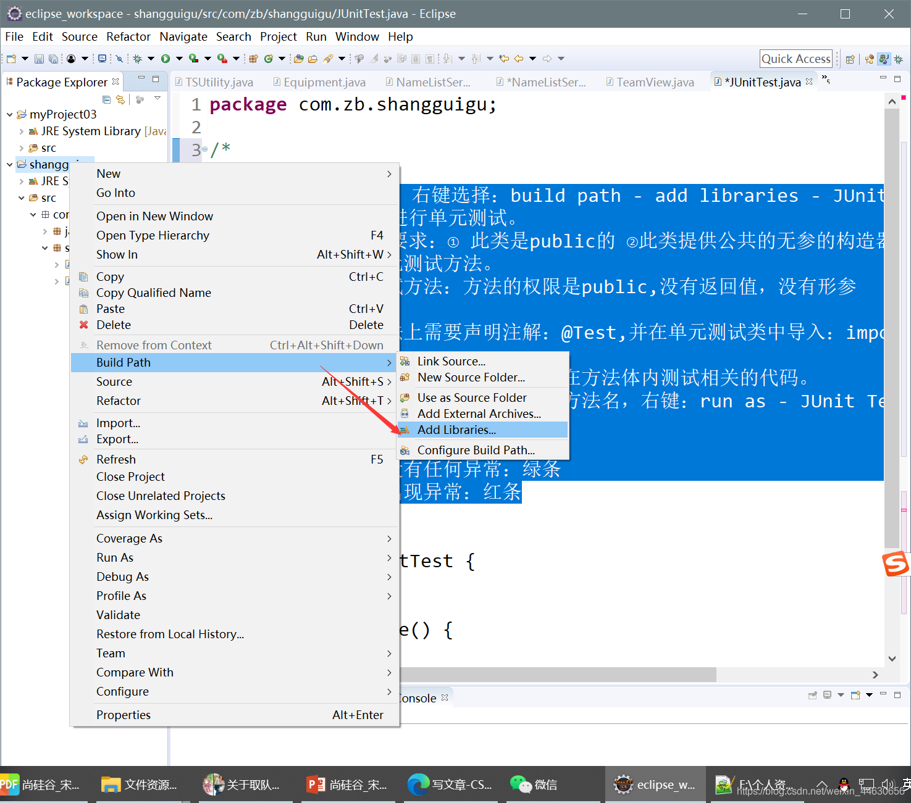

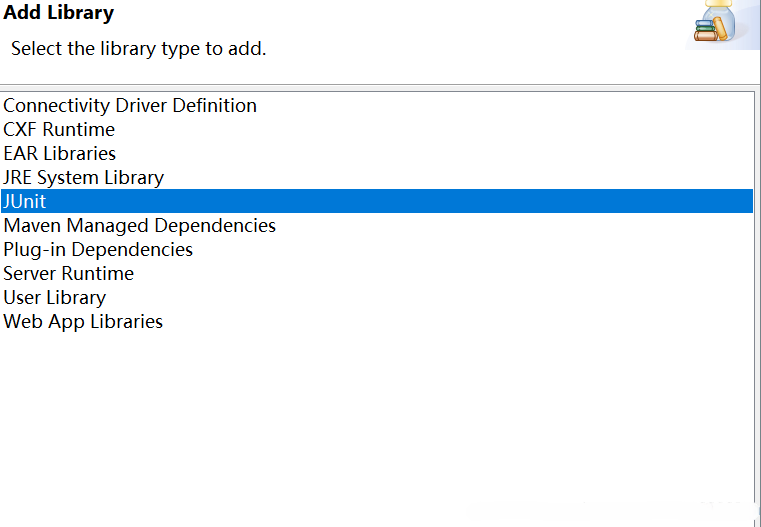


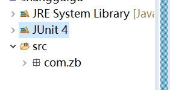

- 方法二：

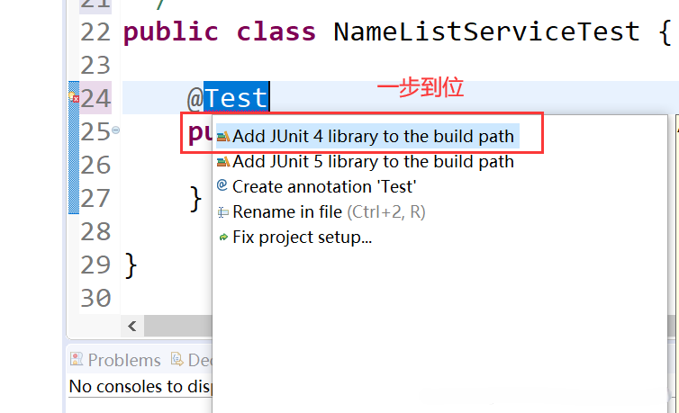

# 四、修改workspace编码为UTF-8

> Window->Preferences
>
> General->Workspace ：如下图红框所示进行设置

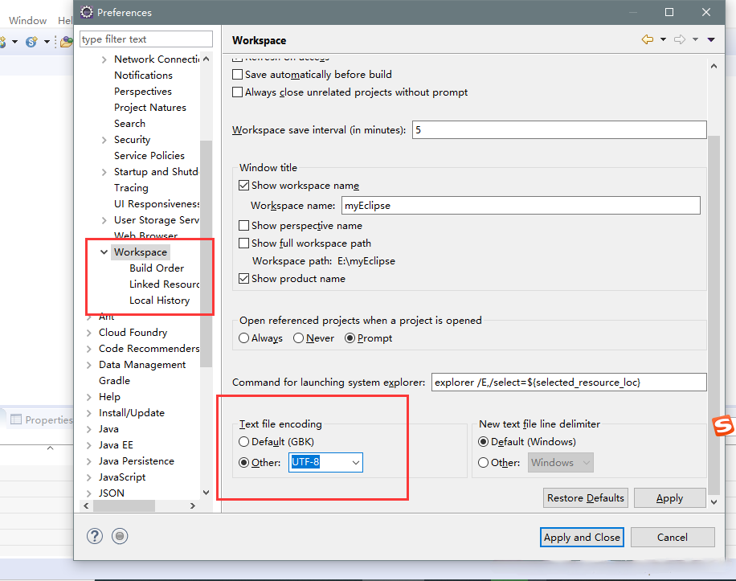

# 五、修改字体

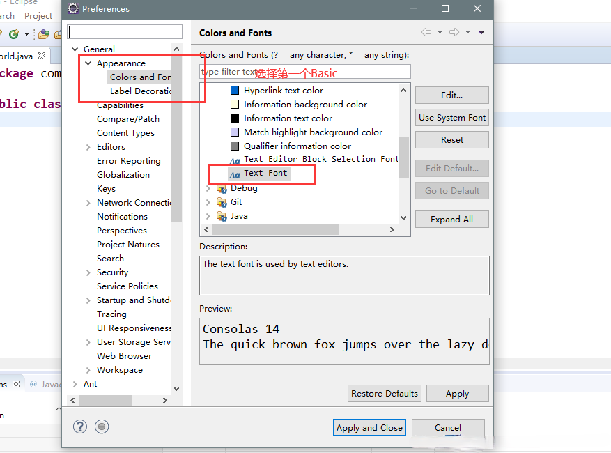

# 六、进入Eclipse时，没有可选择的workspace

- 原因：

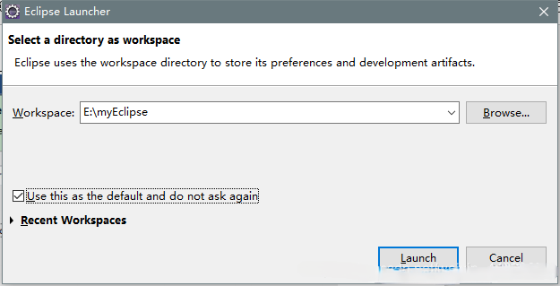

> 由于勾选了上述红框，所以再次启动 Eclipse 时不再显示可选择的workspace。

- 解决办法：

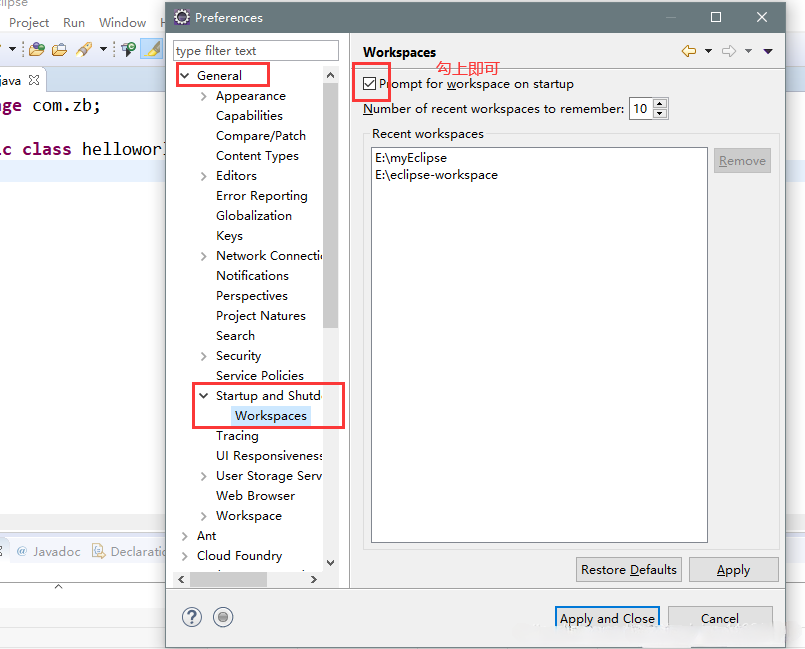

# 七、为类和方法添加文档注释

> Window–>Preferences–>Java–>Code Style–>Code Templates

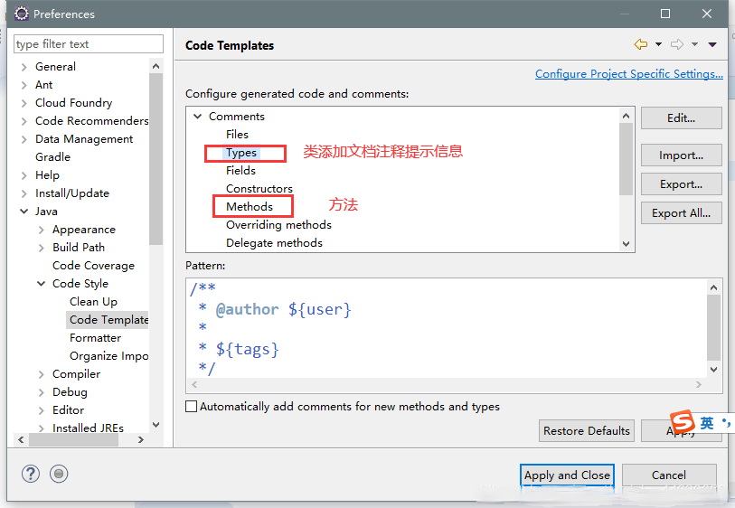

# 八、复制workspace设置方法

总结一下，复制工作空间配置步骤如下：

1. 使用eclipse新建workspace。
2. 将新建的workspace下的.metadata.plugins内容全部删除。
3. 将需要拷贝的workspace下的.metadata.plugins内容除了org.eclipse.core.resources文件夹的其他文件夹全部拷贝到新workspace的.metadata.plugins目录下。
4. 重启eclipse（可直接在eclipse菜单中点击File->Restart）。

# 九、eclipse设置成护眼色

```
windows->peferences->General->Editors->Text Editor
Appearance color options:
选择Background color，去掉System default  点击color框，进入颜色设置窗口。
```


# 十、导入dtd使xml有提示（Mybatis）

以Mybatis中的约束来举例：

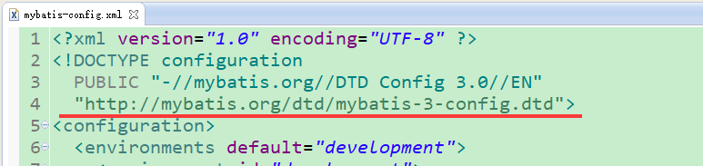

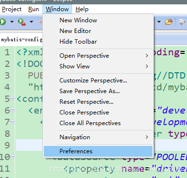

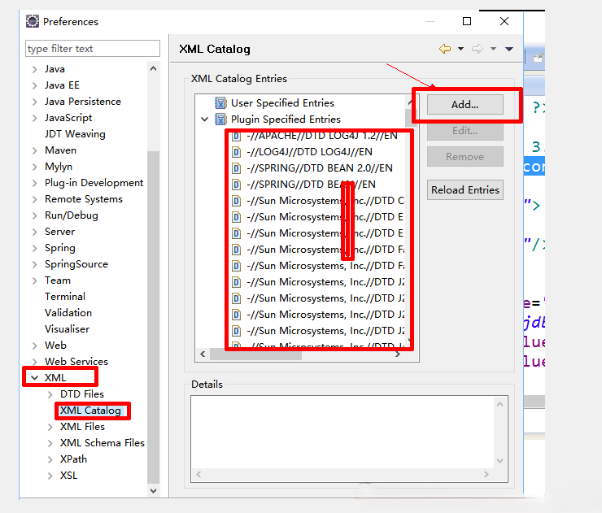


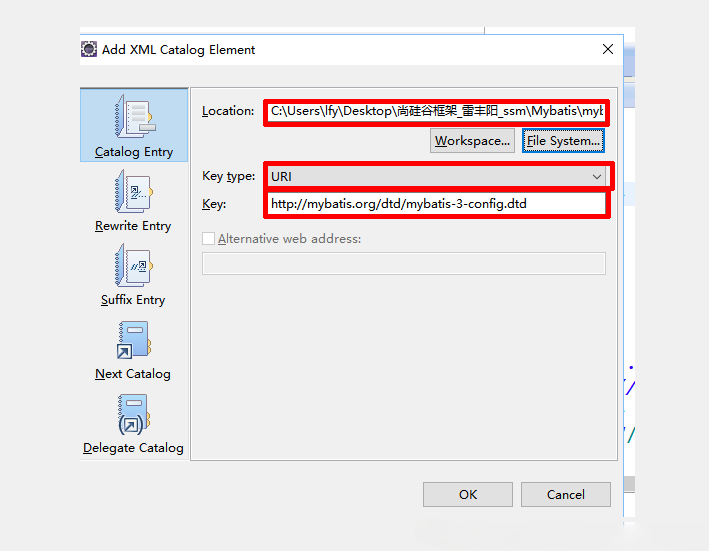