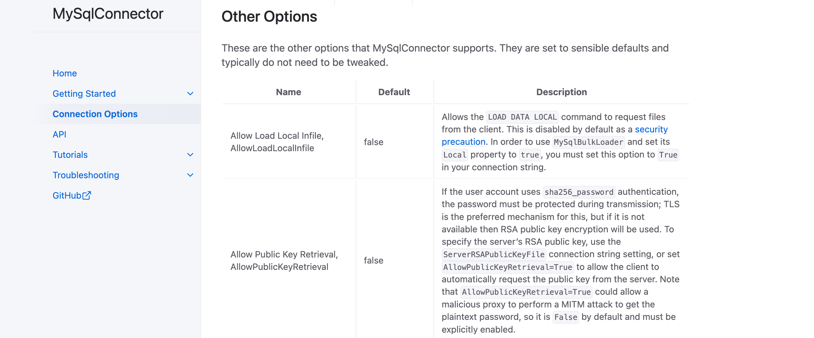

---
# 当前页面内容标题
title: JDBC连接Public Key Retrieval is not all
# 分类
category:
  - java
# 标签
tag: 
  - java
  - jdbc
sticky: false
# 是否收藏在博客主题的文章列表中，当填入数字时，数字越大，排名越靠前。
star: false
# 是否将该文章添加至文章列表中
article: true
# 是否将该文章添加至时间线中
timeline: true
---

## JDBC使用报错: java.sql.SQLNonTransientConnectionException: Public Key Retrieval is not all

报错信息：
java.sql.SQLNonTransientConnectionException: Public Key Retrieval is not all
在url的后边加上 allowPublicKeyRetrieval=true 即可

文档地址：([MySQL Connection String for C# .NET Core Programs - MySqlConnector](https://mysqlconnector.net/connection-options/ "MySQL Connection String for C# .NET Core Programs - MySqlConnector"))

>  If the user account uses sha256_password authentication, the password must be protected during transmission; TLS is the preferred mechanism for this, but if it is not available then RSA public key encryption will be used. To specify the server’s RSA public key, use the ServerRSAPublicKeyFile connection string setting, or set AllowPublicKeyRetrieval=True to allow the client to automatically request the public key from the server. Note that AllowPublicKeyRetrieval=True could allow a malicious proxy to perform a MITM attack to get the plaintext password, so it is False by default and must be explicitly enabled.

翻译：

> 如果用户帐户使用sha256_password身份验证，则在传输过程中必须保护密码；TLS是首选的机制，但如果它不可用，则将使用RSA[公钥](https://so.csdn.net/so/search?q=%E5%85%AC%E9%92%A5&spm=1001.2101.3001.7020)加密。要指定服务器的RSA公钥，请使用ServerRSAPublicKeyFile连接字符串设置，或将`AllowPublicKeyRetrieval=True`设置为允许客户端自动向服务器请求公钥。请注意，`AllowPublicKeyRetrieval=True`可能允许恶意代理执行MITM攻击以获取明文密码，因此默认情况下它为False，必须显式启用。
