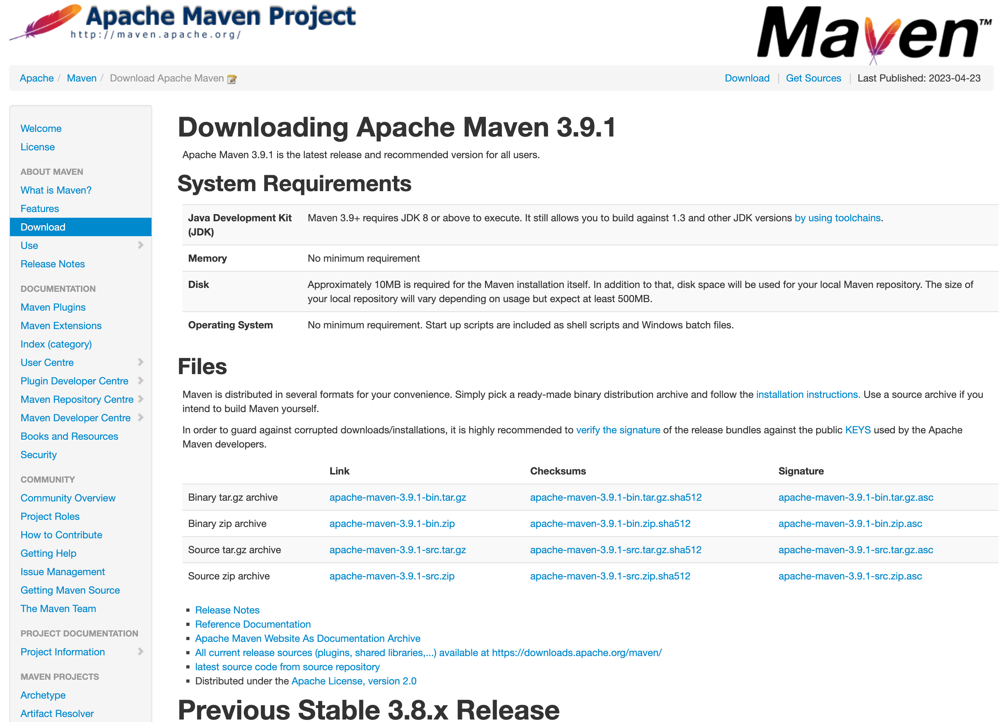
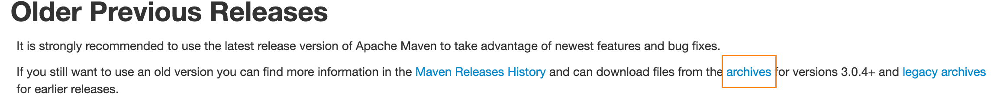
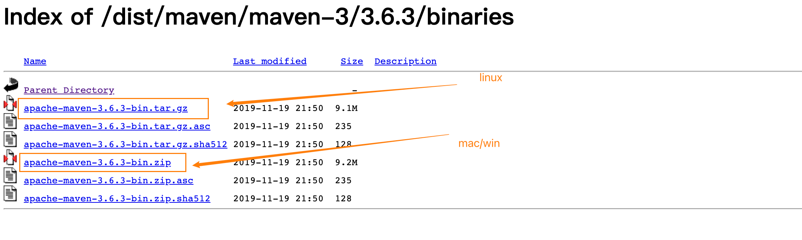
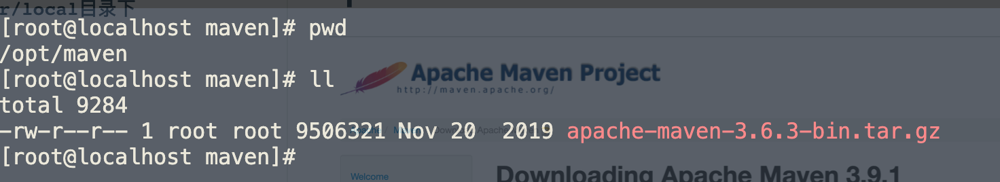
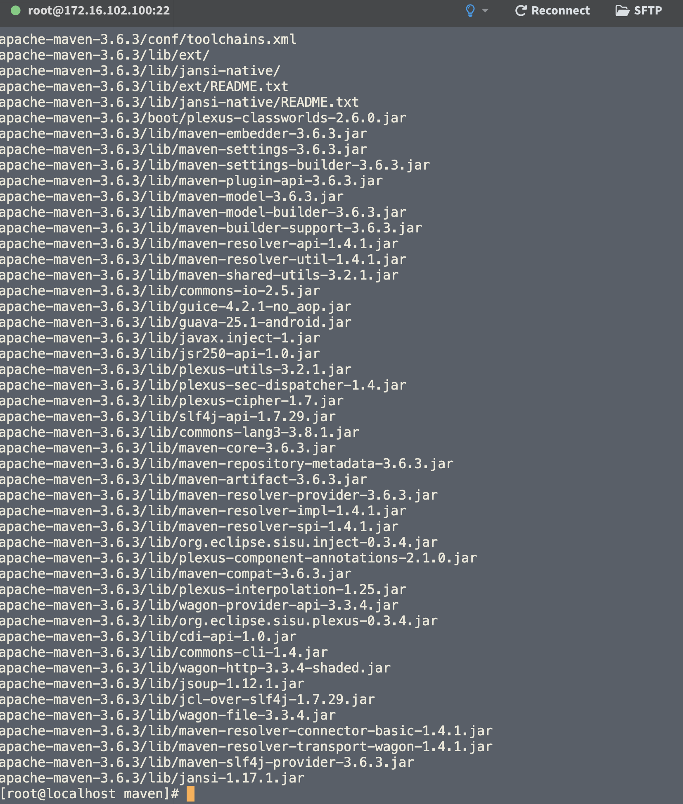
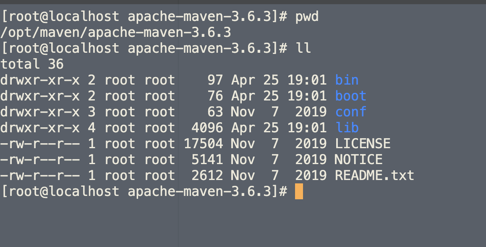
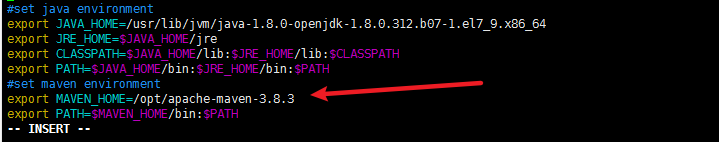
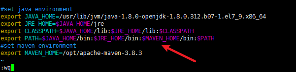
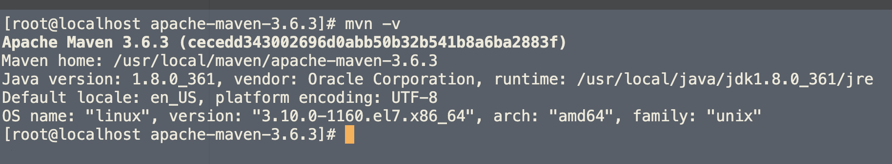

---
# 当前页面内容标题
title: Linux安装Maven与配置
# 分类
category:
  - linux
  - maven
# 标签
tag: 
  - maven
  - 环境配置
sticky: false
# 是否收藏在博客主题的文章列表中，当填入数字时，数字越大，排名越靠前。
star: false
# 是否将该文章添加至文章列表中
article: true
# 是否将该文章添加至时间线中
timeline: true
---

## 1.去官网下载

> http://maven.apache.org/download.cgi

## 2.下载完成上传到`/opt`或者`/usr/local`目录下





或者进入历史版本选择自己需要的！





## 3.解压缩

```
tar -zxvf apache-maven-3.6.3-bin.tar.gz
```



## 4.配置环境变量

进入Maven目录记住目录的路径`pwd`



编写配置环境变量文件

```sh
vim /etc/profile
```

将下面的信息复制到文件最底部

```sh
#set maven environment
export MAVEN_HOME=/opt/apache-maven-3.6.3
export PATH=$MAVEN_HOME/bin:$PATH
```



但是如果你前面安装了java的环境之后就按照下面的这张图取去写，将path变量写在上面，并且用`：`隔开



## 5.刷新配置文件使得配置文件生效

```sh
source /etc/profile
```

## 6.然后我们运行`mvn -v`查看是否成功

如果你出现版本号了，那恭喜你，你已经安装成功了




