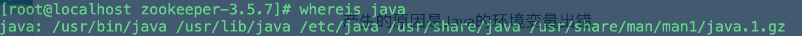
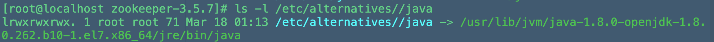
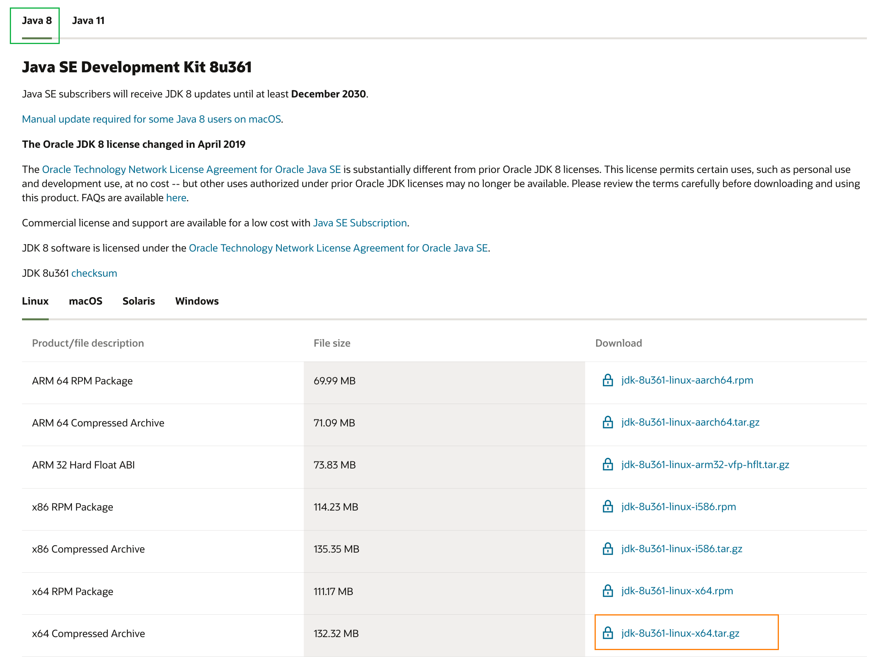
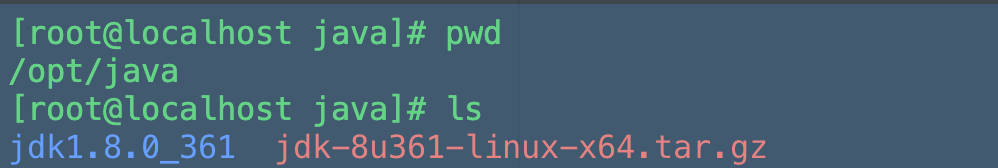
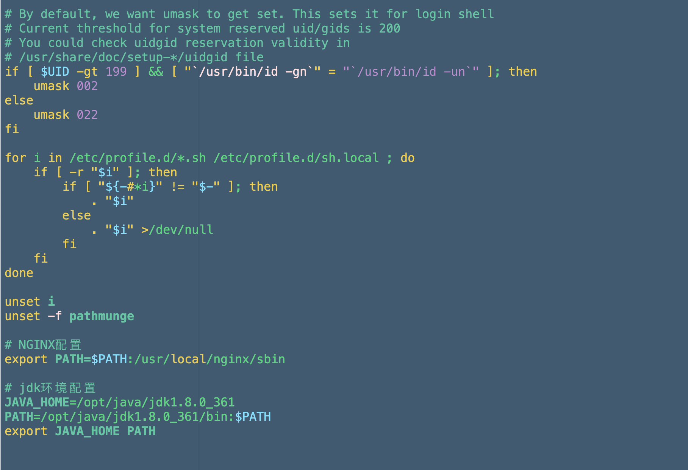
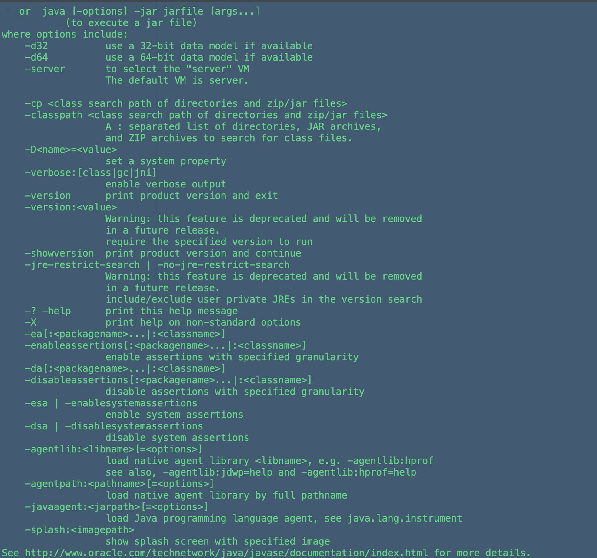

---
# 当前页面内容标题
title: Linux执行jps报错以及jdk安装
# 分类
category:
  - java
  - linux
# 标签
tag: 
  - java
  - linux
sticky: false
# 是否收藏在博客主题的文章列表中，当填入数字时，数字越大，排名越靠前。
star: false
# 是否将该文章添加至文章列表中
article: true
# 是否将该文章添加至时间线中
timeline: true
---

## Linux执行jps命令报错

**前言：这里在学习Zookeeper的时候，需要使用jps命令查看运行状态的时候发现报错：**

> -bash: jps: command not found

首先发现问题：

产生的原因是Java的环境变量出错

> 执行 `whereis java`



发现一串奇怪的路径，说明这只是java的执行路径，而非java的安装路径。

> - 执行 `which java` 来获取java路径：


我们发现又一个奇怪的路径，其实这是对java路径的一个软链接，查询此软链接的指向：


查询这个指向的真实源目录：



终于我们获取到了java的安装路径，但这个路径为嘛有一大串？？？原因是这是CentOS自带的open-jdk...

- 首先我们得将它给干掉：

```sh
rpm -qa | grep java #查看java文件
sudo rpm -qa | grep java | xargs rpm -e --nodeps #root权限下删除所有java文件
```

> 冷知识，
>
> sudo进入root模式：
>
> ln -s target_file_name source_file_name #建立软链接
>
> rm -rf xxxx/ 加了个/ #这个是删除文件夹
>
> rm -rf xxxx 没有/ #这个是删除软链接

**查看Linux系统是否有自带的jdk：**

**注意：全程使用root用户来操作！**

1、输入：java -version 如果有输出版本信息，则需要卸载原本的jdk，如果没有说明linux系统没有安装jdk可以跳过下面步骤直接进行下一步的安装。

2、发现有版本信息输入：rpm -qa | grep java 检测jdk的安装包，（注意：rpm命令符没有时记得下载一个输入：apt-get install +命令名称）

3、接着进行一个个删除包，输入：rpm -e --nodeps  包名

4、最后再次：rpm -qa | grep java     检查是否删除完即可（此步由于之前已经卸载，所以没有截图）


## Linux安装jdk8

**1.下载jdk安装包**

首先，去到oracle官网下载jdk8，这里我们选择tar.gz的压缩包。

https://www.oracle.com/java/technologies/downloads/



- 发现下载的时候版本眼花缭乱，分为tar.gz、rpm、yum文件，区别是：

> 1. tar.gz：
>    本质上就是一种压缩包，里面的一些配置都需要我们手动操作
> 2. rpm：
>    Rethat红帽公司发布的一个功能，redhat package manager，.rpm更像一个软件安装包，意为tar.gz的傻瓜式安装，全自动化
> 3. yum：
>    rpm的究极傻瓜版...类似于java-maven的作用，自动下载、自动安装、自动装配，甚至可以补丢失的依赖包，一般使用这个命令可以查看对应插件官网的目前能下载的插件列表，然后再选择进行安装，十分的方便


**2.解压**

安装完成后通过远程传输工具将文件传输到Linux的 /opt 目录下

opt目录是linux专门给用户装额外软件的目录，我们的jdk可以放在该目录下



之后输入指令解压压缩包

```sh
tar -zxvf jdk-8u361-linux-x64.tar.gz
```

上图的 jdk1.8.0_361是已经编译好的！

**3.配置环境变量**

修改配置文件

```sh
vim /etc/profile
```

在文件最底部加上

```sh
# jdk环境配置--这里的路径根据自己的来
JAVA_HOME=/opt/java/jdk1.8.0_361
PATH=/opt/java/jdk1.8.0_361/bin:$PATH
export JAVA_HOME PATH
```

如图所示：



最后esc退出编辑模式

 输入 :wq 保存退出

**4.使配置文件生效**

输入指令使配置文件生效

```sh
source /etc/profile
```

输入java和javac会输出信息则表示jdk的安装大功告成



自此jdk8在linux上的安装完成！