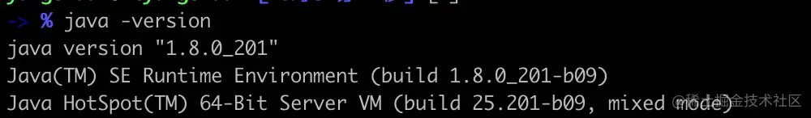
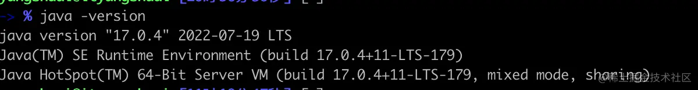
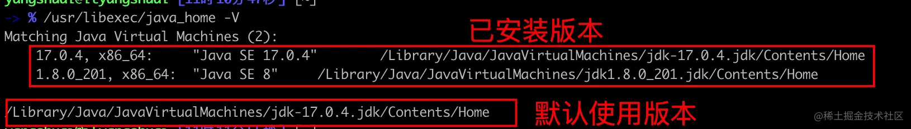
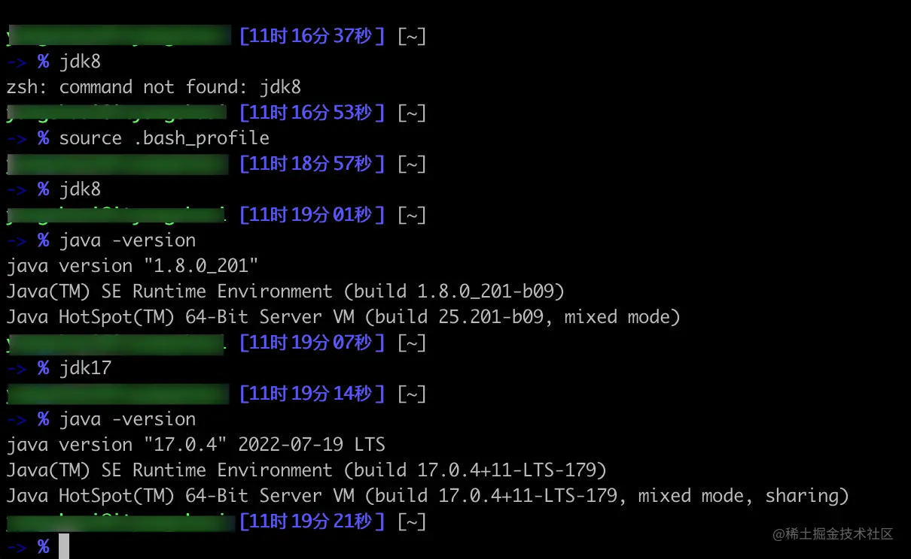

---
# 当前页面内容标题
title: Mac系列_多JDK切换配置
# 分类
category:
  - jdk
# 标签
tag: 
  - mac
  - 环境配置
  - jdk
sticky: false
# 是否收藏在博客主题的文章列表中，当填入数字时，数字越大，排名越靠前。
star: false
# 是否将该文章添加至文章列表中
article: true
# 是否将该文章添加至时间线中
timeline: true
---

## 下载安装

> Oracle官方下载地址：[www.oracle.com/java/techno…](https://link.juejin.cn?target=https%3A%2F%2Fwww.oracle.com%2Fjava%2Ftechnologies%2Fdownloads%2F)

由于之前工作一直都是使用的JDK8，现要转用JDK17，于是想在mac笔记本上同时安装jdk8和jdk17，方便跑以前的项目。

如图，通过官网地址选择Java 17，选择macOS,可以选择下载DMG安装程序，也可以选择tar.gz结尾的压缩包。


安装前执行`java -verison`显示版本是1.8.0_201。



选择DMG文件安装之后，没有做任何配置，再次执行`java -verison`显示版本是17.0.4。



此时，我的笔记本上已经安装了两个JDK版本。

终端输入命令：`/usr/libexec/java_home -V`查看JDK安装目录。注意此处-V必须是大写。

执行后如下图： 两个红框内分别表示`当前Mac已安装jdk目录`和`Mac默认使用的jdk版本`；



拷贝文件目录备用:

```bash
   17.0.4, x86_64:    "Java SE 17.0.4"    /Library/Java/JavaVirtualMachines/jdk-17.0.4.jdk/Contents/Home
    1.8.0_201, x86_64:    "Java SE 8"    /Library/Java/JavaVirtualMachines/jdk1.8.0_201.jdk/Contents/Home
```

### 实现

> 我们的目的是可以在多个JDK版本之间自由切换。

默认安装路径：/Library/Java/JavaVirtualMachines/

我们可以在用户home目录`~` 下创建`.bash_profile`文件来配置环境变量和用户一些自定义别名等。

命令行如下：

```bash
# 进入用户home目录
cd ~  
#创建.bash_profile文件,已存在不会操作
touch .bash_profile
# 使用vim 或open命令打开文件
vim .bash_profile
open -e .bash_profile
```

`.bash_profile`文件配置内容如下：

```bash
# JDK 配置
export JAVA_17_HOME=/Library/Java/JavaVirtualMachines/jdk-17.0.4.jdk/Contents/Home
export JAVA_8_HOME=/Library/Java/JavaVirtualMachines/jdk1.8.0_201.jdk/Contents/Home

# 默认JDK版本
export JAVA_HOME=$JAVA_17_HOME

# 多版本切换（设置别名，终端输入jdk8/jdk17 自动切换）
alias jdk17="export JAVA_HOME=$JAVA_17_HOME"
alias jdk8="export JAVA_HOME=$JAVA_8_HOME"
```

保存退出后终端执行jdk8测试能够切换JDK版本：报错：`command not found: jdk8`

需执行命令`source .bash_profile`使配置生效。

执行命令后即可以顺利切换，如下图展示。

