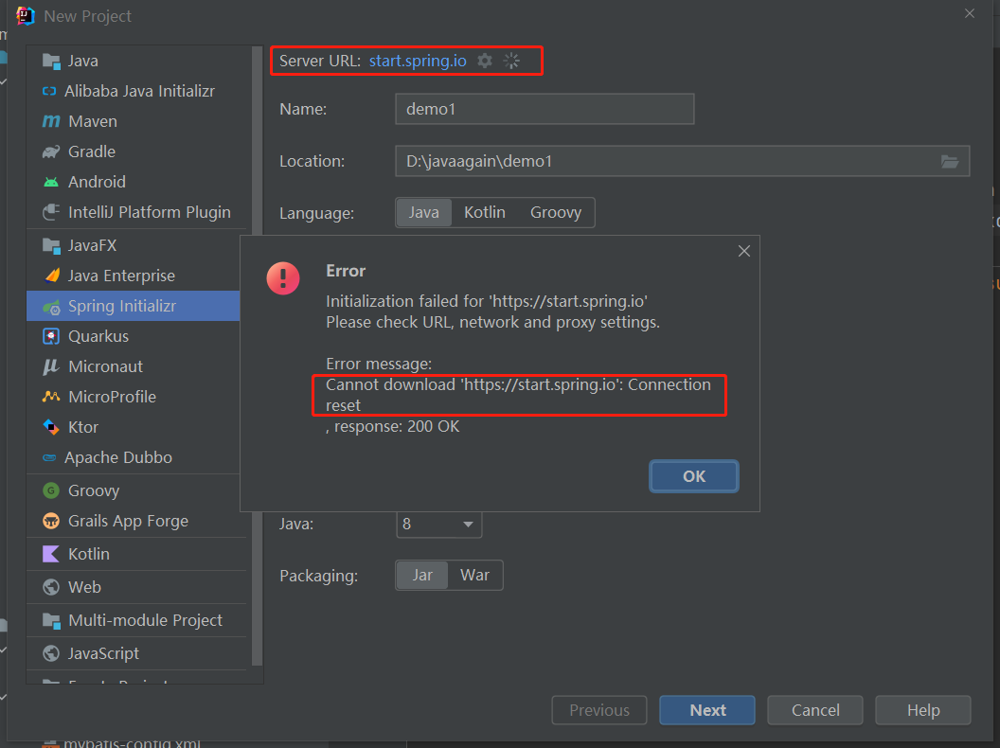
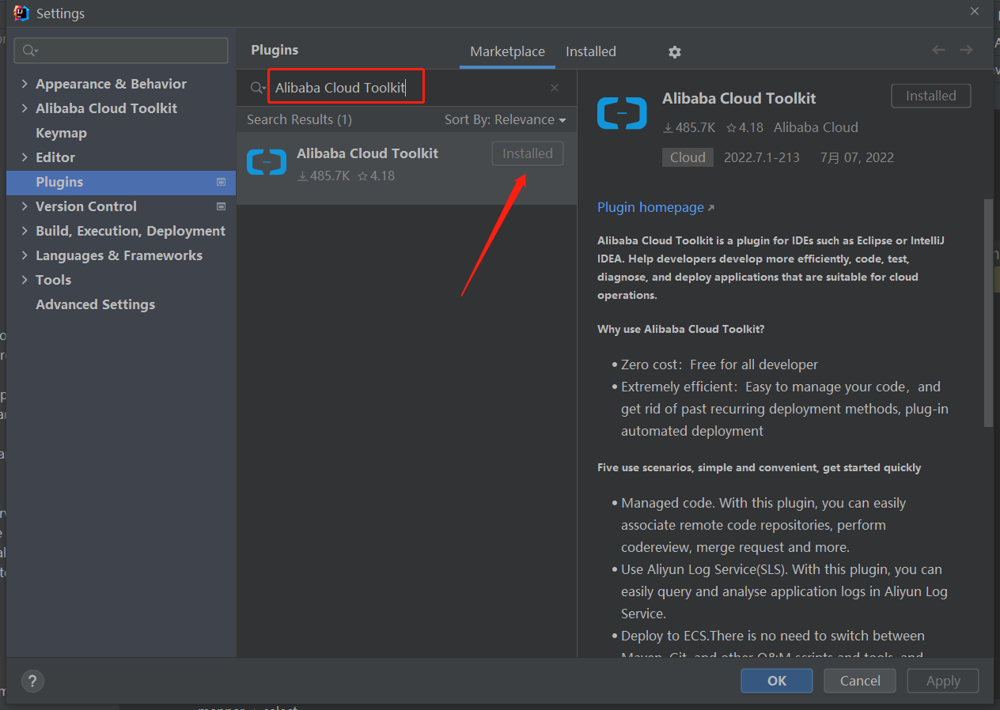
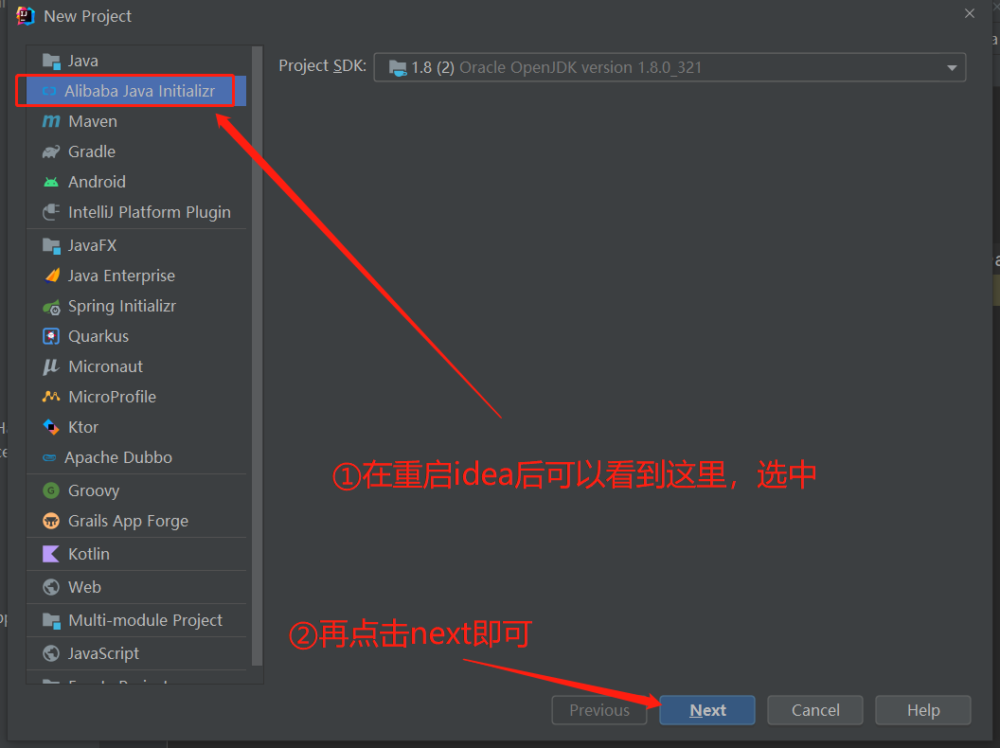
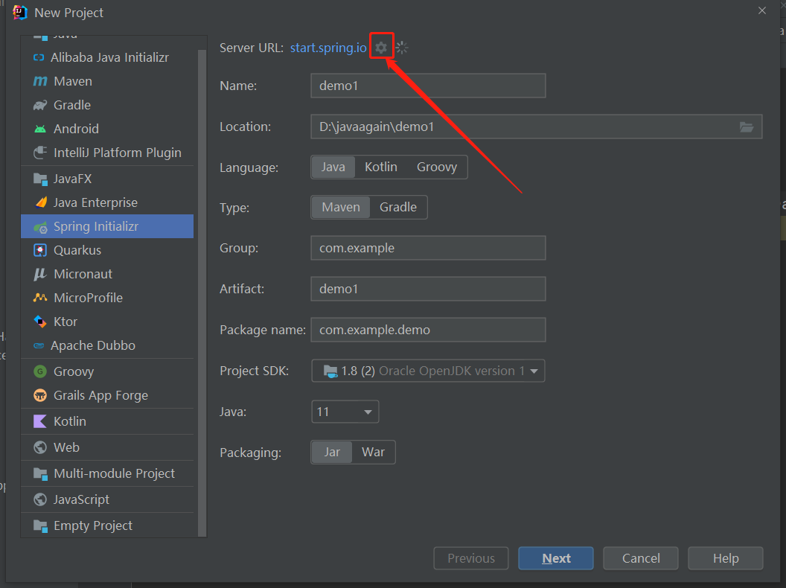
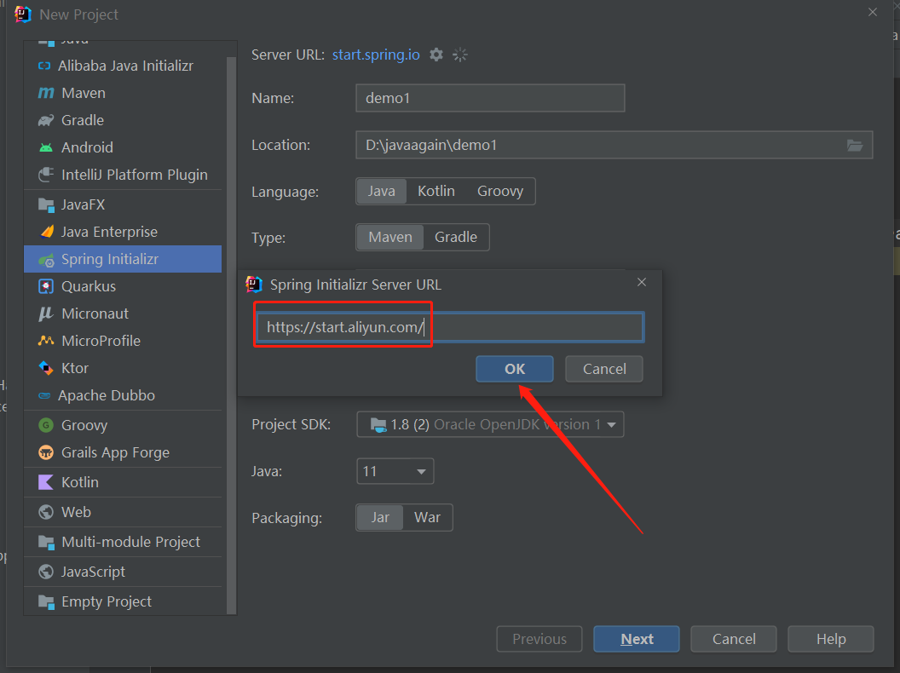
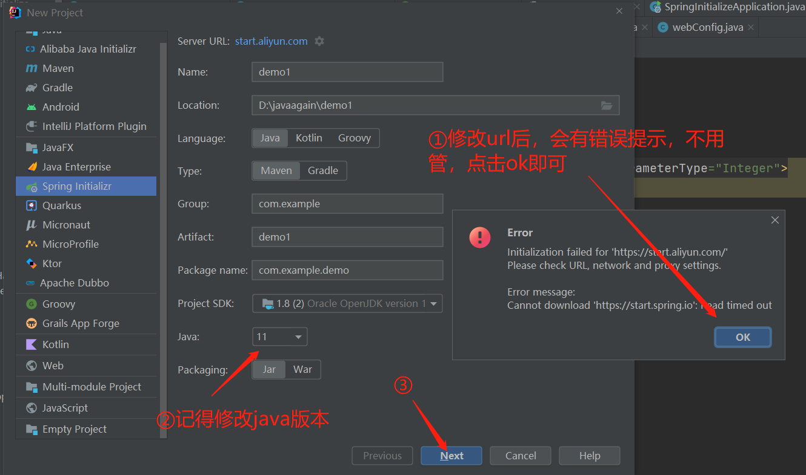
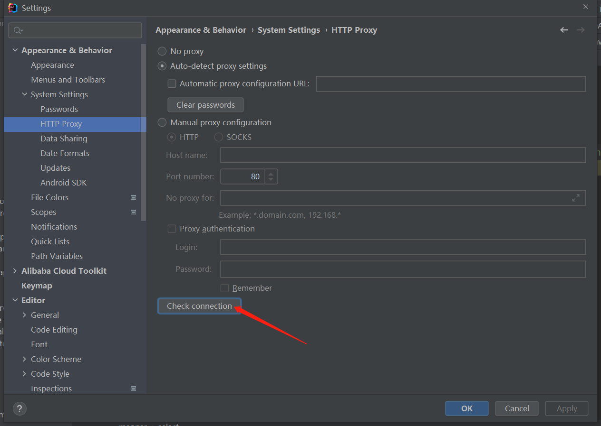
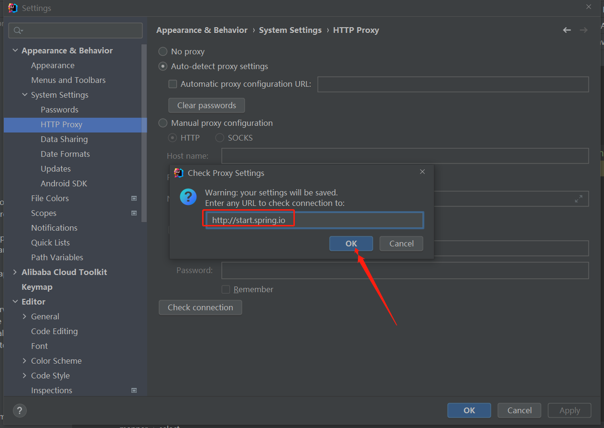
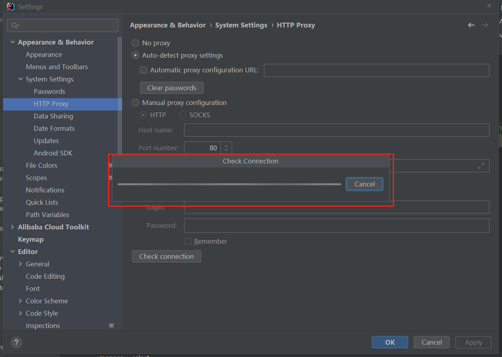

---
# 当前页面内容标题
title: SpringInitializr网络连接超时三种解决方案（配图文步骤）
# 分类
category:
  - idea
  - springboot
# 标签
tag: 
  - idea
  - 脚手架创建
sticky: false
# 是否收藏在博客主题的文章列表中，当填入数字时，数字越大，排名越靠前。
star: false
# 是否将该文章添加至文章列表中
article: true
# 是否将该文章添加至时间线中
timeline: true
---

## 1.问题分析

## 2.方案一：下载阿里云插件

### 2.1 搜索Alibaba Cloud Toolkit并Installed

### 2.2 重启idea

下载完成以后，该插件不会立即生效，需要重启idea

上图红色箭头指向的 **<u>Install</u>** 在下载完成以后会 变成绿色的 **<u>Reset</u>** ,因此你也可以直接点击 <u><strong>Reset</strong></u> ,也可以重启idea

### 2.3 使用阿里版的Spring Initializr

## 3.方案二：配置阿里云Spring Initializr URL（推荐）

### 3.1 点击 设置 图标

### 3.2 修改为阿里云地址

[https://start.aliyun.com/](https://start.aliyun.com/ "https://start.aliyun.com/")

## 4.方案三：check connection

### 4.1设置HTTP Proxy配置

**Settings** --> **Appearance & Behavior** --> **System Settings** --> **HTTP Proxy** --> 点击 **Check connection**

### 4.2 输入 [http://start.spring.io](http://start.spring.io/ "http://start.spring.io"),点击ok

### 4.3 结果

1. 可能依旧不成功，显示error

2. 如果成功，就可以再去创建spring Initializr项目，需要先修改url为[http://start.spring.io](http://start.spring.io/ "http://start.spring.io")即可
