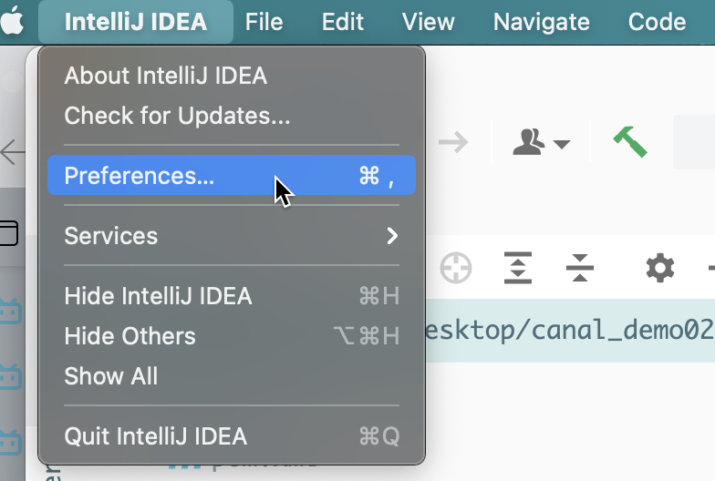
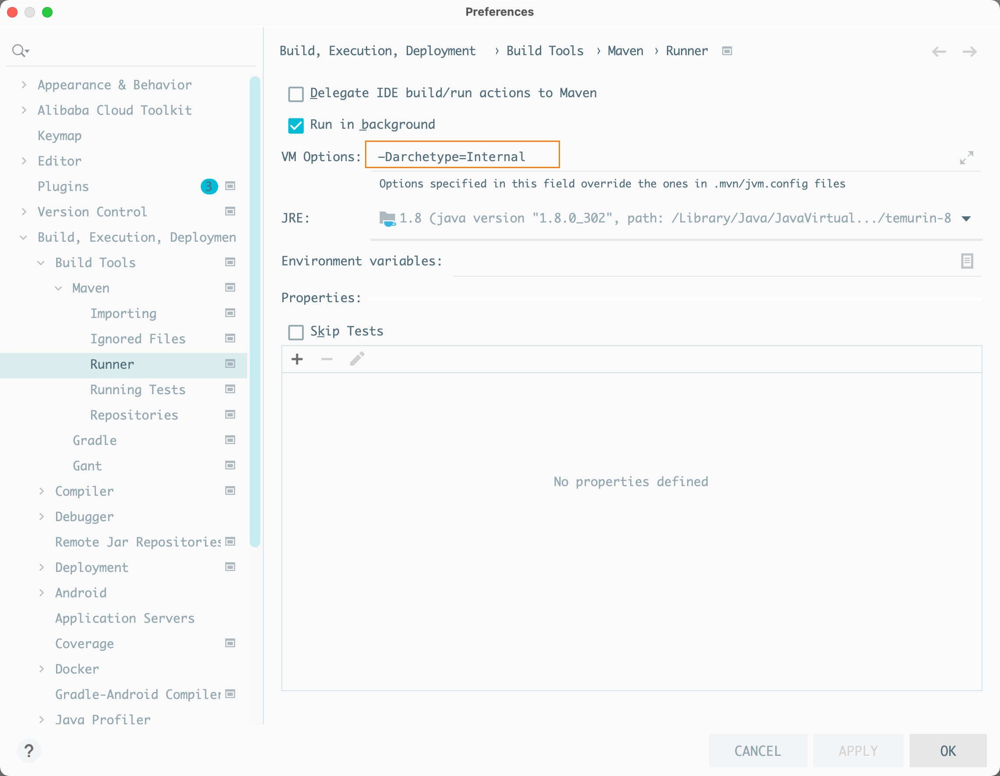

---
# 当前页面内容标题
title: 解决IDEA中创建maven项目没有src问题
# 分类
category:
  - idea
# 标签
tag: 
  - idea
  - 开发工具
sticky: false
# 是否收藏在博客主题的文章列表中，当填入数字时，数字越大，排名越靠前。
star: false
# 是否将该文章添加至文章列表中
article: true
# 是否将该文章添加至时间线中
timeline: true
---

解决方案如下：

1.首先点击左上角的File


2.选中File中的Settings（mac的话点击这个Intellij IDEA中的Perferences）



3.找到Build, Execution, Deployment，选中Build Tools–>Maven–>Runner，在右侧 VM Options框中写上 `-Darchetype=Internal `即可。



```
-Darchetype=Internal
```

4.然后就可以看到了！
