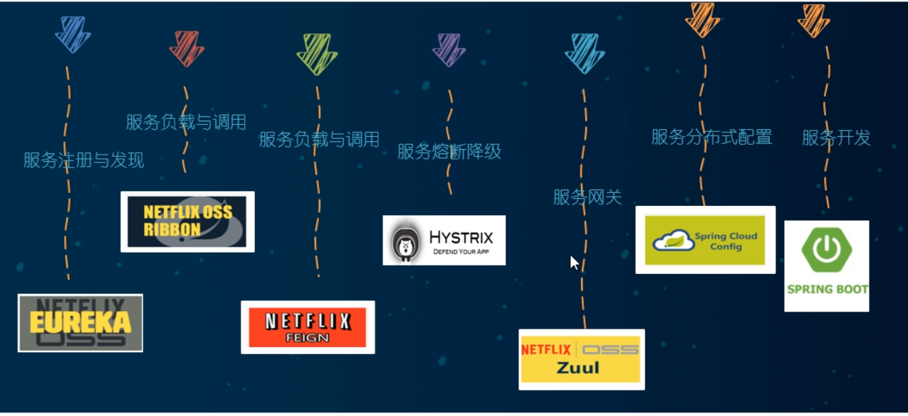
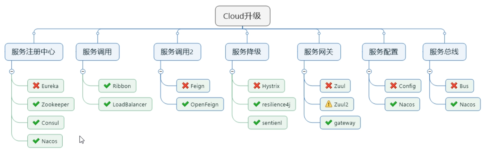

---
# 当前页面内容标题
title: 三、关于Cloud个钟组件的停更/升级/替换
# 分类
category:
  - springcloud
# 标签
tag: 
  - spring
  - springcloud
  - 微服务
  - java
sticky: false
# 是否收藏在博客主题的文章列表中，当填入数字时，数字越大，排名越靠前。
star: false
# 是否将该文章添加至文章列表中
article: true
# 是否将该文章添加至时间线中
timeline: true
---

## 01、由停更引发的“升级惨案”

- 停更不停用

  - 被动修复bugs
  - 不再接受合并请求
  - 不再发布新版本

- 补充

  - 停课不停学

- 明细条目

  - 以前

    

  - now2022

    

## 02、参考资料见官网

> - SpringCloud
>
> https://cloud.spring.io/spring-cloud-static/Hoxton.SR1/reference/htmlsingle/
>
> - SpringCloud中文文档
>
> https://www.bookstack.cn/read/spring-cloud-docs/docs-index.md

> - SpringBoot
>
> https://docs.spring.io/spring-boot/docs/2.2.2.RELEASE/reference/htmlsingle/