---
# 当前页面内容标题
title: 二、从2.2x和H版开始说起
# 分类
category:
  - springcloud
# 标签
tag: 
  - spring
  - springcloud
  - 微服务
  - java
sticky: false
# 是否收藏在博客主题的文章列表中，当填入数字时，数字越大，排名越靠前。
star: false
# 是否将该文章添加至文章列表中
article: true
# 是否将该文章添加至时间线中
timeline: true
---

## 01、本次的springcloud第二季分为上半场和下半场

- 上篇
  - SpringBoot2.X版和SpringCloud H版
- 下篇
  - SpringCloud Alibaba
- 大纲

## 02、SpringBoot版本选择

- git源码地址：https://github.com/spring-projects/spring-boot/releases/
- SpringBoot2.0新特性：https://github.com/spring-projects/spring-boot/wiki/Spring-Boot-2.0-Release-Notes
- 通过上面官网发现，Boot官方强烈建议你升级到2.X以上版本

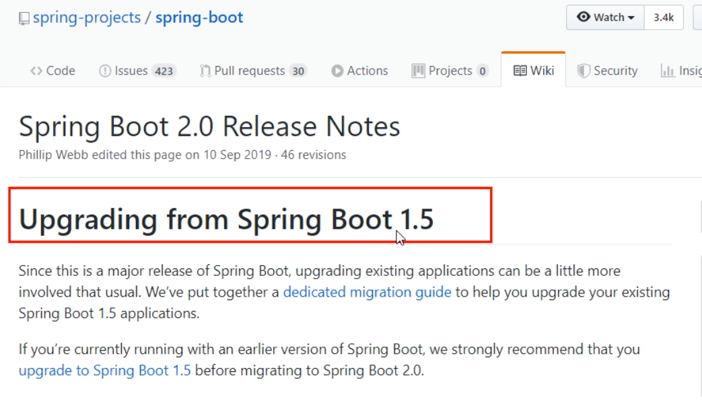

- 官网看Boot版本

  -  springboot(截至2019.10.26)

    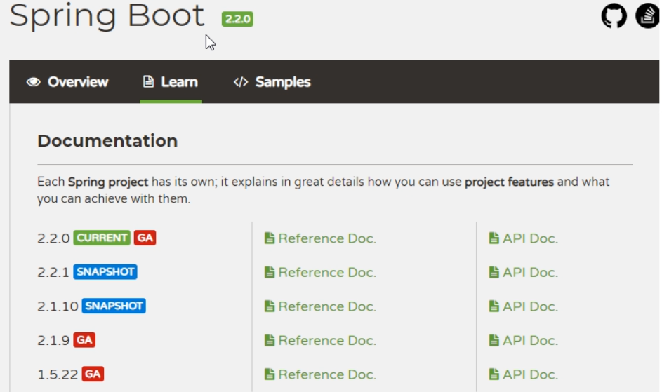

  - springboot(截至2020.2.15)

    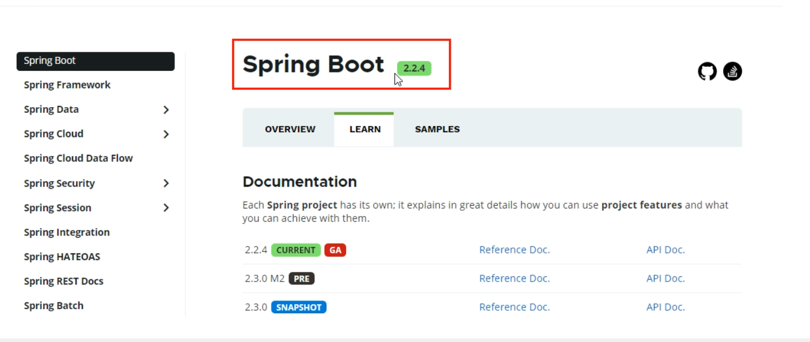

## 03、SpringCloud版本选择

> git源码地址：https://github.com/spring-projects/spring-cloud/wiki
>
> 官网：https://spring.io/projects/spring-cloud

- 官网看Cloud版本

1. Cloud命名规则

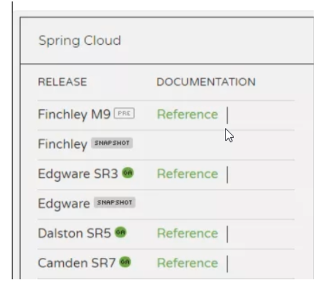

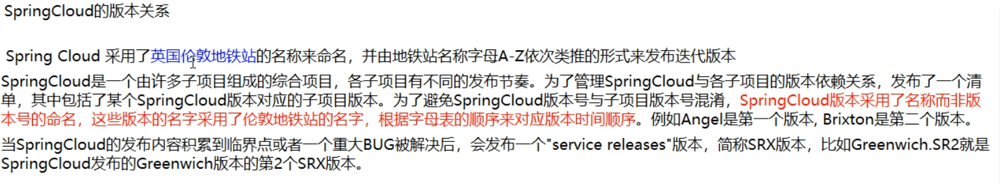

 SpringCloud的多版本

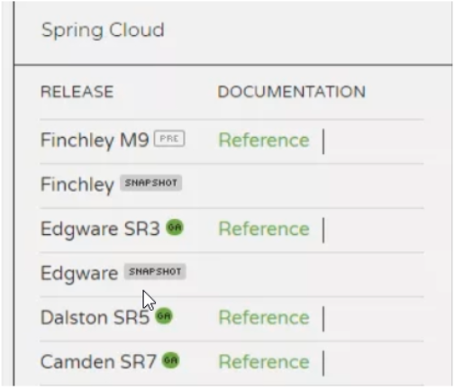

2. springcloud(截至2019.10.26)

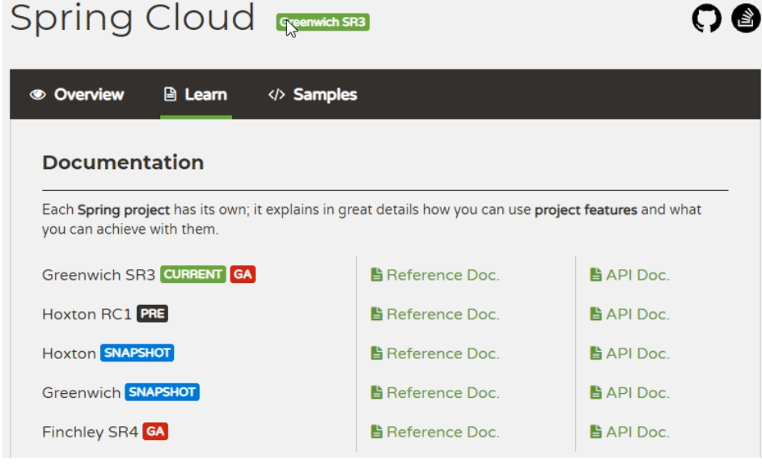

3. springboot(截至2020.2.15)

## 04、SpringBoot和SpringCloud之间的依赖关系如何部署

> https://spring.io/projects/spring-cloud#overview

- 依赖

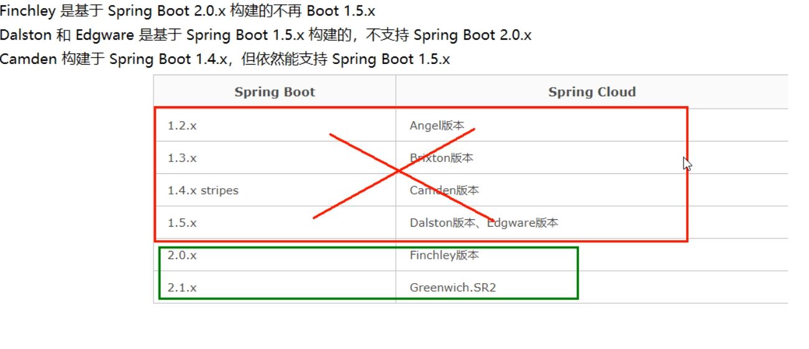

- 更详细的版本对应查看方法

> https://start.spring.io/actuator/info

- 结果

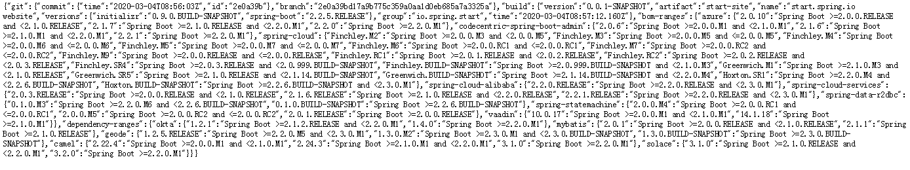

- 查看json串返回结果

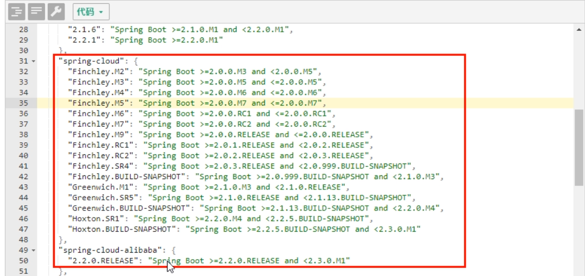

## 05、SpringCloud第二季定稿版（截止2020.2.15）

- cloud		Hoxton.SR1
- boot		 2.2.2.RELEASE
- cloud Alibaba		2.1.0.RELEASE
- java		JAVA8
- maven		3.5及以上
- mysql		5.7及以上
- 不许捣蛋，上述全部版本必须一致
- 题外话

> boot版已经到2.2.4为最新，为什么选2.2.2？

1. 只用boot，直接用最新

2. 同时用boot和cloud，需要照顾cloud，由cloud决定boot版本

结果

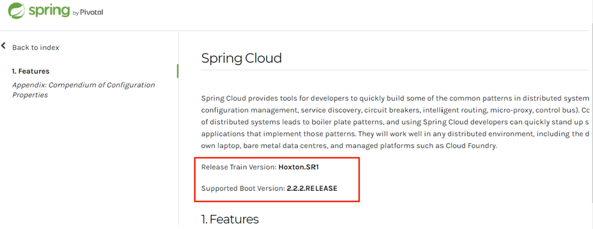

3. SpringCloud和SpringBoot版本对应关系

> 2.X版本常用的组件pom

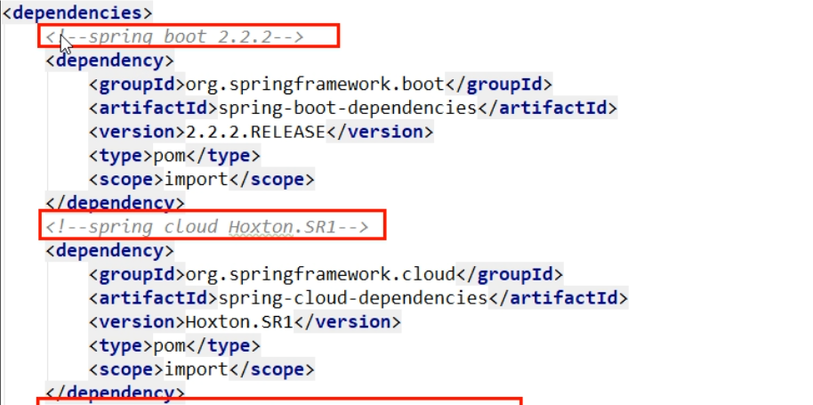

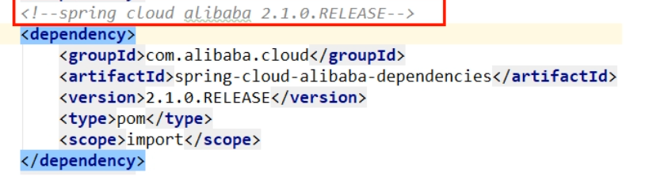

