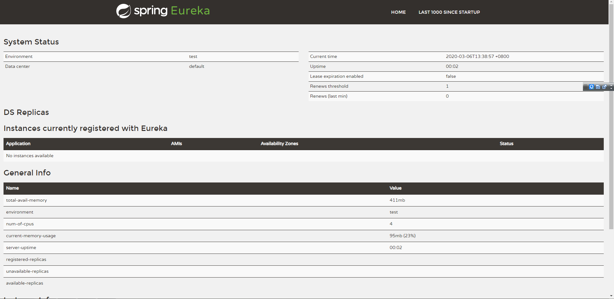
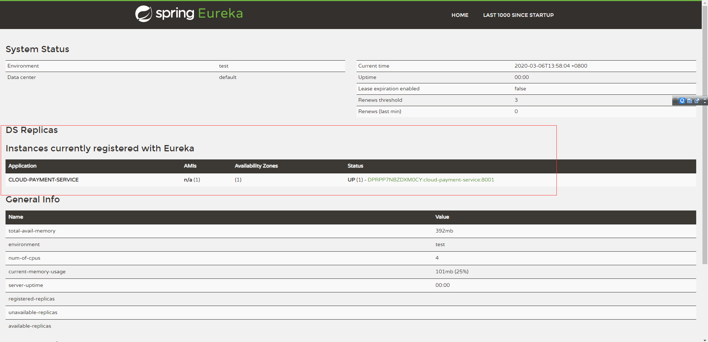
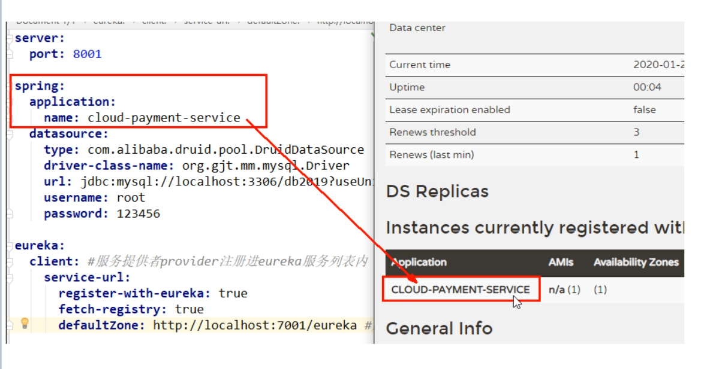
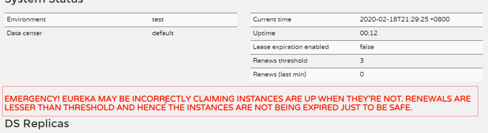
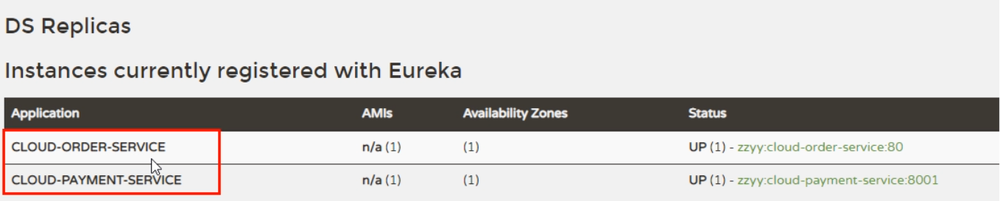
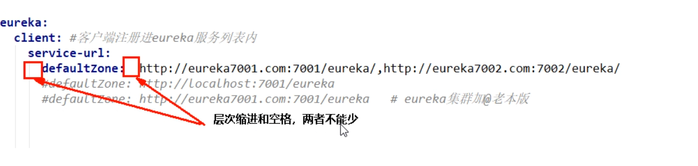
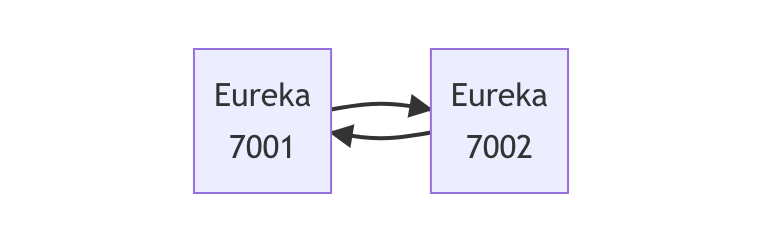

---
# 当前页面内容标题
title: 五、Eureka服务注册与发现
# 分类
category:
  - springcloud
# 标签
tag: 
  - spring
  - springcloud
  - 微服务
  - java
sticky: false
# 是否收藏在博客主题的文章列表中，当填入数字时，数字越大，排名越靠前。
star: false
# 是否将该文章添加至文章列表中
article: true
# 是否将该文章添加至时间线中
timeline: true
---

## 01、Eureka基础知识

### 什么是服务治理

Spring Cloud封装了Netflix 公司开发的Eureka模块来实现服务治理

在传统的RPC远程调用框架中，管理每个服务与服务之间依赖关系比较复杂，管理比较复杂，所以需要使用服务治理，管理服务于服务之间依赖关系，可以实现服务调用、负载均衡、容错等，实现服务发现与注册。

### **什么是服务注册与发现**

Eureka采用了CS的设计架构，Eureka Sever作为服务注册功能的服务器，它是服务注册中心。而系统中的其他微服务，使用Eureka的客户端连接到 Eureka Server并维持心跳连接。这样系统的维护人员就可以通过Eureka Server来监控系统中各个微服务是否正常运行。

在服务注册与发现中，有一个注册中心。当服务器启动的时候，会把当前自己服务器的信息比如服务地址通讯地址等以别名方式注册到注册中心上。另一方(消费者服务提供者)，以该别名的方式去注册中心上获取到实际的服务通讯地址，然后再实现本地RPC调用RPC远程调用框架核心设计思想:在于注册中心，因为使用注册中心管理每个服务与服务之间的一个依赖关系(服务治理概念)。在任何RPC远程框架中，都会有一个注册中心存放服务地址相关信息(接口地址)


**Eureka包含两个组件:Eureka Server和Eureka Client**

**Eureka Server**提供服务注册服务

各个微服务节点通过配置启动后，会在EurekaServer中进行注册，这样EurekaServer中的服务注册表中将会存储所有可用服务节点的信息，服务节点的信息可以在界面中直观看到。

**EurekaClient**通过注册中心进行访问

它是一个Java客户端，用于简化Eureka Server的交互，客户端同时也具备一个内置的、使用轮询(round-robin)负载算法的负载均衡器。在应用启动后，将会向Eureka Server发送心跳(默认周期为30秒)。如果Eureka Server在多个心跳周期内没有接收到某个节点的心跳，EurekaServer将会从服务注册表中把这个服务节点移除（默认90秒)

## 02、EurekaServer服务端安装

IDEA生成eurekaServer端服务注册中心，类似物业公司

1.创建名为cloud-eureka-server7001的Maven工程

2.修改pom.xml

```xml
<!-- eureka新旧版本 -->
<!-- 以前的老版本（2018）-->
<dependency>
    <groupid>org.springframework.cloud</groupId>
    <artifactId>spring-cloud-starter-eureka</artifactId>
</dependency>

<!-- 现在新版本（2020.2）--><!-- 我们使用最新的 -->
<dependency>
    <groupId>org.springframework.cloud</groupId>
    <artifactId>spring-cloud-starter-netflix-eureka-server</artifactId>
</dependency>
```

```xml
<?xml version="1.0" encoding="UTF-8"?>
<project xmlns="http://maven.apache.org/POM/4.0.0"
         xmlns:xsi="http://www.w3.org/2001/XMLSchema-instance"
         xsi:schemaLocation="http://maven.apache.org/POM/4.0.0 http://maven.apache.org/xsd/maven-4.0.0.xsd">
    <parent>
        <artifactId>cloud2022</artifactId>
        <groupId>com.nakanomay.springcloud</groupId>
        <version>1.0.0-SNAPSHOT</version>
    </parent>
    <modelVersion>4.0.0</modelVersion>

    <artifactId>cloud-eureka-server7001</artifactId>

    <dependencies>
        <!--eureka-server-->
        <dependency>
            <groupId>org.springframework.cloud</groupId>
            <artifactId>spring-cloud-starter-netflix-eureka-server</artifactId>
        </dependency>
        <!-- 引入自己定义的api通用包，可以使用Payment支付Entity -->
        <dependency>
            <groupId>com.nakanomay.springcloud</groupId>
            <artifactId>cloud-api-commons</artifactId>
            <version>${project.version}</version>
        </dependency>
        <!--boot web actuator-->
        <dependency>
            <groupId>org.springframework.boot</groupId>
            <artifactId>spring-boot-starter-web</artifactId>
        </dependency>
        <dependency>
            <groupId>org.springframework.boot</groupId>
            <artifactId>spring-boot-starter-actuator</artifactId>
        </dependency>
        <!--一般通用配置-->
        <dependency>
            <groupId>org.springframework.boot</groupId>
            <artifactId>spring-boot-devtools</artifactId>
            <scope>runtime</scope>
            <optional>true</optional>
        </dependency>
        <dependency>
            <groupId>org.projectlombok</groupId>
            <artifactId>lombok</artifactId>
        </dependency>
        <dependency>
            <groupId>org.springframework.boot</groupId>
            <artifactId>spring-boot-starter-test</artifactId>
            <scope>test</scope>
        </dependency>
        <dependency>
            <groupId>junit</groupId>
            <artifactId>junit</artifactId>
        </dependency>
    </dependencies>

</project>
```

3.添加application.yml

```yml
server:
  port: 7001

eureka:
  instance:
    hostname: locathost #eureka服务端的实例名称
  client:
    #false表示不向注册中心注册自己。
    register-with-eureka: false
    #false表示自己端就是注册中心，我的职责就是维护服务实例，并不需要去检索服务
    fetch-registry: false
    service-url:
      #设置与Eureka server交互的地址查询服务和注册服务都需要依赖这个地址。
      defaultZone: http://${eureka.instance.hostname}:${server.port}/eureka/
```

5.测试运行`EurekaMain7001`，浏览器输入`http://localhost:7001/`回车，会查看到Spring Eureka服务主页。



## 03、支付微服务8001驻入EurekaServer

EurekaClient端cloud-provider-payment8001将注册进EurekaServer成为服务提供者provider，类似学校对外提供授课服务。

1.修改cloud-provider-payment8001

2.改POM

添加spring-cloud-starter-netflix-eureka-client依赖

```xml
<dependency>
    <groupId>org.springframework.cloud</groupId>
    <artifactId>spring-cloud-starter-netflix-eureka-client</artifactId>
</dependency>
```

3.写YML

```yml
eureka:
  client:
    #表示是否将自己注册进Eurekaserver默认为true。
    register-with-eureka: true
    #是否从EurekaServer抓取已有的注册信息，默认为true。单节点无所谓，集群必须设置为true才能配合ribbon使用负载均衡
    fetchRegistry: true
    service-url:
      defaultZone: http://localhost:7001/eureka
```

4.主启动

```java
import org.springframework.boot.SpringApplication;
import org.springframework.boot.autoconfigure.SpringBootApplication;
import org.springframework.cloud.netflix.eureka.EnableEurekaClient;

@SpringBootApplication
@EnableEurekaClient//<-----添加该注解
public class PaymentMain8001 {

    public static void main(String[] args) {
        SpringApplication.run(PaymentMain001.class, args);
    }
}
```

5.测试

- 启动cloud-provider-payment8001和cloud-eureka-server7001工程。

- 浏览器输入 - http://localhost:7001/ 主页内的Instances currently registered with Eureka会显示cloud-provider-payment8001的配置文件application.yml设置的应用名cloud-payment-service





```yml
spring:
  application:
    name: cloud-payment-service
```

6.自我保护机制

EMERGENCY! EUREKA MAY BE INCORRECTLY CLAIMING INSTANCES ARE UP WHEN THEY’RE NOT. RENEWALS ARELESSER THAN THRESHOLD AND HENCFT ARE NOT BEING EXPIRED JUST TO BE SAFE.



紧急情况！EUREKA可能错误地声称实例在没有启动的情况下启动了。续订小于阈值，因此实例不会为了安全而过期。

## 04、订单服务80驻入EurekaServer

EurekaClient端cloud-consumer-order80将注册进EurekaServer成为服务消费者consumer，类似来上课消费的同学

1.cloud-consumer-order80

2.POM

```xml
<dependency>
    <groupId>org.springframework.cloud</groupId>
    <artifactId>spring-cloud-starter-netflix-eureka-client</artifactId>
</dependency>
```

3.YML

```yml
server:
  port: 80

spring:
  application:
    name: cloud-order-service

eureka:
  client:
    #表示是否将自己注册进Eurekaserver默认为true。
    register-with-eureka: true
    #是否从EurekaServer抓取已有的注册信息，默认为true。单节点无所谓，集群必须设置为true才能配合ribbon使用负载均衡
    fetchRegistry: true
    service-url:
      defaultZone: http://localhost:7001/eureka
```

4.主启动

```java
import org.springframework.boot.SpringApplication;
import org.springframework.boot.autoconfigure.SpringBootApplication;
import org.springframework.cloud.netflix.eureka.EnableEurekaClient;

@SpringBootApplication
@EnableEurekaClient//<--- 添加该标签
public class OrderMain80
{
    public static void main( String[] args ){
        SpringApplication.run(OrderMain80.class, args);
    }
}
```

5.测试

- 启动cloud-provider-payment8001、cloud-eureka-server7001和cloud-consumer-order80这三工程。

- 浏览器输入 http://localhost:7001 , 在主页的Instances currently registered with Eureka将会看到cloud-provider-payment8001、cloud-consumer-order80两个工程名。



注意，application.yml配置中层次缩进和空格，两者不能少，否则，会抛出异常`Failed to bind properties under 'eureka.client.service-url' to java.util.Map <java.lang.String, java.lang.String>`。



## 05、Eureka集群原理说明

1.Eureka集群原理说明


服务注册：将服务信息注册进注册中心

服务发现：从注册中心上获取服务信息

实质：存key服务命取value闭用地址

1先启动eureka注主册中心

2启动服务提供者payment支付服务

3支付服务启动后会把自身信息(比服务地址L以别名方式注朋进eureka

4消费者order服务在需要调用接口时，使用服务别名去注册中心获取实际的RPC远程调用地址

5消去者导调用地址后，底屋实际是利用HttpClient技术实现远程调用

6消费者实癸导服务地址后会缓存在本地jvm内存中，默认每间隔30秒更新—次服务调用地址

问题:微服务RPC远程服务调用最核心的是什么

高可用，试想你的注册中心只有一个only one，万一它出故障了，会导致整个为服务环境不可用。

解决办法：搭建Eureka注册中心集群，实现负载均衡+故障容错。

**互相注册，相互守望**。

## 06、Eureka集群环境构建

创建cloud-eureka-server7002工程，过程参考` Eueka服务端安装`



- 找到C:\Windows\System32\drivers\etc路径下的hosts文件，修改映射配置添加进hosts文件

```text
127.0.0.1 eureka7001.com
127.0.0.1 eureka7002.com
```

- 修改cloud-eureka-server7001配置文件

```yml
server:
  port: 7001

eureka:
  instance:
    hostname: eureka7001.com #eureka服务端的实例名称
  client:
    register-with-eureka: false     #false表示不向注册中心注册自己。
    fetch-registry: false     #false表示自己端就是注册中心，我的职责就是维护服务实例，并不需要去检索服务
    service-url:
    #集群指向其它eureka
      defaultZone: http://eureka7002.com:7002/eureka/
    #单机就是7001自己
      #defaultZone: http://eureka7001.com:7001/eureka/
```

- 修改cloud-eureka-server7002配置文件

```yml
server:
  port: 7002

eureka:
  instance:
    hostname: eureka7002.com #eureka服务端的实例名称
  client:
    register-with-eureka: false     #false表示不向注册中心注册自己。
    fetch-registry: false     #false表示自己端就是注册中心，我的职责就是维护服务实例，并不需要去检索服务
    service-url:
    #集群指向其它eureka
      defaultZone: http://eureka7001.com:7001/eureka/
    #单机就是7002自己
      #defaultZone: http://eureka7002.com:7002/eureka/
```

实践的时候，遇到异常情况

在开启cloud-eureka-server7002时，开启失败，说7002端口被占用，然后在cmd中输入`netstat -ano | find "7002"`，查不到任何东西。

纳闷一阵，重启电脑，问题解决。

## 07、订单支付两微服务注册进Eureka集群

- 将支付服务8001微服务，订单服务80微服务发布到上面2台Eureka集群配置中

将它们的配置文件的eureka.client.service-url.defaultZone进行修改

```yml
eureka:
  client:
    #表示是否将自己注册进Eurekaserver默认为true。
    register-with-eureka: true
    #是否从EurekaServer抓取已有的注册信息，默认为true。单节点无所谓，集群必须设置为true才能配合ribbon使用负载均衡
    fetchRegistry: true
    service-url:
      defaultZone: http://eureka7001.com:7001/eureka, http://eureka7002.com:7002/eureka
```

- 测试01
  1. 先要启动EurekaServer，7001/7002服务
  2. 再要启动服务提供者provider，8001
  3. 再要启动消费者，80
  4. 浏览器输入 - http://localhost/consumer/payment/get/1

## 08、支付微服务集群配置

**支付服务提供者8001集群环境构建**

参考cloud-provicer-payment8001

1.新建cloud-provider-payment8002

2.改POM

3.写YML - 端口8002

4.主启动

5.业务类

6.修改8001/8002的Controller，添加serverPort

```java
@RestController
@Slf4j
public class PaymentController{

    @Value("${server.port}")
    private String serverPort;//添加serverPort

    @PostMapping(value = "/payment/create")
    public CommonResult create(@RequestBody Payment payment)
    {
        int result = paymentService.create(payment);
        log.info("*****插入结果：" + result);

        if(result > 0) {
            return new CommonResult(200,"插入数据库成功,serverPort: "+serverPort/*添加到此处*/, result);
        }else{
            return new CommonResult(444,"插入数据库失败",null);
        }
    }
}
```

**负载均衡**

cloud-consumer-order80订单服务访问地址不能写死

```java
@Slf4j
@RestController
public class OrderController {

    //public static final String PAYMENT_URL = "http://localhost:8001";
    public static final String PAYMENT_URL = "http://CLOUD-PAYMENT-SERVICE";
    
    ...
}
```

使用@LoadBalanced注解赋予RestTemplate负载均衡的能力

```java
import org.springframework.cloud.client.loadbalancer.LoadBalanced;
import org.springframework.context.annotation.Bean;
import org.springframework.context.annotation.Configuration;
import org.springframework.web.client.RestTemplate;

@Configuration
public class ApplicationContextConfig {

    @Bean
    @LoadBalanced//使用@LoadBalanced注解赋予RestTemplate负载均衡的能力
    public RestTemplate getRestTemplate(){
        return new RestTemplate();
    }

}
```

ApplicationContextBean - 提前说一下Ribbon的负载均衡功能

**测试**

先要启动EurekaServer，7001/7002服务

再要启动服务提供者provider，8001/8002服务

浏览器输入 - http://localhost/consumer/payment/get/31

结果：负载均衡效果达到，8001/8002端口交替出现

Ribbon和Eureka整合后Consumer可以直接调用服务而不用再关心地址和端口号，且该服务还有负载功能。

**相互注册，相互守望**


## 09、actuator微服务信息完善

主机名称：服务名称修改（也就是将IP地址，换成可读性高的名字）

修改cloud-provider-payment8001，cloud-provider-payment8002

修改部分 - YML - eureka.instance.instance-id

```yml
eureka:
  ...
  instance:
    instance-id: payment8001 #添加此处
```

```yml
eureka:
  ...
  instance:
    instance-id: payment8002 #添加此处
```

修改之后

eureka主页将显示payment8001，payment8002代替原来显示的IP地址。

---

访问信息有IP信息提示，（就是将鼠标指针移至payment8001，payment8002名下，会有IP地址提示）

修改部分 - YML - eureka.instance.prefer-ip-address

```yml
eureka:
  ...
  instance:
    instance-id: payment8001 
    prefer-ip-address: true #添加此处
```

```yml
eureka:
  ...
  instance:
    instance-id: payment8002
    prefer-ip-address: true #添加此处
```

## 10、服务发现Discovery

对于注册进eureka里面的微服务，可以通过服务发现来获得该服务的信息

- 修改cloud-provider-payment8001的Controller

```java
@RestController
@Slf4j
public class PaymentController{
	...
    
    @Resource
    private DiscoveryClient discoveryClient;

    ...

    @GetMapping(value = "/payment/discovery")
    public Object discovery()
    {
        List<String> services = discoveryClient.getServices();
        for (String element : services) {
            log.info("*****element: "+element);
        }

        List<ServiceInstance> instances = discoveryClient.getInstances("CLOUD-PAYMENT-SERVICE");
        for (ServiceInstance instance : instances) {
            log.info(instance.getServiceId()+"\t"+instance.getHost()+"\t"+instance.getPort()+"\t"+instance.getUri());
        }

        return this.discoveryClient;
    }
}
```

- 8001主启动类

```java
@SpringBootApplication
@EnableEurekaClient
@EnableDiscoveryClient//添加该注解
public class PaymentMain8001 {

    public static void main(String[] args) {
        SpringApplication.run(PaymentMain001.class, args);
    }
}
```

- 自测

先要启动EurekaSeryer

再启动8001主启动类，需要稍等一会儿

浏览器输入http://localhost:8001/payment/discovery

浏览器输出：

```json
{"services":["cloud-payment-service"],"order":0}
```

后台输出：

```java
*****element: cloud-payment-service
CLOUD-PAYMENT-SERVICE	192.168.199.218	8001	http://192.168.199.218:8001
```

## 11、Eureka自我保护理论知识

**概述**

保护模式主要用于一组客户端和Eureka Server之间存在网络分区场景下的保护。一旦进入保护模式，**Eureka Server将会尝试保护其服务注册表中的信息，不再删除服务注册表中的数据，也就是不会注销任何微服务。**

如果在Eureka Server的首页看到以下这段提示，则说明Eureka进入了保护模式:

EMERGENCY! EUREKA MAY BE INCORRECTLY CLAIMING INSTANCES ARE UP WHEN THEY’RE NOT. RENEWALS ARE LESSER THANTHRESHOLD AND HENCE THE INSTANCES ARE NOT BEING EXPIRED JUSTTO BE SAFE

**导致原因**

一句话：某时刻某一个微服务不可用了，Eureka不会立刻清理，依旧会对该微服务的信息进行保存。

属于CAP里面的AP分支。

**为什么会产生Eureka自我保护机制?**

为了EurekaClient可以正常运行，防止与EurekaServer网络不通情况下，EurekaServer**`不会立刻`**将EurekaClient服务剔除

**什么是自我保护模式?**

默认情况下，如果EurekaServer在一定时间内没有接收到某个微服务实例的心跳，EurekaServer将会注销该实例(默认90秒)。但是当网络分区故障发生(延时、卡顿、拥挤)时，微服务与EurekaServer之间无法正常通信，以上行为可能变得非常危险了——因为微服务本身其实是健康的，`此时本不应该注销这个微服务`。Eureka通过“自我保护模式”来解决这个问题——当EurekaServer节点在短时间内丢失过多客户端时(可能发生了网络分区故障)，那么`这个节点就会`进入自我保护模式。


自我保护机制∶默认情况下EurekaClient定时向EurekaServer端发送心跳包

如果Eureka在server端在一定时间内(默认90秒)没有收到EurekaClient发送心跳包，便会直接从服务注册列表中剔除该服务，但是在短时间( 90秒中)内丢失了大量的服务实例心跳，这时候Eurekaserver会开启自我保护机制，不会剔除该服务（该现象可能出现在如果网络不通但是EurekaClient为出现宕机，此时如果换做别的注册中心如果一定时间内没有收到心跳会将剔除该服务，这样就出现了严重失误，因为客户端还能正常发送心跳，只是网络延迟问题，而保护机制是为了解决此问题而产生的)。

**在自我保护模式中，Eureka Server会保护服务注册表中的信息，不再注销任何服务实例**。

它的设计哲学就是宁可保留错误的服务注册信息，也不盲目注销任何可能健康的服务实例。一句话讲解：**好死不如赖活着。**

综上，自我保护模式是一种应对网络异常的安全保护措施。它的架构哲学是宁可同时保留所有微服务（健康的微服务和不健康的微服务都会保留）也不盲目注销任何健康的微服务。使用自我保护模式，可以让Eureka集群更加的健壮、稳定。

## 12、怎么禁止自我保护

- 在eurekaServer端7001处设置关闭自我保护机制

出厂默认，自我保护机制是开启的

使用`eureka.server.enable-self-preservation = false`可以禁用自我保护模式

```yml
eureka:
  ...
  server:
    #关闭自我保护机制，保证不可用服务被及时踢除
    enable-self-preservation: false
    eviction-interval-timer-in-ms: 2000
```

关闭效果：

spring-eureka主页会显示出一句：

**THE SELF PRESERVATION MODE IS TURNED OFF. THIS MAY NOT PROTECT INSTANCE EXPIRY IN CASE OF NETWORK/OTHER PROBLEMS.**

---

- 生产者客户端eureakeClient端8001

默认：

```properties
eureka.instance.lease-renewal-interval-in-seconds=30
eureka.instance.lease-expiration-duration-in-seconds=90
```

```yml
eureka:
  ...
  instance:
    instance-id: payment8001
    prefer-ip-address: true
    #心跳检测与续约时间
    #开发时没置小些，保证服务关闭后注册中心能即使剔除服务
    #Eureka客户端向服务端发送心跳的时间间隔，单位为秒(默认是30秒)
    lease-renewal-interval-in-seconds: 1
    #Eureka服务端在收到最后一次心跳后等待时间上限，单位为秒(默认是90秒)，超时将剔除服务
    lease-expiration-duration-in-seconds: 2
```

- 测试
  - 7001和8001都配置完成
  - 先启动7001再启动8001

