---
# 当前页面内容标题
title: 四、微服务架构编码构建
# 分类
category:
  - springcloud
# 标签
tag: 
  - spring
  - springcloud
  - 微服务
  - java
sticky: false
# 是否收藏在博客主题的文章列表中，当填入数字时，数字越大，排名越靠前。
star: false
# 是否将该文章添加至文章列表中
article: true
# 是否将该文章添加至时间线中
timeline: true
---

## 01、注意点

约定>配置>编码

## 02、IDEA新建project工作空间

> 微服务cloud整体整合父工程Project

父工程步骤

1. New Project

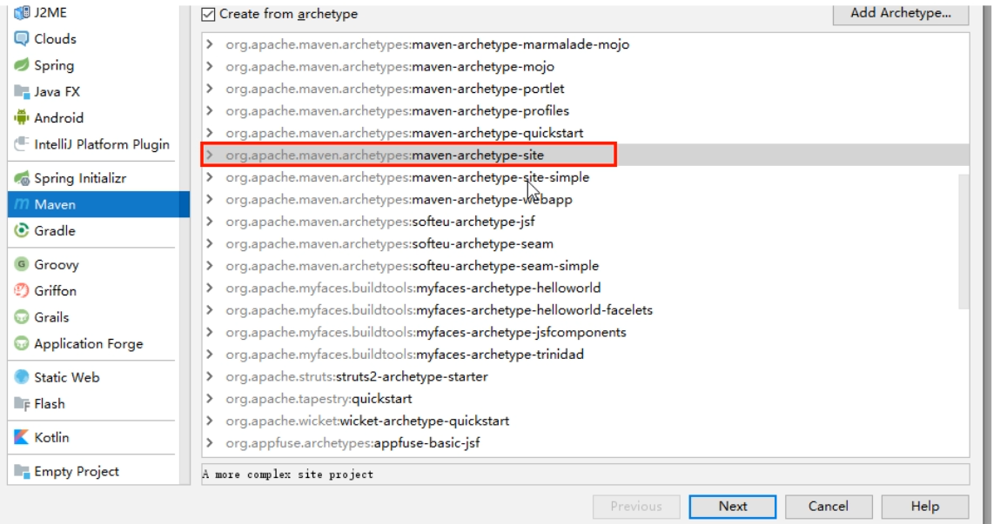

2. 聚合总工程名字

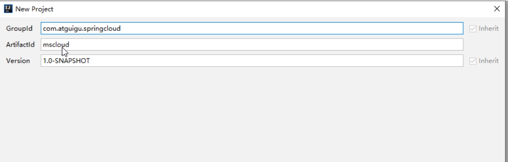

3. Maven选版本

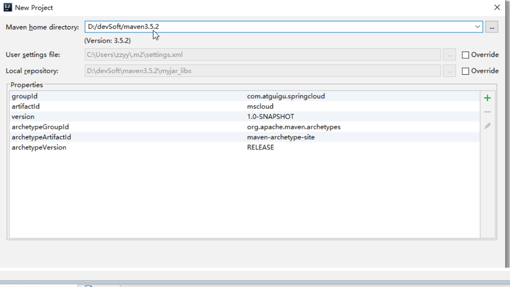

4. 工程名字

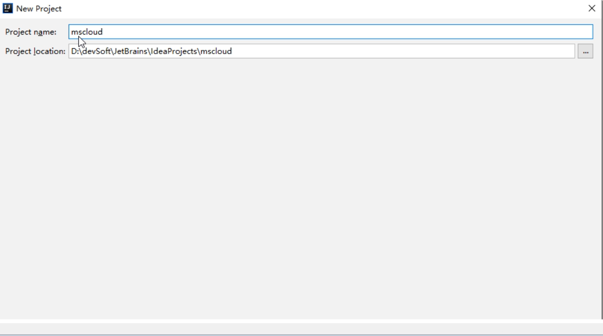

5. 字符编码

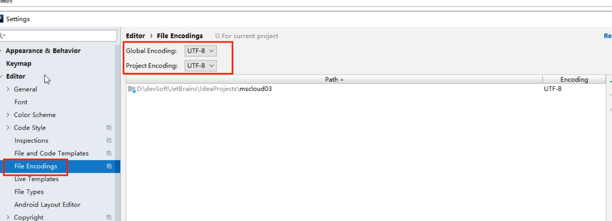

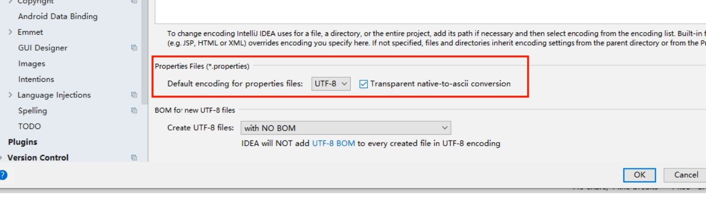

6. 注解生效激活

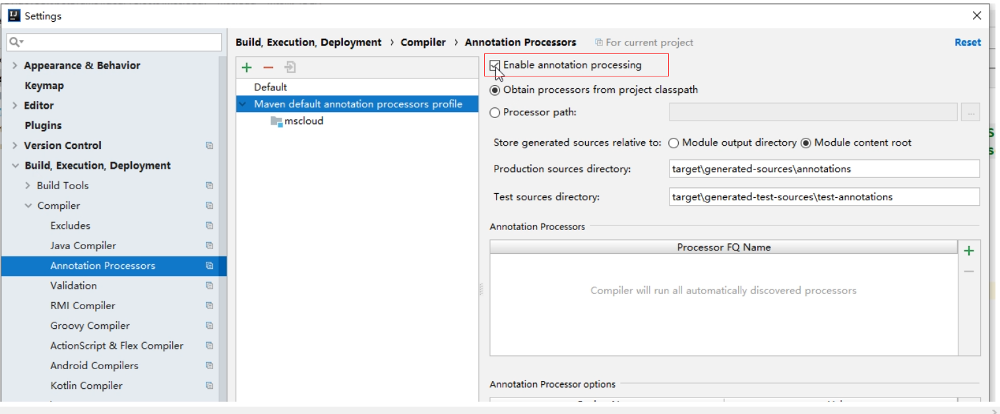

7. java编译版本选8

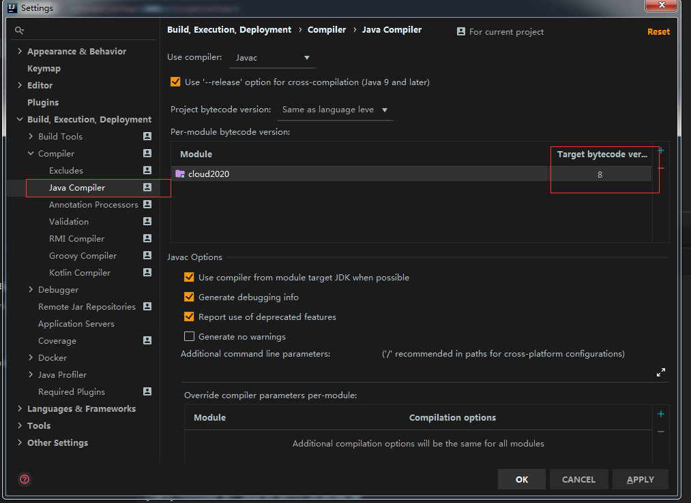

8. File Type过滤

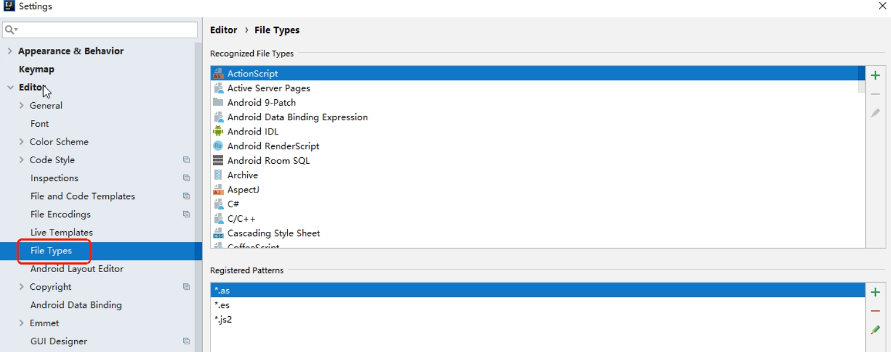

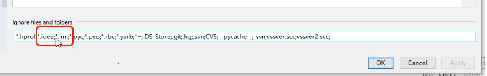

> 父工程POM

```xml
<?xml version="1.0" encoding="UTF-8"?>

<project xmlns="http://maven.apache.org/POM/4.0.0" xmlns:xsi="http://www.w3.org/2001/XMLSchema-instance"
         xsi:schemaLocation="http://maven.apache.org/POM/4.0.0 http://maven.apache.org/xsd/maven-4.0.0.xsd">
    <modelVersion>4.0.0</modelVersion>  

    <groupId>com.lun</groupId>
    <artifactId>LearnCloud</artifactId>
    <version>1.0.0-SNAPSHOT</version>
    <packaging>pom</packaging><!-- 这里添加，注意不是jar或war -->

    <!-- 统一管理jar包版本 -->
    <properties>
        <project.build.sourceEncoding>UTF-8</project.build.sourceEncoding>
        <maven.compiler.source>1.8</maven.compiler.source>
        <maven.compiler.target>1.8</maven.compiler.target>
        <junit.version>4.12</junit.version>
        <log4j.version>1.2.17</log4j.version>
        <lombok.version>1.16.18</lombok.version>
        <mysql.version>5.1.47</mysql.version>
        <druid.version>1.1.16</druid.version>
        <mybatis.spring.boot.version>1.3.0</mybatis.spring.boot.version>
    </properties>

    <!-- 子模块继承之后，提供作用：
        锁定版本+子modlue不用写groupId和version -->
    <dependencyManagement>
        <dependencies>
            <!--spring boot 2.2.2-->
            <dependency>
                <groupId>org.springframework.boot</groupId>
                <artifactId>spring-boot-dependencies</artifactId>
                <version>2.2.2.RELEASE</version>
                <type>pom</type>
                <scope>import</scope>
            </dependency>
            <!--spring cloud Hoxton.SR1-->
            <dependency>
                <groupId>org.springframework.cloud</groupId>
                <artifactId>spring-cloud-dependencies</artifactId>
                <version>Hoxton.SR1</version>
                <type>pom</type>
                <scope>import</scope>
            </dependency>
            <!--spring cloud alibaba 2.1.0.RELEASE-->
            <dependency>
                <groupId>com.alibaba.cloud</groupId>
                <artifactId>spring-cloud-alibaba-dependencies</artifactId>
                <version>2.1.0.RELEASE</version>
                <type>pom</type>
                <scope>import</scope>
            </dependency>
            <dependency>
                <groupId>mysql</groupId>
                <artifactId>mysql-connector-java</artifactId>
                <version>${mysql.version}</version>
            </dependency>
            <dependency>
                <groupId>com.alibaba</groupId>
                <artifactId>druid</artifactId>
                <version>${druid.version}</version>
            </dependency>
            <dependency>
                <groupId>org.mybatis.spring.boot</groupId>
                <artifactId>mybatis-spring-boot-starter</artifactId>
                <version>${mybatis.spring.boot.version}</version>
            </dependency>
            <dependency>
                <groupId>junit</groupId>
                <artifactId>junit</artifactId>
                <version>${junit.version}</version>
            </dependency>
            <dependency>
                <groupId>log4j</groupId>
                <artifactId>log4j</artifactId>
                <version>${log4j.version}</version>
            </dependency>
            <dependency>
                <groupId>org.projectlombok</groupId>
                <artifactId>lombok</artifactId>
                <version>${lombok.version}</version>
                <optional>true</optional>
            </dependency>
        </dependencies>
    </dependencyManagement>

    <build>
        <plugins>
            <plugin>
                <groupId>org.springframework.boot</groupId>
                <artifactId>spring-boot-maven-plugin</artifactId>
                <configuration>
                    <fork>true</fork>
                    <addResources>true</addResources>
                </configuration>
            </plugin>
        </plugins>
    </build>

</project>
```

## 03、复习DependencyManagement和Dependencies

> 解决maven下载不了jar的问题请复制这个链接到浏览器自行解决：
> 
> https://blog.csdn.net/HeyWeCome/article/details/104543411

- Maven工程落地细节复习

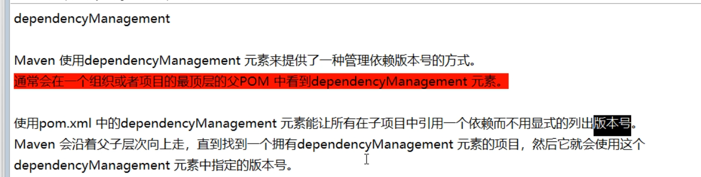

```xml
<dependencyManagement>
    <dependencies>
        <dependency>
        <groupId>mysq1</groupId>
        <artifactId>mysql-connector-java</artifactId>
        <version>5.1.2</version>
        </dependency>
    <dependencies>
</dependencyManagement>
```

然后在子项目里就可以添加`mysql-connector`时可以不指定版本号，例如：

```xml
<dependencies>
    <dependency>
    <groupId>mysq1</groupId>
    <artifactId>mysql-connector-java</artifactId>
    </dependency>
</dependencies>
```

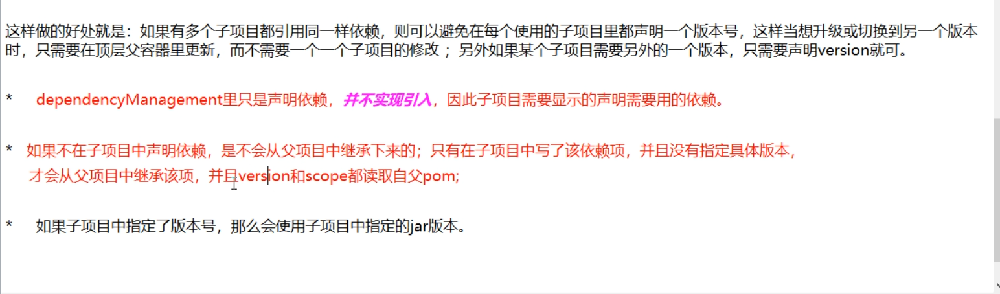

- maven中跳过单元测试

IDEA右侧旁的Maven插件有`Toggle ' Skip Tests' Mode`按钮，这样maven可以跳过单元测试

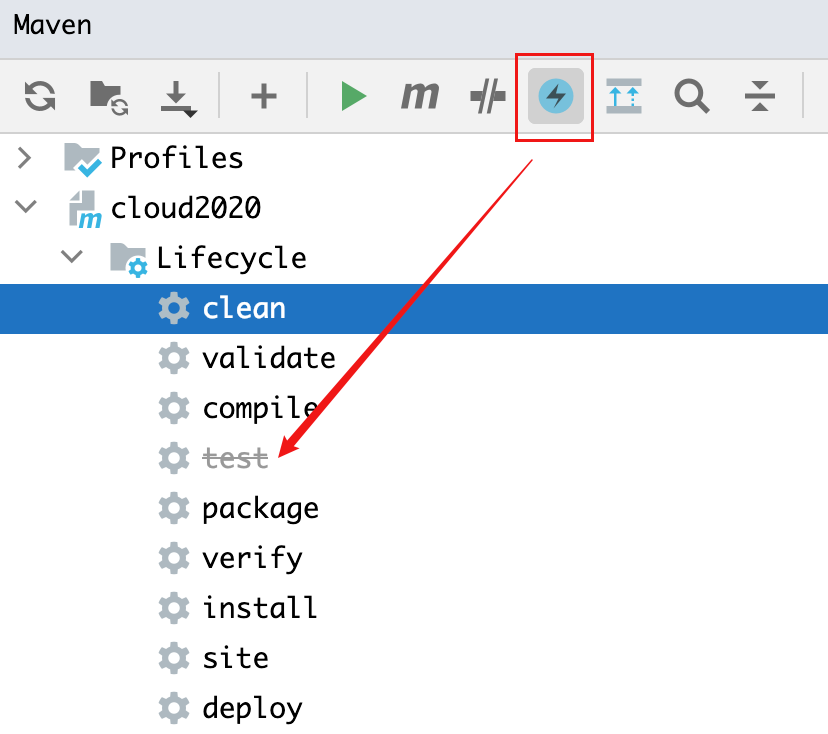

- 父工程创建完成执行mvn:install将父工程发布到仓库方便子工程继承

## 04、Rest微服务工程构建

### 1.cloud-provider-payment8001微服务提供者支付Module模块

#### 支付模块构建（上）

创建微服务模块套路：

1. 建Module
2. 改POM
3. 写YML
4. 主启动
5. 业务类

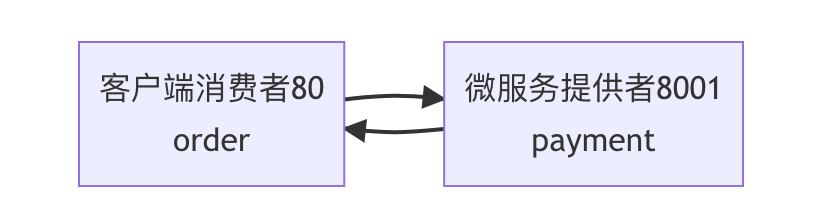

> **1.建名为cloud-provider-payment8001的Maven工程**

创建完成后请回到父工程查看pom文件变化

> **2.改POM文件**

```xml
<?xml version="1.0" encoding="UTF-8"?>
<project xmlns="http://maven.apache.org/POM/4.0.0"
         xmlns:xsi="http://www.w3.org/2001/XMLSchema-instance"
         xsi:schemaLocation="http://maven.apache.org/POM/4.0.0 http://maven.apache.org/xsd/maven-4.0.0.xsd">
    <parent>
        <artifactId>cloud2020</artifactId>
        <groupId>com.nakanomay.springcloud</groupId>
        <version>1.0.0-SNAPSHOT</version>
    </parent>
    <modelVersion>4.0.0</modelVersion>

    <artifactId>cloud-provider-payment8001</artifactId>

    <dependencies>
        <!--包含了sleuth+zipkin-->
        <dependency>
            <groupId>org.springframework.cloud</groupId>
            <artifactId>spring-cloud-starter-zipkin</artifactId>
        </dependency>
        <!--eureka-client-->
        <dependency>
            <groupId>org.springframework.cloud</groupId>
            <artifactId>spring-cloud-starter-netflix-eureka-client</artifactId>
        </dependency>
            <!-- 引入自己定义的api通用包，可以使用Payment支付Entity -->
        <!--
        <dependency>
            <groupId>com.atguigu.springcloud</groupId>
            <artifactId>cloud-api-commons</artifactId>
            <version>${project.version}</version>
        </dependency>
        -->
        <dependency>
            <groupId>org.springframework.boot</groupId>
            <artifactId>spring-boot-starter-web</artifactId>
        </dependency>
        <dependency>
            <groupId>org.springframework.boot</groupId>
            <artifactId>spring-boot-starter-actuator</artifactId>
        </dependency>
        <dependency>
            <groupId>org.mybatis.spring.boot</groupId>
            <artifactId>mybatis-spring-boot-starter</artifactId>
        </dependency>
        <dependency>
            <groupId>com.alibaba</groupId>
            <artifactId>druid-spring-boot-starter</artifactId>
            <version>1.1.10</version>
        </dependency>
        <!--mysql-connector-java-->
        <dependency>
            <groupId>mysql</groupId>
            <artifactId>mysql-connector-java</artifactId>
        </dependency>
        <!--jdbc-->
        <dependency>
            <groupId>org.springframework.boot</groupId>
            <artifactId>spring-boot-starter-jdbc</artifactId>
        </dependency>
        <dependency>
            <groupId>org.springframework.boot</groupId>
            <artifactId>spring-boot-devtools</artifactId>
            <scope>runtime</scope>
            <optional>true</optional>
        </dependency>
        <dependency>
            <groupId>org.projectlombok</groupId>
            <artifactId>lombok</artifactId>
            <optional>true</optional>
        </dependency>
        <dependency>
            <groupId>org.springframework.boot</groupId>
            <artifactId>spring-boot-starter-test</artifactId>
            <scope>test</scope>
        </dependency>
    </dependencies>

</project>
```

> 3.写YML

```yaml
server:
  port: 8001

spring:
  application:
    name: cloud-payment-service
  datasource:
    type: com.alibaba.druid.pool.DruidDataSource            # 当前数据源操作类型
    driver-class-name: com.mysql.cj.jdbc.Driver              # mysql驱动包
    url: jdbc:mysql://localhost:3306/my?useUnicode=true&characterEncoding=utf-8&useSSL=false
    username: root
    password: 123456

mybatis:
  mapperLocations: classpath:mapper/*.xml
  type-aliases-package: com.nakanomay.springcloud.entities    # 所有Entity别名类所在包
```

> 4.主启动

```java
import org.springframework.boot.SpringApplication;
import org.springframework.boot.autoconfigure.SpringBootApplication;

@SpringBootApplication
public class PaymentMain8001 {

    public static void main(String[] args) {
        SpringApplication.run(PaymentMain8001.class, args);
    }
}
```

#### 支付模块构建（中）

1. SQL

```sql
CREATE TABLE `payment`(
    `id` bigint(20) NOT NULL AUTO_INCREMENT COMMENT 'ID',
    `serial` varchar(200) DEFAULT '',
    PRIMARY KEY (id)
)ENGINE=InnoDB AUTO_INCREMENT=1 DEFAULT CHARSET=utf8mb4;
```

2. Entities

实体类Payment：

```java
import lombok.AllArgsConstructor;
import lombok.Data;
import lombok.NoArgsConstructor;

import java.io.Serializable;

@Data
@AllArgsConstructor
@NoArgsConstructor
public class Payment implements Serializable {
    private Long id;
    private String serial;
}
```

JSON封装体CommonResult：

```java
import lombok.AllArgsConstructor;
import lombok.Data;
import lombok.NoArgsConstructor;

@Data
@AllArgsConstructor
@NoArgsConstructor
public class CommonResult<T>{
    private Integer code;
    private String message;
    private T data;

    public CommonResult(Integer code, String message){
        this(code, message, null);
    }
}
```

3. DAO

接口PaymentDao：

```java
import com.atguigu.springcloud.entities.Payment;
import org.apache.ibatis.annotations.Mapper;
import org.apache.ibatis.annotations.Param;

@Mapper
//@Repository不用Spring的
public interface PaymentDao
{
    public int create(Payment payment);

    public Payment getPaymentById(@Param("id") Long id);
}
```

> MyBatis映射文件PaymentMapper.xml，路径：resources/mapper/PaymentMapper.xml

```xml
<?xml version="1.0" encoding="UTF-8" ?>
<!DOCTYPE mapper PUBLIC "-//mybatis.org//DTD Mapper 3.0//EN" "http://mybatis.org/dtd/mybatis-3-mapper.dtd" >

<mapper namespace="com.nakanomay.springcloud.dao.PaymentDao">

    <insert id="create" parameterType="Payment" useGeneratedKeys="true" keyProperty="id">
        insert into payment(serial)  values(#{serial});
    </insert>

    <resultMap id="BaseResultMap" type="com.lun.springcloud.entities.Payment">
        <id column="id" property="id" jdbcType="BIGINT"/>
        <id column="serial" property="serial" jdbcType="VARCHAR"/>
    </resultMap>

    <select id="getPaymentById" parameterType="Long" resultMap="BaseResultMap">
        select * from payment where id=#{id};
    </select>

</mapper>
```

4. Service

接口PaymentService

```java
import com.nakanomay.springcloud.entities.Payment;
import org.apache.ibatis.annotations.Param;

public interface PaymentService
{
    public int create(Payment payment);

    public Payment getPaymentById(@Param("id") Long id);
}
```

实现类

```java
import com.nakanomay.springcloud.dao.PaymentDao;
import com.nakanomay.springcloud.entities.Payment;
import com.nakanomay.springcloud.service.PaymentService;
import org.apache.ibatis.annotations.Param;
import org.springframework.stereotype.Service;

import javax.annotation.Resource;

@Service
public class PaymentServiceImpl implements PaymentService
{
    @Resource
    private PaymentDao paymentDao;

    public int create(Payment payment)
    {
        return paymentDao.create(payment);
    }

    public Payment getPaymentById(Long id)
    {
        return paymentDao.getPaymentById(id);
    }
}
```

5. Controller

```java
import com.nakanomay.springcloud.entities.CommonResult;
import com.nakanomay.springcloud.entities.Payment;
import com.nakanomay.springcloud.service.PaymentService;
import lombok.extern.slf4j.Slf4j;
import org.springframework.beans.factory.annotation.Value;
import org.springframework.cloud.client.ServiceInstance;
import org.springframework.web.bind.annotation.*;
import org.springframework.cloud.client.discovery.DiscoveryClient;

import javax.annotation.Resource;
import java.util.List;
import java.util.concurrent.TimeUnit;

/**
 * 支付业务组件的controller
 */
@RestController
@Slf4j
public class PaymentController{
    @Resource
    private PaymentService paymentService;

    @PostMapping(value = "/payment/create")
    public CommonResult create(Payment payment)
    {
        int result = paymentService.create(payment);
        log.info("*****插入结果："+result);

        if(result > 0)
        {
            return new CommonResult(200,"插入数据库成功,serverPort: "+serverPort,result);
        }else{
            return new CommonResult(444,"插入数据库失败",null);
        }
    }

    @GetMapping(value = "/payment/get/{id}")
    public CommonResult<Payment> getPaymentById(@PathVariable("id") Long id)
    {
        Payment payment = paymentService.getPaymentById(id);

        if(payment != null)
        {
            return new CommonResult(200,"查询成功,serverPort:  "+serverPort,payment);
        }else{
            return new CommonResult(444,"没有对应记录,查询ID: "+id,null);
        }
    }
}
```

#### 支付模块（下）

> 测试

1. 浏览器 - http://localhost:8001/payment/get/1
2. Postman - http://localhost:8001/payment/create?serial=may

> 小总结

创建微服务模块套路：

1. 建Module
2. 改POM
3. 写YML
4. 主启动
5. 业务类

### 2.热部署Devtools

**开发时使用，生产环境关闭**

**1.Adding devtools to your project**

```xml
<dependency>
    <groupId>org.springframework.boot</groupId>
    <artifactId>spring-boot-devtools</artifactId>
    <scope>runtime</scope>
    <optional>true</optional>
</dependency>
```

**2.Adding plugin to your pom.xml**

下段配置复制到聚合父类总工程的pom.xml

```xml
    <build>
        <!--
        <finalName>你的工程名</finalName>（单一工程时添加）
        -->
        <plugins>
            <plugin>
                <groupId>org.springframework.boot</groupId>
                <artifactId>spring-boot-maven-plugin</artifactId>
                <configuration>
                    <fork>true</fork>  <!--dev-tools相关-->
                    <skip>true</skip>  <!--否则模块打包时候会提示 unable to find main class-->
                    <addResources>true</addResources>
                </configuration>
            </plugin>
        </plugins>
    </build>
```

**3.Enabling automatic build**

File -> Settings(New Project Settings->Settings for New Projects) ->Complier

下面项勾选

- Automatically show first error in editor
- Display notification on build completion
- Build project automatically
- Compile independent modules in parallel

**4.Update the value of**

键入Ctrl + Shift + Alt + / ，打开Registry，勾选：

- compiler.automake.allow.when.app.running（备注这里如果高版本的idea换位置了，这里以2021为例：Setting->Advanced Settings:Compiler下的Allow auto-make to start even if developed application is currently running）
- actionSystem.assertFocusAccessFromEdt

**5.重启IDEA**

### 3.cloud-consumer-order80微服务消费者订单Module模块

#### 消费者订单模块(上)

**1.建Module**

创建名为cloud-consumer-order80的maven工程。

**2.改POM**

```xml
<?xml version="1.0" encoding="UTF-8"?>

<project xmlns="http://maven.apache.org/POM/4.0.0" xmlns:xsi="http://www.w3.org/2001/XMLSchema-instance"
         xsi:schemaLocation="http://maven.apache.org/POM/4.0.0 http://maven.apache.org/xsd/maven-4.0.0.xsd">
  <parent>
    <artifactId>cloud2022</artifactId>
    <groupId>com.nakanomay.springcloud</groupId>
    <version>1.0.0-SNAPSHOT</version>
  </parent>
  <modelVersion>4.0.0</modelVersion>

  <artifactId>cloud-consumer-order80</artifactId>

  <properties>
    <project.build.sourceEncoding>UTF-8</project.build.sourceEncoding>
    <maven.compiler.source>1.8</maven.compiler.source>
    <maven.compiler.target>1.8</maven.compiler.target>
  </properties>

  <dependencies>
    <dependency>
      <groupId>org.springframework.boot</groupId>
      <artifactId>spring-boot-starter-web</artifactId>
    </dependency>
    <dependency>
      <groupId>org.springframework.boot</groupId>
      <artifactId>spring-boot-starter-actuator</artifactId>
    </dependency>

    <dependency>
      <groupId>org.springframework.boot</groupId>
      <artifactId>spring-boot-devtools</artifactId>
      <scope>runtime</scope>
      <optional>true</optional>
    </dependency>
    <dependency>
      <groupId>org.projectlombok</groupId>
      <artifactId>lombok</artifactId>
      <optional>true</optional>
    </dependency>
    <dependency>
      <groupId>org.springframework.boot</groupId>
      <artifactId>spring-boot-starter-test</artifactId>
      <scope>test</scope>
    </dependency>
  </dependencies>
</project>
```

**3.写YML**

```yml
server:
  port: 80
```

**4.主启动**

```java
import org.springframework.boot.SpringApplication;
import org.springframework.boot.autoconfigure.SpringBootApplication;

/**
 * Hello world!
 *
 */
@SpringBootApplication
public class OrderMain80
{
    public static void main( String[] args ){
        SpringApplication.run(OrderMain80.class, args);
    }
}
```

**5.业务类**

实体类：

```java
import lombok.AllArgsConstructor;
import lombok.Data;
import lombok.NoArgsConstructor;

import java.io.Serializable;

@Data
@AllArgsConstructor
@NoArgsConstructor
public class Payment implements Serializable 
{
    private Long id;
    private String serial;
}
```

```java
import lombok.AllArgsConstructor;
import lombok.Data;
import lombok.NoArgsConstructor;

@Data
@AllArgsConstructor
@NoArgsConstructor
public class CommonResult<T>{
    private Integer code;
    private String message;
    private T data;

    public CommonResult(Integer code, String message){
        this(code, message, null);
    }
}
```

控制层：

```java
import com.nakanomay.springcloud.entities.CommonResult;
import com.nakanomay.springcloud.entities.Payment;
import lombok.extern.slf4j.Slf4j;
import org.springframework.web.bind.annotation.GetMapping;
import org.springframework.web.bind.annotation.PathVariable;
import org.springframework.web.bind.annotation.RestController;
import org.springframework.web.client.RestTemplate;

import javax.annotation.Resource;

@Slf4j
@RestController
public class OrderController {

    public static final String PAYMENT_URL = "http://localhost:8001";

    @Resource
    private RestTemplate restTemplate;

    @GetMapping("/consumer/payment/create")
    public CommonResult<Payment> create(Payment payment){

        return restTemplate.postForObject(PAYMENT_URL+"/payment/create", payment, CommonResult.class);
    }

    @GetMapping("/consumer/payment/get/{id}")
    public CommonResult<Payment> getPayment(@PathVariable("id") Long id){
        return restTemplate.getForObject(PAYMENT_URL+"/payment/get/"+id, CommonResult.class);
    }
}
```

配置类：

```java
import org.springframework.context.annotation.Bean;
import org.springframework.context.annotation.Configuration;
import org.springframework.web.client.RestTemplate;

@Configuration
public class ApplicationContextConfig {

    @Bean
    public RestTemplate getRestTemplate(){
        return new RestTemplate();
    }
}
```

**6.测试**

运行cloud-consumer-order80与cloud-provider-payment8001两工程

- 浏览器 - http://localhost/consumer/payment/get/1

**RestTemplate**

RestTemplate提供了多种便捷访问远程Http服务的方法，是一种简单便捷的访问restful服务模板类，是Spring提供的用于访问Rest服务的客户端模板工具集

[官网地址](https://docs.spring.io/spring-framework/docs/5.2.2.RELEASE/javadoc-api/org/springframework/web/client/RestTemplate.html)

使用：

- 使用restTemplate访问restful接口非常的简单粗暴无脑。
- `(url, requestMap, ResponseBean.class)`这三个参数分别代表。
- REST请求地址、请求参数、HTTP响应转换被转换成的对象类型。

#### 消费者订单模块(下)

浏览器 - http://localhost/consumer/payment/create?serial=lun3

虽然，返回成功，但是观测数据库中，并没有创建serial为lun3的行。

解决之道：在loud-provider-payment8001工程的PaymentController中添加@RequestBody注解。
```java
public class PaymentController
{

    @PostMapping(value = "/payment/create")
    public CommonResult create(@RequestBody/*添加到这里*/ Payment payment){
		...
    }
}
```

---

通过修改idea的workspace.xml的方式来快速打开Run Dashboard窗口（这个用来显示哪些Spring Boot工程运行，停止等信息。我idea 2020.1版本在名为Services窗口就可以显示哪些Spring Boot工程运行，停止等信息出来，所以这仅作记录参考）。

- 开启Run DashBoard
  1. 打开工程路径下的.idea文件夹的workspace.xml
  2. 在`<component name="RunDashboard">`中修改或添加以下代码：

```xml
<option name="configurationTypes">
	<set>
		<option value="SpringBootApplicationConfigurationType"/>
    </set>
</option>
```

由于idea版本差异，可能需要关闭重启。

### 4.工程重构

观察cloud-consumer-order80与cloud-provider-payment8001两工程有重复代码（entities包下的实体）（坏味道），重构。

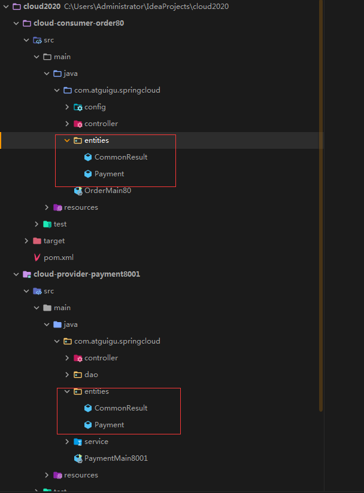

1.新建 - cloud-api-commons

2.POM

```xml
<?xml version="1.0" encoding="UTF-8"?>
<project xmlns="http://maven.apache.org/POM/4.0.0"
         xmlns:xsi="http://www.w3.org/2001/XMLSchema-instance"
         xsi:schemaLocation="http://maven.apache.org/POM/4.0.0 http://maven.apache.org/xsd/maven-4.0.0.xsd">
    <parent>
        <artifactId>cloud2020</artifactId>
        <groupId>com.nakanomay.springcloud</groupId>
        <version>1.0-SNAPSHOT</version>
    </parent>
    <modelVersion>4.0.0</modelVersion>

    <artifactId>cloud-api-commons</artifactId>

    <properties>
        <maven.compiler.source>8</maven.compiler.source>
        <maven.compiler.target>8</maven.compiler.target>
    </properties>

    <dependencies>
        <dependency>
            <groupId>org.springframework.boot</groupId>
            <artifactId>spring-boot-devtools</artifactId>
            <scope>runtime</scope>
            <optional>true</optional>
        </dependency>
        <dependency>
            <groupId>org.projectlombok</groupId>
            <artifactId>lombok</artifactId>
            <optional>true</optional>
        </dependency>
        <dependency>
            <groupId>cn.hutool</groupId>
            <artifactId>hutool-all</artifactId>
            <version>5.1.0</version>
        </dependency>
    </dependencies>

</project>
```

3.entities

将cloud-consumer-order80与cloud-provider-payment8001两工程的公有entities包移至cloud-api-commons工程下。

4.maven clean、install cloud-api-commons工程，以供给cloud-consumer-order80与cloud-provider-payment8001两工程调用。

5.订单80和支付8001分别改造

- 将cloud-consumer-order80与cloud-provider-payment8001两工程的公有entities包移除
- 引入cloud-api-commons依赖

```xml
<!--引入自己定义的api通用包，可以使用Payment支付Entity-->
<dependency>
    <groupId>com.nakanomay.springcloud</groupId>
    <artifactId>cloud-api-commons</artifactId>
    <version>1.0-SNAPSHOT</version>
</dependency>
```

6.测试

### 5.目前工程构建

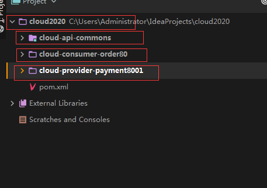